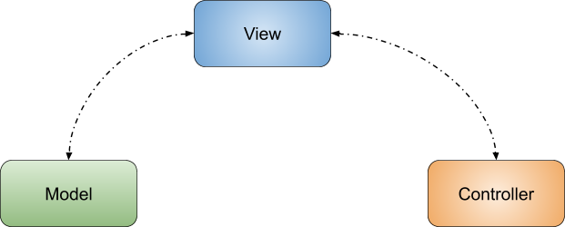
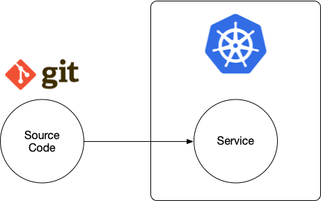

# I've been reading about DDD, where should I go next? 

You’ve been coding Java for more than eight years now, you’ve read about Domain-Driven Design and you want to apply that to a real-life project. What does that look like? What does it actually mean to apply DDD in today’s ecosystem? Is it really worth the time? 

DDD provides us with a very good theoretical background and patterns to build robust software that brings real business value. To do that, DDD helps you by providing a framework to organize how the software is built and how to optimize for independent teams that can work together by consuming well-defined APIs. At the end of the day, DDD gives you principles that you will need to translate to Java or any other language of your choice. But when you do that, you will need to make some hard decisions on how these Java components/services/applications will run and interact. 

This chapter covers the practical side of how these concepts can be mapped into an existing example that runs on top of Kubernetes,  giving you practical tips about how DDD concepts will map to a concrete technology stack. Of course, there are tons of different options to choose from today, but you can take this as an example of what kind of things you will need to pay attention to when going through this journey. 

It is important to highlight that this chapter is not about DDD, so if you are new to DDD, the following books are recommended: 
- [Implementing DDD](https://www.amazon.co.uk/Implementing-Domain-Driven-Design-Vaughn-Vernon/dp/0321834577)
- [DDD Distilled](https://www.amazon.co.uk/Domain-Driven-Design-Distilled-Vaughn-Vernon/dp/0134434420/ref=pd_lpo_14_t_1/262-0200870-8496500?_encoding=UTF8&pd_rd_i=0134434420&pd_rd_r=c7957a5b-3f2f-4008-8c93-8a9b5792c448&pd_rd_w=JKKyX&pd_rd_wg=dFALp&pf_rd_p=7b8e3b03-1439-4489-abd4-4a138cf4eca6&pf_rd_r=W41G9RPNEBHEF8Y5DXG8&psc=1&refRID=W41G9RPNEBHEF8Y5DXG8)

This chapter is divided into two main sections:
- [Introduction to Java-related topics and Cloud](#java-in-the-cloud) 
- [From Monolith to K8s using DDD](#from-monolith-to-k8s-using-ddd)


## Java in the Cloud

There are a lot of frameworks out there now aiming to provide an easier experience for developers creating microservices. Examples of this are Spring Boot, Quarkus, Micronaut, Helidon, etc. In general, what these frameworks aim for is to create a standalone JAR file that can be executed, providing you a dependency-free executable that only requires the Java Virtual Machine to run. 

This pretty much goes in contrast with what we (as the Java Community) were doing five years ago, and some of us still do, which was to deploy our Java applications inside an Application Server or a Servlet Container such as Tomcat. 

While we used to have a monolith with all the features of our large applications built inside, now we aim to have a set of services with well-defined functionality.  These new (micro)services share the following characteristics:
- Tend to colocate and version all the artifacts that are needed to go from source code to a running service in an environment.
- Each service is built, maintained, evolved and deployed by a different team
- Each service has its own release cycle 
- Each service expose a well-defined set of APIs

Building a Service today with REST endpoints is a fairly easy task if you are using one of these frameworks previously mentioned. You have an annotation-based programming model that allows you to map Java Methods to REST endpoints and advanced Serialization/Deserialization mechanisms that will deal with all the boilerplate of parsing HTTP requests. 

The real problem arises when you start having more than a handful of services. Running each service in its own JVM will push you to run each service on a different port and take care of issues when these JVMs crash. For that reason, the industry quickly jumped to containers around 2015. 


### Containers & Containers Orchestration

Following the same line of going dependency-free, like the Java frameworks mentioned in the previous section, Containers help us to run our software anywhere. This means that we go one step further and now we don’t even want to depend on the Java Virtual Machine being installed in our host machine where the services will run. 

Docker (a container runtime) helped us with that. We can encapsulate our standalone JAR along with the JVM and configuration files to make it a container that can be run anywhere where the Docker Container Runtime is installed. 

Each Docker container has its own isolated runtime. Enabling us to isolate failures at the Docker container boundaries. 

When you have one Bounded Context and a few Services, you are probably fine just running these Java Microservices using a script (or docker-compose). However, even for everyday development practices, you will notice that each of these services will require a dedicated port and you will need to keep track of these ports to make sure that they are available for each of the services. 

When the number of services grows, this becomes unmanageable. 
For that reason, Container Orchestrators have become popular in the last few years, and  Kubernetes is leading the way. Kubernetes is in charge of dealing with how to create these container runtimes, how to scale them when there is load, and how to deal with containers that are misbehaving or crashing. 

<Reference to Karina’s list of containers orchestrators>

Kubernetes success is based on the fact that each major cloud provider provides a managed Kubernetes Service, making it the defacto standard for multi-cloud support. In other words, no matter which Cloud Provider you choose, you can always trust that there will be a Kubernetes API exposed for you to interact and provision your services. 


### Capitalizing on DDD benefits

If you follow the DDD path, you need to capitalize on some of the promises that DDD gave you to start with and make sure that you are ripping the benefits. If we cannot continuously deliver new versions of our services without stopping the entire application, we are just making our life more complicated for nothing. If we are not delivering concrete business value as a result of following DDD, all the changes suggested in this chapter are not worth the effort or the time. 

I recommend the following article: [“The Business Value of using DDD”](https://www.informit.com/articles/article.aspx?p=1944876&seqNum=4), which gives a high-level overview of the benefits of adopting DDD, not for you as a developer, but for your Business. 

The next section covers an example that I’ve created based on my experience while rearchitecting Java Monolithic applications to a more distributed approach. The example is fictional, any similarity with reality is just a coincidence :) I encourage you to abstract the concepts and patterns away from the example scenario and map them to your own domain. At the end of the day, this is just an example, albeit a complex and fully functional one.


## From Monolith to K8s using DDD

This section covers an example scenario that helps us to explain some of the concepts in action. You can map these concepts to your business domain and copy the actual technical solution from the example for some of the challenges presented. 

As expected, creating a full-blown application is hard work and usually requires a lot of time investment. For that reason, the following example is provided as a set of Open Source repositories where you can contribute to making it better. As a real application, the example will evolve in time, adding more tools and best practices, so I invite you to participate in this journey where we can all learn and share valuable information together. 

[From Monolith to K8s Github Repository](https://github.com/salaboy/from-monolith-to-k8s)

We begin our journey with a Monolith Java Application. The scenario that we will cover belongs to a company that is in charge of providing a platform to create Conference websites. Imagine that each of our customers requires us to host and scale their Conference website. 
We all have seen big Java Web Applications and for this scenario, the application will look like this: 



The “Customer Management” Facade is in charge of isolating different customers from each other. In some companies, this is defined as a multi-tenant platform or application. Unfortunately, this is quite common in the Java space. For historical reasons, implementations ended up growing into big, scary monoliths that came with a lot of scalability issues as well as data and traffic isolation challenges. No matter how fancy our platform looks, it is just running in a single JVM. You have no way of scaling each individual customer - you scale all or nothing. 

As you can see in the red box, each Conference Site will contain a bunch of modules depending on each customer selection, but in reality, at runtime, all the code will be there for every single conference. 

> Please note that if you have a platform like this and it does the work that it is supposed to do,you **should NOT** change it. Unless you are having problems managing this “Platform” or scaling it, you shouldn’t rearchitect the whole thing.

Now this Monolith architecture has some clear drawbacks, and for this scenario, we can consider the following reason to rearchitect into a proper Cloud-Native Platform:

- Customers cannot be scaled independently
- Customer traffic is all handled by the same application
- Single Point of Failure in the JVM
- If data is stored in a database, data is shared across customers. The application code needs to deal with isolating each customer data. The database becomes a bottleneck as well, as all customer data is in the same DB. 
- Every change into the platform requires the entire application to be restarted
- Every developer involved with the application works against the same code base, making a release and merging features a major task with a lot of risks involved. This usually can be done by someone who understands the entire application.

If you already have this application up and running and you have customers using the platform, you will have a good understanding of which features are essential and how you can start re-architecting it. 

As Martin Fowler describes in the linked blog post [Monolith First](https://martinfowler.com/bliki/MonolithFirst.html) is the way to go. By having a monolith you already understand the solution that you need to build, making it easy to estimate how the new architecture will tackle the problems of the existing version. In other words, if you don’t have an existing Monolith, do not start with a distributed architecture from scratch. Create a monolith first and then split if needed. 

The next step in our journey is to decide where to start. In my experience I’ve seen three common patterns repeating:

- **Start new functionalities as separated services**: this is usually recommended if you can afford to maintain the Monolith as it is. New services will not solve the already existing problems, but it will help your developer teams to get used to working with a microservice mindset.
- **Split existing functionality out of the monolith** (and slowly deprecate the old code): if you have pressing issues with the Monolith you can evaluate branching off some of the functionality outside into a new service. This might solve some of your existing problems, but it will not bring any business value immediately. It also adds to the complexity of the day-to-day operations as you might end up running two solutions for the same problem over a long period of time. This can also be used to understand how complex and costly a core rearchitecture can be. 
- **Rearchitect the core of the platform as microservices** (to tackle existing problems): Sooner or later, if you are experiencing problems maintaining and scaling your Monolith, you will need to rethink and redesign the core bits of your platform, making sure that you focus on solving the current scalability and maintenance problems. This can be a costly initiative, but it can be done in complete isolation from your production environments. Several times I’ve seen how this is done as a Proof of Concept to demonstrate that is actually possible and also to make sure that your team members understand the implications from a business (advantages) and technical point of view (new tech stack, new tools).

In this chapter, I will cover the last of these options (**Rearchitect the core of the platform as microservices**) to highlight the solution for our existing problems with the monolith application, but you can explore the other two if they are more appropriate for your situation. 

This is where DDD concepts and patterns become really handy to define how to split the functionalities of the monolith and how to organize our teams around the new services. In the following sections, we will explore some of these concepts in action.


### Assumptions and Simplifications

Platforms are complex beasts, trying to re-architect something big will give you more headaches than solutions. For that reason, you should try to simplify the scope of the problem to tackle different challenges in a controlled way. 

For our scenario, this might mean that instead of trying to go for the re-architecture of the entire platform, first, we try to solve the architecture and shape of a simple Conference Site. This means that instead of focusing on the platform, we first focus on what the Customer will expect for their Conference Site. By understanding the shape of a single Conference Site you and your teams have a well-defined set of challenges to solve that can bring immediate business value. Later we automate how each of these Conference Sites can be provisioned. 

From a more architectural point of view, this might mean a Monolith Conference Site or a Conference Site that is built with different distributed services. If Conference Sites are complex enough and we want to reuse modules for all of them we might consider a distributed approach. Based on my experience, this kind of platform does leverage shared services most of the time so it makes sense to architect them with reusability in mind. This might lead to having multiple services from day one, which is something that you and your teams will need to get used to.

Our independent Conference Sites will look like this: 


As you can see in the previous diagram, it is quite clear that there are important architectural changes. It is quite common to have the User Interface, in this case, the “Conference Site” box separated from core services. Most of the time, this user-facing component will act as a router, routing requests from the Conference  Site to services that are not directly exposed to users. 

But before digging into technicalities, how do we prioritize and make sure that we start on the right foot? How do we scope these services correctly (not too macro, not too micro)? DDD concepts can help us, providing some answers and guidelines. 


### Bounded Contexts to start splitting your Monolith 

If you are planning a rearchitecture for the core of your platform you need to be careful and you need to choose wisely which components will be re-architected first and why. 
In my experience, you will try to tackle core components first, that you understand and that you know that provide value to the business where you are. 

In the case of our scenario, dealing with Call for Proposals is critical to bootstrap a conference. 
There is substantial work around accepting proposals, reviewing them and making sure that the conference has an interesting agenda. 

If we are confident that implementing the Call For Proposal functionality first will give us immediate wins, we need to estimate how big and how complex the effort is. 

DDD proposes the concept of Bounded Context as a well-scoped set of functionalities that belong together. These functionalities usually map how a Domain Expert (Subject Matter Expert) will do the work if there is no software available. In order to plan, design, and implement these functionalities, a team is assembled with Domain Experts that will work hand in hand with Software Engineers. Most of the time, a Domain Expert will know what Bounded Contexts already exist and what are they responsible for. From a DDD perspective, it is extremely important to not make up these Bounded Contexts a technical boundary that is imposed on Domain Experts. 

A Bounded Context will expose a well-defined set of APIs so other Teams from different Bounded Contexts can consume and interact with the Call For Proposals functionality. 

The Call for Proposals Bounded Context will enable a team to implement all the needed functionality independently of other teams. This team will be in charge of the entire lifecycle of the project, from designing it, implementing it, running it for the rest of the company and for your customers to consume it. 

As soon as you start designing the Call for Proposal functionality you realize that you will need to consume and interact with other teams. Very early on the following Bounded Contexts are identified:


Each of these Bounded Contexts will be owned by different teams and we need to make sure that they have enough autonomy to make progress, create new versions with new features, and deploy concrete software components to our customer’s environments. 

On a practical side, each Bounded Context will be implemented as one or a set of services that implement the context features. There is no need to be strict about the number of services that will compose a Bounded Context, but usually, there is one that is in charge of exposing a set of APIs to the outside world. 

For the purpose of this example, a single service will implement all the Call For Proposals Bounded Context logic and the team behind this service will be responsible for designing its APIs, choosing the frameworks that they are going to use, and actually deploying it into a live environment. 

Going deep into practical details, there are a couple of best practices shared by many companies and tools: 
- One Repository /  One Service + Continuous Delivery
- Open APIs


#### One Repository / One Service + Continuous Delivery

It is usually recommended to keep all the technical resources needed to run a service close to the source code. This facilitates the maintenance and the cognitive load of understanding how to run our Services in an actual environment. 

Nowadays, it is quite common to have a service, let’s say written in Spring Boot versioned in a git provider such as GitHub, where we can find a Dockerfile to create a containerized version of our service that can be run anywhere where a Docker daemon is present. 

With the rise in popularity of Kubernetes, it is also common to find Kubernetes Manifest (YAML files) describing how our Service can be deployed to a Kubernetes Cluster. Finally, we tend to use Continuous Integration pipelines to actually build all these software components, so it is quite common to also find the pipeline definition close to the source that needs to be built. 

You, as a developer targeting Kubernetes as your deployment platform, are now responsible for a bunch of artifacts, not just your Java Service Source Code. 


In order to deploy your code to Kubernetes you will need to: 
- Build and Test your source code, if it is Java you will use Maven or Gradle to do that
- That will result in a JAR file that you might want to push to a repository such as Nexus or Artifactory. This JAR file will already have a version in it and if you are using Maven or Gradle this JAR will be identified by its GAV (Group/Artifact/Version).
- From that JAR you create a Docker Image by defining a Dockerfile that understands how to run your Java application with a provided JVM.
- Finally, if you want to deploy your container to a Kubernetes Cluster you will need some YAML manifests
- Optionally, if you are building a lot of services you might want to use Helm to package and release these YAML files. Helm provides the idea of Charts (Packages) that map one to one with how we deal with our Maven artifacts. If you are working with Helm Charts, these charts are usually also pushed/released to a chart repository such as Chart Museum. 
All these artifacts need to be versioned accordingly, meaning that when you build a new version of your JAR file, a new container needs to be built and a new Helm Chart needs to be released. 

At this point if you are thinking ‘that is a lot of work,’ you are 100% right. If you are thinking, ‘I don’t want to do all of that,’ you are absolutely right. I don’t want to do that either. If you want to make this work, you will need to use specialized tools that already deliver all this functionality in an automated way. You should aim for automating every step, and the industry uses Continuous Integration pipelines to achieve this. But you are now targeting Kubernetes, so welcome Jenkins X to your toolchain. Jenkins X, brings CI/CD to Kubernetes and it is part of the Continuous Delivery Foundation. 

As you might notice, Jenkins X is not only about Continuous Integration but also about Continuous Delivery. By covering Continuous Delivery, the pipeline doesn’t stop when these components are built. The pipeline is in charge of building, testing, and also deploying our artifacts into a live environment where they will run to serve our customers. The “continuous” part makes reference to the fact that you want to make sure deploying a new version of your service is frictionless and you will aim to deploy new versions in a short period of time. 

In order to achieve Continuous Delivery, Jenkins X uses a set of conventions to enable developers to focus on building business value. These conventions are not exclusive to Jenkins X and are part of best practices gathered from different industries and practitioners. 

One of these conventions is called “Trunk Based Development” which basically means that every change applied (merged) to the master branch will generate a new release of our artifacts. Most of the time, this is not comfortable for developers, as most of these practices are commonly defined in each company and they tend to vary quite a lot. The key motivation to use something like Trunk Based Development is to make sure that teams don’t need to spend time defining these practices. Projects like Jenkins X are the catalysts for thousands of community members, who are experts in the CI/CD space, which creates best practices and tools that apply them. When working with Trunk Based Development you are enabled to focus on writing code and, when your code is done and merged in master, a new release is created and deployed to some kind of staging environment for further validations. 

I strongly recommend if you are starting a new project, to check the advantages of Trunk Based Development as well as the book Accelerate as it was used as the basis to create tools like Jenkins X. https://jenkins-x.io/about/overview/accelerate/

At the end of the day, Jenkins X uses “One Repository / One Service” plus “Trunk Based Development” to take your service from source to a running instance inside a Kubernetes Cluster. 


For our example, the following links demonstrate all these concepts in action 
Pipeline: https://github.com/salaboy/fmtok8s-email/blob/master/jenkins-x.yml 
DockerFile: https://github.com/salaboy/fmtok8s-email/blob/master/Dockerfile
Helm Charts: https://github.com/salaboy/fmtok8s-email/tree/master/charts/fmtok8s-email
Continuous Releases: https://github.com/salaboy/fmtok8s-email/releases

You will find the same setup for all the projects inside the Conference Site Demo. 


#### Open APIs
If you are already implementing a Bounded Context, very early one you will need to design and specify what kind of interface are you going to expose to other Bounded Context and third party services that might be interested in the functionality that your context provides. A popular way of implementing these APIs are REST endpoints. Since you are probably familiar with REST endpoints already this section is focused on the Open API Specification: https://github.com/OAI/OpenAPI-Specification As defined in the Spec text “the OpenAPI Specification removes the guesswork in calling a service.” Nowadays popular frameworks such as Spring Boot comes with out of the box integration with Open API and Open API tooling. 

By just adding a Spring Boot extension/starter, you enable your application to expose a user interface that serves as live documentation and browser of your APIs.

If you are using standard (Tomcat) Spring Boot you need to only add to your pom file: 

```
<dependency>
   <groupId>org.springdoc</groupId>
   <artifactId>springdoc-openapi-ui</artifactId>
   <version>${springdoc-openapi-ui.version}</version>
</dependency>

```
If you are using Webflux, the reactive stack you need to only add: 
```
<dependency>
   <groupId>org.springdoc</groupId>
   <artifactId>springdoc-openapi-webflux-ui</artifactId>
   <version>${springdoc-openapi-ui.version}</version>
</dependency>
```

https://github.com/salaboy/fmtok8s-email/blob/master/pom.xml#L40 

In real-life projects, these user interfaces and API specification documents can be used by other teams to understand with concrete details about how to interact with your services. The sooner that you get an API exposed, the sooner that other teams can start leveraging your service. 

The following screenshot shows the Open API User Interface that is provided by just including the previous dependency. This screen can be accessed by pointing your browser to host:port/swagger-ui.html and it provides a simple client to interact with your services, understand which endpoints are exposed and which data these endpoints expect and return. 



Feel free to clone one of the services from this example and run `mvn spring-boot:run` to explore each service APIs definitions. By default, each service will start in port 8080 so you will need to point your browser at http://localhost:8080/swagger-ui.html


### Context Map to understand Team and Technical interactions

Bounded Contexts are great to understand a well-scoped set of functionalities that need to be provided together. When we have several of these contexts, we need to understand how they will interact with each other and their relationships. That is where the concept of Context Maps really helps. With Context Maps, you can map out the relationships between bounded context and what they will actually need to interact. Context mapping also gives you visibility about how the teams responsible for each Bounded Context will interact with other teams.

On the practical side, this is all about System Integrations. How our services or the services that expose some kind of APIs talk to each other. How do they transform and move data around and how do they know which services are available to consume. 

As you might guess, APIs are extremely important, but understanding who is going to consume our APIs, what is expected from these APIs and who actually depends on us is critical. 

Well-defined Context Maps help a lot to plan and understand how these “isolated’ Bounded Context and teams working on them will interact on a day to day basis. 

For our example the following context map would make sense:


This diagram depicts the relationships between the simple Bounded Context that we have for our Conference Site application. Here we can see that there is a Customer/Supplier relationship between Call for Proposals and the Conference Agenda Bounded Context. Where Call for Proposals is a consumer of the upstream service Conference Agenda. Between these two teams, there is a Partnership relationship as well, as they need to collaborate to get things done. This means that the communication between these two teams is important and they should be able to influence each other’s roadmap. 

On the other hand, the relationship with the Notification service is different. Call For Proposals has an upstream relationship with the Notification Bounded context, but it will comfort with their contracts. This means that from the Call for Proposals team perspective they cannot influence or change the Notification Bounded Context APIs. This happens a lot when we have legacy systems or when this bounded context is external to our company. 


Jumping on the practical side, while System integrations is a very broad topic, this section focuses on a very practical recommendation: “You must learn about Consumer-Driven Contact Testing”. Once again Martin Fowler has an article about this: https://martinfowler.com/articles/consumerDrivenContracts.html 
While the topic itself is not new (previous blog post from 2006) there are very up to date tools to actually implement this in your projects, such as Spring Cloud Contracts (https://spring.io/projects/spring-cloud-contract). 

With Spring Cloud Contracts, the story goes like this, first you define a contact for your APIs, this basically means what kind of request the consumer will submit and what kind of response we will provide as a service. 

A contract looks like this: https://github.com/salaboy/fmtok8s-c4p/blob/no-workflow/src/test/resources/contracts/shouldAcceptPostProposal.groovy

```

Contract.make {
       name "should accept POST with new Proposal"
       request{
           method 'POST'
           url '/'
           body([
               "title": $(anyNonEmptyString()),
               "description": $(anyNonEmptyString()),
               "author": $(anyNonEmptyString()),
               "email": $(anyEmail())
           ])
           headers {
               contentType('application/json')
           }
       }
       response {
           status OK()
           headers {
               contentType('application/json')
           }
           body(
                   "id": $(anyUuid()),
                   "title": $(anyNonEmptyString()),
                   "description": $(anyNonEmptyString()),
                   "author": $(anyNonEmptyString()),
                   "email": $(anyEmail())
           )
       }
   }

```
This contract defines the interaction for submitting a new Proposal to the Call for Proposal Service. As you can see, it involves a POST request and a body with some predefined properties including a header with a very specific content type. This contract also defines that the return for the consumer will add to the information sent an “id” property with a UUID format. 

Now, this contract can be used to generate a test to actually test that your service is working as expected from a consumer point of view. So, if you have defined any contract in your project when you build and test your project, the contracts will be executed against a real instance of your service. This enables us to make sure that we break the build if a contract was broken. In order to automatically create and execute these tests you only need to add a dependency and a plugin to your maven project:
https://github.com/salaboy/fmtok8s-c4p/blob/no-workflow/pom.xml#L50

```
<dependency>
  <groupId>org.springframework.cloud</groupId>
  <artifactId>spring-cloud-starter-contract-verifier</artifactId>
  <version>${spring.cloud.contract}</version>
  <scope>test</scope>
</dependency>

```
And in the <build><plugins> section the following plugin:
https://github.com/salaboy/fmtok8s-c4p/blob/no-workflow/pom.xml#L88

```
<plugin>
  <groupId>org.springframework.cloud</groupId>
  <artifactId>spring-cloud-contract-maven-plugin</artifactId>
  <version>${spring.cloud.contract}</version>
  <extensions>true</extensions>
  <configuration>
    <packageWithBaseClasses>com.salaboy.conferences.c4p</packageWithBaseClasses>
    <testMode>EXPLICIT</testMode>
   </configuration>
</plugin>

```

Finally, depending on the shape of the service that you will be testing some confirmation might be needed: https://github.com/salaboy/fmtok8s-c4p/blob/no-workflow/src/test/java/com/salaboy/conferences/c4p/ContractVerifierBase.java#L16

```
@RunWith(SpringRunner.class)
@SpringBootTest( webEnvironment = SpringBootTest.WebEnvironment.RANDOM_PORT,
        properties = "server.port=0")
public abstract class ContractVerifierBase {

    @LocalServerPort
    int port;
    
    ...
}

```

If you need to add any initialization code, this is the class that all the autogenerated test will inherit. 

Now that the contract is validated with every build, we can also use the contract to generate a Stub, which is a Service that behaves like the actual service but with Mock Data. The Mock data is also automatically generated, as it can be provided by the contract definition as well. This Stub is an artifact on its own that can be distributed to other services, for example, the ones consuming the “real” service for testing.

This basically means that now, every time that you build your service two JAR files are going to be created. One is the actual Spring Boot application JAR and the other one is the Service Stub. 
This Service Stub can be automatically pushed to your Nexus or Artifactory and it will leave under the same group and artifact name as your application JAR. 

Finally,  a Service X that is designed to consume your service can create tests that will start the previously generated Stub locally to avoid requiring an actual instance or an entire environment setup. You can easily start the Stub before your tests by using the following annotations:


```
@RunWith(SpringRunner.class)
@SpringBootTest(webEnvironment = SpringBootTest.WebEnvironment.MOCK)
@AutoConfigureMockMvc
@AutoConfigureJsonTesters
@AutoConfigureStubRunner(stubsMode = StubRunnerProperties.StubsMode.REMOTE, repositoryRoot = "<your nexus repository>", ids = "com.salaboy.conferences:fmtok8s-c4p")
public class C4PApisTests {
   @StubRunnerPort("fmtok8s-c4p")
    int producerPort;

...
}

```

https://github.com/salaboy/fmtok8s-api-gateway/blob/master/src/test/java/com/salaboy/conferences/site/C4PApisTests.java#L29

This will automatically download the latest version of the stub and run it before your test starts using a random port that you can obtain via injection using @StubRunnerPort. 


It is important to notice, that both, the Service and the contracts are versioned together as part of the same code base. This implies that the generated Stub and the Service itself will have the same version. A consumer service, to run its tests can depend on the Stub, as it should never depend on the service itself. As soon as the consumer has tested using the producer Service Stub, you can quickly recognize when a contract is broken or when a new version of the contract is no longer supported by consumers, as the tests using the Stubs will break when new and incompatible versions are released. At the point in time, the consumers are faced with a simple decision, to stay depending on the old contracts with a fixed version, or to update to the latest version of the contract. As you can see, this might require you to run several versions of your service at the same time, luckily for us, Kubernetes is built to support these scenarios. You might want to read about Canary Releases if you are interested in aspects of multi-version deployments.

Both, Bounded Contexts and Context Maps are great conceptual tools to understand how to structure your teams and your software, but more importantly, these concepts help you to focus on business value. 


### Focus on Business Value


## Sum up

