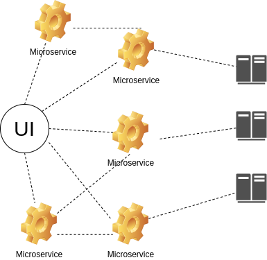

# Microservices


Microservices, ou em portugues, Microsserviços, são um novo jeito de construirmos nossas aplicações nos dias de hoje, pregam ser independentes e modeladas para o dominio de negócios (o que faz o DDD ser muito importante). Essas aplicações se comunicam entre si via protocolos de rede, e tem uma arquitetura que pode resolver problemas que você tenha. Os microsserviços são um dos tipos do SOA (service-oriented architeture), e te o foco de colocar fronteiras bem especificas de negocios e promover a entrega independente destes serviços, trazendo a vantagem de pode ser agnóstico de tecnologia. Resumindo no ponto de vista de tecnologia, são capacidades de negócios encapsuladas em um ou mais endpoints, mas seguindos os seguintes pilares:


* Flexibilidade
* Escalabidade
* Simplicidade


Neste cenário criamos aplicações que são desacopladas em pequenos serviços e cada um deles representando um objetivo de negócio. Onde eles podem ser desenvolvidos e facilmente mantidos de maneira individual, e podendo usar diferentes tipos de linguagem de programação.

<center></center>


​												<center>*Arquitetura de Microserviços*</center>

Mas isso não significa que devemos esquecer as arquiteturas Monoliticas, é preciso analisar os casos onde se encaixam cada um dos formates e analisar os pontos de atenção que são trazidos aos ambientes.


## Monolitos vs Microsserviços

Falar que está em uma arquitetura monolítica quer dizer que você tem uma artefato único que é a base de todos os seus componentes funcionais, que é deployada de uma vez só e roda em uma mesmo ambiente. Tudo em uma base de código única onde todas as alterações irão acontecer. 

Um monolito deve ser considerado como uma solução válida se você está desenvolvendo uma aplicação muito simples, onde pode-se testar repidamente e fácilmente colocar essa aplicação no ar.

Mas quanto a aplicação começa a se tornar muito complexa, com vários times de desenvolvimento, muitas funcionalidades, as adições ou alterações começam a se tornar complicadas por causa do acoplamento que começa a existir. Escalar então um ambiente destes começa a se tornar desafiador.

É aqui que entra a mão dos microsserviços em começar a desacoplar esses serviços e dar responsabilidade únicas para os "serviços", onde você pode alterar, deployar e escalar de maneira independente de todo o ecossistema. Justamente com a premissa de não afetar os outros microsserviços.


## Quais as vantagens de se escolher por Microsserviços

As suas aplicações tem muito o que ganhar com a arquitetura em Microsserviços, e entre elas podemos elencar:

- **Escalabilidade** - Se aproveitando das as funções são independentes, você pode fazer os serviços escalarem independente dos outros, conforme a necessidade e uso, e até mesmo escolher a melhor tecnologia para um serviço diferente das demais. 
- **Produtividade** - Quando se fala em times grandes, ou empresas com muitos times, trabalhar com o modelo monolítico pode tomar muito tempo e esforço, e quebrar os serviços em vários e independentes ajuda a escalar os times de trabalho e reduz atritos, e até mesmo em um mesmo projeto, os membros são capazes de atuar em peças independentes.
-  **Agilidade** - Todos almejam chegar nos modelos ágeis de trabalho para alavancar a produtividade, e separar os serviços em pedaços menores permite que se separe as responsabilidades e trazer a eficiência de ciclos de desenvolvimento menores.
- **Reusabilidade** - Trabalhar com microsserviços significa que você tem pequenos trechos de código espalhados por uma aplicação maior. E essas peças podem funcionar de maneira independente e dessa maneira ser usada em uma outra parte da aplicação ou compor os dados de outro serviço.


## E os desafios que Microsserviços vão trazer

Claro que não estamos falando de uma “bala de prata” que resolve todos os problemas. E existem desafios que vão surgir quando se migra para este cenário. E um dos primeiros que tem-se que lidar é a comunicação entre os mesmo.

A comunicação entre eles não é instantânea, e como estamos falando de comunicação de rede, um ponto de preocupação que você terá que colocar em seus desenhos e soluções será a latência. E quanto mais seu ambiente crescer em complexidade, este problema pode se tornar grande em seu ambiente. Lidar com o fato de que sua rede pode e vai falhar causa muita dor de cabeça, mas precisa ser feito.

Também não se pode esquecer que a estratégia de fazer microsserviços não diz respeito apenas ao backend, é necessário ter atenção ao Front-End. Não vale absolutamente nada se você deixar a sua interface como um monolito gigante, isso não vai lhe trazer vantagem nenhuma mesmo que todo o server-side esteja distrubuído, porque na hora do deploy a alteração pode quebrar a sua interface.

Umas das vantagens dos micro-serviços que é ser agnóstico de tecnologia. qie pode se transformar no seu calvário depois. Não adianta deixar que seu ambiente seja completamente poliglota, se depois ninguém vai saber manter e operar, e ainda começar a ter problemas de latência por uma linguagem mal utilizada. É preciso ser conciso e usar tecnologias que seu time e equipes de suporte dominem.

Um dos pontos importantes, e que é sempre pergunta em reuniões é: “Mas qual é o tamanho que o microserviço precisa ter?”. E a maioria das pessoas confunde o “Micro” com o tamanho e acha que ele precisa ser do menor tamanho possível, acha que realmente tem relação com a quantidade de bytes que ele ocupa.

Mas como é medido esse tamanho? Linhas de código? Tamanho em bytes? Nada disso, é o principio da responsabilidade única, esse é o tamanho que você precisa respeitar.

Um grande ponto de atenção que é necessário, é a governança e manter quem será o dono do microserviço. Em ambientes altamente distribuídos, um serviço que está rodando em produção e não apresenta problema pode acabar ficando sem um dono e na hora de um problema ou possível manutenção, fica dificil achar quem é que assume a responsabilidade, então é preciso ter processos de governança bem fortes, para que você não acabe com aplicações órfãs em ambiente produtivo.


## Quando não escolher por Microsserviços

Um dos principais pontos para não se escolher ir para essa direção é quando não temos limites bem definidos de quais são as fronteiras que definem o seu negócio. Então é necessário ter uma visão completa de todo o seu domínio, e após isso começar a desacoplar as partes.

Se você quer testar algo rápido no modelo de Startups, também não recomendo escolher por aqui, e sim ir para algo mais monolítico, ou descentralizado e depois de testado e estabelecido ir na direção de evoluir para microsserviços. Os microsserviços deveriam entrar depois que você encontrou aquilo que se encaixa ao seu negócio, então você consolida e ai sim coloca algo escalável para rodar.

Se você criar aplicações que são empacotadas e entregues para seus clientes operar, microsserviços são uma péssima opção para você. Esse padrão de arquitetura traz algumas complexidades para você operar. Normalmente aplicações que são instaladas no cliente tem uma necessidade e um ambiente especifico para rodar, então neste caso, um arquitetura mais fechada e monolítica faz mais sentido.

E o principal ponto a se escolher é não fazer porque está todo mundo fazendo. Você precisa ter um objetivo e analisar qual é o seu ganho em fazer isso, se não houver ganho, ou se você está fazendo só para dizer que fez, então a recomedação para você é: "não faça".

## Planejando uma migração de um monolito para uma arquitetura de microservices

Existem alguns padrões e tecnicas para fazer uma migração para de um monolito para um microserviço. Vale lembrar que são padrões, então são idéias que se pode seguir para chegar ao objeto que é migrar, mas não quer dizer que um padrão seja universalmente a melhor idéia, dependendo do caso, você pode precisar mesclar idéias e padrões.

#### Padrão: Strangler Fig Application (Estrangulamento)

Quem veio com esse padrão pela primeira vez foi Martin Fowler, https://martinfowler.com/bliki/StranglerFigApplication.html, e como o nome diz, o conceito é ir estrangulando o seu legado e ir substituindo as parte por microsserviços. E a idéia aqui é o "legado" funcionar junto com o novo, dando espaço para a parte nova começar a crescer e substituir o antigo. E a chave deste padrão é permitir uma migração incremental para o novo sistema. E como é incremental, lhe dá o espaço para aprender e parar ou pausar a migração e ir ajustando as direções do que está sendo entregue.

Esse padrão pode ser usado para migrar de uma monolito para outro e também ir de uma monolito para um padrão de microsserviços. As vezes, apenas separando código e reimplementando as funcionalidades segregadas, o unico ponto de atenção é que se a funcionalidade tem algum requerimento de persistência de estado, você vai precisar ver como vai levar isso para o mundo dos serviços.

Implementar esse padrão requer basicamente três passos. O primeiro passo é identificar as partes do sistema a serem migradas, então entrar no segundo passo que é implementar a funcionalidade em um novo microserviço. E então entrar no último passo que é fazer a aplicação antiga apontar para o novo microserviço.

Outra vantagem de seguir nessa direção é a possibilidade de em caso de necessidade, você poder voltar a aplicação para o estado anterior e continuar usando o legado enquanto você analisa o que fez com que o novo serviço não funcionasse como deveria.

Mas para este padrão funcionar, você precisa saber claramente o mapa de como funciona a funcionalidade que você quer levar para o microserviço.

#### Padrão: Composição de UI

O padrão de estrangulamente olha para o trabalho todo sendo no lado servidor, mas a interface também nos da ótimas oportunidades para ir separando as funcionalidades para o novo padrão de microsserviços.

E aqui temos diversos jeitos de aplicar essa separação, a idéia é ir do front até o backend. A chave é começar a componentizar a UI para que ela possa funcionar isolada, e ai poder encaixar a funcionalidade onde for necessário.

Um dos pontos de atenção desta técnica é que você precisa alterar seu monolito e lançar uma nova versão sempre que alterar essa parte do front, principalmente se a aplicação for mobile, porque será necessário uma nova versão na loja e nos clientes. E neste ponto é onde a técnica dos Micro-Frontends vai lhe ajudar bastante.

#### Padrão: Ramificar por Abstração

Para o padrão de estrangulamento, temos que ser capazes de interceptar as chamadas no perímetro do monolíto. Mas e quando a funcionalidade está completamente enraizada dentro da sua aplicação? 

Neste casos é preciso fazer alterações significantes e disruptivas na sua base de código, só que isso se tornar um problema para você, porque queremos fazer as mudanças no código de maneira incremental, mas ao mesmo tempo impactar o menor possível os desenvolvedores que já estão trabalhando na sua base de código. Aqui entra o padrão de ramificar, e como fazer isso.

O primeiro passo é criar uma abstração da funcionalidade para ser substituida, então a aplicação atual passa a usar a abstração, então você trabalha no código desta abstração e cria o mecanismo para alternar entre o modelo antigo e o novo microserviço criado, e se está tudo ok, você remove a implementação antiga.

O interessante neste modelo, é que ao mesmo tempo você acaba criando um modelo de *fallback* que pode ser usado se seu novo serviço não se comportar bem. 

Este é um padrão utilizado para resolver praticamente qualquer situação, e útil quando a sua base de código vai sobreviver junto por um bom tempo.

#### Padrão: Rodando em Paralelo

Quando você tem um cenário em que você não consegue testar todos os cenários possíveis de implementação e não quer mexer no código legado, e quer mitigar o risco de ficar trocando entre uma implementação e outra, acaba-se por usar o padrão de subir um segundo serviço e deixar ele rodar em paralelo com o principal.

Neste modelo você não roda a implementação velha ou a nova, você roda as duas e assim consegue comparar o resultado e a performance de ambos. E com isso o sistema antigo permanece intocado. Normalmente se usa técnicas como o Canary Releasing neste padrão para que você possa ir direcionando parte do seu tráfego para a nova funcionalidade e ir comparando os resultados. Outra técnica muito usada aqui é o chamado "dark launch", onde você mantem a funcionalidade velha ativa e a nova transparente para o usuário e você vai comparando as funcionalidades e quando trocar para a nova será completamente transparente para o sistema.

Esse padrão é uma opção para ser usada quando você tem aplicações de alto risco que não pode ficar indisponíveis de maneira alguma, que são críticas para o negócio, então você vai comparando o funcionamento da nova e faz a troca no momento em que você tem a certeza absoluta que vai funcionar tudo perfeitamente.


## Por onde começar?


## DTO ou não DTO?


O Data Transfer Object, conhecido como DTO, é alvo de grandes discussões, quando falamos sobre o desenvolvimento de aplicações Java. O DTO nasceu no mundo Java no EJB2 com dois propósitos: primeiro, contornar o problema de serialização do EJB e; segundo, definir implicitamente uma fase de montagem, na qual todos os dados que serão usados para apresentação passam por uma ordenação antes de irem efetivamente para a camada de apresentação. Porém, atualmente o EJB não é mais utilizado em larga escala, portanto, os DTOs também podem ser descartados? 

Existe uma grande discussão sobre os DTOs, afinal, num ambiente onde existem vários tópicos novos, como cloud e microservices, essa tal camada faz sentido? Quando falamos em uma boa arquitetura de software a resposta é praticamente unânime: depende do quão acoplado desejamos que a entidade esteja com a camada de visualização.


Pensando numa arquitetura básica em camadas e dividindo-a em três partes interconectadas, encontramos o famoso [MVC](https://en.wikipedia.org/wiki/Model%E2%80%93view%E2%80%93controller).


Um ponto importante é que a arquitetura da camada MVC não é exclusiva para aplicações Web, como: Spring MVC ou JSF. Por exemplo, em uma aplicação RESTful as informações expostas como JSON funcionam como view, mesmo não tendo uma interface amigável.

Após explicarmos de maneira resumida o MVC, falaremos sobre as vantagens e desvantagens do uso do DTO. Pensando em aplicações em camadas, o DTO tem como objetivo, separar o model da view, sendo assim, as desvantagens do DTO são:

* Aumento a complexidade;
* Existe grande possibilidade do código ficar duplicado.


Adicionar uma nova camada causando impacto no layout, deixando-o mais lento, ou seja, cria problemas relacionados a desempenho.

Assim, sistemas simples e dos quais não precisam de um model rico como premissa, não utilizar o DTO traz grandes benefícios para a aplicação. Um ponto interessante é que muitos frameworks de serialização acabam obrigando que os atributos tenham métodos de acesso (getter e setter) sempre presentes e públicos, assim, em algum momento isso significará um impacto no encapsulamento e na segurança da aplicação.

A outra opção está em adicionar a camada DTO garantindo algumas vantagens, como o desacoplamento da view e do model como mencionado anteriormente:


* Deixa explícito quais campos irão para a camada da view. Sim, existem várias anotações em diversos frameworks que indicam quais campos não irão para a visualização. Porém, caso esqueçamos de fazer as anotações, podemos exportar um campo crítico de maneira acidental como a senha do usuário;
* Facilita o desenho em relação a orientação de objeto. Um dos pontos que o clean code deixa claro sobre orientação a objetos é que, o [POO](https://en.wikipedia.org/wiki/Object-oriented_programming) esconde os dados para expor o comportamento e, o encapsulamento, ajuda com isso;
* [Facilita o atualização do banco de dados](https://dzone.com/articles/orms-heroes-or-villains-indoors-the-architecture). Muitas vezes é importante refatorar ou migrar o banco de dados sem que essa alteração impacte o cliente. Essa separação facilita otimizações, modificações no banco de dados sem que isso impacte a visualização;
* Versionamento e retrocompatibilidade são pontos importantes, principalmente, quando se tem uma API de uso público e com vários clientes, assim é possível ter um DTO para cada versão e evoluir o modelo de negócio sem se preocupar;
* Outro benefício é a facilidade de trabalhar com o model rico e na criação de uma API que é [a prova de balas](https://dzone.com/articles/designing-a-bulletproof-code). Por exemplo, dentro do model podemos usar uma API do tipo money, porém, dentro da camada da view, exporto como sendo um simples objeto com apenas o valor monetário, ou seja, o bom e velho String no Java;
* [CQRS](https://martinfowler.com/bliki/CQRS.html): a Segregação de Responsabilidade de Consulta de Comando (Command Query Responsibility Segregation) separa a responsabilidade da escrita e da leitura de dados. Como fazer isso sem os DTOs?


No geral, adicionar uma camada significa desacoplar e facilitar a manutenção em detrimento de ter mais classes e mais complexidade. Uma vez que também temos que pensar na operação de conversão entre essas camadas. Essa é a razão, por exemplo, da existência do MVC, assim, é muito importante entender que tudo se baseia em impacto e tradeoffs em uma determinada aplicação ou situação. A não existência dessas camadas pode ser péssimo, acarretando um padrão [Highlander, there can be only one](https://www.youtube.com/watch?v=sqcLjcSloXs), no qual existe uma classe que detém todas as responsabilidades. Do mesmo jeito que o excesso de camadas torna o padrão similar a uma cebola, onde o desenvolvedor se arrepende ao passar por cada camada.


Uma crítica mais frequente ao DTOs se encontra no trabalho para realizar a conversão. A boa notícia é que existem diversos frameworks especializados neste trabalho, ou seja, não é necessário realizar a mudança manualmente. Nesse artigo escolheremos o framework [modelmapper](http://modelmapper.org/).


```xml
<dependency>
    <groupId>org.modelmapper</groupId>
    <artifactId>modelmapper</artifactId>
    <version>${modelmapper.version}</version>
</dependency>

```


Para ilustrar o conceito do DTO, criaremos uma aplicação utilizando JAX-RS conectado ao MongoDB, tudo isso, graças ao Jakarta EE, utilizando o Payara como servidor. Basicamente, iremos gerenciar um User com nickname, salary, birthday e lista de idiomas que o usuário fala (languages). Como trabalharemos com MongoDB no Jakarta EE, utilizaremos o Jakarta NoSQL.

Para mapear a entidade para persistir no banco de dados, as anotações que o Jakarta NoSQL utiliza é bastante semelhante ao JPA, com exceção do nome do pacote. Assim, temos as anotações `Entity`, `Id`, `Column` para identificar que a classe é uma entidade, o campo é uma chave e os campos que serão persistidos respectivamente.


```java
import jakarta.nosql.mapping.Column;
import jakarta.nosql.mapping.Convert;
import jakarta.nosql.mapping.Entity;
import jakarta.nosql.mapping.Id;
import my.company.infrastructure.MonetaryAmountAttributeConverter;

import javax.money.MonetaryAmount;
import java.time.LocalDate;
import java.util.Collections;
import java.util.List;
import java.util.Map;
import java.util.Objects;

@Entity
public class User {

    @Id
    private String nickname;

    @Column
    @Convert(MonetaryAmountAttributeConverter.class)
    private MonetaryAmount salary;

    @Column
    private List<String> languages;

    @Column
    private LocalDate birthday;

    @Column
    private Map<String, String> settings;

   // somente os métodos getter
}

```


Uma coisa importante é que o MongoDB não tem suporte para persistir o tipo `MonetaryAmount`, assim, criamos também uma classe que realiza a conversão de/para String de modo que criamos o `MonetaryAmountAttributeConverter` para realizar essa conversão de/para o banco MongoDB.


```java
import jakarta.nosql.document.Document;
import jakarta.nosql.mapping.AttributeConverter;
import org.javamoney.moneta.Money;

import javax.money.CurrencyUnit;
import javax.money.Monetary;
import javax.money.MonetaryAmount;
import java.math.BigDecimal;
import java.util.HashMap;
import java.util.List;
import java.util.Map;

public class MonetaryAmountAttributeConverter implements AttributeConverter<MonetaryAmount, String> {

    @Override
    public String convertToDatabaseColumn(MonetaryAmount attribute) {
        if (attribute == null) {
            return null;
        }
        return attribute.toString();
    }

    @Override
    public MonetaryAmount convertToEntityAttribute(String dbData) {
        if (dbData == null) {
            return null;
        }
        return Money.parse(dbData);
    }
}

```


De uma maneira geral, não faz sentido fazer com que as entidades tenham getter e setter para todos os atributos, afinal, isso seria o mesmo que deixar o atributo público de maneira direta. Como o foco do artigo não é sobre DDD ou sobre o model rico, omitiremos os detalhes dessa entidade. Para o DTO, teremos todos os campos que a entidade possui, porém, para o view o `MonetaryAmount` será uma `String` e a birthday seguirá a mesma linha.


```java
import java.util.List;
import java.util.Map;

public class UserDTO {

    private String nickname;

    private String salary;

    private List<String> languages;

    private String birthday;

    private Map<String, String> settings;

    //getter e setter
}

```


O grande benefício do mapper é que não precisamos nos preocupar em fazer isso manualmente. O único ponto a salientar é que os tipos especiais, por exemplo, o `[MonetaryAmount](https://javamoney.github.io/apidocs/javax/money/MonetaryAmount.html)` do [money-api](https://javamoney.github.io/api.html) precisarão criar um converter para virar `String` e vice-versa.


```java
import org.modelmapper.AbstractConverter;

import javax.money.MonetaryAmount;

public class MonetaryAmountStringConverter extends AbstractConverter<MonetaryAmount, String> {

    @Override
    protected String convert(MonetaryAmount source) {
        if (source == null) {
            return null;
        }
        return source.toString();
    }
}


import org.javamoney.moneta.Money;
import org.modelmapper.AbstractConverter;

import javax.money.MonetaryAmount;

public class StringMonetaryAmountConverter extends AbstractConverter<String, MonetaryAmount> {

    @Override
    protected MonetaryAmount convert(String source) {
        if (source == null) {
            return null;
        }
        return Money.parse(source);
    }
}

```


Os converters estão prontos, o próximo passo é instanciar a classe que realiza a conversão do `ModelMapper`. A partir de agora, toda a aplicação poderá utilizar o mesmo mapper, sendo necessário utilizar apenas a anotação `Inject` como veremos a frente.


```java
import org.modelmapper.ModelMapper;

import javax.annotation.PostConstruct;
import javax.enterprise.context.ApplicationScoped;
import javax.enterprise.inject.Produces;
import java.util.function.Supplier;

import static org.modelmapper.config.Configuration.AccessLevel.PRIVATE;

@ApplicationScoped
public class MapperProducer implements Supplier<ModelMapper> {
    private ModelMapper mapper;

    @PostConstruct
    public void init() {
        this.mapper = new ModelMapper();
        this.mapper.getConfiguration()
                .setFieldMatchingEnabled(true)
                .setFieldAccessLevel(PRIVATE);
        this.mapper.addConverter(new StringMonetaryAmountConverter());
        this.mapper.addConverter(new MonetaryAmountStringConverter());
        this.mapper.addConverter(new StringLocalDateConverter());
        this.mapper.addConverter(new LocalDateStringConverter());
        this.mapper.addConverter(new UserDTOConverter());
    }

    @Override
    @Produces
    public ModelMapper get() {
        return mapper;
    }
}

```


Uma das grandes vantagens do uso do Jakarta NoSQL está na facilidade entre integrar o banco de dados. Por exemplo, nesse artigo utilizaremos o conceito de repositório, no qual criaremos uma interface e o Jakarta NoSQL irá se encarregar da implementação.


```java
import jakarta.nosql.mapping.Repository;

import javax.enterprise.context.ApplicationScoped;
import java.util.stream.Stream;

@ApplicationScoped
public interface UserRepository extends Repository<User, String> {
    Stream<User> findAll();
}

```


Por fim, faremos o recurso com o JAX-RS. Um ponto importantíssimo é a exposição de dados, que será feita a partir do DTO, ou seja, é possível realizar toda a modificação dentro da entidade sem que o cliente saiba, graças ao DTO. Como foi dito anteriormente, o mapper foi injetado e o método `map` facilita bastante essa integração entre o DTO e a entidade, sem necessidade de muito código adicional.


```Java
import javax.inject.Inject;
import javax.ws.rs.Consumes;
import javax.ws.rs.DELETE;
import javax.ws.rs.GET;
import javax.ws.rs.POST;
import javax.ws.rs.Path;
import javax.ws.rs.PathParam;
import javax.ws.rs.Produces;
import javax.ws.rs.WebApplicationException;
import javax.ws.rs.core.MediaType;
import javax.ws.rs.core.Response;
import java.util.List;
import java.util.stream.Collectors;
import java.util.stream.Stream;

@Path("users")
@Consumes(MediaType.APPLICATION_JSON)
@Produces(MediaType.APPLICATION_JSON)
public class UserResource {

    @Inject
    private UserRepository repository;

    @Inject
    private ModelMapper mapper;

    @GET
    public List<UserDTO> getAll() {
        Stream<User> users = repository.findAll();
        return users.map(u -> mapper.map(u, UserDTO.class))
                .collect(Collectors.toList());
    }

    @POST
    public void insert(UserDTO dto) {
        User map = mapper.map(dto, User.class);
        repository.save(map);
    }

    @POST
    @Path("id")
    public void update(@PathParam("id") String id, UserDTO dto) {
        User user = repository.findById(id).orElseThrow(() ->
                new WebApplicationException(Response.Status.NOT_FOUND));
        User map = mapper.map(dto, User.class);
        user.update(map);
        repository.save(map);
    }

    @DELETE
    @Path("id")
    public void delete(@PathParam("id") String id) {
       repository.deleteById(id);
    }
}

```

