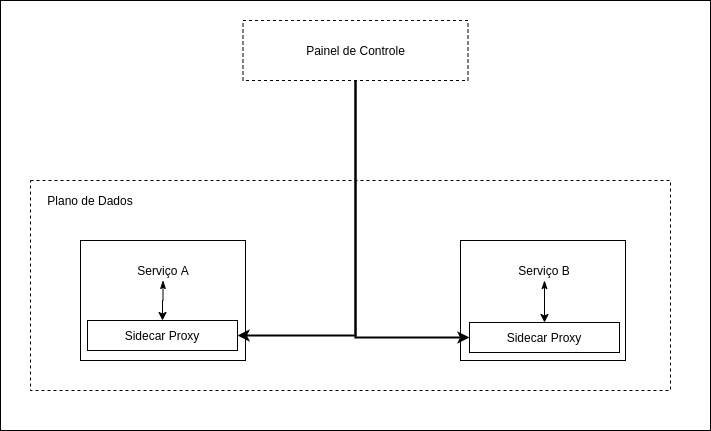

# Cloud

Uma vez que conversamos sobre DDD, microservices, boas práticas design de código e arquitetura de software, temos embasamento para prosseguir e abordar um dos temas mais discutidos do cenário de tecnologia: computaçào em nuvem (*cloud* *computing*).

Discorreremos sobre o que se considerar ao arquitetura de aplicações para um ambiente de cloud, perspectivas populares a respeito de aplicações  "cloud-native" e porque este conceito é tão ligado a ferramentas como Kubernetes.  Serão também descritos padrões e funcionalidades esperadas em uma aplicação, para que sejam first-class citizens em um ambiente de cloud. 

>  **INFO:** Este capítulo não te ensinará a fazer deploy de um cluster Kubernetes, a configurar um serviço na AWS ou a criar uma aplicação cloud-native. A intenção deste capítulo é prover informações arquiteturais que embasarão suas decisões e modelagem dos seus serviços e plataformas. Com o conhecimento aqui fornecido, você estará preparadoe confiante para iniciar ou prosseguir sua jornada cloud-native independente da solução ou linguagem adotada.

A buzz-word "cloud-native" começou a se estabelecer por volta de 2014, e sua crescente popularidade se mostra em seu melhor cenário. Para atingir maior espaço no mercado, empresas passaram a rotular seus produtos como cloud-native, quando na verdade, são apenas tecnologias cloud-enabled. 

> **TIP:** Uma das formas de se avaliar a popularidade de um termo, é validar a quantidade de buscas realizadas ao longo do tempo e as regiões interessadas.
>
>  https://trends.google.com.br/trends/explore?date=all&q=cloud-native

O entendimento destes conceitos te auxiliará no entendimento da situação em que suas aplicações estão, e dará suporte ao planejamento de uma jornada para a cloud. Vamos discorrer sobre estas categorizações, seus conceitos e diferenças.

## Cloud-Native ou Cloud-Enabled?

Uma aplicação pode ser categorizada conforme seu nível de adequação a um ambiente de cloud como sendo *cloud-enabled* ou *cloud-native* (a.k.a. *cloud-ready*).  

### Cloud-Enabled

É uma aplicação que roda na cloud - em um ambiente containerizado - mas que originalmente foi criada para rodar em ambiente tradicional - um data-center local, um cluster estático de servidores de aplicação, por exemplo, pode ser categorizada como *cloud-enabled*. Aplicações como esta costumam ter maior consumo de recursos (cpu, memória, storage) se comparado a aplicações cloud-native. 

Uma aplicação cloud-enabled passou por refatorações e ajustes para ser conteinerizada e orquestrada por plataformas como Kubernetes. O custo ou esforço de se refatorar toda a aplicação não são viáveis, portanto ela não usufrui de todos os benefícios existentes em um ambiente de cloud. 

> **INFO:** [Kubernetes](https://kubernetes.io/): É uma ferramenta open-source de orquestração de containers e trabalha muito bem com o [Docker](https://www.docker.com/). Atualmente, é a ferramenta mais popular na comunidade.

Para entender melhor tudo o que uma aplicação cloud-enabled não é capaz de entregar facilmente, vamos falar sobre o conceito cloud-native.

### Perspectivas sobre o conceito Cloud-Native

No momento da escrita deste livro, não há um consenso ou definição exata acerca do termo. Portanto, vejamos posicionamentos:

> "Cloud-native é uma abordagem para criar e executar aplicações que explora as vantagens do modelo de computação em nuvem. (...)"
>
>  —[VMWare Tanzu (Pivotal)](https://tanzu.vmware.com/cloud-native)

> "Cloud-native é uma maneira diferente de pensar e raciocinar sobre sistemas de software. Ele incorpora os seguintes conceitos: Alimentado por infraestrutura descartável, composta por limites, escala globalmente, adota a arquitetura descartável. (...)"
>
> — [Architecting Cloud Native Applications](https://www.amazon.com/Architecting-Cloud-Native-Applications-high-performing-ebook/dp/B07QTJ8WW8/ref=sr_1_4?keywords=cloud+native+applications&qid=1575059989&sr=8-4)

> "De maneira geral, “cloud-native” é uma abordagem para criar e executar aplicações que explora as vantagens do modelo de entrega de computação em nuvem. "Cloud-native" é sobre como os aplicações são criados e implantados, não onde. (...)" 
>
> — [InfoWorld](https://www.infoworld.com/article/3281046/what-is-cloud-native-the-modern-way-to-develop-software.html)

> "As tecnologias cloud-native capacitam as empresas a criar e executar aplicações escaláveis em ambientes modernos e dinâmicos, como públicos, privados, e nuvens híbridas. Containers, service meshes, microservices, infraestrutura imutável e APIs declarativas exemplificam essa abordagem. (...) "
>
> — [Cloud-Native Computing Foundation](https://www.cncf.io/)

> "Cloud-native é um adjetivo que descreve as aplicações, arquiteturas, plataformas/infraestrutura, e processos,que juntos as fazem funcionar de uma forma que nos permita melhorar nossa habilidade de rapidamente responer a mudanças e reduzir imprev  that together make it economical to work in a way that allows us to improve our ability to quickly respond to change and reduce imprevisibilidade.”
>
> — [Christian Posta](https://www.infoq.com/articles/cloud-native-panel/)

> "Um conjunto de boas práticas para otimizar uma aplicação na nuvem por meio de: containerização, orquestração e automação. "
>
> —  [Otávio Santana](https://twitter.com/otaviojava)

Além dos conceitos acima, um conjunto de padrões bastante adotado pela comunidade é o [12-factor](https://12factor.net/). As excelentes práticas de arquitetura de software sugeridas nesta metodologia originam do livro [Patterns of Enterprise Application Architecture, por Martin Fowler e David Rice](https://books.google.com.br/books/about/Patterns_of_enterprise_application_archi.html?id=FyWZt5DdvFkC&redir_esc=y). Tendo em mente que o livro foi publicado em 2003, tempos estes onde ainda não se falava em "cloud-native", podemos considerar que, ao adotar os conceitos do 12-factor você estará não apenas criando uma aplicação cloud-native, mas também, estará implementando boas práticas arquiteturais e culturais no desenvolvimento e entrega de software.

> **TIP**: Os detalhes de implementação que serão detalhados a seguir, podem evoluir e mudar com o tempo. Porém, as definições e padrões esperadas de uma aplicação cloud-native, permanecerão. Portanto, recomendamos a leitura das referências citadas e aprofundamento no entendimento do conceito. 

### Princípios de design e containerização de aplicações

Em se tratando em detalhes de implementação de uma aplicação cloud-native, é consenso entre as fontes citadas, que estas apps serão **conteinerizadas**. Com isto em mente, o arquiteto deve se preocupar não apenas com o  [SOLID](https://www.amazon.com.br/Clean-Architecture-Craftsmans-Software-Structure-ebook/dp/B075LRM681/ref=sr_1_2?adgrpid=83848702769&gclid=CjwKCAjwqpP2BRBTEiwAfpiD-w6m0nZtj0_jaXw7DfCfvIuztN-m6OrPIQ5BH2g2UHzLOird4mProRoCNTYQAvD_BwE&hvadid=426015975773&hvdev=c&hvlocphy=1001541&hvnetw=g&hvqmt=b&hvrand=11863819395550854586&hvtargid=kwd-298463329082&hydadcr=5628_11235154&keywords=clean+architecture&qid=1590032086&sr=8-2) na qualidade do código e mas também com os [princípios de design de conteinerização de aplicações](https://www.redhat.com/en/resources/cloud-native-container-design-whitepaper).

Princípios a serem considerados durante o tempo de construção:

* Single Concern Principle: Similar ao **S** do padrão **S**OLID, porém neste contexto, cada contêiner deve resolver *um* problema, e resolvê-lo *bem*; Caso seja necessário acoplar mais features a um microservice, por exemplo, side-cars podem ser utilizado no mesmo pod.
* Self-Containment Principle: Deve estar contida na imagem de build, todas as bibliotecas, runtime da linguagem e ferramentas de construção necessárias para se realizar o build a aplicação. As exceções são dados que variam entre ambientes, dados estes, que estarão por exemplo em variáveis de ambiente.
* Image Immutability Principle: imagens imutáveis são essenciais para se permitir escalabilidade e adoção de estratégias de deploy. Diferenças entre ambientes são providas ao container através de configurações (por exemplo, utilizando-se variáveis de ambiente ou ConfigMaps);

Princípios a serem considerados durante o tempo de runtime:

* High Observability Principle: A aplicação containerizada deve prover as API's padronizadas para que o orquestrador possa fazer health-checks de liveness e readiness. Coletas de logs e métricas também são parte das API's que o orquestrador poderá consumir e disponibilizar através de ferramentas como, por exemplo, Fluentd, Logstash para logs centralizados, ou Prometheus e Grafana para métricas. Apesar de tratar a aplicação como uma caixa preta, os desenvolvedores que buscam entregar apps cloud-native devem se preocupar em expor estas API's.
* Lifecycle conformance principle: é recomendado realizar graceful shutdown dos serviços sempre que possível, certo? Com containers, o mesmo é valido. O container precisa, através de API's, permitir que o orquestrador envie comandos para graceful ou forceful shutdown. E caso necessário, pode até mesmo fazer uso de api's como "pre-stop" e "post-stop" para implementação de necessidades específicas do componente pertencente ao container.
* Process disposability principle: Deve-se ter em mente que o container é volátil, e pode ser destruído e recriado várias vezes. Desta forma, tenha em mente o tempo de start-up e shutdown de seus containers. Além disto, caso seja necessário manter estado, deve-se recorrer a bancos de dados ou volumes providos pela plataforma.
* Runtime confinement principle: Ao seguir o princípio Self-Containment Principle, a imagem utilizada para se gerar o container utilizado de fato para executar a aplicação terá uma menor necessidade de consumo de recursos (memória, espaço, cpu). O princípio de Runtime Confinement, espera que o container tenha definidos os limites de recursos que serão utilizados. Com base nisso, o orquestrador poderá fazer uma melhor utilização da infraestrutura disponível.

Com base nestes princípios, é possível notar que não basta apenas criar um Dockerfile, containerizar uma aplicação e categorizá-la como "cloud-native". No processo de conteinerização, é esperado que a aplicação implemente e disponibilize recursos que facilitarão seu gerenciamento e orquestração.

### Funcionalidades de uma aplicação cloud-native

Um conjunto de microserviços que serão disponibilizados contêinerizados em um ambiente de cloud, podem utilizar, conforme necessidade, dos seguintes recursos oferecidos da plataforma de orquestração:

|                                                           |                                      |
| :-------------------------------------------------------: | :----------------------------------: |
| Gerenciamento de configurações (Configuration Management) | Service Discovery and Load Balancing |
|                      API Management                       |           Service Security           |
|                 Scheduling (of workloads)                 |     Auto Scaling / Self healing      |
|                    Distributed Tracing                    |         Centralized Metrics          |
|                    Centralized Logging                    |                                      |

Existem centenas de serviços que podem ser utilizados juntamente à plataforma de orquestração para fornecer as funcionalidades acima. Pensando em organizações que estão na jornada para a cloud, nasceu a Cloud Native Computing Foundation (CNCF). A CNCF nasceu com o objetivo de se definir o termo Cloud Native e fornecer espaço para projetos opensource como Kubernetes, Prometheus, e [muito mais](https://landscape.cncf.io/zoom=200). A CNCF adota projetos e os encaixa na arquitetura de cloud computing, segundo a visão dos membros do comitê.

Uma vez que tivemos um overview de todas as funcionalidades que podemos usufruir ao evoluir nossa aplicação, vamos ter uma idéia de como é o ciclo de vida dessas apps.

### O ciclo de vida de uma aplicação cloud-native

A componentização dos serviços, permite agora que os times de desenvolvimento entreguem mudanças com maior velocidade. Com isto, o time de operações precisa responder de forma equivalente, entregando serviços que permitam entregas velozes porém estáveis. Para atingir o cenário ideal, é de comum entendimento que a automação de processos de T.I. é essencial não só para o aumento da produtividade como também, para o aceleramento da evolução da organização como um todo. 

Nos cenários atuais, clientes esperam uma evolução constante e serviços altamente disponíveis e performáticos. Vejamos um cenário que considera esta necessidade, e demonstra o ciclo de vida da aplicação, utilizando-se melhores práticas de implantação:

Considerando que sua aplicação está pronta para deploy:

* O código fonte deve ser disponibilizado em um repositório de código fonte - *a single source of truth*.

  >  **TIP**: Conforme [pesquisas](https://softwareengineering.stackexchange.com/questions/136079/are-there-any-statistics-that-show-the-popularity-of-git-versus-svn) sobre os dados de 2020 (baseadas em códigos open-source) repositórios `git`  são atualmente a escolha mais popular.

* Este repositório por sua vez, pode ser configurado de forma que ações chave - como criação de uma nova tag, ou commit no branch master - disparem automáticamente uma ferramenta de integração contínua. 

* A ferramenta iniciará a execução de testes unitários e empacotamento dessa aplicação (podendo incluir mais passos como por exemplo, checagem da qualidade do código). 

  >  **TIP:** Tendo em mente uma melhor utilização de recursos, deve-se destacar que: a imagem base utilizada para construir a aplicação *não* deve ser a mesma imagem base utilizada para se executar a aplicação. Ferramentas para construção e empacotamento (como maven, npm, etc) que não são utilizadas na execução da aplicação, *não* devem estar incluídas na imagem base de execução.

* Após empacotar a aplicação, a ferramenta de integração é responsável pela criação do container com base na imagem-base que inclua este novo pacote (i.e. `.jar`) . 

  >  **TIP:** É recomendado que a imagem-base gerada seja armazenada em um registro de imagens.

* A partir desta imagem, a plataforma utilizada (i.e. Kubernetes, OpenShift, Rancher, etc) irá criar a quantidade de containers especificada. 

  > **TIP:** É muito comum a existência de casos de uso que podem usufruir da utilização de Operators para gerenciamento e manutenção de aplicações. 

Automação dos processos de entrega de software através da utilização de Entrega Contínua e Deploy Contínuo (CI/CD) é uma das práticas da cultura DevOps. Esta prática se mostrou eficaz em ambientes tradicionais, e agora, se mostra indispensável quando se trabalhando com times menores e centenas de microserviços rodando em clouds privadas, públicas, ou híbridas. 

## A jornada cloud-native

Entendidos os conceitos que giram em torno de uma aplicação cloud-native e após se visualizar o ciclo de vida de uma aplicação cloud-native, o próximo passo é entender as formas que estas aplicações podem ser entregues e as opções disponíveis no mercado. 

Há de se concordar que a transformação digital rumo a cloud acarreta não só uma mudança na forma de se codificar aplicações (time de desenvolvedores), mas se estende a outras áreas da organização de T.I. que precisará se reformular e lidar com novos desafios. Cada organização se encontra em um momento diferente, possui budgets diferentes e times com características e perfis variados.

Vamos discorrer sobre como *infraestrutura como serviço (Infrastructure As A Service - IaaS)*, *plataforma como serviço (Platform As A Service - PaaS)* e *software como serviço (Software As A Service - SaaS )* coexistem, seus prós e cons e como cada uma delas pode auxiliar o momento atual de sua organização na jornada cloud-native.

## IaaS, PaaS e SaaS: Uma perspectiva arquitetural

A melhor maneira de pensar no cloud em termo de abstração para o negócio, certamente é na analogia de um serviço de pizzaria como serviço. Podemos partir do cenário onde temos a opção de preparar toda a pizza em casa e ter que gerenciar todo o processo de criação e cozimento, ou, sair para comer a pizza em um restaurante sem se preocupar com sua criação. 

Na imagem acima, temos dispostos quatro formatos:  on-premise, IaaS, PaaS e SaaS, onde as caixinhas brancas são as tarefas de nossa responsabilidade, e as azuis são de responsabilidade de terceiros. Essa mesma comparação pode ser feita, se trocarmos as tarefas de criação de pizza, por tarefas referentes a criação de software: Instalação e gerenciamento de sistema operacional, networking, storage, orquestração de serviços, gerenciamento de middleware, runtime, pipelines de CI/CD, e até a criação da aplicação propriamente dita.

Quando nós falamos de cloud e seus serviços, note que quanto menor a abstração que utilizamos como serviço, por exemplo com IaaS, teremos a maior responsabilidade no processo de construção do software. Esse grande número de processos crescerá na mesma medida que em o número de servidores aumenta, e essa complexidade é diretamente proporcional relacionada aos riscos. Em contrapartida, quanto menor a abstração, maior o controle a possibilidade de customização da arquitetura e componentes.

### IaaS - Infra as a Service

Com este approach, é possível atingir e usufruir de todos os benefícios de um ambiente de cloud, porém, toda a responsabilidade de manutenção do software é da sua equipe de T.I. A empresa que provê o serviço de IaaS tem o dever de garantir a comunicação entre os serviços, de lidar com quedas, problemas de hardware e eventuais consertos. 

Neste cenário, a sua equipe assume tarefas referentes a banco de dados, backup, escalonamento tanto vertical quanto horizontal, etc. Esse fator aumenta a possibilidade de customização, e por outra perspectiva gera complexidade e mais risco. Nesta opção o hardware e a garantia de seu funcionamento pertence a terceiros, mas o serviço é executado pelo seu time, desta forma, pode ter um custo mais reduzido se comparado à outras opções.

O conceito de *orquestração* no contexto de IaaS é a configuração, gerenciamento e coordenação automatizada dos serviços, aplicações e sistemas de computador. Esta orquestração permite a manutenção da infraestrutura através de programação (infra as code) e tem como objetivo facilitar e abstrair a utilização da IaaS.

Exemplos de IaaS são Microsoft Azure, Google Compute Engine e [Amazon EC2](https://aws.amazon.com/ec2/). De uma maneira geral, se pode pensar nela como sendo um grande aluguel de máquinas no qual se pode pagar pelo uso delas, semelhante a nossa conta de luz. Para ilustrar isso, vamos analisar a realização do deploy de uma aplicação containerizada no ambiente da Amazon. A [primeira tarefa]((https://docs.aws.amazon.com/AWSEC2/latest/UserGuide/launching-instance.html)) é a criação de uma instância, atividade esta que requer cerca de sete passos. Em seguida, a [instalação do Docker](https://docs.aws.amazon.com/AmazonECS/latest/developerguide/docker-basics.html), para que assim seja possível criar [uma imagem para executar essa instância](https://docs.aws.amazon.com/AmazonECS/latest/developerguide/docker-basics.html#docker-basics-create-image). Neste caso, nota-se que um simples deploy de uma aplicação, requer não apenas know-how extra como a execução de tarefas de sysadmin por parte do seu time.

### PaaS - Platform as a Service

Uma redução drástica de complexidade para focar na criação do software, certamente, é a maior vantagem dentro do PaaS. Com ele, no geral, não é necessário se preocupar com a manutenção das máquinas, criação de rotina de backup, compra de licenças, etc. Todos os cuidados do [desenvolvimento serão na criação do software](https://twitter.com/gilzow/status/1251308583427465216). Porém, o PaaS costuma apresentar custo mais elevado se comparado com serviços sem maior abstração. 

> **TIP:** Veja abaixo, algumas opções de PaaS atualmente disponíveis no mercado: 
>
> * [Platform.sh](platform.sh) :  É um PaaS que utiliza todos os conceitos de infraestrutura como serviço e também é orientado ao Git, além de ser possível realizar o deploy da aplicação deixando todo trabalho para a plataforma. Basicamente, a partir de três arquivos: [aplicação](https://docs.platform.sh/configuration/app-containers.html), [serviços](https://docs.platform.sh/configuration/services.html) e [rotas](https://docs.platform.sh/configuration/routes.html) podemos fazer o push para um repositório Git. Um simples push para o sistema remoto do Platform.sh criará automaticamente os containers da aplicação, dos serviços como banco de dados e as rotas da aplicação. Nesse caso a abstração é gigantesca e faz com que o time foque muito mais na aplicação central da empresa.
> * [Red Hat OpenShift Online](https://www.openshift.com/products/online/): uma opção para se utilizar o OpenShift (a.k.a. [OKD](https://www.okd.io/)) como serviço. Neste PaaS, o OpenShift é disponibilizado na AWS e permite aos desenvolvedores de aplicações Ruby, PHP, Node.js e Java utilizarem seus runtimes e banco de dados de preferência para rodar suas aplicações. Possui uma opção self-service e free para desenvolvedores. 
> * Heroku #TODO
> * GKE #TODO

Baseado em leituras e conceito aplicação de PaaS por diversas empresas, podemo analisar por duas perspectivas:

1. Você delega o gerenciamento de toda a plataforma (leia, Kubernetes e similares ) para terceiros. Desta forma a sua equipe não precisa instalar, lidar com manutenções, backups e monitoring. Esta perspectiva é apenas viável quando o caso de uso pode usufruir de uma cloud pública. Heroku e os vários flavors de Kubernetes como Platform.sh, GKE e OpenShift Online são exemplos de solução de PaaS que se adequam a esta perspectiva.
2. No segundo cenário, devido a restrições na sua empresa, você necessáriamente deve utilizar uma cloud privada.  Neste caso, você pode prover um PaaS ao disponibilizar uma ferramenta que aumente a autonomia do desenvolvedor ao prover uma forma eficiente e automatizada de entregar aplicações conteinerizadas, seja através do uso de catálogo de serviços, abstração de apis de entrega de containers, e automação de deploy. Desta perspectiva, é valido considerar que ferramentas como por exemplo OpenShift, instalado em uma cloud-privada, e gerenciada pelo seu time de infra-estrutura.

Em ambos os cenários, é comum assumir que há maior autonomia do desenvolvedor ao se utilizar PaaS.

### SaaS - Software as a Service

O software como serviço é a oferta que provê uma solução mais rápida para determinado problema. Nesta oferta, o cliente opta por consumir um programa pronto para uso, e não precisa se preocupar com hospedagem, escalabilidade, etc e nem mesmo desenvolvimento. Toda a complexidade e o risco já foram resolvidos. No entanto, a customização é bem reduzida e a possibilidade de configuração depende diretamente do provedor. 

---

De uma maneira geral temos que pensar nos seguintes três princípios cíclicos que compara:

* Quanto maior a complexidade menor abstração;
* Quanto maior abstração menor é o risco;
* Quanto menor o risco menor é complexidade.
  

É verdade que existem vários benefícios na navegação nos mares da computação em nuvem, porém, é muito importante conhecer os tipos de serviços que a cloud disponibiliza e fazer uma análise profunda entre a complexidade de um serviço com o seu respectivo risco, além de quanto tempo o time está disposto a gastar para criar e manter toda a infraestrutura. O PaaS fornece uma grande vantagem de abstração de toda a infraestrutura e manutenção para que o desenvolvedor foque no seu negócio. O IaaS te garantirá uma grande flexibilidade e poder para instalar e configurar o que seu time deseja sem nenhum problema mesmo que tudo tenha que seja configurado manualmente. É muito importante que a quanto o time quanto a empresa tenha noção de que, independente da escolha haverão benefícios e desvantagens. É muito importante para que os arquitetos avaliem o que melhor se encaixa na instituição, afinal, cloud e computação não está relacionado a quando, mas como.

# Kubernetes - Quando usar e quando não usar

Como decidir quando é a hora de migrar seu workload para uma arquitetura conteinerizada e orquestrada por plataformas como Kubernetes? Entenda mudanças culturais e operacionais para tomar uma decisão mais embasada. Os pontos abaixo descritos são válidos para plataformas como Kubernetes e seus vários flavors.

* Instalação e manutenção da plataforma de orquestração: em caso de adoção de IaaS, o time de sysadmins deve estar preparado para realizar e gerenciar a instalação de um ou mais clusters de Kubernetes. Deve estar atenado em melhores práticas de gerenciamento e configuração de clusters Kubernetes.

* Utilização da plataforma Kubernetes: em caso de IaaS ou PaaS:

  * Da perspectiva de um desenvolvedor, a conterinerização da aplicação garante que o código que roda em sua máquina, funcionará também nos ambientes produtivos. Basta garantir que a imagem seja corretamente descrita. Além disto, uma vez absorvidos os conceitos de criação de uma aplicação cloud-native e das vantagens de um ambiente de orquestração, o desenvolvedor tem a vantagem da perspectiva da carreira, de estar apto a trabalhar em diferentes vendors, uma vez que há certa padronização na forma de trabalho. Por outro lado, a gestão deve estar ciente da curva de aprendizado inicial que a equipe enfrentará.

    > TIP: É recomendada a leitura do livro [Kubernetes patterns for desiging cloud-native apps](https://www.redhat.com/en/resources/oreilly-kubernetes-patterns-cloud-native-apps). Trás boas práticas na implementação de serviços cloud-native. 

  *  Da perspectiva do time de middleware ou sysadmins, o dia-a-dia passa a ser diferente. Não é mais necessário despender tempo aprendendo como entregar diferentes tipos de aplicação e desvendando suas respectivas peculiaridades e dependencias. Basta aprender a lidar com containers, e a forma de trabalho passa a ser padrão, independente da tecnologia utilizada nas aplicações. Por outro lado, deve-se entender conceitos de operators, segregação e segurança no ambiente Kubernetes, estratégias de deployment (rolling, blue-green, canary), como lidar com storages, etc.

##  Kubernetes Vanila e seus sabores

Este projeto se popularizou por demonstrar que é capaz de lidar com orquestração de containers em larga escala. É possível identificar diversas ofertas baseadas em Kubernetes: Heptio, OpenShift, Platform.sh, Rancher, entre outras. A intenção é que cada empresa por trás destas plataforma possa agregar valor com features únicas, porém, respeitando todos os conceitos e arquiteturas existentes em sua plataforma de origem, Kubernetes. 

As diferentes plataformas trazem consigo de maneira pré-selecionada porém não definitiva, um conjunto de tecnologias que irão atender aos requisitos de uma plataforma de orquestração. Para entender melhor esta afirmação, analise a [CNCF landscape](https://landscape.cncf.io/), e note a quantidade de tecnologias que endereçam por exemplo, a categoria de Service Mesh. Uma das opções disponíveis é o [Istio](istio.io), solução esta, disponibilizada de forma suportada em plataformas como o OpenShift, o que não significa que a mesma tecnologia é exclusiva desta plataforma. O que se torna diferenciado entre plataforma são as distribuições utilizadas. Ainda tendo o service mesh como exemplo, o projeto de Istio entregue pelo OpenShift é o [Maistra](http://maistra.io/), que é um projeto que adiciona mais features on top of Istio. 

Neste contexto, ao selecionar sua próxima plataforma de orquestração considere:

- As features exclusivas de cada plataforma e como elas podem tornar sua equipe mais eficiente;
- O quanto é importante para sua empresa o nível de estabilidade do serviço (em casos de ofertas de PaaS em clouds públicas ou híbridas);
- Como você e sua equipe irão lidar com problemas: por si só, ou precisam de suporte enterprise?
- Se vai rodar em cloud pública, valide se a plataforma oferece suporte ou tem cases de sucesso na devida opção (Amazon, Google, Azure, etc.).
- Avalie as ferramentas de CI/CD suportadas pela plataforma;
- Avalie as ferramentas que seu desenvolvedor terá que utilizar no dia a dia para interagir com a ferramenta de orquestração: existe apenas CLI? Há um console que permite manutenção e monitoramento do ambiente? 
- Caso seja parte do seu cenário uma migração parcial e de medio/longo prazo de um ambiente on-premise para uma cloud pública, avalie as possibilidades de um ambiente híbrido onde você possa usufruir de ambas clouds privada e pública sem maiores problemas com a plataforma em questão;

## Service Mesh

Vamos a definição de service mesh (malha de serviços) por [William Morgan, 2017](https://buoyant.io/2017/04/25/whats-a-service-mesh-and-why-do-i-need-one):

> Uma malha de serviço é uma camada de infraestrutura dedicada para lidar com a comunicação serviço a serviço. É responsável pela entrega confiável de solicitações por meio da topologia complexa de serviços que inclui um aplicativo nativo da nuvem moderno. Na prática, a malha de serviço é normalmente implementada como uma matriz de proxies de rede leves que são implantados juntamente com o código do aplicativo, sem que o aplicativo precise estar ciente.

Estamos falando de um desacoplamento entre o "Dev" e o "Ops", ou melhor, o desenvolvedor não precisa se preocupar no código do seu microserviço de prover as capacidades que operação precisa. E toda vez que operação precisar alterar algo, não é necessário uma nova compilação da aplicação, gerando um desacoplamente que prove a resiliencia, a segurança, toda a parte de observability e reteamento para a malha e fora da aplicação.

Se avaliarmos que o conceito começou a ganhar popularidade em 2017, é um conceito um tanto quanto novo, mas a idéia é criar uma camada de abstração por cima da aplicação. E através da malha prover a segurança entre os serviços, e também delegar para a malha toda a observação e resiliência que ela possa precisar.

Uma camada de abstração pode existir em três níveis:

- **Biblioteca** - Cada serviço implementa uma biblioteca que inclui as capacidades da malha, blibliotecas como [Hystrix](https://github.com/Netflix/Hystrix) ou [Ribbon](https://github.com/Netflix/ribbon) são exemplos. Estas implementações possuem trade-offs pois, neste caso, você precisa fornecer as bibliotecas e com isso limitar as tecnologias que se pode trabalhar. Se seu projeto tem multiplas linguagens, você também precisará de multiplas implementações e precisará gerenciar esse cenário. 
- **Node Agent** - Existe um agente rodando em cada nó da malha e com a responsabilidade de cuidar das capacidades da malha. A implementação do Linkerd no Kubernetes usa esse modelo. O trade-off aqui é que o time de Ops precisa trabalhar em conjunto com o time de Dev para que as capacidades estejam bem estabelecidas.
- **Sidecar** - Atualmente a implementação mais sugerida, é o modelo usado pelo Istio com Envoy. Neste modelo para a cada container de aplicação existirá um container ao lado - no mesmo pod. Este sidecar lida com tudo que a malha precisa para chegar ou sair do serviço.

Mas o que são essas capacidades da `Malha` que são mencionadas acima. A malha de serviços devem seguir as regras de ORASTAR sem ter códigos implementados no seu microserviço:

- **Observability** - O Painel de Controle prove todos os serviços de observação que estão rodando no plano de dados. Ou seja, métricas para ver a latência, consumo de banda, logging e tracing, tudo que precisa para monitor a saúde dos seus serviços ficam na malha. Provendo vizualições gráficas de todas as requisições.
- **Routing** - As regras de roteamento para o controle do tráfego pode ser feito tanto visualmente quanto por arquivos de configuração e então enviadas do controle para todos as aplicações. Estamos falando de mudança e divisão de tráfego, controle sobre o que entra e sai, e a capacidade de injetar falhas e latências para fazer testes.
- **Automatic Scaling** - O painel de controle tem que ser capaz de escalar automaticamente para lidar com os aumentos do workload ou diminuição do mesmo.
- **Separation of duties** - Usar o painel de controle para separar a operação da malha e dar mais independencia para os desenvolvedores.
- **Trust** - Delegue para a malha e o plano de dados os protocolos de comunicação de segurança, bem como a renovação e manutenção de certificados. E a regra é sempre a mesma, considere que se está sempre inseguro, mesmo abaixo de um firewall.
- **Automatic service registration and discovery** - O painel de controle interage com o gerenciamento do cluster para provisionar a descoberta dos serviços automaticamente, assim como registrar a aplicação durando o procedimento de deploy.
- **Resilient** - As regras de resiliencia para toda a sua malha, é necessário assumir que a rede pode falhar. Então é preciso ter a capacidade de blindar o trafego e automaticamente balancear para outros pontos que estejam funcionamento e que possam prover a mesma capacidade. Aqui entra o conceito de Circuit Breaker.

### Arquitetura

E para implementar as regras de ORASTAR temos a arquitetura de ter um plano de controle e um plano de dados. Vamos entender esses conceitos.

`Painel de Controle` é onde ficam as configurações, políticas e a administração dos serviços que estão no plano de dados para o controle de rotas, tráfego, monitoração, descoberta e registro dos serviços. É aqui que está responsabilidade pela comunicação entre os microserviços através de autenticação, autorização e segurança no tráfego da rede.

`Plano de dados` estão todos os microserviços e seus "sidecars", não importando como eles estão implementados. É com essa camada que o painel de controle interage para conseguir controlar os serviços.

### Ferramentas

Service Mesh é um conceito que surgiu aproximadamente em 2018 e está em constante evolução. Em termos de implementação, basicamente vamos falar de três ferramentas: Istio, Linkerd e Consul.

**Istio** - Ferramenta criada pela Google, IBM e Lyft. Hoje o [Istio](https://istio.io/) é a implementação mais recomendada do mercado, e construída em cima da plataforma do Kubernetes. 

Ele é um painel de controle centralizado que permite que se administre e coordene as aplicação no plano de dados, e inclusive pode-se rodar o core dele fora do kubernetes, tem suporte a integração com VMs e service discovery com diferentes produtos.

**Linkerd** -  iniciado pelo Twitter para lidar com seu volume massivo. Hoje está na versão [Linkerd](https://linkerd.io/) 2.0. Possui a limitação de rodar apenas ambientes com Kubernetes. Também possui um painel de controle centralizado como o Istio, e usa seu próprio Sidecar, em vez do Envoy como proxy como os concorrentes.

**Consul** - criado pela Hashicorp. O [Consul](https://www.consul.io/) é mais velho que o próprio service mesh, sendo que sua primeira versão foi de 2014. Ele é composto de um binário em GO para o servidor e aplicações para prover as capacidades da malha. Mas diferente das ferramentas acima, ele tem um painel de controle distribuido, pois é feito para funcionar próximo as máquinas. 

>  **TIP:** Para optar por um dos serviços, veja a comparação de funcionalidades entre os serviços encontrada no artigo [Kubernetes Service Mesh: A Comparison of Istio, Linkerd and Consul](https://platform9.com/blog/kubernetes-service-mesh-a-comparison-of-istio-linkerd-and-consul).  

Do ponto de vista do autor, uma das desvantagens do Linkerd é não possuir Circuit Breaker nativo fazendo com que você tenha que implementar o Circuit Breaker no código de seu serviço. Em contrapartida, ele é mais o fácil de operar dentre as outras opções.

Não podemos deixar de fora os provedores de serviços na nuvem pública que também tem oferecido service mesh, como a AWS e a Microsoft:

**AWS App Mesh** - Se o seu ambiente está na AWS, vale a pena dar uma neste serviço que usa o Envoy como sidecar proxy: [AWS App Mesh](https://aws.amazon.com/app-mesh/?nc1=h_ls);

**Azure Service Fabric Mesh** - Apesar de usar o nome Service Mesh, este é o que mais se difere dos demais. Está mais comparado a um Red Hat OpenShift e se faz necessário que você tenha um plano de dados de malha de serviço já em uso. É um serviço gerenciado e os desenvolvedores não tem acesso ao painel de controle: [Azure Service Fabric](https://azure.microsoft.com/services/service-fabric/)

