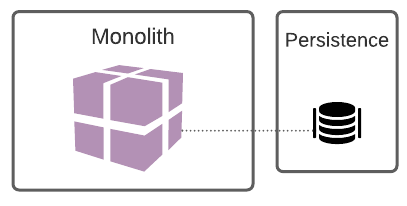

# Arquitetura de microsserviços

Com a popularização da utilização de ambientes de cloud para entrega de software, a [arquitetura orientada a microsserviços](https://www.martinfowler.com/articles/microservices.html) passou a ser cada vez mais adotada. O quão confortável a comunidade de T.I. pode se sentir acerca da adoção desta arquitetura? 

Com base na análise de [tendências de arquitetura e design de software realizada em Abril de 2020](https://www.infoq.com/articles/architecture-trends-2020/), podemos assumir que o conhecimento acerca dos benefícios e desafios da adoção deste modelo estão bem estabelecidos, uma vez que já sua adoção já chegou a categoria de usuários classificados como "Late Majority". Existem várias histórias de sucesso e de desastre de organizações que optaram pelo uso deste modelo, portanto, nosso ecossistema se encontra repleto de conhecimento como "por onde começar" e "lições aprendidas". 

Antes de entrar em mais detalhes sobre esta arquitetura, vamos brevemente recapitular os desafios da arquitetura monolítica que antecederam a criação deste novo modelo arquitetural.  

## Arquitetura monolítica

Em uma arquitetura monolítica encontramos uma aplicação cujo front-end e back-end são parte de um artefato único. Neste artefato estão contidos todos componentes funcionais, que são compilados e disponibilizados em conjunto. A escalabilidade é impactada uma vez que sempre que é necessário escalar esta aplicação, será necessário prover recursos para a execução de todos os seus componentes - mesmo aqueles que não precisavam ser escalados. No cenário de persistência, é muito comum se encontrar a relação de um banco para um monolito, porém, existem monolitos que trabalham acessando multiplos bancos de dados ( o que aumenta ainda mais o nível de complexidade de manutenção).

Com o passar dos ciclos de desenvolvimento, estas aplicações monolíticas tendem a crescer tanto em quantidade de linhas de código quanto em consumo de hardware, o que acarreta em:

- Menor manutenibilidade do código: as chances de se quebrar a aplicação ao realizar alterações pontuais passam a ser cada vez maiores. 
- Quanto maior a aplicação, maior o número de testes unitários, o que acarreta um maior tempo de build sempre que se precisa compilar a aplicação;
- Um maior tempo de build acarreta em um processo de entrega mais longo;
- É comum que a área de negócio queira realizar testes de validação da aplicação ao se liberar uma nova versão. Esses testes também requerem mais esforço, uma vez que - apesar de uma porção pequena ter sido alterada - toda a aplicação foi atualizada. Desta forma, os testes de homologação se tornam mais demorados;
- Evolução e migração dos dados requerem um maior planejamento prévio, uma vez que alterações em banco podem parar o funcionamento de toda aplicação;
- A aplicação naturalmente passa a ocupar e consumir maior espaço em memória, e possuir um maior tempo de start-up.
- Mudanças e entregas críticas exigem uma grande mobilização na organização e planejamento prévio para disponibilização em produção.

Ao enfrentar estes desafios, muitos times acabam caindo na cilada dos "monolitos distribuidos": a aplicação é entregue em módulos, ou seja, o código passa a ser separado de forma que pode ser entregue separadamente. Mas cuidado: neste cenário, ainda existe dependência entre estes serviços - mudanças no serviço A podem impactar no serviço B! Evite este cenário, pois nele você encontrará ainda mais complexidade no controle de versões e disponibilização da aplicação que em uma arquitetura monolítica.

E eis que notamos um dos maiores impasses: o acoplamento, em termos de código e de deploy. Quando a aplicação começa a se tornar muito complexa, com vários times de desenvolvimento e muitas funcionalidades, as adições ou alterações começam a se tornar cada vez mais custosas. Escalar um ambiente destes é desafiador. 

É aqui que entra o conceito dos microsserviços, que começa a desacoplar esses serviços e dar responsabilidade únicas para os serviços. Nesta abordagem você pode alterar, disponibilizar e escalar de maneira independente todo o ecossistema, seguido sempre a premissa de não afetar os outros microsserviços.

//TODO UMA COLA MELHOR

O mundo dos monolitos trazem diversos benefícios, como sempre cansamos de falar, todas escolhas resultam em um trade-off, ou seja, pontos fotes e pontos fracos dentro da sua arquitetura. Vendendo um 

- ​	Facilidade de manutenção, afinal, quanto menos camadas físicas menos pontos para se verificar, especialmente, quando está pequeno
- ​	Facilidade de sincronizar os dados entre o usuário e o sistema, a melhor maneira de trocar informações e mais rápidos é pela memória. Pensando num banco de dados relacacional, por exemplo, a sincronização de dados acontece de uma maneira bastante simples com os clássicos JOINs ao invés de realizar todo o processo de sincronização ou orquestarção.
- Consistência de dados, tendem a ser facilitado se comparado à um sistema distribuido, salientando que sempre teremos o problema do CAP quando falamos de arquitetura distribuida e para aplicações que precisam, por exemplo, transação no o que no monolito seria um simples Roolback num sistema de microservices seria o caro e complexo padrão SAGA.
- Iniciar um projeto tende a ser muito simples com o monolioto uma vez que precisamos pensar em menos camadas e componentes
- O monitoramento dentro de uma única aplicação tende a ficar mais facilitada.

## Microserviços

A arquitetura orientada a microsserviços trás como preceito a criação de aplicações desacopladas entre si e modeladas conforme o dominio de negócios. Essas aplicações se integram através de diferentes protocolos e os diversos padrões de comunicação (REST, GRPC, eventos assíncronos, entre outros) podem ser adotados. Com a adoção de uma arquitetura orientada a microsserviços é possível promover entregas mais velozes e frequentes, além de trazer ao desenvolvedor um ecossistema agnóstico de linguagem. 

Como apontado por Sam Newman, em seu livro "Building Microservices", estes são conceitos que estão implícitos aos microsserviços:

* São modelados levando-se em consideração o domínio do negócio;
* São altamente monitoráveis;
* Seu deploy pode ser feito de maneira independente dos outros serviços;
* Possui isolamento às falhas no ecossistema;
* Detalhes de implementação são "escondidos";
* Automação é essencial em todos os níveis;

Com essas características alcançamos uma arquitetura flexível e escalável. 

> **TIP**: Tenha em mente que as vantagens expostas não necessariamente nos levam a um mundo onde as arquiteturas monolíticas não têm espaço. Na verdade, nós temos agora mais uma ferramenta em nossa caixa de ferramentas, uma forma diferente de se de entregar aplicações - que não necessariamente é a melhor forma para todos os cenários.

Vejamos algumas vantagens da utilização da abordagem de uma arquitetura orientada a microsserviços:

- **Escalabilidade vertical** - Devido à independência dos serviços, eles podem ser escalados conforme a necessidade, sem causar impactos nos demais serviços. Por serem menores, também requerem menos recursos de harware.
- **Liberdade de selecionar tecnologias por projeto**: É possível escolher a melhor tecnologia para resolver determinado problema mesmo que seja diferente das tecnologias utilizadas nos demais serviços.
- **Produtividade** - Esta abordagem suporta a existência de multiplos times multidiciplinares (também conhecido como squads) que podem atuar com um foco mais específico de negócio e devido à independência técnica, entregar com maior velocidade.
- **Agilidade** - metodologias ágeis e suas diversas ramificações têm se mostrado cada mais populares. Ao se aliar este estilo de gerenciamento de projeto com a arquitetura em microsserviços, permitimos tecnicamente a existência de ciclos completos e mais curto para entrega de valor .
- **Reusabilidade** - Os componentes, como por exemplo um serviço que processe a lógica de negócio, podem ser consumidos via APIs quando necessário evitando assim a duplicidade de código e impactos na manutenibilidade.
- **Produtividade para times grandes**: tende a se tornar mais fácil e menos problemático atividades como merge/rebase de um projeto se cada time trabalhe no seu próprio repositório. É muito importante pensar na organização e suas estruturas que refletem diretamente nos serviços e nas suas integrações. É o caso muito comum de que a estrutura do time impacta como os software são organizados, muito bem explicado no Coways's law.

### Desafios da arquitetura de microserviços

A comunicação entre componentes de uma aplicação monolítica ocorrem in-memory, ou seja, não possuem o overhead da  **latência** existente na comunicação via rede, como ocorre no cenário de microsserviços. Quanto mais o número de serviços e a complexidade arquitetural aumentam, este problema pode ser mais catastrófico. Lidar com o tempo de resposta do serviço invocado no cliente em si é uma boa prática (como configuração de timeouts e retries) assim como, manter em dia os serviços de monitoramento e alertas da sua rede.

Atente-se à separação por responsabilidade dos componentes de backend e de front-end. O **front-end** deve ser implementado de forma que, na falha de um dos serviços de back-end, os demais itens funcionem normalmente - garantindo a melhor experiência possível ao usuário final.

A arquitetura de microsserviços é agnostica a linguagens e frameworks. Com isso, seu ambiente pode se tornar **poliglota**. Do ponto de vista arquitetural e de liderança ténica, tenha parcimônia na avaliação das tecnologias a serem utilizadas para que não se depare com um cenário onde há um serviço sem profissionais capacitados para mantê-lo. A definição do escopo e tamanho de um microsserviço deve ser mensurada 

A definição do tamanho e escopo dos microsserviços pode ser uma tarefa que exija um pouco mais de esforço no início da jornada ao desacoplamento. Tenha em mente que o escopo e tamanho de um microsserviço deve ser mensurados a partir do princípio da responsabilidade única (**S**OLID). 

Um dos desafios de governança é evitar a existência de aplicações orfãs em ambiente produtivo. Procure estabelecer times responsáveis por cada serviço, inclusive em sua fase produtiva. Desta forma caso ocorra um problema inesperado ou uma nova solicitação de mudança, será mais fácil identificar quem poderá assumir as tarefas.

Cuidado com a granualização demasidada de projetos por repostitórios, essa decisão pode sair pela culatra quando existem mais repositórios que funcionário na empresa.

### Quando evitar a arquitetura de microserviços

Nenhuma arquitetura é apropriada a todos os cenários e organizações, portanto, vamos conhecer alguns fatores que nos alertam que a arquitetura de microsserviços pode não ser a mais apropriada. 

Avalie o quanto o seu time de T.I. tem conhecimento das fronteiras que definem o negócio do software a ser implementado. Caso a visão seja muito restrita, fique alerta. Para maiores chances de sucesso na implementação desta arquitetura é necessário ter uma boa visão do domínio a ser implementado, para que seja possível identificar as possíveis partes a serem desacopladas.

Se você precisa testar uma idéia através de um MVP (Produto Viável Mínimo) , também deve-se avaliar com cautela esta arquitetura. Para a criação da maioria dos MVPs, o processo de desenvolvimento e entrega de software se mostra mais eficiente com a utilização de monolíticos. Uma vez validada a idéia do MVP, pode-se migrar para a abordagem microsserviços se a essa estratégia se mostrar necessária.

Os desafios de monitoramento e observabilidade dos serviços distribuídos e até conteinerizados trarão a necessidade de um time com perfis e skills mais mescladas e que vão além de um crud tradicional implantado em um servidor de aplicações instalado em uma máquina virtual. Tecnologias como contêineres, orquestradores de contêineres e funcionalidades cloud-native devem ser habilidades existentes no seu time de T.I.

Evitar esta arquitetura no início de um projeto não significa impossibilitar o seu uso futuramente. Vamos falar um pouco sobre estratégias para se realizar a migração de aplicações monolíticas para um cenário de aplicações menores e mais desacopladas.

## Planejando uma migração de um monolito para uma arquitetura de microservices

Existem alguns padrões e tecnicas para fazer uma migração para de um monolito para um microserviço. 

#### Padrão: Strangler Fig Application (Estrangulamento)

Quem veio com esse padrão pela primeira vez foi Martin Fowler, https://martinfowler.com/bliki/StranglerFigApplication.html, e como o nome diz, o conceito é ir estrangulando o seu legado e ir substituindo as parte por microsserviços. E a idéia aqui é o "legado" funcionar junto com o novo, dando espaço para a parte nova começar a crescer e substituir o antigo. E a chave deste padrão é permitir uma migração incremental para o novo sistema. E como é incremental, lhe dá o espaço para aprender e parar ou pausar a migração e ir ajustando as direções do que está sendo entregue.

Esse padrão pode ser usado para migrar de uma monolito para outro e também ir de uma monolito para um padrão de microsserviços. As vezes, apenas separando código e reimplementando as funcionalidades segregadas, o unico ponto de atenção é que se a funcionalidade tem algum requerimento de persistência de estado, você vai precisar ver como vai levar isso para o mundo dos serviços.

Implementar esse padrão requer basicamente três passos:

1. Identificar as partes do sistema a serem migradas,
2. Implementar a funcionalidade em um novo microserviço. 
3. Fazer a aplicação antiga apontar para o novo microserviço.

Outra vantagem de seguir nessa direção é a possibilidade de em caso de necessidade, você poder voltar a aplicação para o estado anterior e continuar usando o legado enquanto você analisa o que fez com que o novo serviço não funcionasse como deveria.

Mas para este padrão funcionar, você precisa saber claramente o mapa de como funciona a funcionalidade que você quer levar para o microserviço.

#### Padrão: Composição de UI

O padrão de estrangulamento olha para o trabalho todo sendo no lado servidor, mas a interface também nos da ótimas oportunidades para ir separando as funcionalidades para o novo padrão de microsserviços.

E aqui temos diversos jeitos de aplicar essa separação, a idéia é ir do front até o backend. A chave é começar a componentizar a UI para que ela possa funcionar isolada, e ai poder encaixar a funcionalidade onde for necessário.

Um dos pontos de atenção desta técnica é que você precisa alterar seu monólito e lançar uma nova versão sempre que alterar essa parte do front, principalmente se a aplicação for mobile, porque será necessário uma nova versão na loja e nos clientes. E neste ponto é onde a técnica dos Micro-Frontends vai lhe ajudar bastante.

#### Padrão: Ramificar por Abstração

Para o padrão de estrangulamento, temos que ser capazes de interceptar as chamadas no perímetro do monólito. Mas e quando a funcionalidade está completamente enraizada dentro da sua aplicação? 

Neste casos é preciso fazer alterações significantes e disruptivas na sua base de código, só que isso se tornar um problema para você, porque queremos fazer as mudanças no código de maneira incremental, mas ao mesmo tempo impactar o menor possível os desenvolvedores que já estão trabalhando na sua base de código. Aqui entra o padrão de ramificar, e como fazer isso.

O primeiro passo é criar uma abstração da funcionalidade para ser substituída, então a aplicação atual passa a usar a abstração, então você trabalha no código desta abstração e cria o mecanismo para alternar entre o modelo antigo e o novo microserviço criado, e se está tudo ok, você remove a implementação antiga.

O interessante neste modelo, é que ao mesmo tempo você acaba criando um modelo de *fallback* que pode ser usado se seu novo serviço não se comportar bem. 

Este é um padrão utilizado para resolver praticamente qualquer situação, e útil quando a sua base de código vai sobreviver junto por um bom tempo.

#### Padrão: Rodando em Paralelo

Quando você tem um cenário em que você não consegue testar todos os cenários possíveis de implementação e não quer mexer no código legado, e quer mitigar o risco de ficar trocando entre uma implementação e outra, acaba-se por usar o padrão de subir um segundo serviço e deixar ele rodar em paralelo com o principal.

Neste modelo você não roda a implementação velha ou a nova, você roda as duas e assim consegue comparar o resultado e a performance de ambos. E com isso o sistema antigo permanece intocado. Normalmente se usa técnicas como o Canary Releasing neste padrão para que você possa ir direcionando parte do seu tráfego para a nova funcionalidade e ir comparando os resultados. Outra técnica muito usada aqui é o chamado "dark launch", onde você mantem a funcionalidade velha ativa e a nova transparente para o usuário e você vai comparando as funcionalidades e quando trocar para a nova será completamente transparente para o sistema.

Esse padrão é uma opção para ser usada quando você tem aplicações de alto risco que não pode ficar indisponíveis de maneira alguma, que são críticas para o negócio, então você vai comparando o funcionamento da nova e faz a troca no momento em que você tem a certeza absoluta que vai funcionar tudo perfeitamente.

#### Padrão: Colaborador de Decoração

Esse padrão é utilizado quando você precisa mudar algo baseado no comportamento de algo acontecendo dentro do monólito, mas não pode alterar o monólito. A idéia aqui é colocar algo como decoração para fazer com que o monolito esteja fazendo as chamadas aos serviços diretamente, mesmo que você não tenha chamado ele.

Em vez de você interceptar ou mudar a requisição, você deixa ela acontecer normalmente, e baseado no resultado desta chamada, juntamos com a chamada ao microserviço externo e até mesmo alteramos o comportamento da resposta.

Este padrão é usado normalmente quando você precisa mudar os dados, seja na chamada ou na resposta, e complementar essas informações sem alterar o seu monolito.

## Os erros mais comuns com microservices

 

É muito comum existir a lista mais comuns dos erros que todo software tem, principalmente, quando existe uma mudança de paradigma. Por exemplo, quando houve a migração para os bancos de dados NoSQL, certamente, o erro foi pensar em relacionamento em bancos de dados que não tem suporte a relacionamento como [Cassandra](http://cassandra.apache.org/). A lista a seguir apresenta os erros mais comuns que encontramos nos microservices:

- Quebra de domínio: o [DDD](https://www.infoq.com/minibooks/domain-driven-design-quickly/) trouxe vários benefícios, principalmente, trazer o código para próximo do negócio com a linguagem ubíqua. Dentro do DDD temos o conceito de domínios e quando movemos para microservices é muito normal quebrar de maneira errada o negócio no domínio. Esse tipo acontece, principalmente, quando fazemos a quebra de maneira precoce é o mesmo caso da modelagem no banco de dados que a fazemos, justamente, quando não temos muita informação do negócio. [Em seu artigo de definição de domínio o Martin Fowler](https://martinfowler.com/bliki/BoundedContext.html) menciona o *bounded context* , podemos ver isso num e-commecer quando separamos o controle de estoque do produto, porém, o que acontece se a regra obrigar que o produto só poderá ser exibido se tiver no estoque? Exato, toda vez que consultar um produto também precisará consultar no serviço de estoque resultando num total acoplamento entre os dois serviços. Em outras palavras, o serviço de produto e estoque não deveriam estar em dois serviços nesse contexto.
- ​	Não automatizar: uma das boas práticas existentes quando falamos de microservices, certamente, é o [CI/CD](https://www.infoworld.com/article/3271126/what-is-cicd-continuous-integration-and-continuous-delivery-explained.html). Essas técnicas são realmente importantes, principalmente, uma vez que existe uma grande quantidade de máquinas a serem gerenciadas;
- ​	Diversidade de linguagens: essa decisão é uma das mais intrigantes. Até o momento ,não conheço um único projeto cujo o objetivo é exibir alguma coisa no console, porém, é muito comum ouvir de grandes nomes recomendações baseados um “Hello World” ou pequeno. É importante ter muito cuidado com esse tipo de decisão; Afinal, quanto maior o número de linguagens dentro de uma empresa, significa que o time terá que conhecer diversos campos ou existirá silos de conhecimento. Existem diversas histórias do qual um sistema foi reescrito, simplesmente, por não ter um time técnico para manter ou por que a linguagem/framework foi descontinuada.
- ​	[Sua aplicação não é grande suficiente para se tornar microservice](https://medium.com/swlh/stop-you-dont-need-microservices-dc732d70b3e0): nem toda aplicação grande precisará ser migrada ou criada com o objetivo de se tornar um ambiente de microserviço. Um exemplo disso são as aplicações legadas e que atendem a necessidade do cliente.
- ​	Um dos grandes argumentos para escolher microservices está na possibilidade de escolher escalar um componente individualmente. Porém, eis que surge a seguinte pergunta: realmente  faz sentido escalar individualmente um componente?
- ​	Microservices precisam de informações e como todo banco de dados distribuídos eles enfrentam a teoria do [CAP](https://en.wikipedia.org/wiki/CAP_theorem). Dado um cenário do qual  se realiza múltiplas atualizações em diversos serviços,  é comum acrescentar um novo item na arquitetura: o padrão [SAGA](https://dzone.com/articles/microservices-using-saga-pattern). Resultando numa maior complexidade e pontos de testes no seu ambiente.
- ​	[Começar o projeto já como microservices tende a ser um grande erro](https://www.oreilly.com/content/should-i-use-microservices/), principalmente, na instabilidade na definição dos domínios. Um erro na quebra dos serviços faz com que exista uma grande dependência e acoplamento entre eles. Considere um contexto onde os dados a serem utilziados estão armazenados em múltiplas bases de dados, sendo pragmático este problema poderia ser facilmente resolvido em uma arquitetura monolítica um join num banco de dados relacional como MySQL ou PosgreSQL ou um subdocumento num banco de dados NoSQL como MongoDB.

* Utilizar microservices apenas porque grandes empresas utilizam esse tipo de arquitetura. No mundo de arquitetura de software, uma decisão não deve ser tomada apenas pela popularidade na solução. Como [Edson Yanaga](https://twitter.com/yanaga) fala em seu [livro](https://developers.redhat.com/books/migrating-microservice-databases-relational-monolith-distributed-data/): “Certamente, sempre lemos grandes coisas sobre as arquiteturas de microservices implementadas por empresas como Netflix ou Amazon. Então, deixe-me fazer uma pergunta: quantas empresas no mundo podem ser Netflix e Amazon?”.

# Conclusão

Como visto acima, a arquitetura de microsserviços traz bastante benefícios para o seu ambiente e lhe oferece a vantagem de deixar o desenvolvimento independente quando se tem vários times e funcionalidade, e essa independencia se estende também para o deploy da aplicação. Ou seja, você da velocidade para seu times e agilidade, consegue ter código de melhor qualidade já que ele vai estar organizado ao redor da funcionalidade. Tem-se a vantagem de ser fácil de escalar apenas no ponto em que se precisa, e ainda poder ser aplicacado na tecnologia que você tem mais domínio.

Mas, como já dito anteriormente, não é nenhuma bala de prata, ele traz complexidades para o ambiente e novas preocupações em termos de segurança. Imagine um projeto gigante com múltiplas instâncias e centenas de microsserviços, como você irá monitorar? Em caso de erro, como você vai encontrar, desviar ou mesmo tratar o erro?

Se usado da maneira correta, e tratado de perto os pontos de atenção, esse padrão de arquitetura tem muito a agregar no seus projetos.

Microservices como toda decisão de arquitetura sem suas vantagens e desvantagens como Martin Fowler fala:  

> Os microservices introduzem eventuais problemas de consistência, por causa de sua louvável insistência no gerenciamento de dados descentralizado. Com um monólito, podemos atualizar várias coisas juntas em uma única transação. Os microservices exigem vários recursos para atualizar, e as transações distribuídas são desaprovadas (por um bom motivo). Portanto, agora, os desenvolvedores precisam estar cientes dos problemas de consistência e descobrir como detectar quando as coisas estão fora de sincronia antes de fazer qualquer coisa que o código se arrependa. - [Martin Fowler](https://martinfowler.com/articles/microservice-trade-offs.html#consistency)