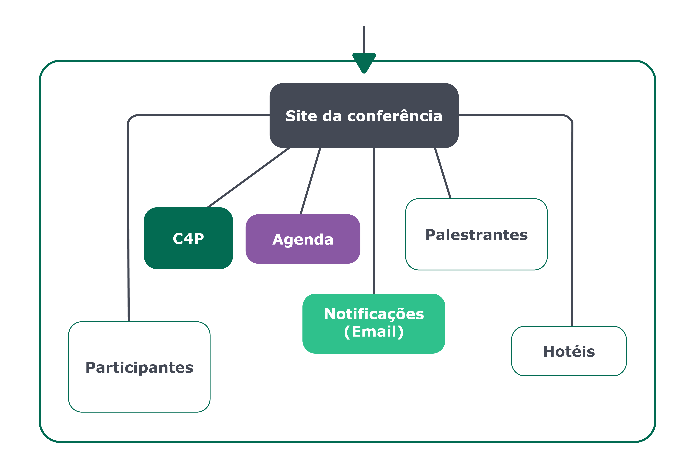
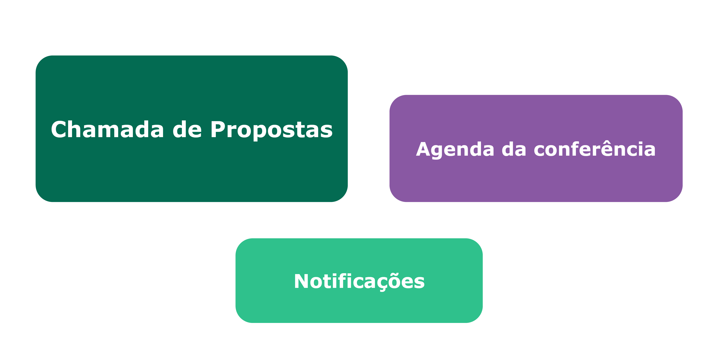
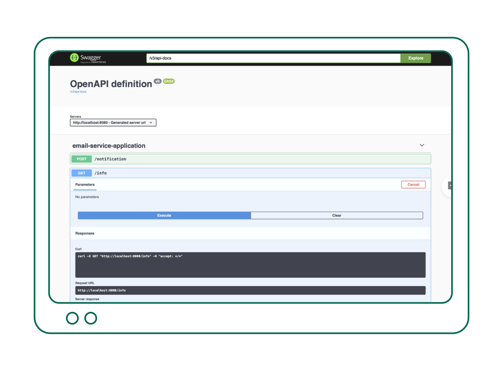
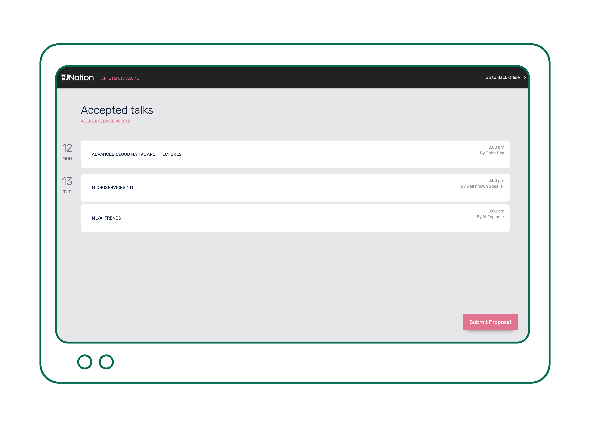
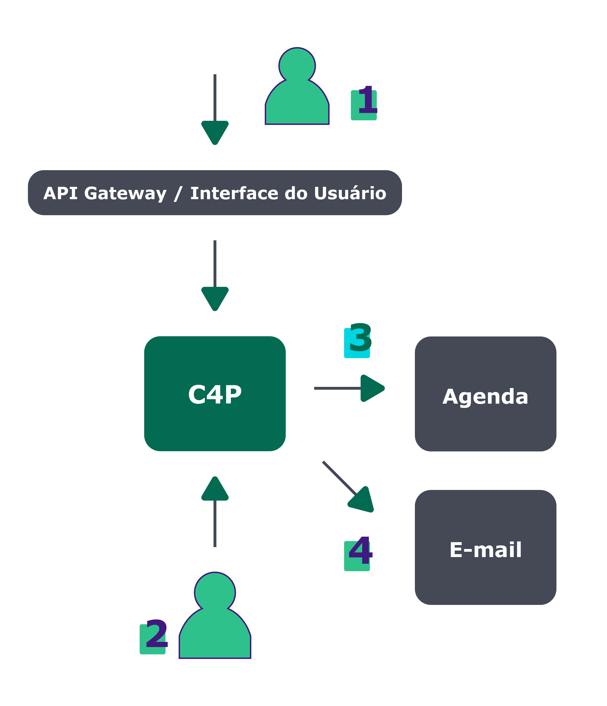

# Tenho lido sobre DDD, para onde devo ir depois? {#chapter_02}

Você já codifica Java há muitos anos, já leu sobre Domain-Driven Design (DDD) e deseja aplicar isso a um projeto da vida real. Como isso funciona? O que realmente significa aplicar DDD no ecossistema de hoje? Realmente vale a pena o tempo investido?

O DDD nos fornece uma base teórica e padrões muito bons para construir um software robusto, que agregue valor real ao negócio. Para fazer isso, o DDD ajuda a fornecer uma estrutura para organizar o software construído e otimizar equipes independentes, que possam trabalhar juntas consumindo APIs bem definidas. No final das contas, o DDD fornece os princípios de que você precisa para traduzir para Java ou qualquer outra linguagem de sua escolha. Mas, ao fazer isso, você precisará tomar algumas decisões difíceis sobre como esses componentes/serviços/aplicações Java serão executados e interagirão.

Este capítulo aborda o lado prático de como esses conceitos podem ser mapeados em um exemplo existente, executado no Kubernetes, oferecendo dicas práticas sobre como os conceitos DDD podem ser mapeados para um stack tecnológico (pilha de tecnologia) concreto. Claro, existem milhares de opções diferentes para se escolher hoje, mas você pode tomar isso como um exemplo do tipo de coisas a que você precisará se atentar ao passar por esta jornada.

> **INFO:** é importante destacar que este capítulo não é sobre os conceitos básicos de DDD. Portanto, se você é novo no DDD, os seguintes livros são recomendados: Implementing DDD e DDD Distilled.

{pagebreak}

Este capítulo está dividido em duas seções principais:

- [Introdução aos tópicos relacionados a Java e nuvem](#java-na-nuvem)
- [De Monolith até K8s usando DDD](#evoluindo-seu-monolito)


## Java na nuvem {#java-na-nuvem}

Existem muitos frameworks por aí com o objetivo de fornecer uma experiência mais fácil para os desenvolvedores que criam microsserviços. Exemplos disso são Spring Boot, Quarkus, Micronaut, Helidon etc. Em geral, o objetivo desses frameworks é criar um arquivo JAR autônomo, que possa ser executado, fornecendo a você um executável livre de dependências e que requer apenas a Java Virtual Machine (JVM) para rodar.

Isso vai contra o que nós (como comunidade Java) estávamos fazendo cinco anos atrás, e alguns de nós ainda fazem, que era fazer o deploy de nossas aplicações Java dentro de um servidor de aplicação ou um Servlet Container como o Tomcat.

Enquanto costumávamos ter um monolito com todos os recursos de nossas grandes aplicações integradas, agora buscamos ter um conjunto de serviços com funcionalidades bem definidas. Esses novos (micro) serviços compartilham as seguintes características:

- Tendem a localizar e versionar todos os artefatos que são necessários para ir do código-fonte até um serviço em execução em um ambiente.
- Cada serviço é construído, mantido, desenvolvido e implantado por uma equipe diferente.
- Cada serviço tem seu próprio ciclo de lançamento.
- Cada serviço expõe um conjunto bem definido de APIs.

Construir um serviço hoje com endpoints REST é uma tarefa bastante fácil se você estiver usando um desses frameworks mencionados anteriormente. Você tem um modelo de programação baseado em anotação que permite mapear métodos Java para terminais REST e mecanismos avançados de serialização/desserialização que lidarão com todo o boilerplate de análise de solicitações HTTP.

> **DICA:** Para mais detalhes sobre a arquitetura de microsserviços, consulte o capítulo [Microsserviços](#chapter_07).

O verdadeiro problema surge quando você começa a ter mais do que um punhado de serviços. A execução de cada serviço em sua própria JVM irá forçá-lo a executar cada serviço em uma porta diferente e cuidar dos problemas quando essas JVMs travarem. Por isso, a indústria saltou rapidamente para containers por volta de 2015.


### Containers & organização de containers

Seguindo a mesma linha de ficar livre de dependências, como os frameworks Java mencionados na seção anterior, containers nos ajudam a executar nosso software em qualquer lugar. Isso significa que vamos um passo adiante e agora não queremos nem mesmo depender da Java Virtual Machine sendo instalada em nossa máquina host, onde os serviços serão executados.

Docker (um container runtime) nos ajudou com isso. Podemos encapsular nosso JAR autônomo junto com a JVM e os arquivos de configuração para torná-lo um container que possa ser executado em qualquer lugar onde o Docker Container Runtime estiver instalado.

Cada container Docker tem seu próprio tempo de execução isolado, o que nos permite isolar as falhas nos limites do container Docker.

Quando você tem um Bounded Context (contexto delimitado) e alguns Serviços, provavelmente está tudo bem apenas executar esses microsserviços Java usando um script (ou docker-compose). No entanto, mesmo para as práticas diárias de desenvolvimento, você notará que cada um desses serviços exigirá uma porta dedicada, e será necessário manter o controle dessas portas para garantir que estejam disponíveis para cada um dos serviços.

Quando o número de serviços aumenta, isso se torna incontrolável.
Por esse motivo, os Container Orchestrators (orquestradores de container) se tornaram populares nos últimos anos, e o Kubernetes está liderando o caminho. O Kubernetes é responsável por lidar com a criação desses container runtimes, como escaloná-los quando há carga e como lidar com containers que apresentem mau comportamento ou falhem.

> **DICA:** Para obter mais detalhes sobre containers e ferramentas de orquestração, consulte o capítulo sobre [Cloud](#chapter_08).

O sucesso do Kubernetes é baseado no fato de que cada grande provedor na nuvem fornece um serviço Kubernetes gerenciado, tornando-o o padrão de fato para suporte a multicloud. Em outras palavras, não importa qual provedor você escolha, você sempre pode confiar que haverá uma API Kubernetes exposta para você interagir e provisionar seus serviços.


### Capitalizando os benefícios do DDD

Se você seguir o caminho do DDD, precisará primeiramente aproveitar algumas das promessas que o DDD lhe deu e certificar-se de que está colhendo os benefícios. Se não podemos fornecer continuamente novas versões de nossos serviços sem interromper a aplicação inteira, estamos apenas tornando nossa vida mais complicada para nada. Se não estamos entregando valor de negócio concreto como resultado do DDD, todas as mudanças sugeridas neste capítulo não valem o esforço ou o tempo.

Eu recomendo o seguinte artigo: [“The Business Value of Using DDD”](https://www.informit.com/articles/article.aspx?p=1944876&seqNum=4), que dá uma visão geral de alto nível dos benefícios de adotar o DDD, não para você como desenvolvedor(a), mas para o seu negócio.

A próxima seção explora um exemplo que eu criei com base na minha experiência durante a rearquitetura de aplicações monolíticas Java para uma abordagem mais distribuída. O exemplo é fictício, qualquer semelhança com a realidade é mera coincidência :) Nós encorajamos você a abstrair os conceitos e padrões do cenário de exemplo e mapeá-los para seu próprio domínio. No final das contas, este é apenas um exemplo, embora complexo e totalmente funcional.


## Evoluindo seu monolito na prática, usando DDD {#evoluindo-seu-monolito}

Esta seção cobre um cenário de exemplo que nos ajuda a explicar alguns dos conceitos em ação. Você pode mapear esses conceitos para seu domínio de negócios e copiar a solução técnica real do exemplo para alguns dos desafios apresentados.

Como esperado, criar uma aplicação completa é um trabalho árduo e geralmente requer muito tempo. Por esse motivo, o exemplo a seguir é fornecido como um conjunto de repositórios de código aberto, e você pode contribuir para melhorá-lo.

- [Repositório De Monolith para K8s Github](https://github.com/salaboy/from-monolith-to-k8s)

> **DICA:** Como uma aplicação real, o exemplo evoluirá com o tempo, agregando mais ferramentas e melhores práticas, por isso convidamos você a participar dessa jornada em que todos podemos aprender e compartilhar informações valiosas juntos.

Começamos nossa jornada com uma aplicação Java monolítica. O cenário que iremos abordar pertence a uma empresa que se encarrega de fornecer uma plataforma para a criação de sites de conferências. Imagine que cada um de nossos clientes exija que hospedemos e escalonemos seu site de conferências.
Todos nós vimos grandes aplicações Java Web e, neste cenário, a aplicação se parece com isto:


O Facade (fachada) “Customer Management” se encarrega de isolar os diferentes clientes uns dos outros. Em algumas empresas, isso é definido como uma plataforma ou aplicação multi-tenant (multilocatário). Infelizmente, isso é bastante comum no espaço Java. Por razões históricas, as implementações acabaram crescendo em monolitos grandes e assustadores, que vieram com muitos problemas de escalabilidade, bem como com desafios de isolamento de tráfego e dados. Não importa o quão sofisticada seja a aparência de nossa plataforma, ela está apenas rodando em uma única JVM. Você não tem como dimensionar cada cliente individualmente - você dimensiona tudo ou nada.

Como você pode ver na caixa vermelha, cada Site de Conferência conterá um monte de módulos, dependendo da seleção de cada cliente, mas, na realidade, em tempo de execução, todo o código estará lá para cada conferência.

> Observe que, se você tiver uma plataforma como esta e ela fizer o trabalho que deve fazer, você **NÃO deve** alterá-la. A menos que você esteja tendo problemas para gerenciar ou escalar essa "plataforma", você não deve rearquitetar a coisa toda.

Agora, essa arquitetura de monolito tem algumas desvantagens claras e, para esse cenário, podemos considerar o seguinte motivo para rearquitetá-la em uma plataforma adequada nativa da nuvem:

- Clientes não podem ser escalados independentemente.
- O tráfego de clientes é todo gerenciado pela mesma aplicação.
- Ponto Único de Falha na JVM.
- Se os dados são armazenados em um banco de dados, os dados são compartilhados entre os(as) clientes. O código da aplicação precisa lidar com o isolamento dos dados de cada cliente. O banco de dados também se torna um gargalo, pois todos os dados dos(as) clientes estão no mesmo banco de dados.
- Cada mudança na plataforma requer que toda a aplicação seja reiniciada.
- Cada desenvolvedor(a) envolvido(a) com a aplicação trabalha com a mesma base de código, o que torna um lançamento e uma fusão de recursos uma grande tarefa, com muitos riscos envolvidos. Isso geralmente pode ser feito por alguém que entenda toda a aplicação.

> **DICA:** Se você já tem essa aplicação instalada e funcionando e tem clientes usando a plataforma, terá um bom entendimento de quais recursos são essenciais e como começar a reformulá-los.

Como Martin Fowler descreve no post [Monolith First](https://martinfowler.com/bliki/MonolithFirst.html), é o caminho a tomar. Por ter um monolito, você já entende a solução que precisa construir, tornando mais fácil estimar como a nova arquitetura resolverá os problemas da versão existente. Em outras palavras, se você não tem um monolito existente, não comece com uma arquitetura distribuída do zero. Crie um monolito primeiro e depois divida, se necessário.

O próximo passo em nossa jornada é decidir por onde começar. Em minha experiência, vi três padrões comuns se repetindo:

- **Iniciar novas funcionalidades como serviços separados**: isso geralmente é recomendado se você puder manter o monolito como está. Novos serviços não resolverão os problemas já existentes, mas ajudarão suas equipes de desenvolvedores a se acostumarem a trabalhar com uma mentalidade de microsserviços.
- **Dividir a funcionalidade existente do monolito** (e lentamente desativar o código antigo): se você tiver problemas urgentes com o monolito, pode avaliar a ramificação de algumas das funcionalidades externas para um novo serviço. Isso pode resolver alguns dos problemas existentes, mas não trará nenhum valor de negócios imediatamente. Isso também aumenta a complexidade das operações do dia a dia, pois você pode acabar executando duas soluções para o mesmo problema por um longo período de tempo. Além do mais, isso pode ser usado para entender o quão complexa e cara uma rearquitetura central pode ser.
- **Reestruturar o núcleo da plataforma como microsserviços** (para resolver os problemas existentes): mais cedo ou mais tarde, se você estiver tendo problemas para manter e dimensionar seu monolito, precisará repensar e redesenhar as partes principais de sua plataforma, certificando-se de focar em resolver os problemas atuais de escalabilidade e manutenção. Isso pode ser uma iniciativa cara, mas pode ser feito de forma totalmente isolada de seus ambientes de produção. Várias vezes eu vi como isso é feito como uma Prova de Conceito para demonstrar que é realmente possível e também para garantir que os membros de sua equipe entendam as implicações de um negócio (vantagens) e do ponto de vista técnico (novo stack tecnológico, novas ferramentas).

Neste capítulo, irei cobrir a última dessas opções (**Reestruturar o núcleo da plataforma como microsserviços**) para destacar a solução para nossos problemas existentes com a aplicação monolítica, mas você pode explorar as outras duas, se elas forem mais apropriadas para sua situação.

> **DICA:** Mais informações sobre estratégias e práticas sobre como migrar um monólito existente para a arquitetura de microsserviços podem ser encontradas no capítulo [Microsserviços](#chapter_07.md).


É aqui que os conceitos e padrões DDD se tornam realmente úteis para definir como dividir as funcionalidades do monolito e como organizar nossas equipes em torno dos novos serviços. Nas seções a seguir, exploraremos alguns desses conceitos em ação.


### Suposições e simplificações

As plataformas são muito complexas. Tentar reestruturar algo grande vai lhe dar mais dores de cabeça do que soluções. Por esse motivo, você deve tentar simplificar o escopo do problema para enfrentar diferentes desafios de forma controlada.

Para o nosso cenário, isso pode significar que, em vez de tentar a rearquitetura de toda a plataforma, primeiro tentaremos resolver a arquitetura e a forma de um simples site de conferências. Isso significa que, em vez de focar a plataforma, primeiro nos concentraremos no que o cliente espera de seu site de conferência. Ao compreender a forma de um único site de conferência, você e suas equipes têm um conjunto bem definido de desafios a serem resolvidos, o que pode agregar valor imediato aos negócios. Posteriormente, automatizaremos como cada um desses sites de conferências pode ser provisionado.

Do ponto de vista arquitetônico, isso pode significar um site de conferência monolítico ou um site de conferência construído com diferentes serviços distribuídos. Se os sites de conferência forem complexos o suficiente e quisermos reutilizar os módulos para todos eles, podemos considerar uma abordagem distribuída. Com base na minha experiência, esse tipo de plataforma aproveita os serviços compartilhados na maioria das vezes, então faz sentido arquitetá-los pensando na reutilização.

> **DICA**: Essa estratégia leva a vários serviços desde o primeiro dia, então isso é algo com o qual você e suas equipes devem se acostumar.

{pagebreak}

Nossos sites de conferências independentes serão semelhantes a este:



Como você pode ver no diagrama anterior, está bastante claro que há mudanças arquitetônicas importantes. É bastante comum ter a Interface do Usuário, neste caso, a caixa “Conference Site”, separada dos serviços principais. Na maioria das vezes, esse componente voltado para o(a) usuário(a) agirá como um roteador, encaminhando solicitações do site de conferência para serviços que não são expostos diretamente a usuários(as).

Mas, antes de entrar em detalhes técnicos, como priorizamos e nos certificamos de que começamos com o pé direito? Como podemos definir o escopo desses serviços corretamente (nem muito macro, nem muito micro)? Os conceitos DDD podem nos ajudar, fornecendo algumas respostas e orientações.

{pagebreak}

### Contextos limitados para começar a dividir seu monolito

Se você está planejando uma rearquitetura para o núcleo de sua plataforma, precisa ter cuidado e escolher com sabedoria quais componentes serão rearquitetados primeiramente e por quê.
Na minha experiência, você deve tentar lidar com os componentes principais primeiro. Escolha componentes que você entende e sabe que agregam valor ao negócio onde você está.

No caso do nosso cenário, lidar com a Chamada de Propostas (Call for Proposals) é fundamental para iniciar uma conferência.
Há um trabalho substancial para aceitar propostas, revisá-las e garantir que a conferência tenha uma agenda interessante.

Se estivermos confiantes de que a implementação da funcionalidade de Chamada de Propostas primeiro nos dará vitórias imediatas, precisamos estimar o quão grande e complexo é o esforço.

O DDD propõe o conceito de contexto limitado como um conjunto bem definido de funcionalidades que se encaixam. Essas funcionalidades geralmente mapeiam como um especialista de domínio (especialista no assunto) fará o trabalho se não houver software disponível. Para planejar, projetar e implementar essas funcionalidades, uma equipe é montada com especialistas em domínio, que trabalharão lado a lado com engenheiros de software. Na maioria das vezes, um especialista de domínio saberá quais contextos delimitados já existem e pelo que eles são responsáveis.

> **INFO:** De uma perspectiva DDD, é extremamente importante não tornar esses Bounded Contexts um limite técnico que é imposto aos especialistas em domínio.

Um Bounded Context irá expor um conjunto bem definido de APIs para que outras equipes de diferentes contextos delimitados possam consumir e interagir com a funcionalidade de Chamada de Propostas.

O Bounded Context Call for Proposals permitirá que uma equipe implemente todas as funcionalidades necessárias, independentemente das outras equipes. Essa equipe será responsável por todo o ciclo de vida do projeto, desde a concepção e implementação até a execução para o resto da empresa e para que seus(suas) clientes o consumam.

Assim que começa a projetar a funcionalidade Call for Proposals, você percebe que precisará consumir e interagir com outras equipes. Logo no início, os seguintes Bounded Contexts são identificados:



Cada um desses Bounded Contexts deve pertencer a equipes diferentes, e precisamos ter certeza de que eles têm autonomia suficiente para progredir, criar novas versões com novos recursos e implantar componentes de software concretos para os ambientes de nossos(as) clientes.

Do lado prático, cada Bounded Context será implementado como um ou um conjunto de serviços que implementam os recursos do contexto. Não há necessidade de ser estrito quanto ao número de serviços que irão compor um Bounded Contexts, mas geralmente há um que se encarrega de expor um conjunto de APIs para o mundo exterior.

Para o propósito deste exemplo, um único serviço implementará toda a lógica do Bounded Contexts Call for Proposals, e a equipe por trás desse serviço será responsável por projetar suas APIs, escolher as estruturas que usarão e realmente implantá-las em um ambiente ao vivo.

Aprofundando os detalhes práticos, existem algumas das melhores práticas compartilhadas por muitas empresas e ferramentas:

- Um Repositório / Um Serviço + Entrega Contínua
- APIs abertas


#### Um Repositório / Um Serviço + Entrega Contínua

Normalmente, é recomendável manter todos os recursos técnicos necessários para executar um serviço próximos ao código-fonte. Isso facilita a manutenção e a carga cognitiva de compreensão de como executar nossos serviços em um ambiente real.

Hoje em dia, é bastante comum ter um serviço, digamos, escrito em Spring Boot versionado em um provedor git como o GitHub, onde podemos encontrar um Dockerfile para criar uma versão em container de nosso serviço, que pode ser executado em qualquer lugar onde um Docker daemon esteja presente.

Com o aumento da popularidade do Kubernetes, também é comum encontrar o Manifesto do Kubernetes (arquivos YAML) descrevendo como nosso serviço pode ser implantado em um cluster do Kubernetes. Finalmente, tendemos a usar pipelines de integração contínua para realmente construir todos esses componentes de software, portanto, é bastante comum também encontrar a definição de pipeline perto da fonte que precisa ser construída.

Você, como desenvolvedor(a) que visa ao Kubernetes como sua plataforma de implantação, agora é responsável por vários artefatos, não apenas pelo código-fonte do serviço Java.


Para fazer o deploy do seu código no Kubernetes: 

- Você precisará construir e testar seu código-fonte. Se for Java, você pode usar, por exemplo, Maven ou Gradle para fazer isso;

- Isso resultará em um arquivo JAR que você pode querer enviar para um repositório como Nexus ou Artifactory. Esse arquivo JAR já terá uma versão nele, e se você estiver usando Maven ou Gradle, esse JAR será identificado por seu GAV (Grupo/Artefato/Versão).

- A partir desse JAR, você cria uma imagem Docker definindo um Dockerfile que entende como executar sua aplicação Java com uma JVM fornecido.

- Por fim, se quiser fazer o deploy do seu container para um cluster Kubernetes, você precisará de alguns manifestos YAML.

- Opcionalmente, se você estiver criando muitos serviços, convém usar o Helm para empacotar e liberar esses arquivos YAML. Todos esses artefatos precisam ser versionados adequadamente, o que significa que, quando você constrói uma nova versão do seu arquivo JAR, um novo container precisa ser construído, e um novo gráfico do Helm precisa ser lançado.

  > **INFO:** O Helm fornece a ideia de gráficos (pacotes) que mapeiam um a um a forma como lidamos com nossos artefatos Maven. Se você estiver trabalhando com gráficos do Helm, esses gráficos geralmente também são enviados/liberados para um repositório de gráficos, como o Chart Museum.

Neste ponto, se você está pensando "isso é muito trabalho", você está 100% certo. Se você está pensando "eu não quero fazer tudo isso", você está absolutamente certo. Eu também não quero fazer isso. Se você quer que isso funcione, precisa usar ferramentas especializadas que já entregam todas essas funcionalidades de forma automatizada. Você deve tentar automatizar cada etapa, e a indústria usa pipelines de integração contínua para conseguir isso. Vamos falar sobre como entregar pipelines com Jenkins X.

> **INFO:** Neste exemplo, estamos visando ao Kubernetes e optamos por usar Jenkins X neste conjunto de ferramentas. Jenkins X traz CI/CD (Continuous Integration/Continuous Delivery) para o Kubernetes e faz parte da Continuous Delivery Foundation.

Como você pode notar, o Jenkins X não é apenas sobre integração contínua, mas também sobre entrega contínua. Ao cobrir a entrega contínua, o pipeline não para quando esses componentes são construídos. O pipeline é responsável por construir, testar e também implantar nossos artefatos em um ambiente ativo, onde serão executados para atender nossos(as) clientes. A parte “contínua” faz referência ao fato de que você deseja ter certeza de que a implantação de uma nova versão do seu serviço é fácil e que você terá como objetivo implantar novas versões em um curto período de tempo.

> **INFO:** Para alcançar a entrega contínua, o Jenkins X usa um conjunto de convenções para permitir que os desenvolvedores se concentrem na construção de valor de negócios. Essas convenções não são exclusivas do Jenkins X e fazem parte das melhores práticas coletadas de diferentes setores e profissionais. Projetos como o Jenkins X são os catalisadores para milhares de membros da comunidade, que são especialistas em CI/CD, o que resulta nas melhores práticas e ferramentas que as aplicam.

Uma das convenções usadas pelo Jenkins X é chamada “Trunk Based Development”. Basicamente, significa que cada alteração aplicada (merged) à branch master irá gerar uma nova versão de nossos artefatos. Na maioria das vezes, isso não é confortável para os desenvolvedores, já que muitas dessas práticas são comumente definidas em cada empresa e tendem a variar bastante. A principal motivação para usar algo como o Trunk Based Development é garantir que as equipes não gastem tempo definindo essas práticas. Ao trabalhar com essa convenção, você pode se concentrar na escrita do código e, quando o código estiver pronto e mesclado ao master, uma nova versão é criada e implantada em algum tipo de ambiente de teste para validações adicionais.

> **DICA:** Recomendo fortemente que, se você estiver iniciando um novo projeto, verifique as vantagens do Trunk Based Development, bem como do livro Accelerate, pois foi usado como base para a criação de ferramentas como [Jenkins X](https://jenkins-x.io/about/overview/accelerate/).

No fim das contas, Jenkins X usa ambas as convenções, “Um Repositório / Um Serviço” mais “Trunk Based Development”, para levar seu serviço do código-fonte para uma instância em execução dentro de um Cluster Kubernetes.


Em nosso exemplo, os links a seguir demonstram todos esses conceitos em ação.

- [Pipeline](https://github.com/salaboy/fmtok8s-email/blob/master/jenkins-x.yml)
- [DockerFile](https://github.com/salaboy/fmtok8s-email/blob/master/Dockerfile)
- [Gráficos do Helm](https://github.com/salaboy/fmtok8s-email/tree/master/charts/fmtok8s-email)
- [Versões contínuas](https://github.com/salaboy/fmtok8s-email/releases)

Você pode encontrar o mesmo setup para todos os projetos dentro da Demonstração do Site de Conferência.


#### APIs abertas
Se você já está implementando um Bounded Context, logo no início você precisará projetar e especificar que tipo de interface irá expor para outro Bounded Context e serviços terceiros que possam estar interessados ​​na funcionalidade que seu contexto fornece. Uma maneira popular de implementar essas APIs são os terminais REST.

> **INFO:** Como você provavelmente está familiarizado com endpoints REST, esta seção se concentra na [Especificação de API aberta](https://github.com/OAI/OpenAPI-Specification)

Conforme definido no texto das especificações *“a especificação OpenAPI remove as suposições ao chamar um serviço.”* Hoje em dia, frameworks populares como Spring Boot vêm com integração pronta para uso com API aberta e ferramentas de API aberta.

Apenas adicionando uma extensão/iniciador Spring Boot, você permite que sua aplicação exponha uma interface de usuário que serve como documentação e navegador ao vivo de suas APIs.

Se você está usando Spring Boot padrão (Tomcat), será preciso adicionar ao seu arquivo `pom.xml`:

```xml
<dependency>
   <groupId>org.springdoc</groupId>
   <artifactId>springdoc-openapi-ui</artifactId>
   <version>${springdoc-openapi-ui.version}</version>
</dependency>
```
Se você estiver usando o Webflux, a pilha reativa que você precisa adicionar é:

```xml
<dependency>
   <groupId>org.springdoc</groupId>
   <artifactId>springdoc-openapi-webflux-ui</artifactId>
   <version>${springdoc-openapi-ui.version}</version>
</dependency>
```

- <https://github.com/salaboy/fmtok8s-email/blob/master/pom.xml#L40>

Em projetos da vida real, essas interfaces de usuário e documentos de especificação de API podem ser usados por outras equipes para entender com detalhes concretos como interagir com seus serviços. Quanto mais cedo você expõe uma API, mais cedo outras equipes podem começar a aproveitar seu serviço.

A captura de tela a seguir mostra a interface de usuário da API aberta, a qual é fornecida apenas incluindo a dependência anterior. Essa tela pode ser acessada apontando seu navegador para *host:port/swagger-ui.html*. Ela fornece um cliente simples para interagir com seus serviços, entender quais terminais estão expostos e quais dados esses terminais esperam e retornam.



Sinta-se à vontade para clonar um dos serviços deste exemplo e executá-lo com o comando `mvn spring-boot: run` para explorar as definições de APIs de cada serviço. Por padrão, cada serviço iniciará na porta 8080, portanto, você deve apontar seu navegador para <http://localhost:8080/swagger-ui.html>

### Mapa de contexto para entender as interações técnicas e da equipe

Bounded Contexts são ótimos para entender um conjunto bem definido de funcionalidades que precisam ser fornecidas juntas. Quando temos vários desses contextos, precisamos entender como eles irão interagir uns com os outros e seus relacionamentos. É aí que o conceito de Mapas de Contexto realmente ajuda. Com mapas de contexto, você pode mapear as relações entre o bounded contexts e o que eles realmente precisam para interagir. O mapeamento de contexto também fornece visibilidade sobre como as equipes responsáveis ​​por cada contexto limitado irão interagir com outras equipes.

Do lado prático, trata-se de integrações de sistema. Como nossos serviços ou os serviços que expõem algum tipo de API conversam entre si. Como eles transformam e movem dados e como eles sabem quais serviços estão disponíveis para consumo.

Como você pode imaginar, as APIs são extremamente importantes, mas entender quem vai consumir nossas APIs, o que se espera dessas APIs e quem realmente depende de nós é igualmente crítico.

Mapas de contexto bem definidos ajudam muito a planejar e compreender como esses bounded contexts “isolados” e as equipes que trabalham neles irão interagir no dia a dia.

Para nosso exemplo, o seguinte mapa de contexto faria sentido:


Esse diagrama descreve as relações entre o bounded context simples que temos para nossa aplicação do site de conferência. Aqui podemos ver que existe uma relação **Cliente/Fornecedor** entre a Call for Proposals e o bounded context da Agenda da Conferência. A Call for Proposals **é um consumidor** da Agenda da Conferência do serviço upstream. Entre essas duas equipes, existe também uma relação de **Parceria(Partnership)**, pois elas precisam colaborar para fazer as coisas. Isso significa que a comunicação entre essas duas equipes é importante e que elas devem ser capazes de influenciar o roteiro uma da outra.

Por outro lado, a relação com o serviço de Notificação é diferente. A Call for Proposals tem uma relação ascendente com o Bounded Context de Notificação (Notification), mas vai **confortar** com seus contratos. Isso significa que, da perspectiva da equipe de Call for Proposals, eles não podem influenciar ou alterar as APIs do Bounded Context de notificação. Isso acontece muito quando temos sistemas legados ou quando esse bounded context é externo à nossa empresa.

> **DICA:** Pulando para o lado prático, embora as integrações de sistema sejam um tópico muito amplo, esta seção se concentra em uma recomendação muito prática: “Você deve aprender sobre testes de contrato orientados ao consumidor (Consumer-Driven Contract)”. Mais uma vez, Martin Fowler tem um artigo, publicado em 2006, sobre isso: <https://martinfowler.com/articles/consumerDrivenContracts.html>.

Embora o tópico em si não seja novo, existem ferramentas muito atualizadas para realmente implementar isso em seus projetos, como [Spring Cloud Contracts](https://spring.io/projects/spring-cloud-contract).

#### Bônus: Implementação de contratos com Spring Cloud Contracts

Com Spring Cloud Contracts, a história é assim: primeiro você define um contrato para suas APIs. Isso basicamente significa que tipo de solicitação o consumidor deve enviar e que tipo de resposta precisamos fornecer como serviço.

Um contrato é semelhante a isto: <https://github.com/salaboy/fmtok8s-c4p/blob/no-workflow/src/test/resources/contracts/shouldAcceptPostProposal.groovy>

```groovy
Contract.make {
       name "should accept POST with new Proposal"
       request{
           method 'POST'
           url '/'
           body([
               "title": $(anyNonEmptyString()),
               "description": $(anyNonEmptyString()),
               "author": $(anyNonEmptyString()),
               "email": $(anyEmail())
           ])
           headers {
               contentType('application/json')
           }
       }
       response {
           status OK()
           headers {
               contentType('application/json')
           }
           body(
                   "id": $(anyUuid()),
                   "title": $(anyNonEmptyString()),
                   "description": $(anyNonEmptyString()),
                   "author": $(anyNonEmptyString()),
                   "email": $(anyEmail())
           )
       }
   }
```
Este contrato define a interação para o envio de uma nova Proposta ao Serviço Call for Proposal. Como você pode ver, ele envolve uma solicitação `POST` e um body com algumas propriedades predefinidas, incluindo um `header` com um `Content Type` muito específico. Esse contrato também define que o retorno para o consumidor agregará às informações enviadas uma propriedade `id` com formato `UUID`.

Agora, esse contrato pode ser usado para gerar um teste para realmente verificar se o seu serviço está funcionando conforme o esperado, do ponto de vista do consumidor. Portanto, se você definiu qualquer contrato em seu projeto ao construir e testar esse projeto, os contratos serão executados em uma instância real de seu serviço. Isso nos permite ter certeza de que quebraremos a construção se um contrato for quebrado. Para criar e executar automaticamente esses testes, você só precisa adicionar uma dependência e um plug-in ao seu projeto maven:
<https://github.com/salaboy/fmtok8s-c4p/blob/no-workflow/pom.xml#L50>

```xml
<dependency>
  <groupId>org.springframework.cloud</groupId>
  <artifactId>spring-cloud-starter-contract-verifier</artifactId>
  <version>${spring.cloud.contract}</version>
  <scope>test</scope>
</dependency>

```

E na seção `<build><plugins>`, o seguinte plugin:
<https://github.com/salaboy/fmtok8s-c4p/blob/no-workflow/pom.xml#L88>

```xml
<plugin>
  <groupId>org.springframework.cloud</groupId>
  <artifactId>spring-cloud-contract-maven-plugin</artifactId>
  <version>${spring.cloud.contract}</version>
  <extensions>true</extensions>
  <configuration>
    <packageWithBaseClasses>com.salaboy.conferences.c4p</packageWithBaseClasses>
    <testMode>EXPLICIT</testMode>
   </configuration>
</plugin>

```

Finalmente, dependendo da forma do serviço que você testará, pode ser necessária alguma confirmação: <https://github.com/salaboy/fmtok8s-c4p/blob/no-workflow/src/test/java/com/salaboy/conferences/c4p/ContractVerifierBase.java#L16>

```java
@RunWith(SpringRunner.class)
@SpringBootTest( webEnvironment = SpringBootTest.WebEnvironment.RANDOM_PORT,
        properties = "server.port=0")
public abstract class ContractVerifierBase {

    @LocalServerPort
    int port;
    
    ...
}
```

Se você precisar adicionar qualquer código de inicialização, esta é a classe que todo teste gerado automaticamente deve herdar.

Agora que o contrato foi validado com cada build, também podemos usar o contrato para gerar um Stub, que é um serviço que se comporta como o serviço real, mas com dados fictícios. Os dados fictícios também são gerados automaticamente, pois também podem ser fornecidos pela definição do contrato. Esse stub é um artefato por si só que pode ser distribuído para outros serviços, por exemplo, aqueles que consomem o serviço “real” para teste.

Isso basicamente significa que agora, toda vez que você construir seu serviço, **dois** arquivos JAR serão criados. Um é o JAR da aplicação Spring Boot real, e o outro é o Stub de Serviço.
Esse stub de serviço pode ser enviado automaticamente para o repositório do seu artefato (por exemplo, Nexus ou Artifactory) e viverá no mesmo grupo e nome do artefato da sua aplicação JAR.

Finalmente, um Serviço X projetado para consumir seu serviço pode criar testes que iniciarão o stub gerado antes, localmente, para evitar a necessidade de uma instância real ou uma configuração de ambiente inteira. Você pode facilmente iniciar o stub antes de seus testes usando as seguintes anotações:


```java
@RunWith(SpringRunner.class)
@SpringBootTest(webEnvironment = SpringBootTest.WebEnvironment.MOCK)
@AutoConfigureMockMvc
@AutoConfigureJsonTesters
@AutoConfigureStubRunner(stubsMode = StubRunnerProperties.StubsMode.REMOTE, repositoryRoot = "<your nexus repository>", ids = "com.salaboy.conferences:fmtok8s-c4p")
public class C4PApisTests {
   @StubRunnerPort("fmtok8s-c4p")
    int producerPort;

...
}
```

<https://github.com/salaboy/fmtok8s-api-gateway/blob/master/src/test/java/com/salaboy/conferences/site/C4PApisTests.java#L29>

Isso baixa automaticamente a versão mais recente do stub e o executa antes que seu teste comece, usando uma porta aleatória que você pode obter via injection, usando `@StubRunnerPort`. 

É importante observar que tanto o Serviço quanto os contratos são versionados juntos, como parte da mesma base de código. Isso implica que o Stub gerado e o próprio Serviço terão a mesma versão. Um serviço de consumidor, para executar seus testes, pode depender do Stub, pois nunca deve depender do próprio serviço. Assim que o consumidor tiver testado por meio do Stub de Serviço do produtor, você pode reconhecer rapidamente quando um contrato é quebrado ou quando uma nova versão do contrato não é mais compatível com os consumidores, pois os testes usando os Stubs serão interrompidos quando versões novas e incompatíveis forem lançadas. Neste momento, os consumidores se deparam com uma decisão simples: ficar dependendo dos contratos antigos com uma versão fixa, ou atualizar para a versão mais recente do contrato. Isso pode exigir que você execute várias versões do seu serviço ao mesmo tempo. Felizmente para nós, o Kubernetes foi criado para oferecer suporte a esses cenários. Você pode ler sobre versões canário (Canary Releases) se estiver interessado em aspectos de multi-version deployments.

> **DICA:** O capítulo [Cloud](#chapter_08) cobre Canary Releases, bem como outras estratégias de implantação.

Ambos, bounded contexts e mapas de contexto, são ótimas ferramentas conceituais para entender como estruturar suas equipes e seu software, mas, mais importante, esses conceitos ajudam você a se concentrar no valor do negócio.


### Foco no valor do negócio

Ao trabalhar com aplicativos reais, você precisa se concentrar no que vai agregar mais valor e resolver mais problemas para o seu negócio. Sendo muito prático, tendo a analisar casos de uso e como o bounded context, em conjunto com os mapas de contexto, fornece um fluxo de negócios de ponta a ponta.

Para este exemplo específico, o cenário de conferência, estamos analisando o fluxo básico da Call for Proposals, que se parece com isto:

1. O palestrante em potencial envia uma proposta pelo site da conferência
2. O Conselho/Comitê analisa a proposta
3. Se a proposta for aceita
   1. Um novo item da agenda é criado e publicado na página da agenda
4. Uma notificação é enviada por e-mail para propostas aceitas e rejeitadas

Você precisa prestar atenção às suas interações humanas, pois essas interações tendem a exigir comportamentos assíncronos, como lembretes, notificações, alertas, bem como interfaces de usuário, que devem ser cuidadosamente projetadas.

> **DICA:** Como engenheiros, tendemos a simplificar e subestimar a quantidade de trabalho e iterações que podem exigir a criação de uma boa experiência do(da) usuário(a).

A interface de usuário que cobre esse cenário simples é assim:

* A página principal dentro do site da conferência exibe a agenda dividida por dias. Os itens da pauta são os que já estão confirmados e foram aprovados pelo comitê.

  

  {pagebreak}

* A página principal também permite que palestrantes em potencial enviem propostas, preenchendo um formulário:

  

  {pagebreak}

* Assim que a proposta for enviada, o palestrante em potencial precisará aguardar a aprovação ou rejeição do comitê. Os membros do comitê têm uma página de back-office, onde podem aprovar ou rejeitar cada proposta enviada:

  

  {pagebreak}

* A página de back-office também oferece aos membros do comitê a opção de enviar notificações por e-mail aos palestrantes em potencial.

  


Mais uma vez, você pode notar a simplificação proposital desse cenário, para estabelecer um conjunto básico de funcionalidades, iterar rapidamente e fazê-lo funcionar e então expandir os requisitos.

{pagebreak}

#### Arquitetura e Serviços

De uma perspectiva arquitetônica, parece mais assim:



A Interface do Usuário com alguma capacidade de roteamento é necessária para encaminhar solicitações ao Serviço Call for Proposals (C4P) para o Serviço de Agenda ou Emails. Neste exemplo, todas as comunicações acontecem por meio de invocações HTTP/Rest.

### Gateway de API / Interface do usuário
Na maioria das vezes, um Gateway de API também é usado para ocultar acesso direto a todos os outros serviços. É bastante comum ver esse serviço delegando autorização e autenticação a um provedor OAuth ou SAML, servindo como uma barreira de segurança para o mundo externo. O exemplo usa o [Spring Cloud Gateway](https://spring.io/projects/spring-cloud-gateway), que fornece o mecanismo de roteamento para encaminhar solicitações de entrada para o restante dos serviços. O Spring Cloud Gateway nos permite transformar qualquer aplicação Spring Boot em um roteador de solicitação com recursos avançados.

> **INFO:** É importante observar que o Spring Cloud Gateway oferece a flexibilidade de realmente adicionar programaticamente qualquer transformação que você deseja/precisa nas solicitações (requests) de entrada. Esse poder e liberdade vêm com a desvantagem de que depende de você manter, testar e corrigir o bug. Em grandes projetos, você pode querer avaliar um gateway de API de terceiros (como Kong, 3Scale, Apigee etc.) com base nos requisitos do seu projeto.

O módulo API Gateway / interface do usuário pode ser encontrado neste repositório: <https://github.com/salaboy/fmtok8s-api-gateway>

O que adiciona às suas dependências maven:

```xml
<dependency>
  <groupId>org.springframework.cloud</groupId>
  <artifactId>spring-cloud-starter-gateway</artifactId>
</dependency>
```
E configure as rotas padrão para nossos serviços dentro do arquivo application.yaml:
<https://github.com/salaboy/fmtok8s-api-gateway/blob/master/src/main/resources/application.yaml#L4>

{language=yaml}

```yaml
spring:
  cloud:
    gateway:
      routes:
      - id: c4p
        uri: ${C4P_SERVICE:http://fmtok8s-c4p}
        predicates:
        - Path=/c4p/**
        filters:
          - RewritePath=/c4p/(?<id>.*), /$\{id}
      - id: email
        uri: ${EMAIL_SERVICE:http://fmtok8s-email}
        predicates:
        - Path=/email/**
        filters:
          - RewritePath=/email/(?<id>.*), /$\{id}
```

Essas rotas definem um caminho para o gateway como `/c4p/**`, que irá encaminhar automaticamente a solicitação para o serviço <http://fmtok8s-c4p>.

> **INFO:** A interface de usuário do site pode ser encontrada aqui: <https://github.com/salaboy/fmtok8s-api-gateway/tree/master/src/main/resources/templates>
> O Controller que busca os dados dos serviços de back-end, aqui: <https://github.com/salaboy/fmtok8s-api-gateway/blob/master/src/main/java/com/salaboy/conferences/site/DemoApplication.java>

Como estamos executando no Kubernetes, podemos usar o nome do serviço Kubernetes em vez de apontar para um pod específico. Esse mecanismo de roteamento nos permite expor apenas os Endpoints do Gateway de API para o mundo externo, deixando todos os outros serviços atrás de uma rede segura.

### Eventos de domínio e o serviço Call for Proposals
Como o fluxo em análise é fundamental para o Bounded Context Call For Proposals, não é surpresa que a lógica central pertença ao Serviço Call For Proposals, mais concretamente, às duas funções a seguir: Envio de Proposta e Decisão Tomada pelo Conselho (Proposal Submission and Decision Made By the Board).

> **INFO:** O Serviço Call for Proposals pode ser encontrado aqui: <https://github.com/salaboy/fmtok8s-c4p/>

O endpoint de Envio de Proposta aceita uma proposta da interface do usuário e a armazena em um banco de dados ou storage. Este é um passo importante, precisamos garantir que não perderemos propostas. Observe que podemos estar interessados ​​em emitir um evento de domínio DDD neste momento, pois outros sistemas/aplicações podem estar interessados ​​em reagir sempre que uma proposta for recebida.

> **INFO:** Verifique uma implementação real aqui: <https://github.com/salaboy/fmtok8s-c4p/blob/no-workflow/src/main/java/com/salaboy/conferences/c4p/C4PController.java#L37>

Mais importante, o endpoint Decision Made by the Board registra uma decisão feita pela diretoria, mas também define as etapas a seguir com base nessa decisão. Na vida real, essa decisão afetará o curso da ação. Na maioria das vezes, esses pontos de decisão e as ações derivadas deles são essenciais para administrar um negócio eficiente e com boa relação custo-benefício.
<https://github.com/salaboy/fmtok8s-c4p/blob/no-workflow/src/main/java/com/salaboy/conferences/c4p/C4PController.java#L60>

```java
@PostMapping(value = "/{id}/decision")
    public void decide(@PathVariable("id") String id, @RequestBody ProposalDecision decision) {
        emitEvent("> Proposal Approved Event ( " + ((decision.isApproved()) ? "Approved" : "Rejected") + ")");
        Optional<Proposal> proposalOptional = proposalStorageService.getProposalById(id);
        if (proposalOptional.isPresent()) {
            Proposal proposal = proposalOptional.get();

            // Apply Decision to Proposal
            proposal.setApproved(decision.isApproved());
            proposal.setStatus(ProposalStatus.DECIDED);
            proposalStorageService.add(proposal);

//          Only if it is Approved create a new Agenda Item into the Agenda Service
            if (decision.isApproved()) {
                agendaService.createAgendaItem(proposal);
            }

            // Notify Potential Speaker By Email
            emailService.notifySpeakerByEmail(decision, proposal);
        } else {
            emitEvent(" Proposal Not Found Event (" + id + ")");
        }

    }
```

Como você provavelmente pode imaginar, esse método contém a lógica de todo o fluxo. Começa por verificar se o `Id` da proposta pode ser encontrado; se estiver presente, aplicará a decisão ao objeto da proposta (`Approved` ou `Rejected`); e, somente se for aprovado, chame o Serviço Agenda para criar um novo item da agenda. Não importa se foi aceito ou não, um e-mail deve ser enviado ao potencial palestrante para notificá-lo sobre a decisão. Ambos [agendaService](https://github.com/salaboy/fmtok8s-c4p/blob/no-workflow/src/main/java/com/salaboy/conferences/c4p/services/AgendaService.java) e [emailService](https://github.com/salaboy/fmtok8s-c4p/blob/no-workflow/src/main/java/com/salaboy/conferences/c4p/services/EmailService.java) estão simplesmente encapsulando chamadas REST simples.

Este exemplo de método simples, em cenários da vida real, nunca é simples. Devido à complexidade inerente aos desafios da vida real, você deve esperar que métodos simples como o discutido acima se tornem monstros reais. A próxima seção aborda algumas das principais armadilhas e considerações que você deve ter em mente ao escrever a lógica de negócios que é a chave para seu domínio. A próxima seção também tenta compartilhar recursos, abordagens e projetos valiosos que podem ajudar você a tomar melhores decisões no início para evitar erros comuns.

### Armadilhas comuns
As aplicações da vida real são complexas, e essa complexidade tende a vir da complexidade inerente aos problemas que estamos tentando resolver. Podemos tentar reduzir essa complexidade usando uma abordagem de melhoria contínua e certificando-nos de que não estamos reinventando rodas desnecessárias, que não estão fornecendo qualquer diferenciação nos negócios.

Vamos começar com algo que você pode ter enfrentado no passado: comunicações REST para REST podem ser desafiadoras.

#### Comunicações REST para REST podem ser desafiadoras
Se você olhar o exemplo fornecido na seção anterior, os serviços de Agenda e de Email são chamados a partir do Serviço Call for Proposals usando uma [chamada REST](https://github.com/salaboy/fmtok8s-c4p/blob/no-workflow/src/main/java/com/salaboy/conferences/c4p/services/AgendaService.java#L29). Como discutimos antes, essas interações representam uma parte fundamental de nosso fluxo de negócios, então você precisa ter certeza de que essas interações ocorram conforme planejado 100% das vezes. É vital que nosso aplicativo não acabe em um estado inconsistente - por exemplo, uma proposta é aprovada e publicada na agenda, mas nunca enviamos uma notificação ao palestrante. Como está codificado neste exemplo, se os Serviços de Agenda ou de Email ficarem inativos, a solicitação HTTP silenciosamente falhará.

Este requisito básico, ao trabalhar com sistemas distribuídos onde não existe estado compartilhado entre os serviços, torna-se um desafio com várias soluções possíveis.

Uma solução comum é escrever dentro de nosso código de serviço para tentar novamente em caso de falha, o que torna cada chamada muito mais complicada. No passado, havia várias bibliotecas que forneciam auxiliares para tais situações. É importante notar que o Kubernetes, por padrão, não lida com esse tipo de falha de forma alguma.

Outra solução pode ser usar um mecanismo de mensagem ou pub/sub para comunicar nossos serviços que, prontos para uso, oferecem mais garantias sobre a entrega das mensagens enviadas. Mudar para o uso de mensagens como RabbitMQ ou Kafka apresenta outro conjunto de desafios, na maioria das vezes relacionado a lidar com outra peça complexa de infraestrutura que precisa ser mantida ao longo do tempo. No entanto, o sistema de mensagens provou ser robusto e a única opção para determinados cenários em que essas garantias são necessárias e o volume de interações é alto.

Finalmente, uma abordagem mais recente são as Service Meshes, em que delegamos a responsabilidade de tentar novamente, por exemplo, à infraestrutura. O Service Mesh usa proxies para inspecionar cargas HTTP e códigos de erro, de forma que novas tentativas automáticas possam ser feitas em caso de falha.

> **DICA:** Você deve dar uma olhada em Istio, Gloo e LinkerD se quiser entender mais sobre como funcionam Service Meshes e quais são suas vantagens. Mais detalhes sobre as Service Meshes são compartilhados no capítulo [Cloud](#chapter_08).

#### Fluxo enterrado no código
É bastante comum encontrar lógicas de negócios complexas escondidas dentro de nossos serviços, de certa forma obscurecidas por todos os padrões necessários para lidar com erros técnicos, buscar dados de diferentes fontes e transformar dados em diferentes formatos. Em projetos da vida real, fica muito difícil para os especialistas em Domínio entenderem de fato o código que implementa seus fluxos de negócios.

O exemplo discutido neste capítulo se tornaria difícil de ler se adicionássemos o código para lidar com outros aspectos, como:

- Caminhos infelizes e casos excepcionais: como o palestrante que apresentou a proposta desapareceu e não está respondendo a e-mails.
- Eventos, lembretes e restrições com base no tempo (Time-Based): por exemplo, programe um lembrete para os membros do conselho analisarem uma proposta antes de três dias após o envio. Cancele o lembrete se a decisão foi tomada antes do prazo.
- Novos requisitos são adicionados, o que leva as pessoas desenvolvedoras a mudar a sequência do fluxo, como, por exemplo, um e-mail que precisa ser enviado com um link de confirmação para o palestrante antes de publicarmos e aprovarmos a palestra para a agenda. Quanto mais requisitos, mais código precisamos adicionar, e mais ele vira um código espaguete.
- Relatórios e análises: por exemplo, seu gerente quer saber quantas propostas recebemos por dia e quanto tempo em média leva para aprovar ou rejeitar propostas. Você pode ficar tentado a adicionar novos endpoints para lidar com esses relatórios dentro do mesmo serviço.

Não existem soluções milagrosas para enfrentar esses desafios, mas eu gostaria de mencionar algumas coisas que podem, em seus cenários, ajudar a reduzir a complexidade e fornecer visibilidade sobre como seus serviços estão funcionando.

Os eventos de domínio (Domain Events) são introduzidos no DDD para externalizar o estado da aplicação que pode ser relevante para o consumo de outros serviços. Do lado prático, esses eventos podem ser criados usando [Cloud Events](https://cloudevents.io/), que fornece um formato independente de transporte para a troca de eventos.

As ferramentas de Orquestração de Serviço podem ser usadas em conjunto com Cloud Events para externalizar a lógica de negócios enterrada em nossos serviços.

> **DICA:** Verifique projetos como Zeebe, jBPM ou Kogito para entender mais sobre como essas ferramentas podem ajudar você. Além disso, você pode achar este post sobre Cloud Events muito útil.

Finalmente, conforme discutido no livro *Implementing DDD*, patterns (padrões) como CQRS (Command/Query Responsibility Segregation [Segregação de Responsabilidade de Consulta e Comando]) podem ajudá-lo muito ao lidar com relatórios e análises. Você quer evitar a execução de relatórios caros ou rotinas intensas de processamento de dados no banco de dados de serviço. Ao aplicar o CQRS, você externaliza os dados que está interessado em relatar em um armazenamento separado que possui um formato otimizado para indexar, pesquisar e resumir dados. Uma abordagem popular é enviar dados para ElasticSearch para a indexação completa do texto. Então, na sua aplicação, se você deseja pesquisar entre milhares de propostas, você não consulta o Serviço Call for Proposals. Em vez disso, você usa os índices ElasticSearch, descarregando o serviço Call for Proposals, para que ele possa continuar aceitando propostas para suas conferências.

#### Adaptadores (Adapters) para sistemas legados

Uma breve nota sobre Sistemas Legados: tente abstraí-los para que você tenha controle sobre suas APIs. Para o exemplo visto neste capítulo, um serviço chamado Email foi introduzido para expor via endpoints HTTP a funcionalidade de um servidor de email. Isso foi feito propositalmente para destacar as vantagens de fornecer um adaptador para um servidor que não podemos alterar (um servidor SMTP). Nesse adaptador, podemos incluir funções auxiliares, modelos e funcionalidades específicas de domínio que são exigidas por nossos casos de uso.

O serviço Email fornecido não inclui uma conexão SMTP, mas expõe um conjunto de APIs que são fáceis de consumir e não exigem que outros serviços incluam clientes SMTP.

> **INFO:** O código-fonte desse serviço pode ser encontrado aqui: <https://github.com/salaboy/fmtok8s-email>

Considere a criação de adapters para seus serviços legados. Lembre-se de que, dentro do Kubernetes, mesmo que os adapters sejam criados em containers separados, esses containers podem ser executados dentro do mesmo host, evitando um salto (hop) extra de rede.

## Resumindo

Este capítulo abordou uma ampla gama de ferramentas e princípios referentes a uma aplicação de exemplo. Algumas dessas ferramentas farão sentido para o seu cenário, outras não. O que é importante tirar daqui pode ser resumido nos seguintes pontos:

- Otimize as decisões sobre a construção ou integração de software de terceiros para resolver questões específicas ou cruzadas (cross-cutting concerns). Para ganhar agilidade, é fundamental ter um processo claro para avaliar as ferramentas em comparação com a construção de software internamente para desafios que não são essenciais para o seu negócio.
- Mantenha suas equipes atualizadas com treinamentos. A transferência de conhecimento é um grande problema quando o stack tecnológico é amplo e complexo. Aprenda a identificar quais são os principais tópicos com os quais suas equipes têm dificuldade e encontre treinamento que possa ajudar a difundir o conhecimento entre elas.
- Use convenções em vez de definições internas, aproveite as comunidades de código aberto, que são ótimos lugares para encontrar as melhores práticas aplicadas, inovações e tendências. Não tenha medo de participar, envolver-se e compartilhar seus aprendizados.
- Considere o uso de provedores SaaS (Software as a Service) em vez de hospedagem interna, quando possível. Se você já está rodando em um provedor na nuvem, precisa seriamente considerar o conjunto de serviços que eles oferecem. Provedores na nuvem e ofertas de SaaS economizarão um tempo valioso ao configurar e manter peças-chave de sua infraestrutura. Mesmo um(a) desenvolvedor(a) podendo executar Kafka, ElasticSearch ou qualquer outra ferramenta de terceiros usando containers, não significa que ele(ela) esteja disposto a manter, atualizar e fazer backup desses serviços para toda a empresa.