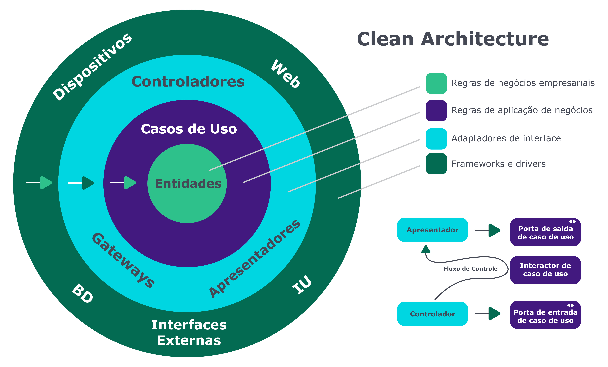

# Clean Architecture {#chapter_04}

É interessante como os conceitos de Clean Architecture podem ser relacionados em diversos aspectos com o livro de Domain Driven Design, de Eric Evans. Podemos exemplificar esta relação quando, no livro de DDD, é citada diversas vezes a proposta de criação de uma linguagem próxima do negócio: a linguagem ubíqua. Já no livro Clean Architecture, de Robert C. Martin Series, se fala sobre separar o código de negócio do que importa, ou seja, não amarrar regra de negócio com a tecnologia escolhida.

> **INFO**: Clean Architecture é um livro muito bom e faz parte de uma "trilogia" cuja leitura é recomendada: Clean Code: a Handbook of Agile Software Craftsmanship (Robert C. Martin Series), The Clean Coder: a Code of Conduct for Professional Programmers (Robert C. Martin Series) e, finalmente, Clean Architecture: a Craftsman's Guide to Software Structure and Design (Robert C. Martin Series). 
>
> Assumimos que o leitor tenha realizado leitura prévia do livro Clean Architecture. Este capítulo não tem o objetivo de falar sobre o livro, mas expor como utilizamos e aplicamos seus conceitos com uma visão prática. 

Iniciaremos falando sobre a estratégia de dividir e conquistar. Essa estratégia possui muitas vantagens, e vamos citar duas dentre elas:

* **Testes**: Uma das grandes vantagens nessa separação, certamente, se encontra na facilidade de testes, principalmente os testes de unidade. Uma maior separação das camadas facilita, por exemplo, mockar as camadas de infraestrutura e fazer com que o teste seja barato - em outras palavras, fácil de criar e rápido de executar. Por consequência, esses testes tendem a ser executados constantemente, com a facilidade e maior cobertura. 
  É comum vivenciar projetos em que testes levam horas para serem executados, trazendo consequências negativas. Testes que falham constantemente tendem a ser ignorados, e testes não confiáveis farão com que o time nunca saiba se houve um problema de regressão ou se simplesmente é aquele “erro amigo”. 

> **TIP:** Vale salientar que não estamos criticando outros tipos de testes; porém, testes unitários têm vantagens. Ao considerarmos que tecnologias como Hibernate, Java e JPA possuem seus próprios testes, lembre-se de que o que você de fato testar são as regras do seu negócio.

* **Baixo impacto em mudanças**: Uma separação maior do negócio da tecnologia acarreta menores impactos em casos de mudança de tecnologia, como, por exemplo, uma troca entre vendors de banco de dados. 

> **TIP:** Na área de arquitetura, o pragmatismo é uma característica crucial. O maior foco de um arquiteto é resolver um problema usando a tecnologia como meio, não como fim. Deste modo, usuários(as) finais não precisam, e muitas vezes, não querem saber qual o banco ou linguagem estão sendo utilizados.

Observe a imagem a seguir:

*Fonte: <https://blog.cleancoder.com/uncle-bob/2012/08/13/the-clean-architecture.html>*

Usaremos a imagem acima para discorrer sobre pontos de atenção que vale a pena aplicar em sua arquitetura:

* Tenha uma estratégia de teste eficaz, que siga a pirâmide de testes;
* As estruturas devem ser isoladas em módulos individuais. Quando (não se) mudarmos de ideia, precisaremos fazer mudança em apenas um lugar;
* "Arquitetura Gritante" também conhecida como uso pretendido. Ao olhar para a estrutura do pacote, percebe-se imediatamente o que o aplicativo faz, e não seus detalhes técnicos. É semelhante a quando se utiliza package by layer ao invés de package by feature. 

* Toda a lógica de negócios deve estar em um caso de uso, portanto, será fácil encontrar e não duplicar em nenhum outro lugar;

* Será um bom monolito com casos de uso claros que você poderá dividir em microsserviços mais tarde, depois de aprender mais sobre eles.

## Granularidade de camadas

Algo bastante discutido em livros de arquitetura em geral é a granularidade de camadas. Com o tempo se percebe que as camadas podem ajudar tanto em abstração e separação de responsabilidade de negócio quanto no aumento da complexidade do código. 

> **TIP:** Avalie sempre ao colocar mais camadas em uma aplicação e tenha atenção para que elas não se tornem uma arma de destruição ao invés de um item de ajuda.

A estratégia descrita pelo livro Clean Architecture é uma visão de “fora para dentro”, ou seja, a camada framework acessa a camada de adaptação seguindo a linha do princípio da dependência. Descreveremos a seguir, de uma maneira geral, as camadas.

### Entidades

Caso você venha do DDD, não verá muita novidade nessa camada e nos conceitos. Ela é responsável por encapsular o domínio do negócio. O ponto principal é que essa camada é o core, ou seja, é a razão de fazer a aplicação em si. Ou seja, é nela que se concentram as regras de negócio e não deve mudar de acordo com itens externos, como, por exemplo, mudança de banco de dados.

>  **TIP:** Particularmente, não achamos "crime federal" caso existam tecnologias que tendem a não mudar, por exemplo, bibliotecas utilitárias usadas por toda a empresa. Em uma aplicação menor, podem ser apenas interfaces e classes que tenham que ser utilizadas em todas as camadas, como a interface de um repositório.

### Casos de uso

Nesta camada se concentram as ações da regra de negócios. Uma maneira de pensar é que esta seja uma continuação da camada de entidade. Muitas regras que envolvem as entidades ficam muito grandes para caberem apenas na entidade, isso sem mencionar o clássico problema de responsabilidade única que tanto falamos no [SOLID](https://en.wikipedia.org/wiki/SOLID).

### Interface de adaptação

Um ponto de vista interessante é que essa camada é uma grande implementação do padrão de projeto [Adapter](https://refactoring.guru/design-patterns/adapter). O seu maior objetivo é deixar as camadas de entidades e Casos de Uso mais transparentes. Por exemplo, uma interface repositório pode ter diversas implementações, seja uma base de dados relacional, seja não relacional. 

O maior objetivo dessa camada é garantir que as mudanças de tecnologia não impactem as outras camadas. Afinal, para o(a) usuário(a) não importa se o banco de dados é um Cassandra ou um PostgreSQL, mas, num nível técnico, é importante pensar nas diferentes estratégias de modelagem.

### Frameworks

Esta é a camada que “não importa” para o negócio. Em outras palavras, é a camada para o "meio" e não para o "fim". Ela é composta por ferramentas e tecnologias como banco de dados. O maior ponto para a estratégia dessa camada é evitar que ela passe para o menor número possível de camadas. É importante salientar que quanto menos código nessa camada melhor, ou seja, ele terá o necessário para interligar as tecnologias.

## Conclusão

O livro Clean Architecture traz uma boa referência para se aplicar em arquiteturas maduras e uma melhor estratégia de como utilizar e comunicar entre as camadas. Um ponto importante: não existe bala de prata, e o livro em questão também não é um. O material é bastante rico e cheio de detalhes, porém, lembre-se de que camadas tendem a aumentar a complexidade do seu código, pois quanto mais camadas são criadas, mais camadas são mantidas. Como diria o livro [fundamentos de arquitetura de software](https://www.amazon.com/Fundamentals-Software-Architecture-Comprehensive-Characteristics/dp/1492043451), tudo é um trade-off, e o bom senso ainda é a melhor ferramenta para que o(a) arquiteto(a) saiba *quando* e *como* aplicar conceitos e práticas.