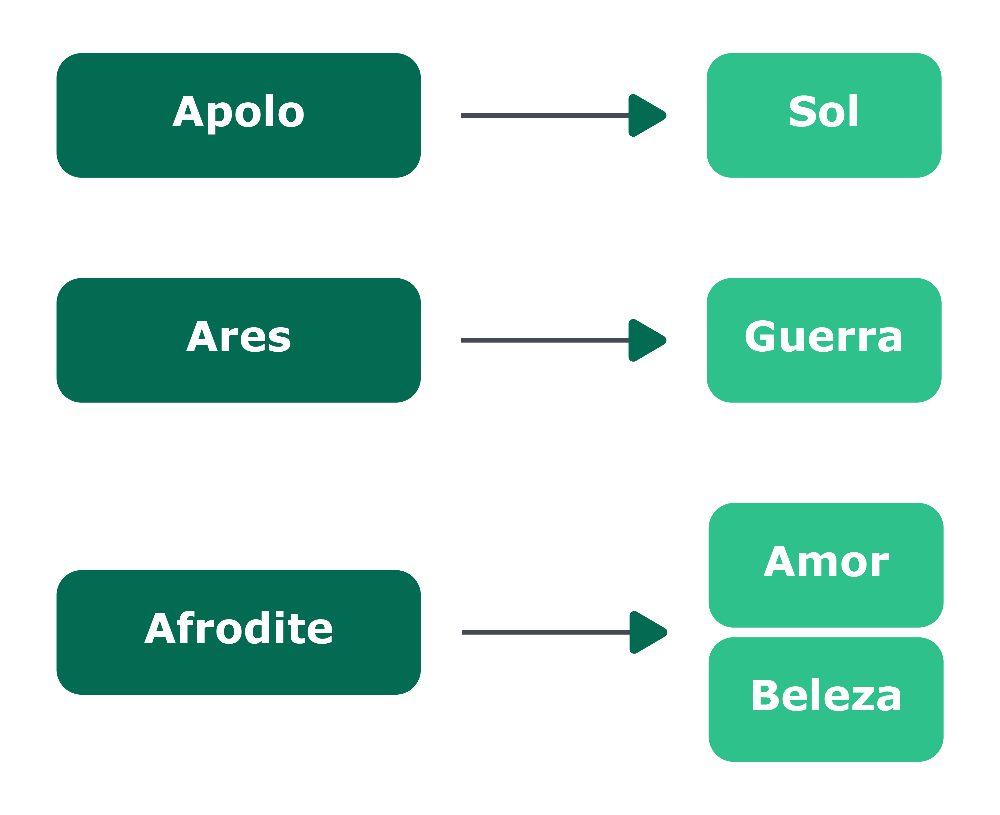
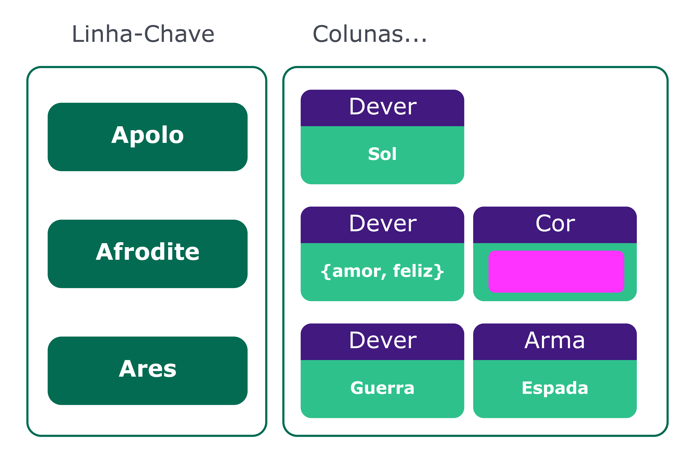
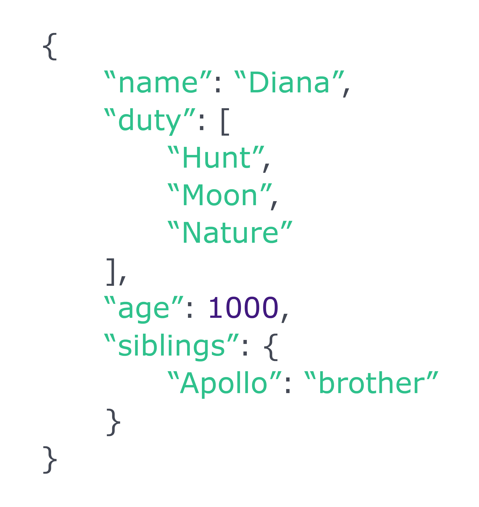
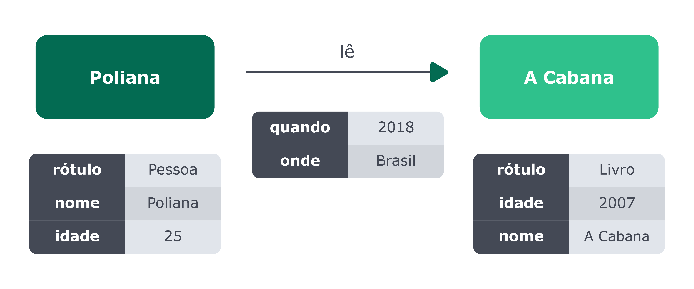
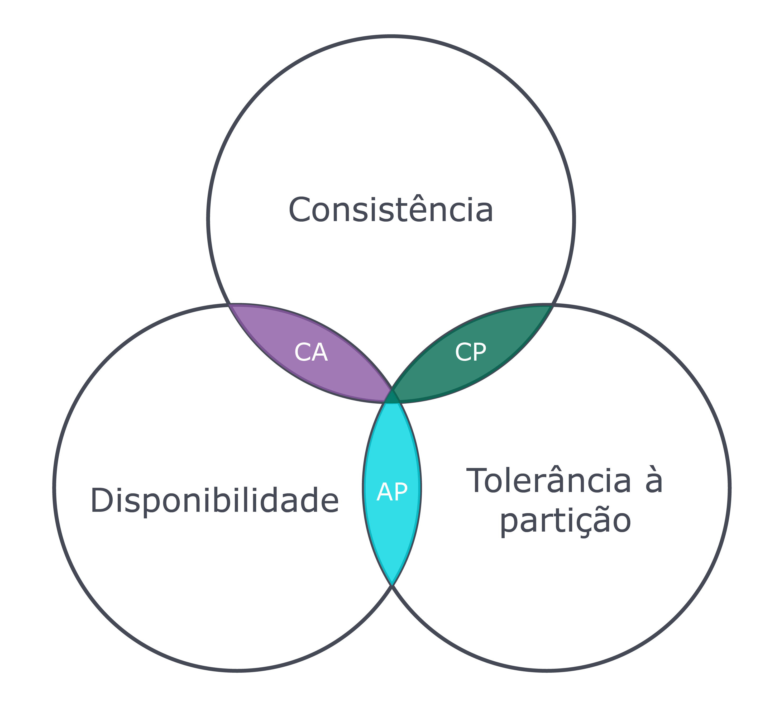
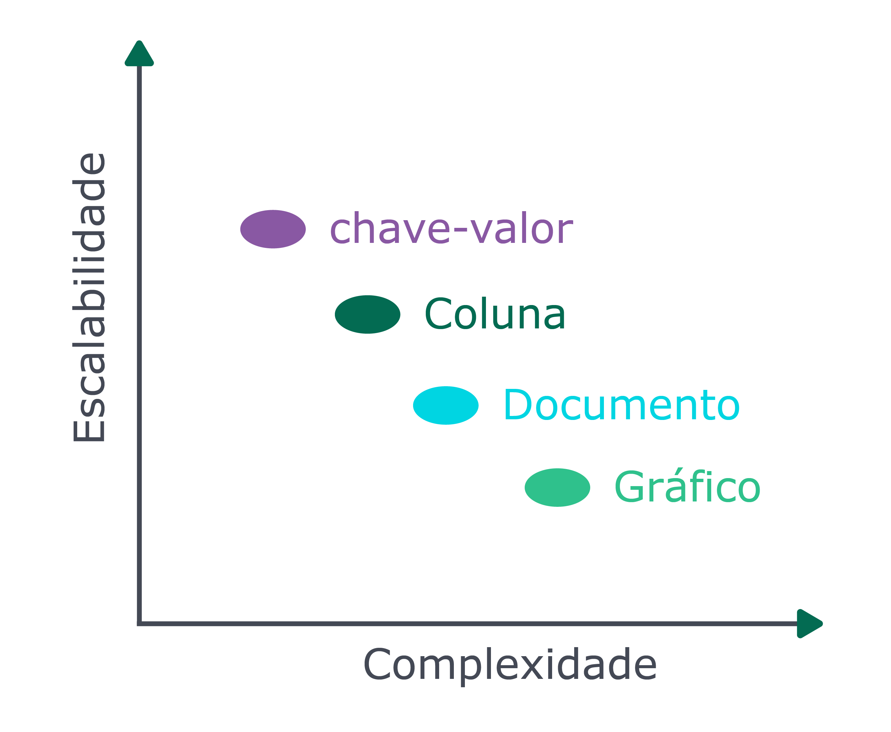
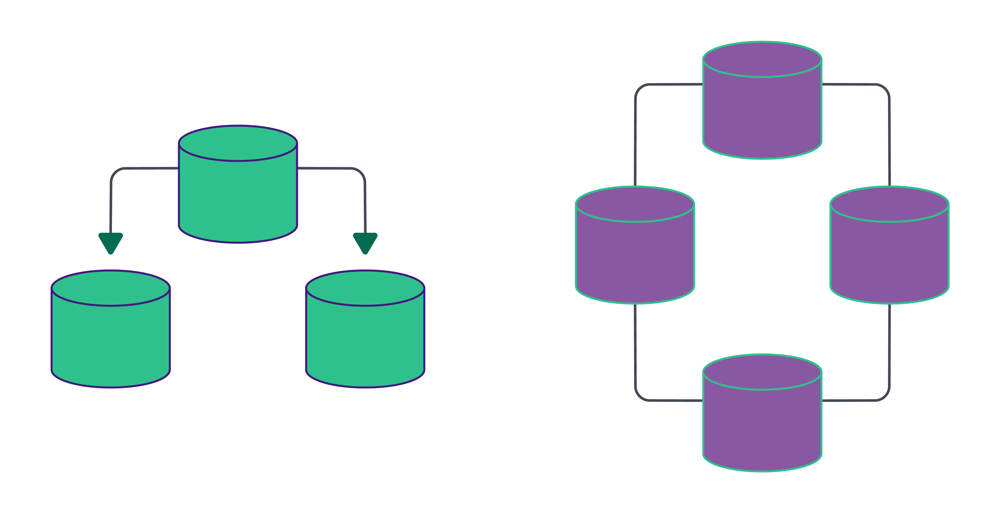

# NoSQL vs. SQL {#chapter_06}

Muitas das vezes, quando iniciamos um debate sobre SQL (Structured Query Language) e NoSQL no meio técnico, já podemos esperar o surgimento de discussões acaloradas. Isso se deve ao fato, principalmente, de que existe uma ideia de que há uma guerra, uma rixa etc. que precisa ser vencida entre quem faz uso dessas tecnologias. Já queremos deixar claro, não existe guerra alguma! Vamos desfazer esse mito?

Para começar, precisamos falar um pouquinho de história. Com isso, entenderemos os detalhes sobre o NoSQL e suas diferenças para o SQL.

Assim como sempre ocorre no universo da tecnologia, nós criamos uma solução para resolver um problema específico. Vamos voltar mais de quarenta anos no tempo para entender o problema existente no contexto dos bancos de dados:

- Para que pudessem ser utilizados posteriormente, os dados produzidos pelos computadores deveriam ficar armazenados e não poderiam ser perdidos quando as máquinas fossem desligadas.

Porém, naquela época, a tecnologia de armazenamento estava engatinhando, e os discos rígidos eram muito caros. Foi necessário então estruturar e normalizar os dados que seriam gravados nesses discos. Com a adoção dessa prática, os dados armazenados utilizariam menos espaço e, consequentemente, trariam um aproveitamento melhor de recursos, gerando economia ou a possibilidade de se armazenar maior quantidade de dados em um mesmo espaço. 

Esse foi o contexto em que os bancos de dados relacionais foram criados, inclusive implementando todos os conceitos detalhados no capítulo anterior, como formas normais e estrutura de dados bem definidas.

O tempo passou, nossa tecnologia evoluiu e, com essa evolução, mais um problema surgiu: produzimos dados em uma quantidade muito grande, muitas vezes de forma desestruturada e também descentralizada, com sistemas cada vez mais distribuídos. 

> **TIP:** Esses dados são chamados de *desestruturados* por terem origem em diversas fontes, como sensores IOT (Internet of Things, i.e. geladeiras conectadas à internet, relógios inteligentes e carros autônomos), imagens e documentos não catalogados, dentre outros exemplos.

Estruturar, isto é, organizar os dados provenientes de fontes como estas era (e é) possível, porém iria requerer muito tempo. Esse tempo extra impactaria o processo de desenvolvimento e entrega de software e, consequentemente, levaria as empresas a perderem o time to market da solução sendo criada. Esse problema precisava ser resolvido e, assim, nasceram os bancos de dados NoSQL!

O termo **NoSQL** foi originalmente criado em 1998 por Carlo Strozzi e, posteriormente, reintroduzido por Eric Evans em 2009, quando este participou da organização de um evento para discutir bancos de dados **open source** e **distribuídos**. E por falar em bancos distribuídos, esse é um conceito amplamente utilizado pelos bancos NoSQL: basicamente, os bancos NoSQL são bancos de dados que operam em computação distribuída, o que impulsiona um significativo grau de escalabilidade e performance. 

> **TIP:** Para entender um pouco mais sobre computação distribuída, recomendamos a leitura do seguinte artigo: [Paradigma da computação distribuída](https://imasters.com.br/arquitetura-da-informacao/paradigma-da-computacao-distribuida).

## NoSQL

### O que significa NoSQL?

Não existe uma definição, digamos, "oficial" para o que realmente esse termo significa, mas particularmente gosto da seguinte: **N**ot **O**nly **SQL**, ou seja, "Não Somente SQL". Essa definição enfatiza que esses bancos podem utilizar linguagens semelhantes ao [SQL ANSI](https://pt.wikipedia.org/wiki/SQL) para realizar consultas e demais operações e não somente o SQL em si.

### Particularidades do NoSQL

Quando você estudou sobre bancos de dados relacionais, viu que esses bancos são baseados no conceito **ACID** (**A**tomicity, **C**onsistency, **I**solation, **D**urability). Os bancos de dados NoSQL, em sua grande maioria, baseiam-se em um outro conceito: o **BASE** (**Ba**se Availability, **S**oft State and **E**ventually Consistent).

Antes de detalhar cada ponto do conceito **BASE**, você precisa entender a representação de um termo no contexto de banco de dados que verá ao longo deste capítulo: **cluster**. Um cluster, nesse contexto, se refere à capacidade de um conjunto de **servidores** (de banco) ou **instâncias** (de banco) se conectarem a um banco de dados. Uma **instância** é uma coleção de memória e processos que interagem com o banco de dados, que é o conjunto de arquivos físicos que efetivamente armazenam os dados.

Devemos destacar duas principais vantagens de um cluster, especialmente em ambientes de banco de dados de alto volume:

* **Tolerância a falhas** (_Fault Tolerance_): como há mais de um servidor ou instância para os usuários se conectarem, o cluster de bancos de dados oferece uma alternativa no caso de falha em um servidor. Quando se lida com dezenas de milhares de máquinas em um único [_data center_](https://pt.wikipedia.org/wiki/Centro_de_processamento_de_dados), tais falhas são um problema presente;

* **Balanceamento de carga** (_Load Balancing_): o cluster geralmente é configurado para permitir que a aplicação cliente seja automaticamente alocada ao servidor com o mínimo de uso para que, assim, se otimize o uso da estrutura disponível para o banco.

#### Detalhando o conceito BASE

- Base Availability - **BA**
    - O banco de dados aparenta funcionar o tempo todo. Como existe a implementação do conceito de cluster, se um servidor falhar, o banco continuará funcionando por conta de outro servidor que suprirá essa falha;

- Soft State - **S**
    - Não é necessário estar consistente o tempo todo. Ou seja: com um banco distribuído em várias máquinas e todas sendo usadas com igual frequência para escrita e consulta, é possível que, em dado momento, uma máquina receba uma escrita e não tenha tido tempo de "repassar" essa escrita para as demais máquinas do banco. Assim, se uma aplicação consultar a máquina que já foi atualizada e outra o fizer numa máquina menos atualizada, os resultados, que deveriam ser iguais, serão diferentes. Imagine a sua _timeline_ do **Facebook**: nela são exibidos os posts, porém nem todos os posts são exibidos exatamente ao mesmo tempo. Nesse caso, o que acontece é que a informação foi enviada ao banco de dados, mas nem todos os servidores do cluster têm essa mesma informação ao mesmo tempo. Isso permite que o banco de dados possa gerenciar mais informações de escrita sem ter que se preocupar em replicá-las em uma mesma operação;

      {pagebreak}
    
- Eventually Consistent - **E**
    - O sistema se torna consistente em algum momento. Em outras palavras, ele eventualmente se tornará consistente. Como não temos a informação replicada "instantaneamente", esse conceito se encarrega de deixar o banco consistente "ao seu tempo". Isso porque, dependendo das configurações do cluster, essa replicação pode acontecer mais rapidamente ou não. Mas em algum momento as informações estarão consistentes e presentes em todos os servidores do cluster.

Para finalizar, uma outra particularidade marcante de bancos não estruturados é a ausência da feature de `schema` ou `schema flexível`. Isso quer dizer que não há necessidade de definição prévia do `schema` dos dados. Se, por um lado, isso torna mais dinâmico o processo de inclusão de novos atributos, por outro pode impactar a integridade desses dados. Não se preocupe: a seu tempo, todos esses conceitos ficarão bem mais claros.

---

## NoSQL e suas classes

Os bancos de dados NoSQL podem ser categorizados em quatro tipos (que, no contexto de banco de dados, são chamados de **classes**):

* Chave / Valor - `Key / Value`
* Família de Colunas - `Column Family`
* Documentos - `Document`
* Grafos - `Graph`

Cada classe acima possui uma aplicação diferente, portanto, devemos entender as características de cada classe para tirar o melhor proveito de cada uma e saber quando escolhê-las.

#### Classe `Key / Value`

Os bancos do tipo chave-valor possuem uma estrutura similar à da classe `java.util.Map` do Java, ou seja, a *informação* (`value`) será recuperada apenas pela *chave* (`key`). Esse tipo de banco de dados pode ser utilizado, por exemplo, para gerenciar sessões de usuários logados. Outro exemplo de utilização é aliado a um DNS, onde a chave é o endereço, por exemplo, `www.google.com`, e o valor é o IP desse servidor.

Atualmente existem diversas implementações de banco de dados do tipo chave-valor, dentre os quais os mais famosos são:

* AmazonDynamo
* AmazonS3
* Redis
* Scalaris
* Voldemort

Comparando o banco de dados relacional com o do tipo chave-valor, podemos elencar alguns pontos de atenção. O primeiro é que a estrutura do chave-valor é bastante simples:

| Estrutura relacional | Estrutura chave-valor |
| -------------------- | --------------------- |
| Table                | Bucket                |
| Row                  | Key/value pair        |
| Column               | ----                  |
| Relationship         | ----                  |

Nessa classe de banco, não é possível realizar operações como `join` entre os `buckets`, e o valor é composto por um grande bloco de informação, ao invés de ser subdivido em colunas, como ocorre na base de dados relacional.

#### Classe `Column Family`

Esse modelo se tornou popular através do paper "[Bigtable: a Distributed Storage System for Structured Data](https://static.googleusercontent.com/media/research.google.com/en//archive/bigtable-osdi06.pdf)", criado por funcionários do Google, com o objetivo de montar um sistema de armazenamento de dados distribuído, projetado para ter um alto grau de escalabilidade e de volume de dados. Assim como o chave-valor, para realizar uma busca ou recuperar alguma informação dentro do banco de dados, é necessário utilizar o campo que funciona como um identificador único, que seria semelhante à chave na estrutura chave-valor. Porém as semelhanças terminam por aí. 

Em bancos do tipo `Column Family`, as informações são agrupadas em colunas: uma unidade da informação (composta pelo nome) e a informação em si.

Esses tipos de bancos de dados são importantes quando se lida com um alto grau de volume de dados, e quando é necessário distribuir essas informações entre diversos servidores. Mas vale salientar que a sua operação de leitura é bastante limitada, semelhante ao chave-valor, pois a busca da informação é definida a partir de um campo único ou uma chave. Existem diversos bancos de dados que utilizam essas estruturas. Podemos citar:

* Hbase
* Cassandra
* Scylla
* Clouddata
* SimpleDb
* DynamoDB

Dentre os tipos de bancos de dados do tipo família de coluna, o Apache Cassandra é o mais famoso. Caso uma aplicação necessite lidar com um grande volume de dados e com fácil escalabilidade, o Cassandra é certamente uma boa opção.

Ao contrapor o banco do tipo família de coluna com os bancos relacionais, é possível perceber que as operações, em geral, são muito mais rápidas. É mais simples trabalhar com grandes volumes de informações e servidores distribuídos em todo o mundo, porém isso tem um custo: a leitura desse tipo de banco de dados é bem limitada. Por exemplo, não é possível realizar uniões entre família de colunas como no banco relacional. A família de coluna permite que se tenha um número ilimitado de coluna, que por sua vez é composta por nome e a informação, exatamente como mostra a tabela a seguir:

| Estrutura relacional | Estrutura de família de colunas |
| -------------------- | ------------------------------- |
| Table                | Column Family                   |
| Row                  | Column                          |
| Column               | Nome e valor da Column          |
| Relacionamento       | Não tem suporte                 |

#### Classe `Document`

Os bancos de dados orientados a documento têm sua estrutura muito semelhante a um arquivo JSON ou XML. Eles são compostos por um grande número de campos, que são criados em tempo de execução, gerando grande flexibilidade, tanto para a leitura como para escrita da informação. 

{width=60%}

Eles permitem que seja realizada a leitura da informação por campos que não sejam a chave. Algumas implementações, por exemplo, têm uma altíssima integração com motores de busca, o que os torna cruciais para a realização de análise de dados ou logs de um sistema. Veja abaixo algumas implementações dos bancos de dados do tipo documento:

* AmazonSimpleDb
* ApacheCouchdb
* MongoDb
* Riak

Destes, o mais popular é o MongoDB. Ao comparar com uma base relacional, apesar de ser possível realizar uma busca por campos que não sejam o identificador único, os bancos do tipo documentos não têm suporte a relacionamento. 

| Estrutura relacional | Estrutura de documentos |
| -------------------- | ----------------------- |
| Table                | Collection              |
| Row                  | Document                |
| Column               | Key/value pair          |
| Relationship         | --                      |

Uma outra característica de bancos do tipo documento é que, no geral, são _schemeless_.

#### Classe `Graph`

O banco do tipo grafo é uma estrutura de dados que conecta um conjunto de vértices através de um conjunto de arestas. Os bancos modernos dessa categoria suportam estruturas de grafo multirrelacionais, em que existem diferentes tipos de vértices (representando pessoas, lugares, itens) e diferentes tipos de arestas. Os sistemas de recomendação que acontecem em redes sociais são o maior case para o banco do tipo grafo. Veja abaixo alguns exemplos desse tipo de banco:

* Neo4j
* InfoGrid
* Sones
* HyperGraphDB

Dos tipos de banco de dados mais famosos no mundo NoSQL, o grafo possui uma estrutura distinta com o relacional.

#### Multi-model database

Alguns bancos de dados possuem a comum característica de ter suporte de uma ou mais classes apresentadas. São exemplos:

* OrientDB
* Couchbase

### Teorema do CAP

{width=60%}

Um dos grandes desafios dos bancos de dados NoSQL é que eles lidam com a persistência distribuída, ou seja, as informações ficam localizadas em mais de um servidor. Foram criados diversos estudos para ajudar nesse desafio de persistência distribuída, mas o mais famoso foi uma teoria criada em 1999, o Teorema do CAP. 

Esse teorema afirma que é impossível que o armazenamento de dados distribuído forneça simultaneamente mais de duas das três garantias seguintes:

* *Consistência*: uma garantia de que cada nó em um cluster distribuído retorna a mesma gravação mais recente e bem-sucedida. Consistência refere-se a cada cliente com a mesma visão dos dados.
* *Disponibilidade*: cada pedido recebe uma resposta (sem erro) - sem garantia de que contém a escrita mais recente.
* *Tolerância à partição*: o sistema continua a funcionar e a manter suas garantias de consistência, apesar das partições de rede. Os sistemas distribuídos que garantem a tolerância continuam operando, mesmo que aconteça alguma falha em um dos nós, uma vez que existe, pelo menos, um nó para operar o mesmo trabalho e garantir o perfeito funcionamento do sistema.

De uma maneira geral, esse teorema explica que não existe mundo perfeito. Quando se escolhe uma característica, perde-se em outra, como consequência. Em um mundo ideal, um banco de dados distribuído conseguiria suportar as três características, porém, na realidade, é importante saber o que se perderá quando escolher entre um e outro.

Por exemplo, o Apache Cassandra é AP, ou seja, sua arquitetura focará em tolerância a falha e disponibilidade. Existirão perdas na consistência, assim, em alguns momentos um nó retornará informação desatualizada.

Porém, o Cassandra tem o recurso de nível de consistência, de modo que é possível fazer com que algumas requisições ao banco de dados sejam enviadas a todos os nós ao mesmo tempo, garantindo consistência. Vale ressaltar que, fazendo isso, ele perderá o `A`, de _aviability_ do teorema do CAP, da disponibilidade.

### Escalabilidade vs Complexidade

No mundo NoSQL, cada classe de banco tem o objetivo de resolver problemas particulares. Como o gráfico abaixo mostra, existe um balanço entre o modelo de complexidade: modelos que permitem mais complexidade em modelagem e busca resultam en menos escalabilidade. Como exemplo, temos o banco de classe chave-valor, que é mais escalável, porém permite menos complexidade, uma vez que as queries são baseadas apenas na chave.

### Master/Slave vs Masterless

Em linha geral, a persistência no mundo NoSQL possui duas maneiras de comunicação entre os servidores:

* *O Master/Slave*: é o modelo de comunicação que se caracteriza por um controle unidirecional de um ou mais dispositivos. Em linhas gerais, o nó master é utilizado para a escrita e para a replicação das informações para todos os nós escravos, que, por sua vez, são responsáveis por realizar a leitura das informações. Dessa maneira, é possível garantir maior consistência de dados. Como há um único ponto para a escrita, é possível ter suporte a comportamentos como, por exemplo, transação. Porém existe um ponto de falha: o master. Caso o servidor fique fora do ar, teremos problemas com a escrita. Em cenários como este, bancos de dados modernos conseguem realizar a eleição de um novo nó master de maneira automática.
* *Masterless*: é o modelo de comunicação que se caracteriza por um controle multidirecional por um ou mais dispositivos. Ou seja, não existe um único nó responsável por leitura ou escrita. Cada nó pode ser responsável pelas duas operações. Assim, não existe nenhum ponto de falha, a elasticidade acontece de maneira natural, porém a consistência da informação se torna mais difícil, uma vez que é necessário um certo tempo para que os nós tenham a informação mais atualizada.

## Conclusão

Este capítulo teve como objetivo dar o pontapé inicial para os bancos de dados não relacionais. Foram discutidos os principais conceitos acerca de bancos não estruturados, as classes de bancos e suas estruturas. Com esse novo paradigma de persistência não estruturada, as portas se abrem para novas possibilidades e novos desafios na implementação de aplicações. 

Os bancos de dados NoSQL vieram para enfrentar e sustentar a nova era das aplicações, na qual velocidade e menor tempo de resposta são um grande diferencial e fator decisivo na hora da escolha. Com este capítulo introdutório, você está apto (a) para seguir desbravando os bancos não relacionais, como o Cassandra, MongoDB, Neo4J e vários outros.