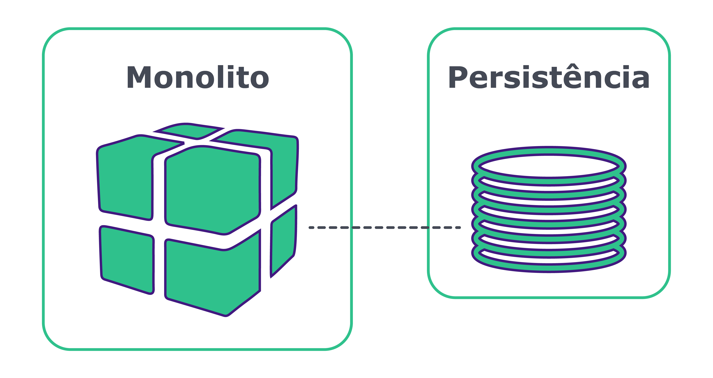

# Arquitetura de microsserviços {#chapter_07}

Com a popularização da utilização de ambientes de cloud para entrega de software, a [arquitetura orientada a microsserviços](https://www.martinfowler.com/articles/microservices.html) passou a ser cada vez mais adotada. O quão confortável a comunidade de TI pode se sentir acerca da adoção dessa arquitetura? 

Com base na análise de [tendências de arquitetura e design de software realizada em Abril de 2020](https://www.infoq.com/articles/architecture-trends-2020/), podemos assumir que o conhecimento acerca dos benefícios e desafios da adoção desse modelo estão bem estabelecidos, uma vez que sua adoção já chegou à categoria de usuários(as) classificados(as) como "Late Majority". Existem várias histórias de sucesso e de desastre de organizações que optaram pelo uso desse modelo, portanto, nosso ecossistema se encontra repleto de conhecimento como "por onde começar" e "lições aprendidas". 

Antes de entrar em mais detalhes sobre essa arquitetura, vamos brevemente recapitular os desafios da arquitetura monolítica que antecederam a criação desse novo modelo arquitetural.  

## Arquitetura monolítica

Em uma arquitetura monolítica encontramos uma aplicação cujos front-end e back-end são parte de um artefato único. Nesse artefato estão contidos todos componentes funcionais, que são compilados e disponibilizados em conjunto. A escalabilidade é impactada, uma vez que, sempre que é necessário escalar essa aplicação, é necessário também prover recursos para a execução de todos os seus componentes - mesmo aqueles que não precisavam ser escalados. No cenário de persistência, é muito comum se encontrar a relação de um banco para um monolito, porém existem monolitos que trabalham acessando múltiplos bancos de dados (o que aumenta ainda mais o nível de complexidade de manutenção).

Vamos falar dos benefícios dessa arquitetura:

- Facilidade de manutenção, afinal, quanto menos camadas físicas, menos pontos para se verificar, especialmente quando ainda está pequeno;
- Facilidade de sincronizar os dados entre a pessoa usuária e o sistema - a melhor e mais rápida maneira de trocar informações é pela memória. Pensando num banco de dados relacional, por exemplo, a sincronização de dados acontece de maneira mais simples com os clássicos JOINs, ao invés de realizar todo o processo de sincronização ou orquestração entre serviços.
- Consistência de dados tende a ser facilitada em comparação a um sistema distribuído. Salientamos que sempre teremos o problema do CAP quando falamos de arquitetura distribuída. Para aplicações que precisam, por exemplo, transação, no que no monolito seria um simples rollback, num sistema de microservices seria o caro e complexo padrão SAGA.
- Iniciar um projeto tende a ser muito simples com o monolito - é necessário planejar e arquitetar um ecossistema com menos camadas e componentes.
- O monitoramento de uma única aplicação é mais simples.

Com o passar dos ciclos de desenvolvimento, essas aplicações monolíticas tendem a crescer tanto em quantidade de linhas de código quanto em consumo de hardware, o que acarreta em:

- As chances de se quebrar a aplicação ao realizar alterações pontuais passam a ser cada vez maiores; 
- Quanto maior a aplicação, maior o número de testes unitários, o que exige um maior tempo de build sempre que se precisa compilar a aplicação;
- Um maior tempo de build provoca um processo de entrega mais longo;
- É comum que a área de negócio queira realizar testes de validação da aplicação ao liberar uma nova versão. Esses testes também requerem mais esforço, uma vez que - apesar de uma porção pequena ter sido alterada - toda a aplicação foi atualizada. Desta forma, os testes de homologação se tornam mais demorados;
- Evolução e migração dos dados requerem um maior planejamento prévio, uma vez que alterações em banco podem parar o funcionamento de toda a aplicação;
- A aplicação naturalmente passa a ocupar e consumir maior espaço em memória e possuir um maior tempo de start-up.
- Mudanças e entregas críticas exigem grande mobilização na organização e planejamento prévio para disponibilização em produção.

Notamos um dos maiores impasses: o acoplamento, em termos de código e de deploy. Quando a aplicação começa a se tornar muito complexa, com vários times de desenvolvimento e muitas funcionalidades, as adições ou alterações começam a se tornar cada vez mais custosas. Escalar um ambiente desses é desafiador. 

É aqui que entra o conceito dos microsserviços, que começa a desacoplar esses serviços e dar responsabilidades únicas para os serviços. Nesta abordagem você pode alterar, disponibilizar e escalar de maneira independente todo o ecossistema, seguindo sempre a premissa de não afetar os outros microsserviços.

## Microsserviços

A arquitetura orientada a microsserviços traz como preceito a criação de aplicações desacopladas entre si e modeladas conforme o domínio de negócios. Essas aplicações se integram através de diferentes protocolos, e os diversos padrões de comunicação (REST, GRPC, eventos assíncronos, entre outros) podem ser adotados. Com a adoção de uma arquitetura orientada a microsserviços, é possível promover entregas mais velozes e frequentes, além de trazer a quem desenvolve um ecossistema agnóstico de linguagem. 

Como apontado por Sam Newman, em seu livro "Building Microservices", estes são conceitos que estão implícitos em microsserviços:

* São modelados levando-se em consideração o domínio do negócio;
* São altamente monitoráveis;
* Seu deploy pode ser feito de maneira independente dos outros serviços;
* Possui isolamento às falhas no ecossistema;
* Detalhes de implementação são "escondidos";
* Automação é essencial em todos os níveis.

Com essas características, alcançamos uma arquitetura flexível e escalável. 

> **TIP**: Tenha em mente que as vantagens expostas não necessariamente nos levam a um mundo onde as arquiteturas monolíticas não têm espaço. Na verdade, nós temos agora mais uma ferramenta em nossa caixa de ferramentas, uma forma diferente de entregar aplicações - que não necessariamente é a melhor forma para todos os cenários.

Vejamos algumas vantagens da utilização da abordagem de uma arquitetura orientada a microsserviços:

- **Escalabilidade vertical** - Devido à independência dos serviços, eles podem ser escalados conforme a necessidade, sem causar impactos nos demais serviços. Por serem menores, também requerem menos recursos de hardware.
- **Liberdade de selecionar tecnologias por projeto**: É possível escolher a melhor tecnologia para resolver determinado problema, mesmo que seja diferente das tecnologias utilizadas nos demais serviços.
- **Produtividade** - Esta abordagem suporta a existência de múltiplos times multidisciplinares (também conhecidos como squads) que podem atuar com um foco mais específico de negócio e, devido à independência técnica, entregar com maior velocidade. Em times grandes, a produtividade tende a tornar mais fáceis e menos problemáticas atividades como merge/rebase de um projeto se cada time trabalhar no seu próprio repositório. É muito importante pensar na organização e suas estruturas, que se refletem diretamente nos serviços e nas suas integrações. É o caso muito comum de que a estrutura do time impacta o modo como os softwares são organizados, muito bem explicado no Conways's law.
- **Agilidade** - Metodologias ágeis e suas diversas ramificações têm se mostrado cada vez mais populares. Ao se aliar esse estilo de gerenciamento de projeto com a arquitetura em microsserviços, permitimos tecnicamente a existência de ciclos completos e mais curtos para entrega de valor.
- **Reusabilidade** - Os componentes, como por exemplo um serviço que processe a lógica de negócio, podem ser consumidos via APIs, quando necessário, evitando assim a duplicidade de código e impactos na manutenibilidade.

### Desafios da arquitetura de microsserviços

A comunicação entre componentes de uma aplicação monolítica ocorrem in-memory, ou seja, não possuem o overhead da **latência** existente na comunicação via rede, como ocorre no cenário de microsserviços. Quanto mais o número de serviços e a complexidade arquitetural aumentam, mais catastrófico pode ser esse problema. Lidar com o tempo de resposta do serviço invocado no(a) cliente em si é uma boa prática (como configuração de timeouts e retries), assim como manter em dia os serviços de monitoramento e alertas da sua rede.

Atente-se à separação por responsabilidade dos componentes de back-end e de front-end. O **front-end** deve ser implementado de forma que, na falha de um dos serviços de back-end, os demais itens funcionem normalmente - garantindo a melhor experiência possível.

A arquitetura de microsserviços é agnóstica a linguagens e frameworks. Com isso, seu ambiente pode se tornar **poliglota**. Do ponto de vista arquitetural e de liderança técnica, tenha parcimônia na avaliação das tecnologias a serem utilizadas para que não se depare com um cenário onde há um serviço sem profissionais capacitados para mantê-lo. A definição do escopo e tamanho de um microsserviço deve ser mensurada. 

A definição do tamanho e escopo dos microsserviços pode ser uma tarefa que exija um pouco mais de esforço no início da jornada ao desacoplamento. Tenha em mente que o escopo e tamanho de um microsserviço devem ser mensurados a partir do princípio da responsabilidade única (**S**OLID). 

Um dos desafios de governança é evitar a existência de aplicações órfãs em ambiente produtivo. Procure estabelecer times responsáveis por cada serviço, inclusive em sua fase produtiva. Desta forma, caso ocorra um problema inesperado ou uma nova solicitação de mudança, será mais fácil identificar quem poderá assumir as tarefas.

Cuidado com a granualização demasiada de projetos por repositórios, essa opção pode não ser a melhor quando existem mais repositórios que colaboradores(as) na empresa.

## Migração de um monolito para microservices

Foram identificados padrões e técnicas que possibilitam a migração com sucesso de monolitos para arquitetura de microsserviços. Dois padrões bem populares para a realização dessa migração são [Strangler Fig Application (Estrangulamento)](https://martinfowler.com/bliki/StranglerFigApplication.html) e [UI Composition](https://www.thoughtworks.com/talks/a-high-performmance-solution-to-microservice-ui-composition). 

Caso você esteja em um cenário em que precisa migrar um monolito, é recomendado o estudo das estratégias presentes no livro [Monolith to Microservices, Sam Newman](https://samnewman.io/books/monolith-to-microservices/). Nesse livro, no capítulo 1, você também pode ver na prática um exemplo de migração de uma aplicação monolítica com o suporte do DDD. 

## Os erros mais comuns com microservices 

É muito comum existir a lista dos erros que todo software tem, principalmente quando há uma mudança de paradigma. Por exemplo, quando houve a migração para os bancos de dados NoSQL, certamente, o erro foi pensar em relacionamento em bancos de dados que não têm suporte a relacionamento, como [Cassandra](http://cassandra.apache.org/). A lista a seguir apresenta os erros mais comuns que encontramos nos microservices:

- Quebra de domínio: o [DDD](https://www.infoq.com/minibooks/domain-driven-design-quickly/) trouxe vários benefícios, principalmente o de trazer o código para próximo do negócio com a linguagem ubíqua. Dentro do DDD temos o conceito de domínios, e quando movemos para microservices é muito normal quebrar de maneira errada o negócio no domínio. Esse tipo acontece, principalmente, quando fazemos a quebra de maneira precoce. É o mesmo caso da modelagem no banco de dados que fazemos, justamente, quando não temos muita informação do negócio. [Em seu artigo de definição de domínio, Martin Fowler](https://martinfowler.com/bliki/BoundedContext.html) menciona o *bounded context*. Podemos ver isso num e-commerce, quando separamos o controle de estoque do produto; porém, o que acontece se a regra obrigar que o produto só possa ser exibido se tiver no estoque? Exato, toda vez que se consultar um produto, também precisará ser consultado o serviço de estoque, resultando num total acoplamento entre os dois serviços. Em outras palavras, o serviço de produto e o de estoque não deveriam estar em dois serviços nesse contexto.
- Não automatizar: uma das boas práticas existentes quando falamos de microservices, certamente, é o [CI/CD](https://www.infoworld.com/article/3271126/what-is-cicd-continuous-integration-and-continuous-delivery-explained.html). Essas técnicas são realmente importantes, uma vez que existe uma grande quantidade de máquinas a serem gerenciadas.
- Diversidade de linguagens: essa decisão é uma das mais intrigantes. Até o momento, não conheço um único projeto cujo objetivo seja exibir alguma coisa no console, porém é muito comum ouvir de grandes nomes recomendações baseadas num “Hello World”. É importante ter muito cuidado com esse tipo de decisão; afinal, quanto maior o número de linguagens dentro de uma empresa, mais e diversos campos o time terá que conhecer, ou existirão silos de conhecimento. Há diversas histórias que relatam que um sistema foi reescrito, simplesmente, por não ter um time técnico para manter ou porque a linguagem/framework foi descontinuada.
- [Sua aplicação não é grande suficiente para se tornar microservice](https://medium.com/swlh/stop-you-dont-need-microservices-dc732d70b3e0): nem toda aplicação grande precisará ser migrada ou criada com o objetivo de se tornar um ambiente de microsserviço. Um exemplo disso são as aplicações legadas e que atendem à necessidade de clientes.
- Um dos grandes argumentos para escolher microservices está na possibilidade de escolher escalar um componente individualmente. Porém, eis que surge a seguinte pergunta: realmente faz sentido escalar individualmente um componente?
- Microsserviços precisam de informações e, como todo banco de dados distribuído, eles enfrentam a teoria do [CAP](https://en.wikipedia.org/wiki/CAP_theorem). Dado um cenário no qual se realizam múltiplas atualizações em diversos serviços, é comum acrescentar um novo item na arquitetura: o padrão [SAGA](https://dzone.com/articles/microservices-using-saga-pattern), resultando numa maior complexidade e pontos de testes no seu ambiente.
- [Começar o projeto já como microservices tende a ser um grande erro](https://www.oreilly.com/content/should-i-use-microservices/), principalmente na instabilidade na definição dos domínios. Um erro na quebra dos serviços faz com que exista uma grande dependência e acoplamento entre eles. Considere um contexto em que os dados a serem utilizados estão armazenados em múltiplas bases de dados. Com pragmatismo, esse problema poderia ser facilmente resolvido em uma arquitetura monolítica, um join num banco de dados relacional, como MySQL ou PostgreSQL, ou um subdocumento num banco de dados NoSQL, como MongoDB.

* Utilizar microservices apenas porque grandes empresas utilizam esse tipo de arquitetura. No mundo de arquitetura de software, uma decisão não deve ser tomada apenas pela popularidade na solução. Como [Edson Yanaga](https://twitter.com/yanaga) fala em seu [livro](https://developers.redhat.com/books/migrating-microservice-databases-relational-monolith-distributed-data/): “Certamente, sempre lemos grandes coisas sobre as arquiteturas de microservices implementadas por empresas como Netflix ou Amazon. Então, deixe-me fazer uma pergunta: quantas empresas no mundo podem ser Netflix e Amazon?”.

## Conclusão

Como visto, a arquitetura de microsserviços traz muitos benefícios para o seu ambiente e lhe oferece a vantagem de deixar o desenvolvimento independente quando se tem vários times e funcionalidades, e essa independência se estende também para o deploy da aplicação. Ou seja, você dá velocidade e agilidade para seus times e consegue ter código de melhor qualidade, já que ele vai estar organizado ao redor da funcionalidade. Tem-se a vantagem de ser fácil de escalar apenas no ponto em que se precisa, e ainda poder ser aplicado na tecnologia que você tem mais domínio.

Mas, como já dito anteriormente, não é nenhuma bala de prata; há complexidades para o ambiente e novas preocupações em termos de segurança. Imagine um projeto gigante, com múltiplas instâncias e centenas de microsserviços; como você irá monitorar? Em caso de erro, como você vai encontrar, desviar ou mesmo tratar o erro?

Se usado da maneira correta, e tratados de perto os pontos de atenção, esse padrão de arquitetura tem muito a agregar nos seus projetos.

Microsserviços, como toda decisão de arquitetura, têm suas vantagens e desvantagens. Como diz Martin Fowler:  

> Os microservices introduzem eventuais problemas de consistência, por causa de sua louvável insistência no gerenciamento de dados descentralizado. Com um monolito, podemos atualizar várias coisas juntas em uma única transação. Os microservices exigem vários recursos para atualizar, e as transações distribuídas são desaprovadas (por um bom motivo). Portanto, agora, os desenvolvedores precisam estar cientes dos problemas de consistência e descobrir como detectar quando as coisas estão fora de sincronia antes de fazer qualquer coisa de que o código se arrependa. - [Martin Fowler](https://martinfowler.com/articles/microservice-trade-offs.html#consistency)