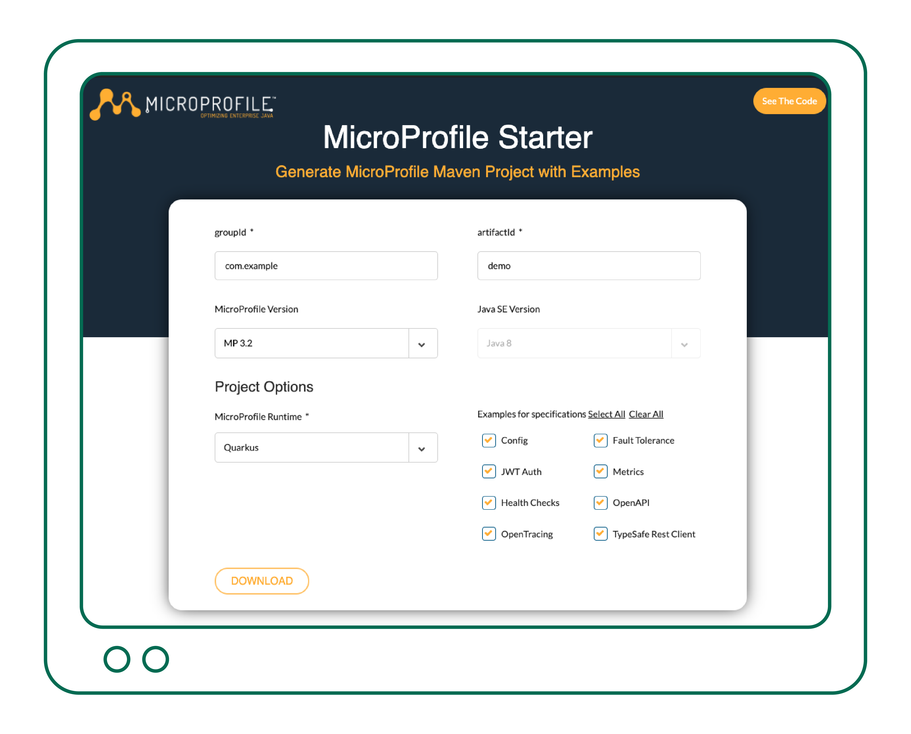
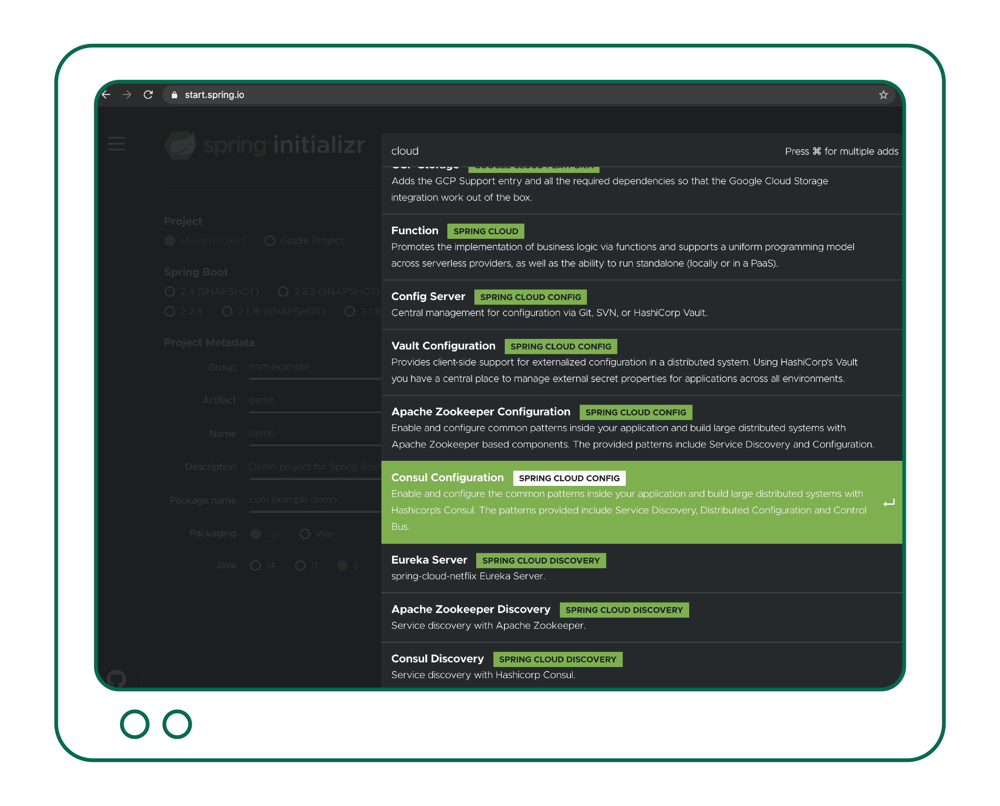
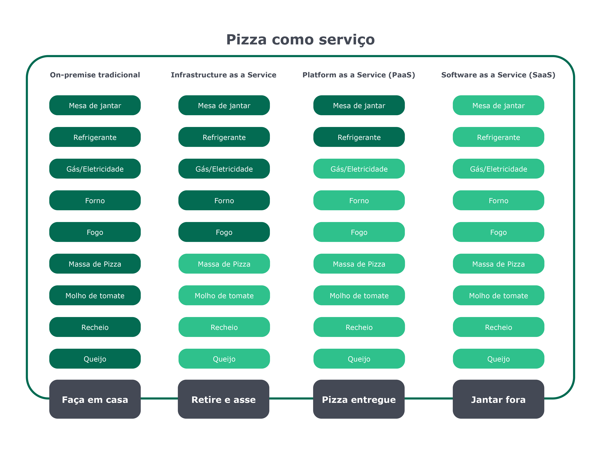
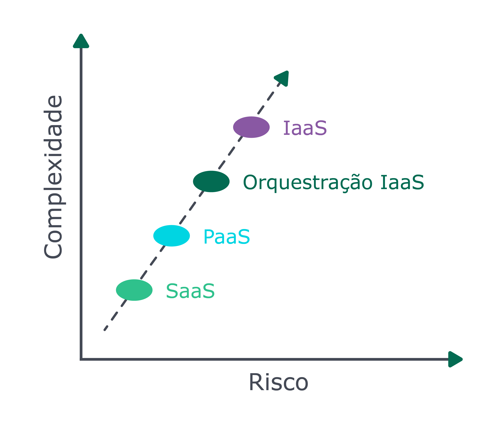
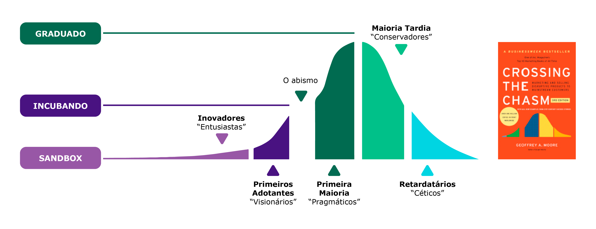

# Cloud {#chapter_08}

Uma vez que conversamos sobre DDD, microservices, boas práticas, design de código e arquitetura de software, temos embasamento para prosseguir e abordar um dos temas mais discutidos do cenário de tecnologia: computação em nuvem (*cloud* *computing*).

Discorreremos sobre o que se considerar ao transpor arquitetura de aplicações para um ambiente de cloud, perspectivas populares a respeito de aplicações "cloud-native" e por que esse conceito é tão ligado a ferramentas como Kubernetes.  Serão também descritos padrões e funcionalidades esperadas em uma aplicação, para que sejam first-class citizens em um ambiente de cloud. 

>  **INFO:** Este capítulo não tem como meta ensinar a fazer deploy de serviços em um cluster Kubernetes, configurar serviços na AWS ou criar aplicações cloud-native from scratch. A intenção deste capítulo é prover informações arquiteturais que embasarão suas decisões e modelagem dos seus serviços e plataformas. Com o conhecimento aqui fornecido, você estará preparado(a) e confiante para iniciar ou prosseguir sua jornada cloud-native, independentemente da solução ou linguagem adotada. 

A buzz-word "cloud-native" começou a se estabelecer por volta de 2014, e sua crescente popularidade se mostra em seu melhor cenário. Para atingir maior espaço no mercado, empresas passaram a rotular seus produtos como cloud-native, quando, na verdade, são apenas tecnologias cloud-enabled. 

> **TIP:** Uma das formas de se avaliar a popularidade de um termo é validar a quantidade de buscas realizadas ao longo do tempo e as regiões interessadas.
>
> <https://trends.google.com.br/trends/explore?date=all&q=cloud-native>

O entendimento desses conceitos te auxiliará no entendimento da situação em que suas aplicações estão e dará suporte ao planejamento de uma jornada para a cloud. Vamos discorrer sobre essas categorizações, seus conceitos e diferenças.

## Cloud-Native ou Cloud-Enabled?

Uma aplicação pode ser categorizada conforme seu nível de adequação a um ambiente de cloud como sendo *cloud-enabled* ou *cloud-native* (a.k.a. *cloud-ready*).  

### Cloud-Enabled

É uma aplicação que foi conteinerizada e roda na cloud, mas que originalmente foi criada para rodar em ambiente tradicional, como por exemplo um data-center local, máquinas virtuais com cluster de servidores de aplicação tradicional. Essas aplicações podem ser categorizadas como *cloud-enabled* e têm maior consumo de recursos (cpu, memória, storage), em comparação a aplicações cloud-native. 

Uma aplicação cloud-enabled passou por refatorações e ajustes para rodar em ambiente conteinerizado e também para suportar orquestração por plataformas como Kubernetes. Afinal de contas, não é mais o tradicional cluster de WildFly (a.k.a. JBoss EAP) ou GlassFish (Weblogic) clusterizados, que permitem que você use a rede ou sistema de arquivos a seu bel-prazer. Agora, esses serviços rodam em pods, em contêineres efêmeros. 

Apesar dos "contras" de se possuir uma aplicação cloud-enabled, o custo ou esforço de se refatorar toda a aplicação não são viáveis. Desta forma, a aplicação pode rodar em cloud, mas não pode usufruir de todos os benefícios existentes em um ambiente de cloud. 

> **INFO:** [Kubernetes](https://kubernetes.io/): É uma ferramenta open-source de orquestração de containers e trabalha muito bem com o [Docker](https://www.docker.com/). Atualmente, é a ferramenta mais popular na comunidade. Outros exemplos de ferramenta de orquestração de containers são Docker Swarm, Mesos e Amazon ECS.

Para entender melhor tudo o que uma aplicação cloud-enabled *não* é capaz de utilizar nativamente, vamos falar sobre o conceito cloud-native.

### Perspectivas sobre o conceito cloud-native

No momento da escrita deste livro, não há um consenso ou definição exata acerca do termo. Portanto, vejamos posicionamentos:

> "Cloud-native é uma abordagem para criar e executar aplicações que explora as vantagens do modelo de computação em nuvem. (...)"
>
> —[VMWare Tanzu (Pivotal)](https://tanzu.vmware.com/cloud-native)

> "Cloud-native é uma maneira diferente de pensar e raciocinar sobre sistemas de software. Ele incorpora os seguintes conceitos: alimentado por infraestrutura descartável, composta por limites, escala globalmente, adota a arquitetura descartável. (...)"
>
> — [Architecting Cloud Native Applications](https://www.amazon.com/Architecting-Cloud-Native-Applications-high-performing-ebook/dp/B07QTJ8WW8/ref=sr_1_4?keywords=cloud+native+applications&qid=1575059989&sr=8-4)

> "De maneira geral, “cloud-native” é uma abordagem para criar e executar aplicações que explora as vantagens do modelo de entrega de computação em nuvem. "Cloud-native" é sobre como as aplicações são criadas e implantadas, não onde. (...)" 
>
> — [InfoWorld](https://www.infoworld.com/article/3281046/what-is-cloud-native-the-modern-way-to-develop-software.html)

> "As tecnologias cloud-native capacitam as empresas a criar e executar aplicações escaláveis em ambientes modernos e dinâmicos, como públicos, privados e nuvens híbridas. Containers, service meshes, microservices, infraestrutura imutável e APIs declarativas exemplificam essa abordagem. (...) "
>
> — [Cloud-Native Computing Foundation](https://www.cncf.io/)

> 'Cloud native' é um adjetivo que descreve as aplicações, arquiteturas, plataformas/infraestrutura e processos que, juntos, tornam o trabalho *econômico* de uma forma que nos permite melhorar nossa capacidade de responder rapidamente às mudanças e reduzir a imprevisibilidade
>
> — [Christian Posta](https://www.infoq.com/articles/cloud-native-panel/)

> "Um conjunto de boas práticas para otimizar uma aplicação na nuvem por meio de: conteinerização, orquestração e automação."
>
> —  [Otávio Santana](https://twitter.com/otaviojava)

Além dos conceitos acima, um conjunto de padrões bem recebido pela comunidade é o [12-factor](https://12factor.net/). As excelentes práticas de arquitetura de software sugeridas nessa metodologia originam do livro [Patterns of Enterprise Application Architecture, escrito por Martin Fowler e David Rice](https://books.google.com.br/books/about/Patterns_of_enterprise_application_archi.html?id=FyWZt5DdvFkC&redir_esc=y). Tendo em mente que o livro foi publicado em 2003, tempos em que ainda não se falava em "cloud-native", podemos considerar que, ao adotar os conceitos do 12-factor, você estará não apenas criando uma aplicação cloud-native, mas também implementando boas práticas arquiteturais e culturais no desenvolvimento e entrega de software.

> **TIP**: Nomes de projetos que serão detalhados a seguir podem evoluir e mudar com o tempo. Porém as definições e padrões esperados de uma aplicação cloud-native permanecerão. Portanto, recomendamos a leitura das referências citadas e aprofundamento no entendimento do conceito. 

### Capabilities for cloud

Veja alguns dos recursos que estão disponíveis e são comumente utilizados em suas aplicações que são concebidas para rodar na cloud:

- Gerência de configurações (Configuration Management)
- API Management
- Scheduling (of workloads)
- Distributed Tracing
- Service Security
- Centralized Metrics
- Auto Scaling / Self healing
- Service Discovery and Load Balancing
- Centralized Logging

Mais adiante discorreremos sobre um set de tecnologias disponíveis que implementam as features acima no ambiente. Neste momento, o que se deve ter em mente é que, para usufruir dessas funcionalidades que existem no ecossistema, você precisa também ajustar um pouco seu código na aplicação. Caso queira ver na prática um excelente exemplo de como usufruir e implementar funcionalidades cloud-native, recomendo que você baixe e verifique o código da aplicação de exemplo gerada pelo site da especificação [Microprofile](http://microprofile.io/). 

> **INFO:** Por trazer um runtime mais leve, a especificação Microprofile abriu um leque de possibilidades para o Java no mundo da cloud. Existem diversas implementações, como Payara Micro, Open Liberty, Quarkus, Helidon e outros. 

O Microprofile tem evoluído de forma rápida, e para garantir um conteúdo atualizado, optamos por não incluir todo o código de boas práticas, mas sim instruir você sobre como obter o conteúdo mais recente e de acordo com sua necessidade. 

Para criar um projeto em que você pode estudar exemplos de implementação de práticas e funcionalidades cloud-native utilizando-se da especificação MicroProfile, execute os passos a seguir:

1. Acesse o site <https://start.microprofile.io/>
2. Insira um `groupId`, `artifactId`, selecione uma versão do MicroProfile, versão do Java SE, e o `runtime`. 
   O `runtime ` será a implementação da especificação MicroProfile. 



3. Clique em `Download`. 

Será realizado o download de dois projetos em sua máquina. Você pode iniciar ambos, testá-los e analisar a simplicidade de se implementarem padrões cloud-native. 

>  **INFO:** MicroProfile é uma especificação recomendada para a criação de microsserviços Java. Esteja atento ao fato de que entregar microsserviços **não** é sinônimo de entregar aplicações cloud-native.

Veja no código como são realizadas a implementação das apis de `Health Checks` com liveness e readiness (apis que serão consumidas pelo fato de o orquestrador de containers aumentar a resiliência e suportar processos de deploy ao validar a saúde do pod), de métricas, tracing distribuído, resiliência a timeouts, segurança com JWT, injeção de propriedades de configuração através de anotações, e a utilização de RestClient (permite consumir um serviço rest apenas implementando-se uma interface no serviço cliente). A aplicação de exemplo acima é uma aplicação que inclui *várias*, mas não *todas* as features que iremos discutir.

Além da utilização da especificação MicroProfile para entrega de microsserviços cloud-native, outra ferramenta amplamente utilizada é o [Spring Boot](https://spring.io/projects/spring-boot). É possível também construir serviços que usufruem de capabilities de aplicações cloud-native com a utilização de Spring e sua stack. [Spring Cloud](https://cloud.spring.io/spring-cloud-static/spring-cloud.html) é um dos frameworks disponíveis que permitem entregar aplicações cloud-native e Java. Assim como demonstrado para o MicroProfile, também é possível criar aplicações de uma forma simples: https://start.spring.io/. Note que, ao clicar em `Add Dependencies`, você pode filtrar por cloud e escolher os componentes que deseja habilitar em sua aplicação:



Agora, uma vez que falamos sobre alguns detalhes de implementação da aplicação propriamente dita, vamos seguir em frente e entender melhores práticas de conteinerização dessas aplicações. 

### Princípios de design de conteinerização de aplicações

Em se tratando de detalhes de implementação de uma aplicação cloud-native, é consenso entre as fontes citadas que essas apps serão **conteinerizadas**. Com isso em mente, o(a) arquiteto(a) deve se preocupar não apenas com adoção do  [SOLID](https://www.amazon.com.br/Clean-Architecture-Craftsmans-Software-Structure-ebook/dp/B075LRM681/ref=sr_1_2?adgrpid=83848702769&gclid=CjwKCAjwqpP2BRBTEiwAfpiD-w6m0nZtj0_jaXw7DfCfvIuztN-m6OrPIQ5BH2g2UHzLOird4mProRoCNTYQAvD_BwE&hvadid=426015975773&hvdev=c&hvlocphy=1001541&hvnetw=g&hvqmt=b&hvrand=11863819395550854586&hvtargid=kwd-298463329082&hydadcr=5628_11235154&keywords=clean+architecture&qid=1590032086&sr=8-2) em seu código, mas também com os [princípios de design de conteinerização de aplicações](https://www.redhat.com/en/resources/cloud-native-container-design-whitepaper).

Princípios a serem considerados durante o tempo de **construção** de uma *imagem*:

* **Single Concern Principle**: Similar ao **S** do padrão **S**OLID, porém, neste contexto, cada container deve resolver *um* problema, e resolvê-lo *bem*; caso seja necessário acoplar mais features a um microservice, por exemplo, adicionar side-cars ao pod é uma boa alternativa.
* **Self-Containment Principle**: Devem estar contidas na imagem de build todas as bibliotecas, runtime da linguagem e ferramentas de construção necessárias para se realizar o build a aplicação. As exceções são dados que variam entre ambientes, dados estes que estarão, por exemplo, em variáveis de ambiente.
* **Image Immutability Principle**: Imagens imutáveis são essenciais para permitir escalabilidade e adoção de estratégias de deploy. Diferenças entre ambientes são providas ao container através de configurações (por exemplo, utilizando-se variáveis de ambiente ou `ConfigMaps`);

Princípios a serem considerados durante o tempo de **runtime** (execução, *container*):

* **High Observability Principle**: A aplicação conteinerizada deve prover as APIs padronizadas para que o orquestrador possa fazer health-checks de liveness e readiness. Coletas de logs e métricas também são parte das APIs que o orquestrador poderá consumir e disponibilizar através de ferramentas como, por exemplo, Fluentd, Logstash para logs centralizados, ou Prometheus e Grafana para métricas. 
* **Lifecycle conformance principle**: É recomendado realizar graceful shutdown dos serviços sempre que possível, certo? Com containers, essa prática também é válida. O container precisa, através de APIs, permitir que o orquestrador envie comandos para graceful ou forceful shutdown. E, caso necessário, pode até mesmo fazer uso de APIs como "pre-stop" e "post-stop" para implementação de necessidades específicas do componente pertencente ao container.
* **Process disposability principle**: Deve-se ter em mente que o container é volátil, e pode ser destruído e recriado várias vezes. Desta forma, considere o tempo de start-up e shutdown de seus containers. Além disso, caso seja necessário manter estado, deve-se recorrer a bancos de dados ou volumes providos pela plataforma.
* **Runtime confinement principle**: Ao seguir o princípio **Self-Containment Principle** em tempo de build, a imagem empregada para se gerar o container utilizado de fato para executar a aplicação terá uma menor necessidade de consumo de recursos (memória, espaço, cpu). O princípio de **Runtime Confinement** espera que o container tenha definidos os limites de recursos que serão utilizados. Com base nisso, o orquestrador poderá fazer uma melhor utilização da infraestrutura disponível.

Com base nesses princípios, é possível notar que não basta apenas criar um `Dockerfile`, conteinerizar uma aplicação e categorizá-la como "cloud-native". No processo de conteinerização, é esperado que a aplicação implemente e disponibilize recursos que facilitarão seu gerenciamento, monitoramento e orquestração.

### O ciclo de vida de uma aplicação cloud-native

A componentização dos serviços permite agora que os times de desenvolvimento entreguem mudanças com maior velocidade. Com isso, o time de operações precisa responder de forma equivalente, entregando serviços que permitam entregas velozes, porém estáveis. Para atingir o cenário ideal, é de comum entendimento que a automação de processos de TI é essencial não só para o aumento da produtividade, mas também para o aceleramento da evolução da organização como um todo. 

Nos cenários atuais, clientes esperam uma evolução constante e serviços altamente disponíveis e performáticos. Vejamos um cenário que considera essa necessidade e demonstra o ciclo de vida da aplicação, utilizando-se de melhores práticas de implantação.

Considerando que sua aplicação está pronta para deploy:

* O código fonte deve ser disponibilizado em um repositório de código fonte - *a single source of truth*.

  > **TIP**: Conforme [pesquisas](https://softwareengineering.stackexchange.com/questions/136079/are-there-any-statistics-that-show-the-popularity-of-git-versus-svn) sobre os dados de 2020 (baseadas em códigos open-source), repositórios `git` são atualmente a escolha mais popular.

* Esse repositório, por sua vez, pode ser configurado de forma que ações-chave - como criação de uma nova tag, ou commit no branch master - disparem automaticamente uma ferramenta de integração contínua. 

* A ferramenta iniciará a execução de testes unitários e o empacotamento dessa aplicação (podendo incluir mais passos, como, por exemplo, checagem da qualidade do código). 

  > **TIP:** Tendo em mente uma melhor utilização de recursos, deve-se destacar que: a imagem-base utilizada para construir a aplicação *não* deve ser a mesma imagem-base utilizada para se executar a aplicação. Ferramentas para construção e empacotamento (como maven, npm etc.) que não são utilizadas na execução da aplicação *não* devem estar incluídas na imagem-base de execução.

* Após empacotar a aplicação, a ferramenta de integração é responsável pela criação do container com base na imagem-base que inclua esse novo pacote (i.e. `.jar`).  

  > **TIP:** É recomendado que a imagem-base gerada seja armazenada em um registro de imagens.

* Deve haver a preocupação de criar os arquivos de definição que serão usados para disponibilizar sua aplicação na cloud. Em se falando de Kubernetes por exemplo, deve-se criar os arquivos YAML, manter seu versionamento e processo de release;

* A partir dessa imagem, a plataforma utilizada (i.e. Kubernetes) irá criar a quantidade de containers especificada. 

  > **TIP:** É muito comum a existência de casos de uso que podem usufruir da utilização de Operators para gerenciamento e manutenção de aplicações. 

Automação dos processos de entrega de software através da utilização de Entrega Contínua e Deploy Contínuo (CI/CD) é uma das práticas da cultura DevOps. Essa prática se mostrou eficaz em ambientes tradicionais e, agora, se mostra indispensável quando se trabalha com times menores e centenas de microsserviços rodando em clouds privadas, públicas ou híbridas. 

O processo acima descrito chega a ser simplista diante da qualidade e eficiência que podemos agregar ao nosso processo de integração. Vamos dar um passo atrás e entender melhor o que seria integração contínua.

#### Integração e Entrega Contínua

Começo este tópico com uma pergunta para você:

>  **Você e sua organização estão prontos para colocar em produção uma nova versão do seu software a cada mudança?**

Este é o estado da arte da integração e entrega contínua. Mas calma, mesmo que sua resposta seja não, a integração e entrega contínua ainda devem fazer parte da sua jornada cloud-native. **Integração** Contínua e **Entrega** Contínua são temas tão vastos que cada um possui seu próprio livro. Mas vamos discorrer sobre os principais tópicos a seguir.

Primeiro de tudo, a base: **automação de tarefas**. "Mas até onde devo automatizar?", você me pergunta. Vamos lá:

#### Integração Contínua (CI)

Utilize uma ferramenta que permita a você automatizar o processo de integração da sua aplicação. A integração é contínua, ou seja, a cada commit no branch master a sua ferramenta de automação deve:

- Compilar e executar o build da aplicação;

- Executar testes unitários e obter o percentual da cobertura de testes;
- Executar testes para validar a qualidade do código;
- Enviar notificação ao time, caso qualquer um dos itens acima falhe, de acordo com seus critérios (cobertura de testes aceitável? Qualidade do código aceitável?);

Os passos mencionados devem ser facilmente executáveis, quer dizer, ao clique de um botão. Devem ser reproduzidos de ponta a ponta sem necessidade de intervenção humana.

Com as regras citadas, as pessoas desenvolvedoras no seu time terão sempre a boa prática de versionar código que roda e de testar o build localmente *antes* de se comitar no branch master. Se um commit quebra qualquer uma das regras, deve-se imediatamente corrigir o problema. 

Essas práticas tornarão o seu processo de desenvolvimento e release mais confiáveis e estáveis.

#### Entrega Contínua (CD)

Uma vez que, com a utilização de CI, você agora gera pacotes mais confiáveis, de acordo com os critérios da sua organização, o que te impede de entregar versões novas com mais frequência em ambiente produtivo? Vamos falar sobre automação do processo de deploy.

> Entrega Contínua != Deploy Contínuo

Com Entrega Contínua, você estaria pronto para liberar - através de um deployment pipeline - a versão recente mais estável do seu código a qualquer momento em produção. Novamente, com um clique de um botão. 

E não podemos deixar de falar sobre **Deploy Contínuo**, que é quando você libera - através de um deployment pipeline - uma nova versão em produção a cada commit no branch master. Empresas grandes que praticam deploy contínuo chegam a liberar dezenas de centenas de versões em produção diariamente. 

#### Automação é o segredo

Pare por um instante e identifique o nível de automação que você possui no momento. Quanto maior a maturidade das práticas de CI mencionadas, mais confiante você se sentirá ao liberar novas releases do seu software. E quanto mais frequentemente você liberar software, mais rápido você terá feedback do(a) usuário(a) final, e o mais importante: maior a garantia de entregar software que funciona e que entrega exatamente o que clientes precisam.  

Tenha em mente:

- CI é o primeiro passo;
- Para realizar Entrega Contínua, você precisa praticar CI. 
- Para praticar Deploy Contínuo, você precisa estar apto e praticando Entrega Contínua.

#### Estratégias de deployment 

Escolha dentre estratégias de deploy maduras que sejam mais apropriadas à sua aplicação para permitir entregas mais confiáveis. Ao escolher a estratégia de deploy para sua aplicação, escolha com base no quão importante é: 

- Tempo de indisponibilidade - o quão crítico é para o negócio que sua aplicação fique fora do ar durante o deploy?
- Sua aplicação suportaria que você executasse duas versões (antiga e a nova) ao mesmo tempo?
- Você gostaria que um determinado grupo de usuários(as) fizesse testes na sua nova release, antes que você libere para 100% dos(as) usuários(as)?
- Você não possui um grupo de usuários(as) de testes, mas, mesmo assim, gostaria de avaliar o funcionamento da nova versão, liberando a release apenas para um percentual de usuários(as) finais?

Veja algumas estratégias de deploy que você pode usar de maneira fácil com plataformas de orquestração como Kubernetes:

* **Recreate Strategy**: todos os pods existentes serão escalados a zero, e só então o Kubernetes criará pods com a nova versão do seu código. Uma estratégia ousada (tudo ou nada), mas que pode ser necessária em casos de mudanças radicais em estruturas de dados, ou caso você não possa rodar as duas versões simultaneamente em produção;

* **Canary release**: é um tipo de Rolling Strategy, em que se libera a nova versão e, apenas quando constatado que a nova versão é saudável (de acordo com o readiness check do Kubernetes), o Kubernetes começará a destruir os pods com a versão antiga; neste cenário, os pods novos e antigos precisam coexistir durante o período de deploy;

* **Blue-Green**: é uma boa estratégia para se mitigarem falhas, porém é mais custoso. Utilize caso você queira que um grupo de pessoas realize testes para garantir que a nova versão está de fato pronta e pode ir ao ar. Devem existir dois ambientes de produção idênticos, o azul e o verde, mas apenas um estará ativo por vez. Você terá um router que irá direcionar os usuários para o ambiente ativo.

  > **TIP:** Leitura recomendada sobre blue-green deployment: artigo [BlueGreenDeployment,por Martin Fowler](https://martinfowler.com/bliki/BlueGreenDeployment.html).

  Digamos que o ambiente azul está ativo, rodando seu código v1. O grupo de usuários(as) realizará os testes no ambiente verde, não ativo, na versão v2. Uma vez confirmado que a nova versão, v2, pode ir ao ar, você vira a chave, e todas as pessoas usuárias passam a utilizar, agora, o ambiente verde. 
  Seguindo a mesma linha, como o ambiente verde agora está em produção, em um próximo deploy você usaria o ambiente azul para garantir o release antes de virar a chave, e assim por diante.

* **A/B testing**: neste cenário você executa duas versões da aplicação em produção ao mesmo tempo, como uma forma de se testar uma hipótese. Você pode, por exemplo, comparar, durante o período de uma semana, qual das duas versões vai performar melhor. Ou, de uma outra perspectiva, se o fato de adicionar um novo botão na tela da aplicação na nova versão leva os(as) usuários(as) a comprarem mais. Uma vez realizados os testes, pode-se liberar a versão desejada em sua totalidade, usando por exemplo canary release. 

## A jornada cloud-native

Entendidos os conceitos que giram em torno de uma aplicação cloud-native e após visualizar o ciclo de vida de uma aplicação cloud-native, o próximo passo é entender as formas que essas aplicações podem ser entregues e as opções disponíveis no mercado. 

Há de se concordar que a transformação digital rumo a cloud acarreta não só uma mudança na forma de se codificarem aplicações (time de desenvolvedores), mas se estende a outras áreas da organização de T.I., que precisarão se reformular e lidar com novos desafios. Cada organização se encontra em um momento diferente, possui budgets diferentes e times com características e perfis variados.

Vamos discorrer sobre como *infraestrutura como serviço (Infrastructure As A Service - IaaS)*, *plataforma como serviço (Platform As A Service - PaaS)* e *software como serviço (Software As A Service - SaaS )* coexistem, seus prós e contras e como cada uma delas pode auxiliar no momento atual de sua organização na jornada cloud-native.

## IaaS, PaaS e SaaS: uma perspectiva arquitetural

A melhor maneira de se pensar no cloud em termos de abstração para o negócio certamente é na analogia de um serviço de pizzaria como serviço. Podemos partir do cenário em que temos a opção de preparar toda a pizza em casa e ter que gerenciar todo o processo de criação e cozimento, ou sair para comer a pizza em um restaurante sem se preocupar com sua criação. 

{width=120%}


Na imagem acima, temos dispostos quatro formatos: on-premise, IaaS, PaaS e SaaS. As caixinhas brancas são as tarefas de nossa responsabilidade, e as azuis são de responsabilidade de terceiros. Essa mesma comparação pode ser feita se trocarmos as tarefas de criação de pizza por tarefas referentes a criação de software: instalação e gerenciamento de sistema operacional, networking, storage, orquestração de serviços, gerenciamento de middleware, runtime, pipelines de CI/CD, e até a criação da aplicação propriamente dita.

Quando falamos de cloud e seus serviços, note que quanto menor a abstração que utilizamos como serviço, por exemplo, com IaaS, maior a responsabilidade no processo de construção do software. Esse grande número de processos crescerá na mesma medida que o número de servidores aumenta, e essa complexidade é diretamente proporcional aos riscos. Em contrapartida, quanto menor a abstração, maior o controle da possibilidade de customização da arquitetura e componentes.




### IaaS - Infra as a Service

Com esta abordagem, é possível obter todos os benefícios de um ambiente de cloud, porém toda a responsabilidade de manutenção do software é da sua equipe de T.I. A empresa que provê o serviço de IaaS tem o dever de garantir a comunicação entre os serviços, de lidar com quedas, problemas de hardware e eventuais consertos. 

Neste cenário, a sua equipe assume tarefas referentes a banco de dados, backup, escalonamento tanto vertical quanto horizontal etc. Esse fator aumenta a possibilidade de customização e, por outra perspectiva, gera complexidade e mais risco. Nesta opção o hardware e a garantia de seu funcionamento pertencem a terceiros, mas o serviço é executado pelo seu time; desta forma, pode ter um custo mais reduzido, se comparado a outras opções.

O conceito de *orquestração* no contexto de IaaS é a configuração, gerenciamento e coordenação automatizada dos serviços, aplicações e sistemas de computador. Essa orquestração permite a manutenção da infraestrutura através de programação (infra as code) e tem como objetivo facilitar e abstrair a utilização da IaaS.

Exemplos de IaaS são Microsoft Azure, Google Compute Engine e [Amazon EC2](https://aws.amazon.com/ec2/). De uma maneira geral, pode-se pensar nela como sendo um grande aluguel de máquinas por cujo uso se pode pagar, semelhante à nossa conta de luz. Para ilustrar isso, vamos analisar a realização do deploy de uma aplicação conteinerizada no ambiente da Amazon. A [primeira tarefa]((https://docs.aws.amazon.com/AWSEC2/latest/UserGuide/launching-instance.html)) é a criação de uma instância, atividade que requer cerca de sete passos. Em seguida, a [instalação do Docker](https://docs.aws.amazon.com/AmazonECS/latest/developerguide/docker-basics.html), para que assim seja possível criar [uma imagem para executar essa instância](https://docs.aws.amazon.com/AmazonECS/latest/developerguide/docker-basics.html#docker-basics-create-image). Neste caso, nota-se que um simples deploy de uma aplicação requer não apenas know-how extra como a execução de tarefas de sysadmin por parte de seu time.

### PaaS - Platform as a Service

Uma redução drástica de complexidade para focar a criação do software, certamente, é a maior vantagem dentro do PaaS. Com ele, no geral, não é necessário se preocupar com manutenção das máquinas, criação de rotina de backup, compra de licenças etc. Todos os cuidados do [desenvolvimento serão na criação do software](https://twitter.com/gilzow/status/1251308583427465216). Porém o PaaS costuma apresentar custo mais elevado, se comparado com serviços sem maior abstração. 

> **TIP:** Veja abaixo algumas opções de PaaS atualmente disponíveis no mercado: 
>
> * [Platform.sh](https://platform.sh/): é um PaaS que utiliza todos os conceitos de infraestrutura como serviço e também é orientado ao Git, além de possibilitar realizar o deploy da aplicação, deixando todo trabalho para a plataforma. Basicamente, a partir de três arquivos [aplicação](https://docs.platform.sh/configuration/app-containers.html), [serviços](https://docs.platform.sh/configuration/services.html) e [rotas](https://docs.platform.sh/configuration/routes.html), podemos fazer o push para um repositório Git. Um simples push para o sistema remoto do Platform.sh criará automaticamente os containers da aplicação, dos serviços como banco de dados e as rotas da aplicação. Nesse caso, a abstração é gigantesca e faz com que o time foque muito mais a aplicação central da empresa.
> * [Red Hat OpenShift Online](https://www.openshift.com/products/online/): uma opção para se utilizar o OpenShift (a.k.a. [OKD](https://www.okd.io/)) como serviço. Neste PaaS, o OpenShift é disponibilizado na AWS e permite a desenvolvedores de aplicações Ruby, PHP, Node.js e Java utilizarem seus runtimes e banco de dados de preferência para rodar suas aplicações. Possui uma opção self-service e free para pessoas desenvolvedoras. 
> * [Heroku](https://www.heroku.com/): nascido em 2007 exclusivamente para Ruby, hoje o Heroku suporta as mais diversas linguagens, como Go, Java, PHP, Node.JS e outras, além de várias ferramentas do ecossistema de uma aplicação;
> * [Google Kubernetes Engine (GKE)](https://cloud.google.com/kubernetes-engine): o PaaS oferecido pelo Google é totalmente baseado em Kubernetes Vanilla. Simples de se iniciar, ao se cadastrar você ganha uma quantidade de créditos para poder rodar seus workloads, e recebe também acesso a outros produtos da Google.

Com base em leituras e conceito aplicação de PaaS por diversas empresas, podemos analisar por duas perspectivas:

1. Você delega o gerenciamento de toda a plataforma (leia-se Kubernetes e similares) para terceiros. Desta forma, a sua equipe não precisa instalar, lidar com manutenções, backups e monitoring. Essa perspectiva é apenas viável quando o caso de uso pode usufruir de uma cloud pública. Heroku e os vários flavors de Kubernetes, como Platform.sh, GKE e OpenShift Online, são exemplos de solução de PaaS que se adequam a essa perspectiva.
2. No segundo cenário, devido a restrições na sua empresa, você necessariamente deve utilizar uma cloud privada. Nesse caso, você pode prover um PaaS ao disponibilizar uma ferramenta que aumente a autonomia da pessoa desenvolvedora ao prover uma forma eficiente e automatizada de entregar aplicações conteinerizadas, seja através do uso de catálogo de serviços, seja por abstração de apis de entrega de containers ou automação de deploy. Dessa perspectiva, é válido considerar que ferramentas como, por exemplo, OpenShift, instalado em uma cloud-privada e gerenciada pelo seu time de infraestrutura.

Em ambos os cenários, é comum assumir que há maior autonomia da pessoa desenvolvedora ao se utilizar PaaS.

### SaaS - Software as a Service

O software como serviço é a oferta que provê uma solução mais rápida para determinado problema. Nessa oferta, clientes optam por consumir um programa pronto para uso e não precisam se preocupar com hospedagem, escalabilidade etc., e nem mesmo com desenvolvimento. Toda a complexidade e o risco já foram resolvidos. No entanto, a customização é bem reduzida, e a possibilidade de configuração depende diretamente do provedor. 

### Conclusão sobre IaaS, Paas e SaaS

De uma maneira geral, temos que pensar nos seguintes três princípios cíclicos, que comparam:

* Quanto maior a complexidade, menor a abstração;
* Quanto maior a abstração, menor o risco;
* Quanto menor o risco, menor a complexidade.

É verdade que existem vários benefícios na navegação nos mares da computação em nuvem, porém é muito importante conhecer os tipos de serviços que a cloud disponibiliza e fazer uma análise profunda da complexidade de um serviço e seu respectivo risco, além do tempo que o time está disposto a gastar para criar e manter toda a infraestrutura. O PaaS fornece uma grande vantagem de abstração de toda a infraestrutura e manutenção para que a pessoa desenvolvedora foque seu negócio. O IaaS te garantirá grande flexibilidade e poder para instalar e configurar o que seu time deseja sem nenhum problema, mesmo que tudo tenha que ser configurado manualmente. É muito importante que tanto o time quanto a empresa tenham noção de que, independentemente da escolha, haverá benefícios e desvantagens. É muito importante para que os(as) arquitetos(as) avaliem o que melhor se encaixa na instituição, afinal, cloud e computação não estão relacionados ao quando, mas ao como.

## Kubernetes - quando usar e quando não usar

Como decidir quando é a hora de migrar seu workload para uma arquitetura conteinerizada e orquestrada por plataformas como Kubernetes? Entenda mudanças culturais e operacionais para tomar uma decisão mais embasada. Os pontos abaixo descritos são válidos para plataformas como Kubernetes e seus vários flavors.

* Instalação e manutenção da plataforma de orquestração: em caso de adoção de IaaS, o time de sysadmins deve estar preparado para realizar e gerenciar a instalação de um ou mais clusters de Kubernetes. Deve estar antenado em melhores práticas de gerenciamento e configuração de clusters Kubernetes.

* Utilização da plataforma Kubernetes: em caso de IaaS ou PaaS:

  * Da perspectiva de pessoas desenvolvedoras, a conteinerização da aplicação garante que o código que roda em sua máquina funcionará também nos ambientes produtivos. Basta garantir que a imagem seja corretamente descrita. Além disso, uma vez absorvidos os conceitos de criação de uma aplicação cloud-native e as vantagens de um ambiente de orquestração, o(a) desenvolvedor(a) tem a vantagem da perspectiva da carreira, de estar apto(a) a trabalhar em diferentes vendors, uma vez que há certa padronização na forma de trabalho. Por outro lado, a gestão deve estar ciente da curva de aprendizado inicial que a equipe enfrentará.

    > TIP: É recomendada a leitura do livro [Kubernetes patterns for designing cloud-native apps](https://www.redhat.com/en/resources/oreilly-kubernetes-patterns-cloud-native-apps). Traz boas práticas na implementação de serviços cloud-native. 

  * Da perspectiva do time de middleware ou sysadmins, o dia a dia passa a ser diferente. Não é mais necessário despender tempo aprendendo como entregar diferentes tipos de aplicação e desvendando suas respectivas peculiaridades e dependências. Basta aprender a lidar com containers, e a forma de trabalho passa a ser padrão, independentemente da tecnologia utilizada nas aplicações. Por outro lado, deve-se entender conceitos de operators, segregação e segurança no ambiente Kubernetes, estratégias de deployment (rolling, blue-green, canary), como lidar com storages etc.


##  Kubernetes Vanilla e seus sabores

Esse projeto se popularizou por demonstrar que é capaz de lidar com orquestração de containers em larga escala. É possível identificar diversas ofertas baseadas em Kubernetes: Heptio, OpenShift, Platform.sh, Rancher, entre outras. A intenção é que cada empresa por trás dessas plataforma possa agregar valor com features únicas, porém respeitando todos os conceitos e arquiteturas existentes em sua plataforma de origem, Kubernetes. 

As diferentes plataformas trazem consigo, de maneira pré-selecionada, porém não definitiva, um conjunto de tecnologias que irão atender aos requisitos de uma plataforma de orquestração. Para entender melhor essa afirmação, analise a [CNCF landscape](https://landscape.cncf.io/) e note a quantidade de tecnologias que endereçam, por exemplo, a categoria de Service Mesh. Uma das opções disponíveis é o [Istio](istio.io), solução disponibilizada de forma suportada em plataformas como o OpenShift, o que não significa que a mesma tecnologia é exclusiva dessa plataforma. O que se torna diferenciado entre plataformas são as distribuições utilizadas. Ainda tendo o Service Mesh como exemplo, o projeto de Istio entregue pelo OpenShift é o [Maistra](http://maistra.io/), que é um projeto que adiciona mais features on top of Istio. 

Nesse contexto, ao selecionar sua próxima plataforma de orquestração, considere:

- As features exclusivas de cada plataforma e como elas podem tornar sua equipe mais eficiente;
- O quanto é importante para sua empresa o nível de estabilidade do serviço (em casos de ofertas de PaaS em clouds públicas ou híbridas);
- Como você e sua equipe irão lidar com problemas: por si sós, ou precisam de suporte enterprise?
- Se vai rodar em cloud pública, valide se a plataforma oferece suporte ou tem cases de sucesso na devida opção (Amazon, Google, Azure etc.).
- Avalie as ferramentas de CI/CD suportadas pela plataforma;
- Avalie as ferramentas que seu(sua) desenvolvedor(a) terá que utilizar no dia a dia para interagir com a ferramenta de orquestração: existe apenas CLI? Há um console que permite manutenção e monitoramento do ambiente? 
- Caso seja parte do seu cenário uma migração parcial e de médio/longo prazo de um ambiente on-premise para uma cloud pública, avalie as possibilidades de um ambiente híbrido onde você possa usufruir de ambas as clouds, privada e pública, sem maiores problemas com a plataforma em questão.

### Como escolher seu set de tecnologias


Existem diversas opções de implementação de cada uma destas funcionalidades, e você pode ver as diversas opções recomendadas para um cenário de cloud na [CNCF Cloud Native Interactive Landscape](https://landscape.cncf.io/zoom=200). 

> **INFO:** Pensando em organizações que estão na jornada para a cloud nasceu a Cloud Native Computing Foundation (CNCF). A CNCF nasceu com o objetivo de definir o termo Cloud Native e fornecer espaço para projetos open source, como Kubernetes, Prometheus e [muito mais](https://landscape.cncf.io/zoom=200). A CNCF adota projetos e os encaixa na arquitetura de cloud computing, segundo a visão dos membros do comitê.

A CNCF assume projetos e os classifica como **graduados**, **incubando** ou em **sandbox**. Essa classificação deriva da maturidade de cada software, de acordo com sua utilização no mercado:



*Imagem obtida em <https://www.cncf.io/projects/>*

Se tiver a possibilidade, acesse a [CNCF Cloud Native Interactive Landscape](https://landscape.cncf.io/zoom=200) e repare as inúmeras tecnologias disponíveis para solucionar os problemas de um ambiente de nuvem. Note que, apesar de ser hoje a mais popular, Kubernetes é apenas *uma* dentre as opções de orquestração de contêineres. Não podemos deixar de ressaltar algumas tecnologias populares:

* Diversas distribuições de Kubernetes, como [Red Hat OpenShift](https://www.openshift.com/) e [Rancher](https://rancher.com/);
* Ofertas de PaaS, como [Heroku](https://www.heroku.com/) e [platform.sh](https://platform.sh/);
* [Jaeger](https://www.jaegertracing.io/) para tracing de aplicações, e [Prometheus](https://prometheus.io/) e [Grafana](https://grafana.com/) para monitoramento;
* [Strimzi](https://strimzi.io/) e [Apache Spark](https://spark.apache.org/) para streaming e mensageria;
* [Istio](https://istio.io/) para service mesh, [Envoy](https://www.envoyproxy.io/) para Service proxy;
* [Jenkins](https://jenkins.io/), [JenkinsX](https://jenkins.io/) e [Tekton](https://tekton.dev/) para CI/CD;
* [Helm](https://helm.sh/), [Operator Framework](https://coreos.com/operators/) e [Podman](https://podman.io/) para construção de imagens e definição de aplicações.

Ainda no contexto de ferramentas e funcionalidades de que aplicações cloud-native podem usufruir, vamos falar a seguir sobre service mesh e as tecnologias existentes.

##### Bonus Topic: Service Mesh

Vamos à definição de service mesh (malha de serviços) por [William Morgan, 2017](https://buoyant.io/2017/04/25/whats-a-service-mesh-and-why-do-i-need-one):

> Uma malha de serviço é uma camada de infraestrutura dedicada a lidar com a comunicação serviço a serviço. É responsável pela entrega confiável de solicitações por meio da topologia complexa de serviços que inclui um aplicativo nativo da nuvem moderno. Na prática, a malha de serviço é normalmente implementada como uma matriz de proxies de rede leves que são implantados juntamente com o código do aplicativo, sem que o aplicativo precise estar ciente.

Estamos falando de um desacoplamento entre o "Dev" e o "Ops", ou melhor, a pessoa desenvolvedora não precisa se preocupar se o código do seu microserviço pode prover as capacidades de que a operação precisa. E toda vez que a operação precisar alterar algo, não é necessária uma nova compilação da aplicação, gerando um desacoplamento que prove a resiliência, a segurança, toda a parte de observability e reteamento para a malha e fora da aplicação.

Se avaliarmos que o conceito começou a ganhar popularidade em 2017, é um conceito um tanto quanto novo, mas a ideia é criar uma camada de abstração por cima da aplicação. E, através da malha, prover a segurança entre os serviços, e também delegar para a malha toda a observação e resiliência de que ela possa precisar.

Uma camada de abstração pode existir em três níveis:

- **Biblioteca** - Cada serviço implementa uma biblioteca que inclui as capacidades da malha; blibliotecas como [Hystrix](https://github.com/Netflix/Hystrix) ou [Ribbon](https://github.com/Netflix/ribbon) são exemplos. Essas implementações possuem trade-offs, pois, neste caso, você precisa fornecer as bibliotecas e, com isso, limitar as tecnologias que se pode trabalhar. Se seu projeto tem múltiplas linguagens, você também precisará de múltiplas implementações, e precisará gerenciar esse cenário. 
- **Node Agent** - Existe um agente rodando em cada nó da malha e com a responsabilidade de cuidar das capacidades da malha. A implementação do Linkerd no Kubernetes usa esse modelo. O trade-off aqui é que o time de Ops precisa trabalhar em conjunto com o time de Dev para que as capacidades estejam bem estabelecidas.
- **Sidecar** - Atualmente, a implementação mais sugerida é o modelo usado pelo Istio com Envoy. Nesse modelo, para cada container de aplicação existirá um container ao lado - no mesmo pod. Esse sidecar lida com tudo que a malha precisa para chegar ou sair do serviço.

Mas o que são essas capacidades da `Malha` que são mencionadas? A malha de serviços deve seguir as regras de ORASTAR sem ter códigos implementados no seu microsserviço:

- **Observability** - O Painel de Controle provê todos os serviços de observação que estão rodando no plano de dados. Ou seja, métricas para ver a latência, consumo de banda, logging e tracing, tudo que precisa para monitorar a saúde dos seus serviços ficam na malha, provendo visualizações gráficas de todas as requisições.
- **Routing** - As regras de roteamento para o controle do tráfego pode ser feito tanto visualmente quanto por arquivos de configuração e, então, enviadas do controle para todas as aplicações. Estamos falando de mudança e divisão de tráfego, controle sobre o que entra e sai e capacidade de injetar falhas e latências para fazer testes.
- **Automatic Scaling** - O painel de controle tem que ser capaz de escalar automaticamente para lidar com os aumentos ou diminuições do workload.
- **Separation of duties** - Usar o painel de controle para separar a operação da malha e dar mais independência para as pessoas desenvolvedoras.
- **Trust** - Delegue para a malha e o plano de dados os protocolos de comunicação de segurança, bem como a renovação e manutenção de certificados. E a regra é sempre a mesma: considere que se está sempre inseguro, mesmo abaixo de um firewall.
- **Automatic service registration and discovery** - O painel de controle interage com o gerenciamento do cluster para provisionar a descoberta dos serviços automaticamente, assim como registrar a aplicação durante o procedimento de deploy.
- **Resilient** - As regras de resiliência para toda a sua malha: é necessário assumir que a rede pode falhar. Então é preciso ter a capacidade de blindar o tráfego e, automaticamente, balancear para outros pontos que estejam funcionando e que possam prover a mesma capacidade. Aqui entra o conceito de Circuit Breaker.

###### Arquitetura

E, para implementar as regras de ORASTAR, temos a arquitetura de um painel de controle e um plano de dados. Vamos entender esses conceitos.

`Painel de Controle` é onde ficam as configurações, políticas e a administração dos serviços que estão no plano de dados para o controle de rotas, tráfego, monitoração, descoberta e registro dos serviços. É aqui que está a responsabilidade pela comunicação entre os microsserviços, através de autenticação, autorização e segurança no tráfego da rede.

`Plano de dados` é onde estão todos os microsserviços e seus "sidecars", não importando como eles estão implementados. É com essa camada que o painel de controle interage para conseguir controlar os serviços.


###### Ferramentas

Service Mesh é um conceito que surgiu por volta de 2018 e está em constante evolução. Em termos de implementação, basicamente vamos falar de três ferramentas: Istio, Linkerd e Consul.

**Istio** - Ferramenta criada pela Google, IBM e Lyft. Hoje o [Istio](https://istio.io/) é a implementação mais recomendada do mercado, e construída em cima da plataforma do Kubernetes. 

Ele é um painel de controle centralizado que permite que se administre e coordene a aplicação no plano de dados - inclusive pode-se rodar o core dele fora do kubernetes -, tem suporte à integração com VMs e service discovery com diferentes produtos.

**Linkerd** - iniciado pelo Twitter para lidar com seu volume massivo. Hoje está na versão [Linkerd](https://linkerd.io/) 2.0. Possui a limitação de rodar apenas ambientes com Kubernetes. Também possui um painel de controle centralizado como o Istio, e usa seu próprio Sidecar, em vez do Envoy como proxy, como os concorrentes.

**Consul** - criado pela Hashicorp. O [Consul](https://www.consul.io/) é mais velho que o próprio service mesh, sendo que sua primeira versão foi de 2014. Ele é composto de um binário em GO para o servidor e aplicações para prover as capacidades da malha. Mas, diferentemente das ferramentas acima, ele tem um painel de controle distribuído, pois é feito para funcionar próximo às máquinas. 

> **TIP:** Para optar por um dos serviços, veja a comparação de funcionalidades entre os serviços encontrada no artigo [Kubernetes Service Mesh: A Comparison of Istio, Linkerd and Consul](https://platform9.com/blog/kubernetes-service-mesh-a-comparison-of-istio-linkerd-and-consul).  

Do ponto de vista do autor, uma das desvantagens do Linkerd é não possuir Circuit Breaker nativo, fazendo com que você tenha que implementar o Circuit Breaker no código de seu serviço. Em contrapartida, ele é o mais fácil de operar, dentre as outras opções.

Não podemos deixar de fora os provedores de serviços na nuvem pública que também têm oferecido service mesh, como a AWS e a Microsoft:

**AWS App Mesh** - Se o seu ambiente está na AWS, vale a pena dar uma olhada neste serviço que usa o Envoy como sidecar proxy: [AWS App Mesh](https://aws.amazon.com/app-mesh/?nc1=h_ls);

**Azure Service Fabric Mesh** - Apesar de usar o nome Service Mesh, este é o que mais difere dos demais. Está mais comparado a um Red Hat OpenShift e se faz necessário que você tenha um plano de dados de malha de serviço já em uso. É um serviço gerenciado, e as pessoas desenvolvedoras não têm acesso ao painel de controle: [Azure Service Fabric](https://azure.microsoft.com/services/service-fabric/).

## Quando não usar Kubernetes

Com base na explicação de aplicações cloud-native, note que, para entregar arquiteturas cloud-native, você não precisa necessariamente utilizar Kubernetes. Principalmente se você está no início da jornada para a cloud, Kubernetes (e seus vários flavors) podem não ser a solução de todas as questões na jornada para a cloud, e pior, talvez até te traga mais pontos de atenção. 

Se seu cenário ainda possui um baixo número de imagens e containers, talvez ainda não seja a hora de adotar uma arquitetura mais robusta como Kubernetes. Além do aumento do consumo de recursos, seus times de Dev e Ops precisarão estar aptos a imergir nesse novo paradigma de entrega de aplicações. Talvez seja apropriado iniciar com uma ferramenta como [Docker Swarm](https://docs.docker.com/get-started/swarm-deploy/). O Docker Swarm está disponível junto ao Docker engine que você instala, e sua utilização se dá através do próprio comando `Docker`:

```
$ docker swarm

Usage:	docker swarm COMMAND

Manage Swarm

Commands:
  ca          Display and rotate the root CA
  init        Initialize a swarm
  join        Join a swarm as a node and/or manager
  join-token  Manage join tokens
  leave       Leave the swarm
  unlock      Unlock swarm
  unlock-key  Manage the unlock key
  update      Update the swarm
```

Você pode criar as máquinas que farão parte do cluster, instalar o Docker e configurar o Swarm e a camada rede. Uma vez configurado seu Swarm, você pode escalar as réplicas de pod e gerenciar em uma escala menor, se comparado ao Kubernetes, os seus containers. 

Com a introdução do conceito de containers e orquestração de containers ao seu time, naturalmente haverá uma evolução para a automação dos processos de construção e entrega dessas imagens e containers. Com isso, o time terá a chance de praticar e absorver o conhecimento necessário para imergir mais naturalmente em um cenário mais complexo de orquestradores robustos.

Deve-se também ter em mente o cenário em que você já utilizou o Kubernetes e já tem um conhecimento mais aprofundado da ferramenta. Com isso, você já tem ideias de como melhorar ou facilitar os fluxos internos de orquestração, práticas de desenvolvimento, de entrega contínua. Tem ideias de UI que podem auxiliar o(a) usuário(a) ou práticas que podem acelerar a entrega de aplicações. Com base nisso, você pode, ao invés de usar o Kubernetes, partir para um dos flavors disponíveis, e até mesmo criar o seu próprio flavor! 

## Conclusão 

Não existem dúvidas de que o futuro da tecnologia reside na cloud. Com o surgimento dos microsserviços, cada vez mais precisamos do conhecimento do ecossistema que gira ao seu redor. Com o aumento do uso de containers e práticas de DevOps, cada vez mais as pessoas desenvolvedoras precisam conhecer sobre plataforma, e o system admin precisa conhecer sobre desenvolvimento. 

Se ainda não fazem parte da sua realidade, aplicações cloud-ready e cloud-native com certeza o farão em um futuro muito próximo. Junto a elas, todo o vasto ecossistema de containers, orquestração de containers e demais funcionalidades que giram ao redor desses serviços serão necessários. Esteja pronto para aderir ao movimento. 


