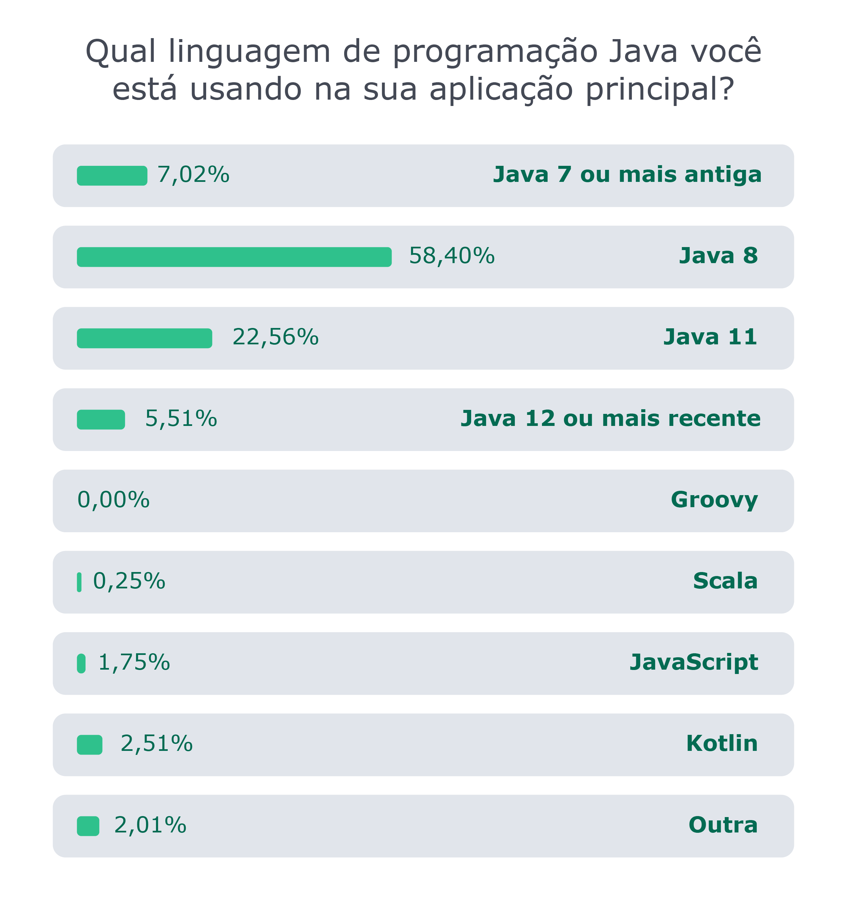
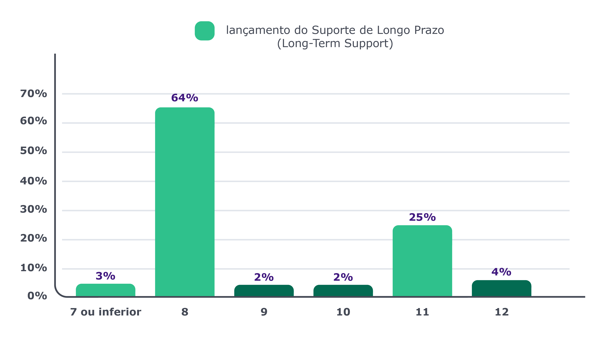
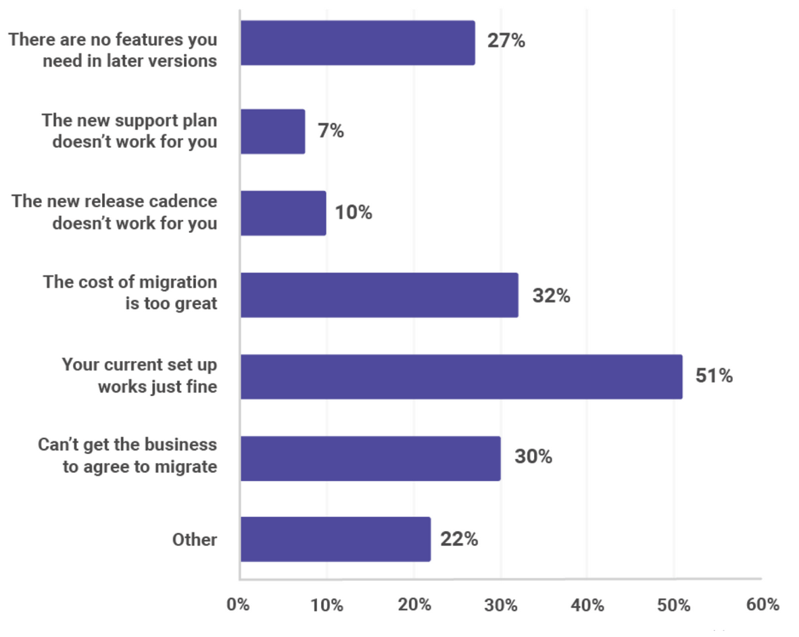

# Precisamos falar sobre atualizações {#chapter_09}

Não vou mentir pra você: quando ouvi falar que o Java seria atualizado a cada seis meses, pensei comigo: "xiiiii… esse negócio não vai dar certo".

Oras, e por quê? Por alguns motivos (seis, para ser mais exato):

1. Se olharmos a plataforma Java apenas do ponto de vista de código fonte, já veremos que se trata de um projeto absolutamente gigantesco, que vem sendo evoluído há 25 anos e que, durante esse tempo, passou por mudanças da própria computação em si (vide os casos de cloud e containers, só para citar dois exemplos rápidos);
2. Milhões de linhas de código, milhares e milhares de classes, um "buzilhão" de coisas que dependem de outras tantas;
3. Cada feature deriva de uma JSR, que não raro está debaixo de um projeto "guarda-chuva". Em cada uma dessas partes, muitas vezes, há pessoas diferentes trabalhando, e ritmos diferentes de evolução dos projetos;
4. Tudo o que acontece dentro da plataforma é regulado pelo JCP, que não é famoso pela sua velocidade;
5. O ecossistema de ferramentas e frameworks em torno do Java é um dos maiores do mundo (se não for o maior). Alguns open source, outros proprietários. E todos totalmente dependentes do ritmo de evolução da plataforma;
6. E, finalmente, os(as) usuários(as), que normalmente são desenvolvedores(as) que trabalham em empresas. Sem dúvida, são as pessoas mais impactadas por qualquer questão referente a ciclo de atualizações, já que são a ponta dessa cadeia de interesse.

Eu poderia acrescentar mais itens a essa lista, mas creio que ela já é suficiente para justificar o meu ceticismo inicial.

Mas hoje cá estamos nós e… não é que eles conseguiram? Sim, hoje temos novidades no Java a cada seis meses! E não apenas funcionou, como está indo bem. Bem demais!

Nas próximas linhas vamos conversar sobre implicações e desafios específicos que esse novo ciclo ajuda a resolver e que também serviram de inspiração para que ele fosse adotado.

## Com que frequência você entrega alguma coisa para seu (sua) usuário (a)?

Se você já leu/ouviu/estudou alguma coisa sobre DevOps, talvez já tenha passado por algo parecido com essa pergunta.

Só para entendermos rapidamente o princípio aqui envolvido: suponha que você entrega uma versão/atualização de algum software para o(a) usuário(a) final uma vez ao ano.

Ou seja, você e sua equipe trabalharam um ano inteiro para criar uma versão nova. Codificaram muito, mexeram no banco, alteraram configurações, atualizaram telas e tantas outras coisas que podem ser feitas de acordo com cada tipo de aplicação.

Agora vamos olhar para as implicações desse cenário:

1. Você descarregou um ano de trabalho no colo de seu(sua) usuário(a). Claro que você pode tornar essa experiência o menos dolorosa possível. Mas ainda assim vai doer;
2. Você publicou uma massa imensa de alterações. Se ocorrer um bug, a sua superfície de busca/debug é gigantesca;
3. Você tinha alterações/melhorias simples, pequenas, que já estavam prontas desde o primeiro mês, mas que tiveram que esperar "a grande release" para chegarem até seu(sua) usuário(a).

E, vamos lembrar, estamos falando de um ano. Imagine se você fizer isso a cada dois anos? Ou a cada três anos? 

Bom, era mais ou menos isso que estava acontecendo com o Java. Normalmente levava-se de dois a três anos para uma nova versão. Aliás, chegamos a incríveis (quase) cinco anos entre a versão 1.6 e a 1.7.

Agora vamos pensar na situação oposta, em que você entrega com uma frequência cada vez maior. O que acontece?

1. Você entrega menos coisas para seu(sua) usuário(a) de uma vez só. É mais fácil ele(a) absorver as mudanças. É mais fácil fazer seu treinamento. Ele(a) vai ter uma maior percepção daquela pequena melhoria fantástica que se perderia no meio de uma release maior;
2. Se um bug ocorrer, você tem muito menos lugares para procurar. E, como tem menos código entregue, a chance de ter erros também é menor. Tem gente que até prefere nunca entregar nada, assim nunca dá erro…;
3. As melhorias chegarão às mãos de seus(suas) usuários(as) em um tempo muito menor. Você vai deixá-los(as) mais feliz com uma frequência maior. Ponto pra você!

Foi exatamente o que ocorreu com a plataforma Java. Eles passaram de um período aproximado de três anos entre as releases para outro de seis meses. É uma frequência seis vezes maior.

Só para te dar uma ideia, o JDK 9 teve noventa e um itens em sua release, enquanto o JDK 14 teve apenas dezesseis. Olhe para os três itens que mencionei acima e veja-os materializados na linguagem mais utilizada no mundo.

## Os problemas de não atualizar a versão de JVM

A empresa JRebel publicou no ano de 2020 os resultados de uma pesquisa realizada com centenas de profissionais ao redor do mundo. Veja abaixo um dos resultados específicos em relação às versões de Java:

*Fonte: <https://www.jrebel.com/blog/2020-java-technology-report>*

Outra pesquisa interessante também, publicada em 2020 pela Snyk, trouxe os seguintes resultados:

*Fonte: <https://snyk.io/blog/developers-dont-want-to-leave-java-8-as-64-hold-firm-on-their-preferred-release/>*

Tirando apenas a média dessas duas pesquisas, já temos cerca de 60% dos desenvolvedores Java ainda na versão 8. E há pesquisas por aí que dizem que esse número pode ser ainda maior, chegando a algo em torno de 80%.

Considerando que o Java 8 foi lançado em 2014 e que já temos uma outra LTS (Java 11) desde 2018, deveríamos fazer no mínimo duas perguntas, para as quais já elenco as devidas respostas.

### Por que o mercado ainda está no JDK 8?

Vamos encarar a realidade: o mercado, principalmente quando se fala em aplicações enterprise, não anda na mesma velocidade que todos nós gostaríamos.

E por que isso? Eu diria que os principais motivos estão claramente listados na mesma pesquisa da Snyk já mencionada acima:

*Fonte: <https://snyk.io/blog/developers-dont-want-to-leave-java-8-as-64-hold-firm-on-their-preferred-release/>*

Esse resultado, aliás, não deveria surpreender ninguém. Os principais motivos que fazem profissionais e empresas ao redor do mundo não terem essa ânsia pelas últimas atualizações são:

1. A versão atual funciona (o famoso "em time que está ganhando não se mexe");
2. O custo de migração é muito alto;
3. A área de negócios não concorda com a migração.

Eu diria que o item 3 é devido ao item 1. Ou seja, a área de negócios não concorda com a migração exatamente porque a versão atual funciona.

Precisamos ter em mente uma realidade de forma clara: projetos em ambiente corporativo são resultado dos acordos feitos a partir de diferentes interesses. 

Atualização de versão (por qualquer motivo que seja) significa risco de erros e indisponibilidade. A área de negócios não quer isso, assim como a área de operações.

No caso do item 2 (custo de migração elevado), ele também é perfeitamente justificável. Afinal, sempre que pensar em mudar a versão de uma JVM, você terá que:

1. Fazer o build do código atual na versão nova (muitos já desistem aqui);
2. Fazer todos os ajustes de código necessários para funcionar na versão nova;
3. Fazer todos os testes necessários para garantir que nenhum erro foi adicionado na aplicação pela pura troca de versão de JVM (e, nessas horas, testes unitários serão seu melhor amigo);
4. Atualizar as ferramentas do seu ecossistema que dependiam da versão anterior;
5. Garantir que a nova versão do Java estará instalada e configurada em todos os ambientes em que sua aplicação rodar (container ou VMs);
6. Se chegar até aqui, provavelmente já terá boa segurança pra migrar.

E, no caso da migração do Java 8 para versões mais atuais, temos ainda um "pequeno" detalhe pelo caminho: o Java 9.

Sim, Java tem retrocompatibilidade. Sim, um código feito em Java 1.2 deveria funcionar no Java 14. Mas também é verdade que o Java 9 introduziu mudanças brutais na plataforma que, sim, quebraram muito projeto por aí.

Em linhas bem gerais, a modularização lançada no JDK 9 (projeto Jigsaw) trouxe não apenas a possibilidade de você modularizar a sua aplicação internamente, mas a própria plataforma em si foi modularizada. Então a forma como o seu projeto lida com a plataforma Java mudou, e o resultado disso para muitos projetos acabou inviabilizando a saída destes da versão 8.

Aliás, existe um artigo fantástico da Trisha Gee falando sobre como migrar seu projeto para o JDK 9 (caso ainda esteja em versões anteriores). Além de útil para a migração em si (claro!), ele ainda vai te dar uma ideia de alguns problemas que podem ocorrer durante o processo. Está aqui: <https://www.infoq.com/br/articles/Java-Jigsaw-Migration-Guide/>

Por todos esses motivos, é de certa forma compreensível que o mercado ainda esteja em sua maior parte "preso" ao Java 8. 

Aliás, de certa forma é até irônico ver que muita gente reclamava que o Java demorava para receber novas atualizações, e agora boa parte dessas pessoas não consegue acompanhar o ritmo de inovações da plataforma.

Porém, se por um lado é compreensível que se pense duzentas vezes antes de migrar para uma nova JVM, é também verdade que ficar parado no tempo tem suas implicações técnicas.

### Quais os impactos de não atualizar para as últimas versões?

Há motivos para que se lancem novas versões de qualquer software: corrigir erros, melhorar funcionalidades, criar outras novas, ou mesmo introduzir tendências que surgem no mercado de tecnologia.

Com a plataforma Java não é diferente. Ela não é atualizada, evoluída e modernizada "por esporte". Logo, se há motivos técnicos que justificam sua atualização, os(as) bons(as) arquitetos(as), desenvolvedores(as) e engenheiros(as) do mercado devem prestar atenção a isso.

Vamos imaginar que você é um(a) profissional que trabalha em uma aplicação Java que está usando o JDK 8. Vamos supor que, nesse nosso ambiente imaginário, não há interesse em atualizar o Java para as versões mais recentes (mesmo que seja a versão 11, que é a versão LTS - Long Term Support - mais recente em 2020). Vamos olhar alguns poucos e importantes itens que você está perdendo:

* Com a modularização do JDK 9, surgiu também o jlink, que permite que você, de certa forma, gere o seu próprio JRE. Ou seja, você consegue gerar a sua aplicação utilizando estritamente as dependências necessárias. Em um mundo cada vez mais ligado aos containers, é possível gerar imagens até 70% menores utilizando jlink;
* Falando em containers, até o JDK 8, a plataforma Java não tinha sido concebida para lidar com restrições de memória do processo onde a JVM está rodando (que, no caso dos containers, derivou do cgroups - algo que já existe em sistemas UNIX há décadas). Ou seja, um container rodando até a versão do JDK 8 poderia alocar memória indefinidamente, até que ocupasse todos os recursos disponibilizados para o daemon, o que exigiu que muitos fizessem workarounds (= gambiarras) para evitar maiores problemas. Desde o JDK 9 (vide este artigo <https://www.infoq.com/br/news/2017/03/java-memory-limit-container/>), a cada nova release temos alguma melhoria com relação à gestão de consumo de recursos da plataforma. Hoje podemos dizer que Java é extremamente performático, eficiente e viável para uso com containers;
* A partir do JDK 10, o compilador JIT do Graal VM está disponível em qualquer distribuição de Java. Ele é em média 13% mais rápido que o JIT padrão, e tem evoluído rapidamente;
* No JDK 9, o G1 passou a ser o Garbage Collector default da plataforma, o que traz ganhos substanciais de performance se você simplesmente mudar a JVM (sem tocar no seu código);
* Falando em Garbage Collector, você poderia (quem sabe?) estar avaliando o uso do Shenandoah, um Garbage Collector chamado de "low-pause-time", ou seja, que faz a sua coleta praticamente sem gerar overhead na sua JVM.

{pagebreak}

Poderíamos escrever outro livro só listando coisas que as aplicações rodando em uma JVM na versão 8 estão "perdendo". E veja que nem foram mencionadas aqui questões de segurança, que é algo crítico em qualquer ambiente corporativo.

É claro, tudo é uma questão de balancear interesses e necessidades. Mas, sem dúvida, planejar se manter atualizado ao menos com as versões LTS é algo que deveria estar nos seus planos e nos planos da sua organização.

## Utilidade versus Hype

Há um tempo atrás eu estive em uma grande empresa brasileira para falarmos sobre seu desejo de migrar para uma arquitetura de microservices. Após conversarmos algumas amenidades, fiz a pergunta de um milhão de deploys: por que vocês querem usar microservices?

E a resposta, claro, não poderia ser diferente: _porque o nosso chefe viu num evento e mandou a gente fazer_.

Isso acontece milhares e milhares de vezes ao redor do mundo, diariamente. Empresas e profissionais adotam tecnologias, padrões, abordagens e linguagens sem ao menos saber do que se trata, para que serve, que problemas aquilo resolve e se ao menos elas têm esses problemas. Apenas porque alguém disse que é legal, é novo, é batuta.

Não seja esse(a) profissional! Cada vez que você faz isso, um pod morre em algum cluster de Kubernetes por aí. Ajude a salvar os pods…

O que um(a) bom(a) arquiteto(a) deveria fazer, então? 

Ter equilíbrio. Como em tudo na vida.

Cada dia tem uma nova bala de prata por aí, algo que vai resolver todos os problemas, que você pode utilizar em todos os projetos. É a fórmula do fracasso.

E daí vem o outro extremo: há quem não preste atenção em novidade alguma, não experimenta nada, não faz uma POC sequer para ver a aplicação de alguma nova tendência. Tudo em nome de evitar a hype. Mais gente matando pods por aí.

De novo, equilíbrio.

A hype em si não é ruim. Tudo o que está consolidado hoje foi hype um dia. O primeiro JavaOne teve mais de seis mil participantes e foi realizado apenas um ano após o lançamento da primeira versão. Era hype! 

O segredo é usar a hype a seu favor. Tirar proveito dela.

Como? Veja, tenho algumas sugestões:

1. Quando algo está na moda, tem muita gente falando. Tem muito material sendo criado. Muita palestra sendo dada. Todo esse material de referência é um tesouro de valor inestimável para quem quer saber de fato o que está acontecendo;
2. Quando tem muita gente tentando algo novo, tem muita gente enfrentando erros, dificuldades, vendo coisas que não funcionam. É aqui que profissionais inteligentes mais tiram proveito: aprendendo com os erros dos outros;
3. Se houver muitos relatos de sucesso sobre uma determinada hype, preste atenção aos cenários onde esses sucessos ocorreram. São parecidos com o seu? Resolvem algum problema que você tem? Se não se aplicam hoje, podem se aplicar a algo que você estava planejando para o futuro;
4. Junte tudo isso (material coletado, casos de fracasso e casos de sucesso) e faça sua própria análise. Analise também junto com colegas de trabalho. Façam simulações e provas de conceito. Discutam, criem conteúdo sobre o assunto.

Se você seguir esses passos, dificilmente será iludido pela próxima hype que surgir. E se ela se provar mais do que uma nova "modinha", quem sabe você não sairá na frente como um case de sucesso?