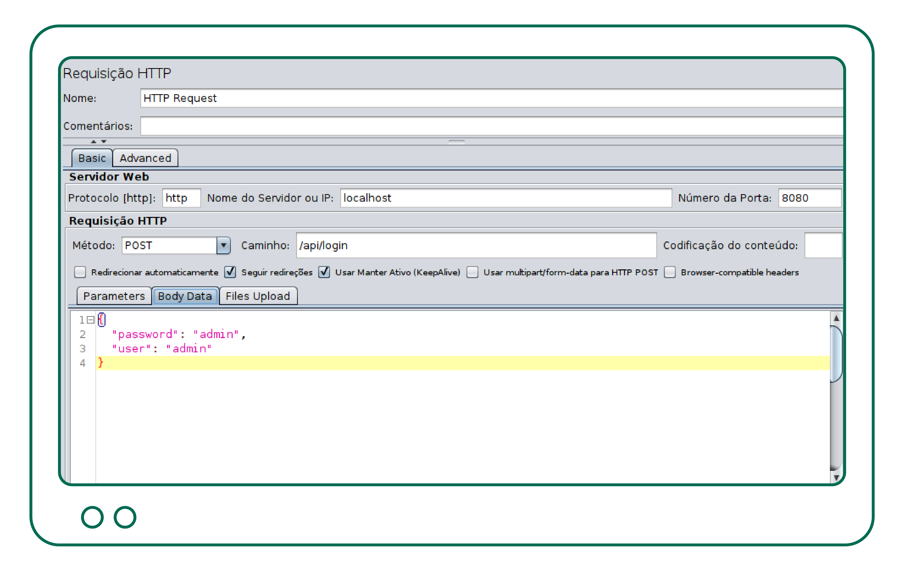
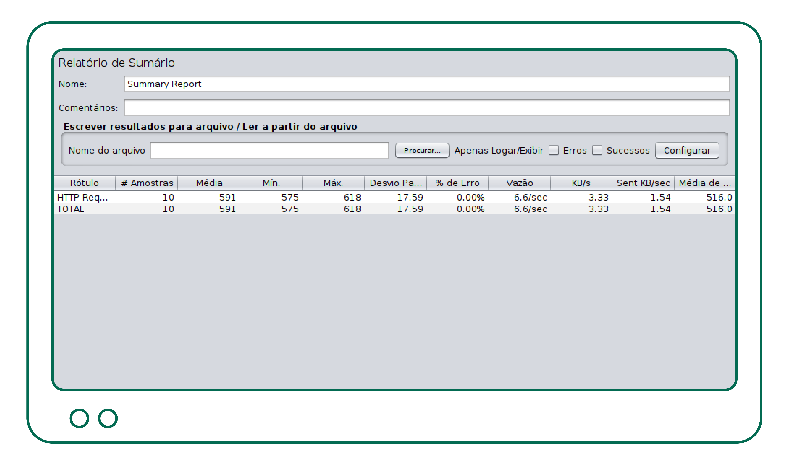
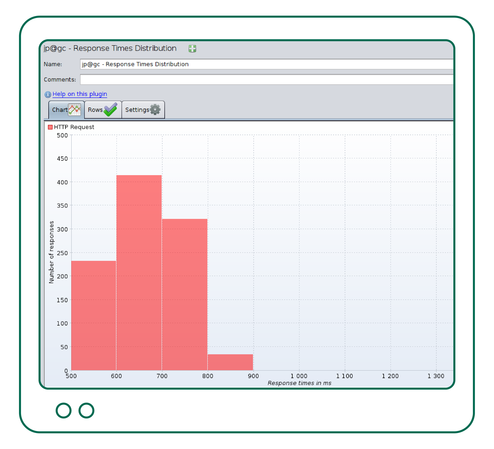
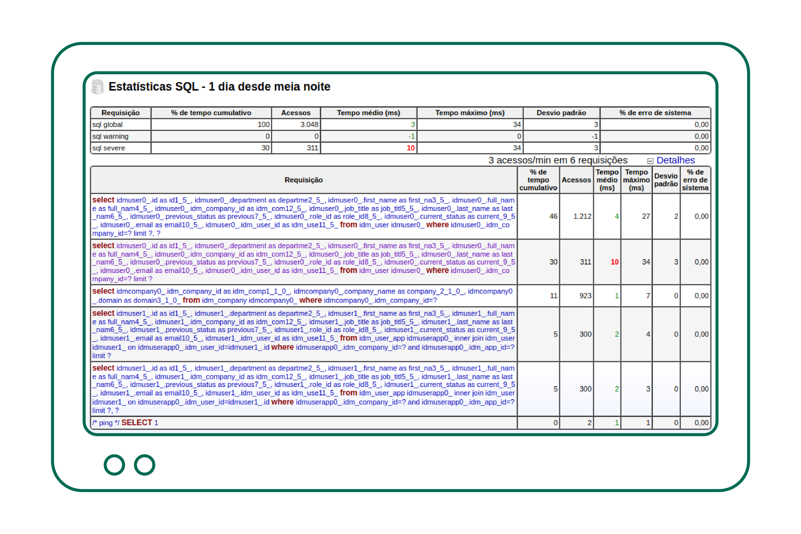
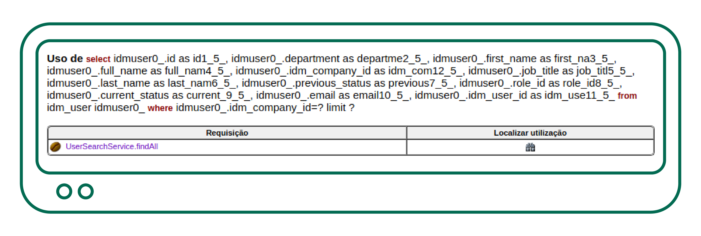
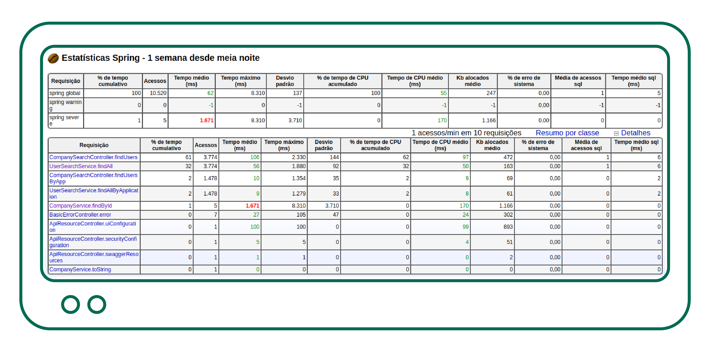
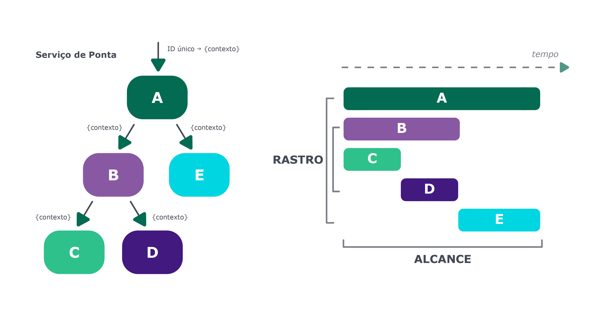

# Destrinchando performance de aplicações {#chapter_10}

## Introdução e conceitos

Muitas empresas utilizam a abordagem "deixe o desempenho para depois" para tratar com possíveis problemas de performance que possam ocorrer no ambiente de produção para a fase de testes. Na fase de testes, é provável que não se leve em consideração a carga que a aplicação possa sofrer e o tempo de resposta esperado, pois isso não foi especificado nos requisitos não funcionais - requisitos como o tempo de resposta de uma determinada operação ou a quantidade de acessos simultâneos. Além disso, temos o desafio de conciliar uma arquitetura evolutiva juntamente com a engenharia de desempenho ou performance. Na arquitetura evolutiva, temos que ser ágeis e permitir constantes melhorias na arquitetura, deixando as decisões para última hora, enquanto a engenharia de desempenho se preocupa em identificar possíveis gargalos e definir as tecnologias utilizadas já no início do projeto.

Antes de irmos mais a fundo, vamos rever alguns conceitos importantes sobre desempenho de aplicações.

**Throughput**: É a vazão ou taxa de transferência que sua aplicação consegue dar às requisições. Número de requisições por segundo/minuto ou hora. Quanto maior esse número, melhor. Geralmente, nas ferramentas de teste de carga, o Throughput é medido da seguinte forma: Throughput = (número de requisições) / (tempo total).

**Latência**: É o tempo que leva para um pacote de dados ir de um ponto a outro. Ao contrário do Throughput, quanto maior a latência, pior a performance. Em sistemas distribuídos, este pode ser um grande problema.

Sistemas de alta performance têm como requisitos alta confiabilidade, baixa latência e alta taxa de vazão. Isso parece comum para quem vai desenvolver um serviço, porém não é uma tarefa das mais fáceis manter e melhorar a performance à medida que o sistema vai sendo utilizado, porque novas funcionalidades são adicionadas, a base de dados cresce.

## Agilidade versus Performance

Se a performance é a prioridade no projeto, considere verificar as dependências que está utilizando ou que irá utilizar. Ao utilizar uma biblioteca para substituir alguma parte de código, podemos ter a sensação de que estamos produzindo menos código, código limpo. Quanto menos código, menos bugs, certo? Nem sempre essa afirmação é correta. Você pode estar utilizando uma biblioteca que possui bugs também. Muitas pessoas desenvolvedoras acabam não acompanhando a evolução da linguagem e ficam "amarradas" a certas bibliotecas que utilizavam em versões passadas e que, na nova versão da linguagem, não se fazem mais necessárias. Bibliotecas podem trazer agilidade no desenvolvimento, mas será que elas degradam a performance ou deixam sua aplicação mais pesada? Avalie os prós e os contras de cada dependência que irá utilizar no projeto. Entenda o seu funcionamento e busque pelo histórico de bugs e vulnerabilidades.

### Verifique o que está carregando na bagagem

Em um projeto Java utilizando o Maven, por exemplo, podemos verificar a árvore de dependências utilizando o comando `mvn dependency:tree`, e ainda podemos filtrar somente por dependências de compilação, ex: `mvn dependency:tree -Dscope=compile`. 

``` asciidoc
 [INFO] --- maven-dependency-plugin:2.8:tree (default-cli) @ testcontainers ---
 [INFO] com.testcontainers:jar:1.0-SNAPSHOT
 [INFO] \- mysql:mysql-connector-java:jar:5.1.47:compile`
```

É muito comum desenvolvermos serviços que são empacotados em um arquivo jar conhecido como _fatjar_, em que todas as dependências são colocadas dentro do jar. Em muitos casos você não precisará daquela dependência para rodar o seu serviço. Ela pode ser uma dependência de teste, ou estar provida por um servidor de aplicações. Então é sempre uma boa ideia verificar as dependências do seu projeto.

Cuidado com a performance também quer dizer, em muitos casos, implementar mais código em vez de utilizar alguma biblioteca que facilita o trabalho e acelera o desenvolvimento, o que pode lhe custar a performance lá na frente.     

## Como medir a performance? 

Existem muitas formas de medir a performance da aplicação, seja com um monitoramento em tempo real, seja com um teste de ‘stress’ antes de liberar uma funcionalidade em produção. Tudo vai depender do requisito não funcional solicitado. É claro que todo(a) usuário(a) quer ter sempre a resposta o mais rápido possível. Mas qual o limite aceitável? Essa é a medida que se deve ter em mente até mesmo antes de iniciar a codificação. Por exemplo: o tempo de login não pode ser superior a um segundo. Como posso medir isso?
Lembrando que não é simplesmente colocar que o 'login precisa ser feito em menos de um segundo'. Deve-se avaliar em quais circunstâncias esse login pode ou não demorar mais. Até onde o sistema de login pode escalar. Uma boa diretriz de média seria dizer: o tempo de resposta do login é de 1 segundo para 500 solicitações simultâneas, com uma carga de CPU de 60% e uma utilização de memória de 80%.

### Capturando o tempo da requisição

Neste capítulo, vamos utilizar a ferramenta [jMeter](https://jmeter.apache.org/), muito utilizada para criar diversos tipos de teste de carga e medir o desempenho. O objetivo aqui não é ser um tutorial do jMeter, mas mostrar como é possível gerar e visualizar dados através dele. Abaixo, um exemplo simples de medição de tempo de login considerando 10 usuários(as):



{pagebreak}

Ao rodar o teste acima, verificamos no Relatório de Sumário os resultados:



Alguns dados importantes neste momento:

**Amostras:** Número de requisições realizadas.

**Média:** Número médio de tempo de todas as requisições.

**Min:** Menor tempo dentre todas as requisições.

**Max:** Maior tempo dentre todas as requisições.

Ainda podemos ter gráficos mais ricos, utilizando o plugin [PerfMon](https://jmeter-plugins.org/wiki/PerfMon/), por exemplo:



No gráfico acima, podemos ver que a maioria das requisições ficou entre 600 e 700 milissegundos em um cenário de testes com 1000 requisições.
Podemos ter gráficos ainda mais bonitos e em tempo real, podendo utilizar o [grafana](https://grafana.com/) como visualizador de gráficos.

Veja que capturamos o tempo total de um processo de login, porém se o login não está em um tempo adequado ou queremos melhorar ainda mais o tempo, precisamos visualizar cada componente em separado. Compreender como um valor é calculado e o que isso significa é essencial para tirar as conclusões corretas. Para esse fim, devemos examinar os métodos estatísticos usados para calcular e agregar dados de desempenho. Nunca utilize somente o valor da **média** para tirar conclusões sobre performance, pois durante um período de 24 horas com  milhares de requisições, os valores de pico serão ocultados pela média.

## Entendendo e separando os componentes

Medimos o tempo total de um login e precisamos melhorar o tempo de resposta. Para isso, precisamos testar separadamente cada componente da arquitetura para descobrir onde podemos diminuir o tempo. É possível que, com apenas uma ferramenta, não se possa medir a performance da sua aplicação. É provável que você utilize uma ferramenta de carga para estressar a aplicação e várias outras para coletar os dados. Como exemplo, podemos ter uma aplicação que tem uma api para o login com acesso ao banco de dados. No entanto, podemos ter cenários bem mais complexos. A imagem abaixo é uma representação da arquitetura para servir milhões de usuários(as):


**Créditos:** <https://github.com/donnemartin/system-design-primer/blob/master/solutions/system_design/scaling_aws/>

No entanto, não foi de primeira que esta arquitetura foi definida. Foram muitos experimentos, testes e medições para chegar a uma arquitetura escalável. Deve ser possível medir a performance da réplica de leitura do banco de dados MySQL separadamente, por exemplo.

## Monitorando a performance por componente

Conforme demonstrado acima, não é de primeira que se define uma arquitetura para milhões de usuários(as). É necessário estressar e medir para verificar onde estão os pontos que podem sofrer carga. Existem várias opções que mostram onde estão os gargalos da aplicação. Uma das várias opções é o [javamelody](https://github.com/javamelody), que pode ser utilizado em modo standalone junto com a sua aplicação Java, é free e muito simples de colocar na aplicação.



Na imagem acima, podemos notar que uma das consultas SQL demorou, em média, mais que o normal em relação a outras. Podemos descobrir de onde veio esse comando SQL, como também executar o comando SQL em modo 'Explain', a fim de revelar que a query está fazendo um 'full scan' e que será preciso ajustar a query ou criar índices específicos na tabela.



No outro exemplo abaixo, podemos ver um desvio bem grande no método 'findById', que, por sua vez, não utiliza um banco de dados MySQL, mas sim uma outra fonte de dados externo. Com essas informações em mãos, já é possível analisar de modo isolado cada comportamento.



Existem muitas ferramentas de monitoramento, e o que fica aqui como exemplo é que, em alguns casos, você vai precisar ir no detalhe e fazer algum ajuste fino na infraestrutura, ou até mesmo no código.

## Monitorando a performance em sistemas distribuídos

Sistemas distribuídos, atualmente mais populares com a utilização de microsserviços, são complexos e difíceis de monitorar a performance. Nesse caso, vamos precisar de mecanismos mais sofisticados, como a utilização de um 'tracing' distribuído por exemplo. Aqui também existem várias soluções, como os famosos APMs, tais como o New Relic, AppDynamics, DataDog e Dynatrace. Vale lembrar que muitos provedores de cloud fornecem ferramentas de análise de performance, tal como o AWS Performance Insights.
No mundo OpenSource, vale destacar a ferramenta [Jaeger Tracing](https://www.jaegertracing.io/), cuja especialidade é fazer o monitoramento de serviços distribuídos rodando em uma infraestrutura do Kubernetes, por exemplo.



Podemos observar em qual dos serviços o tempo de resposta não está adequado e tomar as devidas ações.

## Mapeamento Objeto Relacional

No mundo Java, utilizamos o JPA para trabalhar com a camada de persistência em bancos de dados relacionais. Neste tópico, abordaremos algumas boas práticas para obtermos uma boa performance na utilização desse padrão.

### Estratégia de geração de IDs

O gerador de identificador TABLE é muito ineficiente. Ele é mais genérico e portável para a maioria dos bancos de dados, porém requer uma transação de banco de dados separada, como também uma conexão separada para garantir que o processo de geração do identificador não esteja vinculado à transação que iniciou. Emprega o uso de bloqueios no nível de linha que são pesados em comparação com as usadas pelas estratégias de geração de identificador como IDENTITY ou SEQUENCE.
Portanto, se o banco de dados suportar sequences, é muito mais eficiente usar a estratégia SEQUENCE.

### Enums

Geralmente mapeamos **Enums** como String para facilitar a leitura no banco de dados ou exibir diretamente o literal do enum. 

```java
@Enumerated(EnumType.STRING)
@Column(length = 9)
private TipoTelefoneEnum tipo;

public enum TipoTelefoneEnum {
    CASA,
    COMERCIAL,
    CELULAR;
}
```
Por mais legível que isso possa ser para a pessoa desenvolvedora, essa coluna ocupa muito mais espaço do que o necessário. Nesse caso, a coluna de tipo ocupa 9 bytes. Se armazenarmos 10 milhões de registros, apenas a coluna tipo de telefone ocupará 90 MB.

#### Mapeando como inteiro

Observe que a coluna @Enumerated não precisa receber o valor ORDINAL EnumType, pois é usado por padrão. Também estamos usando o tipo de coluna número inteiro smallint, pois é improvável que precisemos de mais de 2 bytes para armazenar todos os valores do tipo Enum.

```java
@Enumerated
@Column(columnDefinition = "smallint")
private TipoTelefoneEnum tipo;
```

O valor será armazenado como inteiro, iniciando com zero para o tipo CASA. Agora, isso é muito mais eficiente, mas menos expressivo. Então, como podemos ter desempenho e legibilidade?

Basta criarmos uma tabela no banco de dados representando o enum e, na consulta, fazer o join com a tabela de constantes.
Parece trabalhoso? Mas pode valer a pena, se tivermos milhões de registros.

É claro que existem os contras dessa solução. Se o enum for alterado, mudado de ordem ou acrescido de novos valores, os registros da base de dados terão que ser ajustados também.

Portanto, é tudo uma questão de escolha! Então, escolha sabiamente.

### Outras medidas de melhoria

Muitas outras medidas de performance podem ser adotadas ou verificadas no seu código. Abaixo, alguns materiais, em inglês, para auxiliar:

[Associação unidirecional ou bidirecional](https://vladmihalcea.com/the-best-way-to-map-a-onetoone-relationship-with-jpa-and-hibernate/)

[Problema de consulta N + 1](https://vladmihalcea.com/how-to-detect-the-n-plus-one-query-problem-during-testing/)

**Referências:** <https://vladmihalcea.com/tutorials/hibernate/>

## Conclusão

Não tente resolver todos os problemas ao mesmo tempo. Comece construindo uma lista dos cinco principais contribuidores da hora e da queima da CPU, memória ou IO e explore soluções. Ataque um dos problemas e reavalie a arquitetura. Abaixo, algumas etapas que podem ajudar a encontrar e solucionar um problema de performance.

**Descobrir:** Por que este ponto está com baixa performance?

**Entender:** O que está causando a baixa performance?

**Corrigir ou Melhorar:** Oportunidade de corrigir ou melhorar com base nos dados obtidos nas etapas acima.

{pagebreak}

