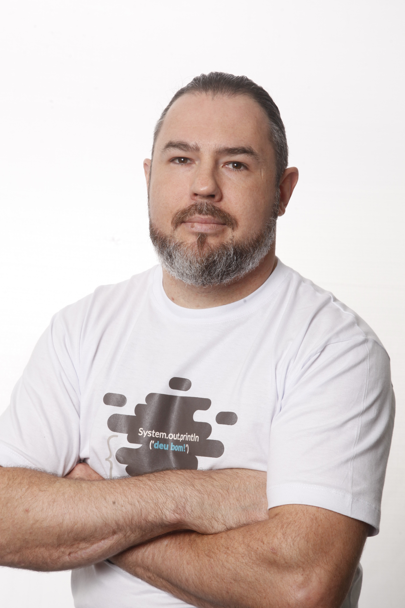

# About ME

* **Nome**: Otavio Santana
* **Cargo**: Staff Engineer
* **Bio:** Capacitando pessoas desenvolvedoras em todo o mundo a entregar softwares melhores, com mais rapidez e escalabilidade na nuvem. Otavio é um engenheiro de software apaixonado por foco em nuvem e tecnologia Java. Ele tem experiência principalmente em aplicações de persistência poliglotas e de alto desempenho em finanças, mídia social e e-commerce. Otavio é membro de Grupos de Especialistas e Líder Especialista em vários comitês executivos JCP e JSRs. Ele está trabalhando em vários projetos da Apache e Eclipse Foundation, como Apache Tamaya, MicroProfile, Jakarta EE, onde está liderando a primeira especificação em Jakarta EE com Jakarta NoSQL. Líder do JUG e palestrante global nas conferências JavaOne e Devoxx, Otavio recebeu reconhecimento por suas contribuições para OSS, como o JCP Outstanding Award, membro do ano e JSR inovador, Duke’s Choice Award e Java Champion Award, para citar alguns.

* **Nome**: Sérgio Lopes
* **Cargo**: Especialista em TI no Banco Itaú S/A
* **Bio:** Desenvolvedor C++, desenvolvedor Java, engenheiro de software, especialista em TI em back-end. Trabalhando em um dos mais robustos Internet Bankings da América Latina. Atuando na criação do framework de desenvolvimento chamado *Universal*, que é o sistema central do Internet Banking Itaú desde 2001 e até os dias de hoje ainda em operação, trabalhando no desenvolvimento de ferramentas de suporte para esse framework, suas especificações e sua manutenção, em C/C++.
Desenvolvimento do Framework Java, que veio substituir o framework *Universal*, atuando nele desde 2014. Criação de mecanismos de coexistência entre o legado e este novo Framework, responsável por atender às necessidades transversais dos canais digitais, fornecendo ferramentas e serviços para acelerar o trabalho de outros engenheiros.
Trabalhando com tecnologias como: JAVA, Spring Framework, Spring Boot, Docker, Windows/Linux, SQL, JavaScript, Hibernate, Application Server: JBoss EAP.6.X, Testes automatizados com (JUnit4, DBUnit, JMock, Mockito). Eclipse IDE, Maven, Git, Jenkins. Nexus, C++, Visual Studio, Artifactory, Sonar.

* **Nome:** Karina Varela
* **Cargo:** Gerente Técnico Sênior de Marketing de Produtos, Red Hat
* **Bio:** Karina M. Varela tem experiência de mais de dez anos em TI, trabalhando em funções como desenvolvedora de aplicações, arquiteta de software, consultora, líder de tecnologia e gerenciamento de marketing de produto. Com uma sólida formação em desenvolvimento de software, ela tem experiência profissional em planejamento, arquitetura, entrega e solução de problemas de software crítico em ambientes empresariais de diferentes setores ao redor do mundo.
A partir de 2020, Karina está trabalhando com a Unidade de Negócios de Serviços de Aplicativos da Red Hat como Gerente de Marketing Técnico, especialista no assunto de Automação de Negócios. Ela é membro da comunidade SouJava, tem paixão por ajudar as comunidades e gosta especialmente de projetos e iniciativas de código aberto. Outro hobby é falar em conferências e já palestrou em conferências como Campus Party, TDC e Women Who Code.

* **Nome:** Mauricio Salatino (Salaboy)
* **Cargo:** Engenheiro de Software
* **Bio:** Mauricio é engenheiro de software na Camunda (http://www.camunda.com) e instrutor na LearnK8s (http://learnk8s.io). Trabalha com o Kubernetes há cinco anos, treinando equipes e desenvolvendo aplicações nativas da nuvem. Em sua jornada, participou de vários projetos de código aberto, incluindo Zeebe, Jhipster, Spring Cloud e Jenkins X. Anteriormente, Mauricio trabalhou na Red Hat/JBoss, no departamento de Engenharia de Automação de Negócios. Apresentou-se na Kubecon 2019 San Diego e na Kubecon 2020 Amsterdam. Está atualmente envolvido com a CD Foundation (http://cd.foundation) e com o projeto Jenkins X (como membro do comitê de direção de bootstrap). 

* **Nome:** Elder Moraes
* **Cargo:** Developer Advocate, Red Hat
* **Bio:** Elder ajuda pessoas desenvolvedoras Java a trabalhar em grandes projetos, orientando-os(as) sobre como construir e entregar aplicações seguras, disponíveis e rápidas do lado do servidor. Ele é o autor do Jakarta EE Cookbook e membro do conselho do SouJava, um dos maiores JUGs do mundo. Como defensor do desenvolvedor, ele compartilha experiências e melhores práticas por meio de conteúdo online e em eventos internacionais como JavaOne, The Developers Conference, QCon, Oracle Code One, Campus Party e Devnexus.

* **Nome:** Sandro Giacomozzi
* **Cargo:** Engenheiro de Software, TOTVS
* **Bio:** Sandro ajuda pessoas desenvolvedoras Java que trabalham em aplicações corporativas a se tornarem especialistas em Java e DevOps, praticando as habilidades certas. Voluntário e palestrante. Seu objetivo na indústria de software é tornar as organizações e as pessoas mais ágeis por meio de processos e ferramentas. Entregas mais rápidas, eficientes e de qualidade. Pessoas e tecnologia alinhadas à satisfação e entrega ao cliente.

* **Nome:** Francisco Isidro
* **Cargo:** * Professor, Pesquisador da Universidade Federal do ABC
* **Bio:** Professor Isidro é professor de Ciência da Computação e pesquisador com foco em Ensino de Fundamentos de Programação, Desenvolvimento de *Game Engines* e Computação em Nuvem. Isidro mantém um canal no Youtube que oferece conteúdo gratuito sobre Estruturas de Dados, Sistemas Operacionais, Desenvolvimento Web, Jogos e outros assuntos para todos os profissionais e estudantes que desejam aprimorar seus conhecimentos e entender os fundamentos da Ciência da Computação e Desenvolvimento de Software. Palestrante na Campus Party, The Developer's Conference, QCon e outras conferências, Isidro está sempre ajudando as comunidades de desenvolvedores oferecendo conteúdo técnico e orientação profissional. 