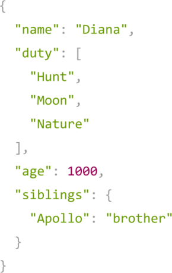
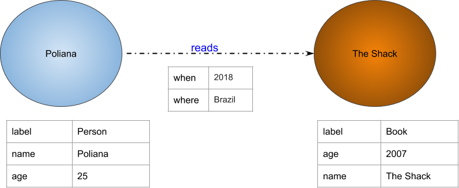
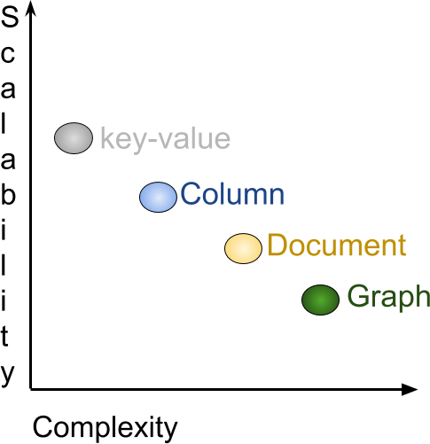
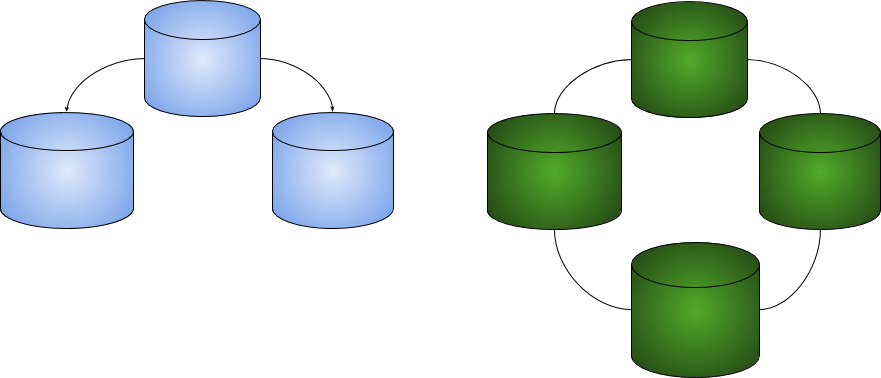

# NoSQL vs. SQL

Often, when we start a debate on SQL (Structured Query Language) and NoSQL in the technical environment, we can already expect heated discussions because an idea of a war, a dispute, etc., that needs to be won by these technologies' users exists. We want to make it clear: there is no war! Let’s debunk that?

To begin with, we need to talk a little bit about history. Consequently, we will comprehend the details about NoSQL and its differences from SQL.

In the world of technology, we always create a solution to solve a specific problem. Let's go back more than forty years ago, to understand the existing situation in the context of databases:

- In order to be used later, the data produced by the computers had to be stored and could not be lost when the machines were turned off.

Nevertheless, at that time, storage technology was in its infancy, and hard drives were rather expensive. It was then necessary to structure and normalize the data that would be recorded on those drives. By adopting this practice, the stored data would utilize less space and, consequently, bring better use of resources, generating savings or the possibility of storing a greater amount of data in the same space.

That was the context in which relational databases were created, including implementing all concepts detailed in the previous chapter, such as normal forms and well-defined data structure.

Time has passed, our technology has evolved and, therefore, another problem has arisen: we produce data in a considerable quantity, often in an unstructured and decentralized way with increasingly distributed systems.

**TIP:** _This data is called *unstructured* because it comes from several sources, such as IoT sensors (_Internet of Things_, i.e., refrigerators connected to the internet, smartwatches, and autonomous cars), non-cataloged images and documents, among other examples._

Structuring, i.e., organizing data from sources like these was (and is) possible but would require a lot of time. This extra time would impact the software development and delivery process and consequently led companies to lose the time to market for the solution being created. This problem needed to be solved, and, thus, NoSQL databases were born!

The term **NoSQL** was created in 1998 by Carlo Strozzi and later re-introduced by Eric Evans in 2009 when the latter participated in the organization of an event to discuss **open-source** and **distributed** databases. And speaking of distributed databases, this is a concept widely used by NoSQL databases: basically, NoSQL databases operate in distributed computing, which represents a significant gain of scalability and performance.

**TIP:** To understand a little more about distributed computing, we recommend reading more about the paradigm of distributed computing.

## NoSQL

### What does NoSQL mean?

There is no, say, "official" definition for what this term actually means, but I particularly like the following: **N**ot **O**nly **SQL**. This definition emphasizes that these databases may use languages similar to [SQL ANSI](https://en.wikipedia.org/wiki/SQL) to perform queries and other operations and not just SQL itself.

### NoSQL features

When you studied relational databases, you saw that these databases are based on the **ACID** concept (**A**tomicity, **C**onsistency, **I**solation, **D**urability). The vast majority of NoSQL databases are based on another concept: **BASE** (**Ba**se Availability, **S**oft State and **E**ventually Consistent).

Before detailing each point of the **BASE** concept, you need to understand the representation of a term in the database context you will see throughout this chapter: **cluster**. A cluster, in this context, refers to the ability of a set of (database) **servers** or (database) **instances** to connect to a database. An **instance** is a collection of memory and processes that interact with the database, which is the set of physical files that effectively store the data.

We must highlight two main advantages of a cluster, especially in very large database environments:

* **Fault Tolerance**: as there is more than one server or instance for users to connect, the database cluster offers an alternative in case of a server failure. When dealing with thousands of machines in a single [data center](https://en.wikipedia.org/wiki/Data_center), such failures are a present issue;

* **Load Balancing**: the cluster is usually configured to automatically allocate users to the least used server so that the use of the structure available to the database is optimized.

#### The BASE concept in details

- Base Availability - **BA**
    - The database appears to be working all the time. As the cluster concept is implemented, if a server fails, the database will continue functioning due to another server that will supply this failure;

- Soft State - **S**
    - It is not necessary to be consistent all the time. In other words: with a distributed database in several machines and all of them being equally used for writing and reading, it is possible that, at a given moment, a machine receives a writing command and does not have time to "pass on" that command to the other database machines. Thus, if a user accesses the updated machine and another one uses a dated one, the results, which should be the same, will be different. Imagine your **Facebook** _timeline_: it shows your friends' posts, but not all posts are displayed simultaneously
. In this case, what happens is that the information was sent to the database, but not all cluster servers have the same information at the same time. That allows the database to manage more writing information without having to worry about replicating it in the same operation;

- Eventually Consistent - **E**
     - The system will become consistent at some point; in other words, it will eventually become consistent. As we do not have the replicated information "instantly", this concept is responsible for making the database consistent "in its time". That is because, depending on the cluster configurations, this replication may happen more quickly or not. But at some point, the information will be consistent and present on all cluster servers.

Finally, another striking feature of unstructured databases is the absence of the `schema` or `flexible schema` characteristic. This means there is no need to define the data schema in advance. If, on the one hand, this makes adding new attributes more dynamic, on the other, it can impact the integrity of this data. Don't worry: in time, all of these concepts will become much clearer.

---

### NoSQL and its classes

NoSQL databases can be categorized into four types (called **classes** in the database context):

* `Key / Value`
* `Column Family`
* `Document`
* `Graph`

Each class above has a different application, so we must understand each class's characteristics to get the best out of each one and know when to choose them.

#### `Key / Value` Class

Key-value databases have a structure similar to Java's `java.util.Map` class, that is, the *information* (`value`) will be retrieved only by the *key*. This type of database can be used, for example, to manage user sessions. Another example is coupled with a DNS, where the key is the address, for example, `www.google.com`, and the value is the IP of that server.

Currently, there are several key-value database implementations; the most famous are:

* AmazonDynamo
* AmazonS3
* Redis
* Scalaris
* Voldemort

Comparing the relational database with the key-value one, we can list some points of attention. The first is that the key-value structure is quite simple:

| Relational structure | Key-value structure|
| -------------------- | --------------------- |
| Table                | Bucket                |
| Row                  | Key/value pair        |
| Column               | ----                  |
| Relationship         | ----                  |

In this database class, it is impossible to run operations such as `join` between the `buckets`, and the value is composed of a large block of information instead of being subdivided into columns, as in the relational database.

#### `Column Family` Class

This model became popular after the paper [Bigtable: A Distributed Storage System for Structured Data](https://static.googleusercontent.com/media/research.google.com/en//archive/bigtable-osdi06.pdf), created by Google employees, aiming to assemble a distributed data storage system designed to have a high degree of scalability and data volume. Just like the key-value one, to search or retrieve some information within the database, it is necessary to use the field that functions as a unique identifier - similarly to the key in the key-value structure. However, the similarities end there.

In 'Column Family` databases, the information is grouped in columns: an information unit (composed of the name) and the information itself.

These types of databases are essential when dealing with a high degree of data volume and distributing this information among several servers. But it is worth noting that its reading operation is quite limited, similar to the key-value one, since the search for information is defined from a single field or a key. Several databases use that use these structures. We can give as examples:

* Hbase
* Cassandra
* Scylla
* Clouddata
* SimpleDb
* DynamoDB

Among the column family databases, Apache Cassandra is the most famous. Cassandra is certainly a good option if an application needs to deal with a large volume of data and with easy scalability.

By comparing the column family databases with the relational ones, it is possible to notice that the operations, in general, are much faster. It is simpler to work with large volumes of information and servers distributed worldwide; however, this comes at a cost: the reading of this type of database is minimal. For example, it is not possible to join families of columns as in the relational database. The column family one allows you to have an unlimited number of columns, which are composed of name and information, exactly as shown in the following table:

| Relational structure | Column family structure |
| -------------------- | ------------------------------- |
| Table                | Column Family                   |
| Row                  | Column                          |
| Column               | Column name and value          |
| Relationship       | Not supported                 |

#### `Document` Class

Document-oriented databases have a structure very similar to a JSON or XML file. They are composed of many fields, which are created at run time, generating great flexibility both for reading and writing information.

They allow information to be read by fields that are not the key. Some implementations, for example, have a very high integration with search engines, which makes them crucial for data analysis or system logs. Below are some implementations of document databases:

* AmazonSimpleDb
* ApacheCouchdb
* MongoDb
* Riak

From those, the most popular is MongoDB. When comparing with a relational base, although it is possible to search for fields other than the unique identifier, document databases do not have relationship support.

| Relational structure | Document structure |
| -------------------- | ----------------------- |
| Table                | Collection              |
| Row                  | Document                |
| Column               | Key/value pair          |
| Relationship         | --                      |

Another characteristic of document databases is that, in general, they are schemeless.

#### `Graph` Class

The graph database is a data structure that connects a set of vertices through a set of edges. Modern databases in this category support multi-relational graph structures, where there are different types of vertices (representing people, places, items) and different types of edges. The social network recommender systems are the biggest use cases. Check some graph database examples below:

* Neo4j
* InfoGrid
* Sones
* HyperGraphDB

Of the most famous database types in the NoSQL world, the graph has a different structure than the relational one.

#### Multi-model database

Some databases have the common characteristic of supporting one or more presented classes. Examples include:

* OrientDB
* Couchbase

### CAP theorem

One of the great challenges of NoSQL databases is that they deal with distributed persistence, i.e., the information is located on more than one server. Several studies were created to tackle this challenge. The most famous one was a theory created in 1999: the CAP theorem.

This theorem states that distributed data storage can't provide more than two of the following three guarantees simultaneously:

* *Consistency*: a guarantee that each node in a distributed cluster returns the same most recent and successful recording. Consistency refers to each client with the same data view.
* *Availability*: each request receives a response (no error) - no guarantee that it contains the most recent writing
* *Partition tolerance*: the system continues to function and maintain its consistency guarantees despite network partitions. Distributed systems that guarantee tolerance continue to operate even if there is a failure in one of the nodes since there is at least one node to do the same job and ensure the system’s perfect functioning.

Generally speaking, this theorem says there is no perfect world. When a characteristic is chosen, another one is lost as a consequence. In an ideal world, a distributed database would support all three characteristics. Still, in reality, the developer needs to know what they will lose when choosing between one or another.

For example, Apache Cassandra falls under the AP system, which means its architecture will focus on fault tolerance and availability. There will be losses regarding consistency, so a node will return outdated information.

However, Cassandra has the consistency level feature so that it is possible to send some database requests to all nodes at the same time, ensuring consistency. It is worth mentioning that in doing so, it will lose the `A`, of _availability_, in the CAP theorem.

### Scalability vs. Complexity

In the NoSQL world, each database class solves specific problems. As the graph below shows, there is a balance between the complexity model: models that allow more complexity in modeling and searching result in less scalability. As an example, we have the key-value class database, which is more scalable; however, allowing less complexity since the queries are based only on the key.

### Master/Slave vs. Masterless

In general, the persistence of the NoSQL world has two ways of communicating between servers:

* *Master/Slave*: this communication model is characterized by a unidirectional control of one or more devices. Generally speaking, the master node is used for writing and replicating information for all slave nodes, which, in turn, are responsible for reading the information. Consequently, it is possible to guarantee greater data consistency. As there is a single point for writing, it is possible to support behaviors, such as a transaction. However, there is a point of failure: the master. If the server goes down, we will have problems with writing. In these scenarios, modern databases can automatically choose a new master node.

* *Masterless*: it is the communication model characterized by a multidirectional control by one or more devices. That is, there is no single node responsible for reading or writing. Each node might be responsible for both operations. Thus, there is no point of failure, and elasticity happens naturally; however, the information's consistency becomes more difficult since it takes a certain time for the nodes to have the most updated information.

### Conclusion

This chapter aimed to kick-start non-relational databases and discuss the main concepts about unstructured databases, database classes, and their structures. With this new paradigm of unstructured persistence, the doors are open for new possibilities and challenges in application implementations.

NoSQL databases have come to face and sustain the new era of applications, in which speed and shorter response times are a big differential and a decisive factor when choosing. With this introductory chapter, you can continue exploring non-relational databases, such as Cassandra, MongoDB, Neo4J, and several others.