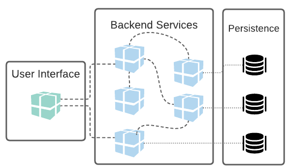

# Microservice architecture

With the popularization of cloud environments for software delivery, [microservice oriented architecture](https://www.martinfowler.com/articles/microservices.html) started to be increasingly adopted. How comfortable may the IT community feel about adopting this architecture?

Based on the analysis of [software architecture and design trends conducted in April 2020](https://www.infoq.com/articles/architecture-trends-2020/), knowledge about the benefits and challenges when adopting this model is well established since its adoption has already reached the category of users classified as "Late Majority". Several successful and disastrous stories of organizations have chosen to use this model, so our ecosystem is full of knowledge such as "where to start" and "lessons learned".

Before diving into this architecture, let's briefly recap the challenges of monolithic architecture that preceded this new architectural model’s creation.

## Monolithic architecture

In a monolithic architecture, we find an application whose front-end and back-end are part of a single artifact. This artifact contains all functional components, which are compiled and made available together. Scalability is impacted because whenever this application needs scaling, resources for the execution of all its components must be provided - even those that didn’t need scaling. In the persistence scenario, finding the relationship between a database and a monolith is pervasive. Still, some monoliths work accessing multiple databases (which further increases the level of maintenance complexity).

Let's talk about the benefits of this architecture:

- Ease of maintenance; after all, the fewer physical layers, the fewer the points to check, especially when it is still small;

- Ease of synchronizing data between the user and the system - the best and quickest way to exchange information is through memory. Regarding a relational database, for example, data synchronization happens more simply with the classic JOINs instead of running the entire process of synchronization or orchestration among services.
- Data consistency tends to be facilitated compared to a distributed system. We emphasize that we will always have the CAP problem when we talk about distributed architecture. For example, for applications that need transactions, in what in the monolith would be a simple rollback, in a microservices system it would be the expensive and complex SAGA pattern.
- Starting a project tends to be very simple with a monolith - it is necessary to plan and architect an ecosystem with fewer layers and components.
- Monitoring a single application is simpler.

Throughout development cycles, these monolithic applications tend to grow both in the number of code lines and in hardware consumption, which results in:

- The chances of breaking the application when making specific changes become increasingly greater;
- The larger the application, the greater the number of unit tests, which leads to a longer build time whenever it is necessary to compile the application;
- A longer build time leads to a longer delivery process;
- It is typical for the business area to want to carry out application validation tests when a new version is released. These tests also require more effort since - although a small portion has been changed - the entire application has been updated. Therefore, homologation tests take longer;
- Evolution and migration of data require greater prior planning since changes in the database can stop the operation of the entire application;
- The application naturally starts to occupy and consume more space in memory and have a longer startup time.
- Critical changes and deliveries require significant mobilization in the organization and prior planning for availability in production.

We noticed one of the biggest impasses: the coupling, in terms of code and deployment. When the application starts to become very complex, with several development teams and many functionalities, the additions or changes become more expensive. Scaling such an environment is challenging.

This is where the concept of microservices comes in, which begins to decouple these services and give unique responsibilities to the services. In this approach, you can change, make available, and scale the entire ecosystem independently, always following the premise of not affecting other microservices.

## Microservices

Microservice oriented architecture has as its precept the creation of applications decoupled from each other and modeled according to the business domain. These applications are integrated through different protocols, and the various communication patterns (REST, GRPC, asynchronous events, among others) can be adopted. With the adoption of a microservice oriented architecture, it is possible to promote faster and more frequent deliveries and bring an agnostic language ecosystem.

As pointed out by Sam Newman in his book "Building Microservices", these are concepts that are implicit in microservices:

* They are modeled taking the business domain into account;
* They are highly monitorable;
* Your deployment can be done independently from other services;
* They have isolation to failures in the ecosystem;
* Implementation details are "hidden";
* Automation is essential at all levels.

With these characteristics, we achieve a flexible and scalable architecture.

> **TIP**: keep in mind that the advantages exposed do not necessarily lead us to a world where monolithic architectures have no space. In fact, we now have one more tool in our toolbox, a different way of delivering applications - which is not necessarily the best way for all scenarios.

Let's look at some advantages of using the microservice oriented architecture approach:

- **Vertical scalability** - Due to services independence, they can be scaled as needed without impacting other services. Because they are smaller, they also require fewer hardware resources.
- **Freedom to select technologies by project** - It is possible to choose the best technology to solve a particular problem even if it is different from the technologies used in other services.
- **Productivity** - This approach supports the existence of many multidisciplinary teams (also known as squads) that can operate with a more specific business focus and, due to technical independence, deliver faster. In large teams, productivity tends to make activities like merge/rebase a project easier and less problematic if each group works in its own repository. It is vital to think about the organization and its structures directly reflected in the services and their integration. The very common case where the team structure impacts the way the software is organized - very well explained in Coways's law.
- **Agility** - Agile methodologies and their diverse ramifications have proved to be increasingly popular. By combining this style of project management with microservice architecture, we technically allow complete and shorter cycles for delivering value.
- **Reusability** - Components, such as a service that processes business logic, can be consumed via APIs when necessary, thus avoiding code duplication and impacts on maintainability.

### Challenges in a microservice architecture

The communication between components of a monolithic application occurs in-memory; that is, they don’t have the **latency** overhead present in network communication, as occurs in the microservices scenario. The more the number of services and architectural complexity increases, the more catastrophic this problem can be. Dealing with the response time of the service invoked on the client per se is a good practice (such as setting up timeouts and retries), and keeping up with your network's monitoring and alert services.

Pay attention to the separation of duties of the back-end and front-end components. The **front-end** must be implemented so that, in the event of failure of one of the back-end services, the other items work normally - guaranteeing the best possible experience for the end user.

The microservice architecture is agnostic to languages ​​and frameworks. Consequently, your environment can become a **polyglot**. From an architectural and technical leadership perspective, be parsimonious in evaluating the technologies to be used so that you don’t encounter a scenario where there is a service without trained professionals to maintain it. The scope definition and the microservice size should be measured.

Defining the size and scope of microservices can be a task that requires a little more effort at the beginning of the journey to decoupling. Keep in mind that the scope and size must be measured from the principle of single responsibility (**S**OLID).

One of the governance challenges is to avoid the existence of orphaned applications in a productive environment. Try to establish teams for each service, including the production phase. Therefore, in the event of an unexpected problem or a new change request, it will be easier to identify who will take on the tasks.

Beware of over granulation of projects by repositories; this option may not be the best when there are more repositories than collaborators in the company.

## Migration from a monolith to microservices

Patterns and techniques that enable the successful migration of monoliths to microservice architecture have been identified. Two trendy patterns for performing this migration are [Strangler Fig Application (Strangulation)](https://martinfowler.com/bliki/StranglerFigApplication.html) and [UI Composition](https://www.thoughtworks.com/talks/a-high-performmance-solution-to-microservice-ui-composition).

If you are in a scenario where you need to migrate a monolith, it is recommended to study the strategies presented in the book [Monolith to Microservices, Sam Newman](https://samnewman.io/books/monolith-to-microservices/). In that book, in chapter 1, you can also see in practice an example of migrating a monolithic application with DDD support.

## The most common errors with microservices

It is pretty common to see a list of errors that all software have, especially when there is a paradigm shift. For example, when there was a migration to NoSQL databases, the mistake was to think of relationships in databases that do not have relationship support, such as [Cassandra](http://cassandra.apache.org/). The following list presents the most common errors that we find in microservices:

- Domain break: [DDD](https://www.infoq.com/minibooks/domain-driven-design-quickly/) brought several benefits, mainly getting the code closer to the business with the ubiquitous language. Within DDD, we have the concept of domains, and when we move to microservices, it is typical to break the business in the domain wrongly. This happens, mainly, when we break it early. It is the same case of modeling in the database that we, precisely, don't have much information about the business. [In his domain definition article, Martin Fowler](https://martinfowler.com/bliki/BoundedContext.html) mentions *bounded contexts*. We can see this in e-commerce when we separate the inventory control from the product; however, what happens if the rule requires the product to be displayed if it is in stock? Exactly, every time a product is consulted, the inventory service will also need to be consulted, resulting in a total coupling between the two services. In other words, the product service and the inventory service should not be in two services in this context.
- No automation: one of the best existing practices when it comes to microservices certainly is [CI/CD](https://www.infoworld.com/article/3271126/what-is-cicd-continuous-integration-and-continuous-delivery-explained.html). These techniques are fundamental since there are a lot of machines to be managed.
- Diversity of languages: this decision is one of the most intriguing. So far, I don't know of a single project whose goal is to display something on the console, but it is very common to hear recommendations from big names based on a "Hello World". It is essential to be very careful with this type of decision; after all, the greater the number of languages ​​within a company, the more diverse fields the team will have to know, or there will be knowledge silos. Several stories report a rewritten system simply because it doesn't have a technical team to maintain it or because the language/framework has been discontinued.
- [Your application is not big enough to become a microservice](https://medium.com/swlh/stop-you-dont-need-microservices-dc732d70b3e0): not every extensive application will need to be migrated or created to become a microservice environment. An example of this is the legacy applications that meet customers’ needs.
- One of the great arguments for selecting microservices is the possibility of choosing to scale a component individually. However, here comes the question: does it make sense to scale a component separately?
- Microservices need information, and, like any distributed database, they face the [CAP](https://en.wikipedia.org/wiki/CAP_theorem) theorem. Given a scenario in which multiple updates are made to different services, it is common to add a new item in architecture: the [SAGA](https://dzone.com/articles/microservices-using-saga-pattern) pattern, resulting in a greater complexity and test points in your environment.
- [Starting the project now as microservices tends to be a big mistake](https://www.oreilly.com/content/should-i-use-microservices/), mainly in the instability in domain definition. An error in service breakdowns means that there is significant dependency and coupling among them. Consider a context in which the data to be used is stored in multiple databases. Pragmatically, this problem could easily be solved in a monolithic architecture, a join in a relational database, such as MySQL or PostgreSQL, or a subdocument in a NoSQL database, such as MongoDB.

* Using microservices only because large companies use this type of architecture. In software architecture, a decision should not be made just by the popularity of the solution. As [Edson Yanaga](https://twitter.com/yanaga) talks about in his [book](https://developers.redhat.com/books/migrating-microservice-databases-relational-monolith-distributed-data/): “Certainly, we always read great things about the microservice architectures implemented by companies like Netflix or Amazon. So, let me ask you a question: how many companies in the world can be Netflix and Amazon?”.

# Conclusion

As seen, the microservice architecture brings many benefits to your environment. It offers you the advantage of leaving the development independent when you have several teams and features, and this independence also extends to the application deployment. In other words, you give your teams speed and agility and manage to have better quality code since it will be organized around functionality. It has the advantage of being easy to scale just when needed and still being applied in the technology that you have more control over.

But, as I said earlier, it is no silver bullet; there are complexities for the environment and new security concerns. Imagine a giant project with multiple instances and hundreds of microservices; how will you monitor it? In case of an error, how will you find, deflect or even deal with the error?

If used properly, this architectural pattern has a lot to add to your projects - also, attention points need to be dealt with closely.

Microservices, like any architectural decision, have their advantages and disadvantages. As Martin Fowler says:

> Microservices introduce possible consistency problems because of their laudable insistence on decentralized data management. With a monolith, we can update several things together in a single transaction. Microservices require several resources to update, and distributed transactions are frowned upon (for a good reason). Now, developers need to be aware of consistency issues and figure out how to detect when things are out of sync before doing anything the code regrets. - [Martin Fowler](https://martinfowler.com/articles/microservice-trade-offs.html#consistency)