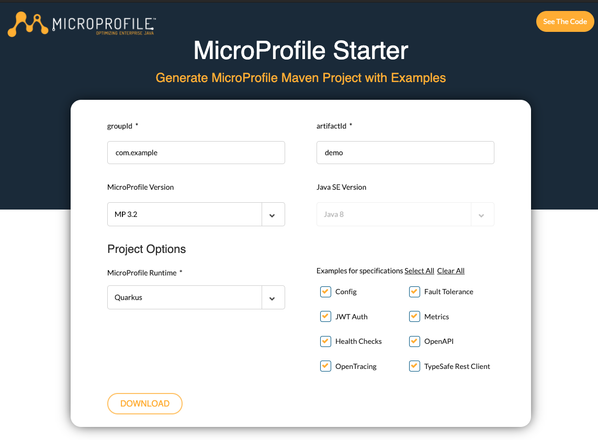
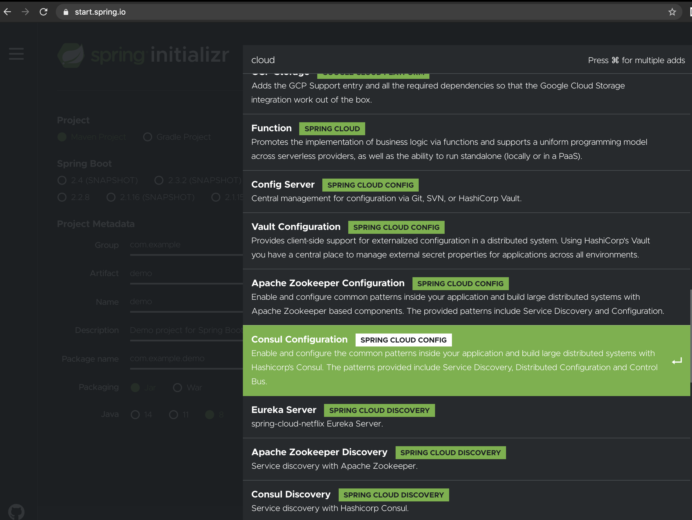
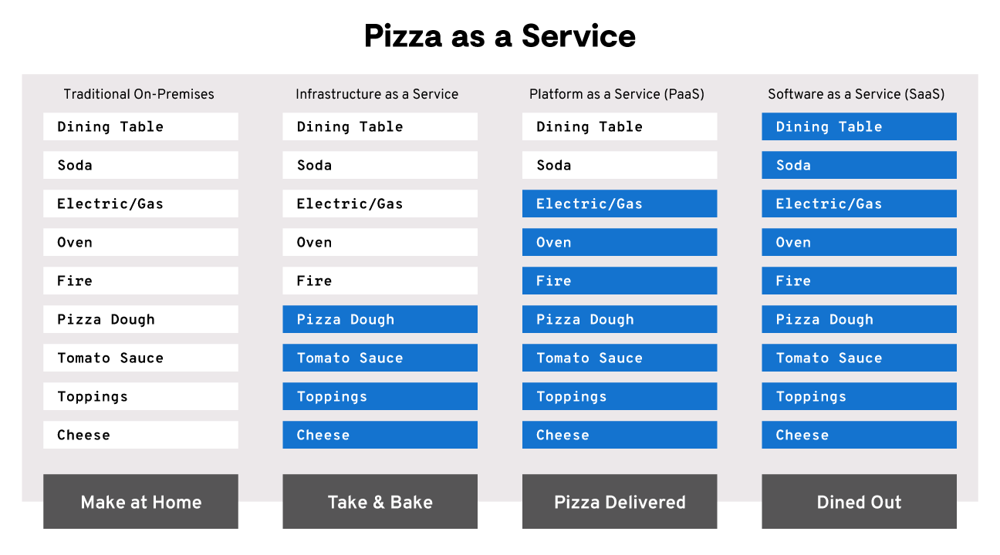
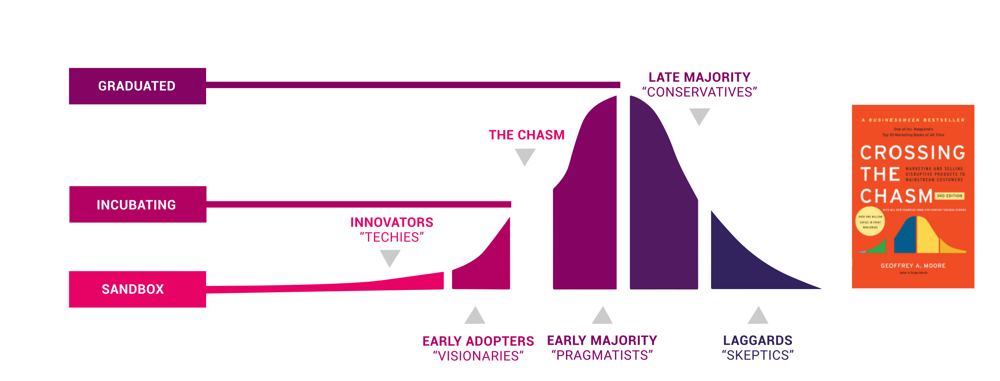

# Cloud

Once we talked about DDD, microservices, good coding practices, and software architecture, we have the basis to continue and address one of the most discussed topics in the technology scenario: cloud computing.

We will discuss what to consider when transposing application architecture to a cloud environment, popular perspectives regarding cloud-native applications and why this concept is linked to tools like Kubernetes. Patterns and functionalities expected in an application will also be described so that they are first-class citizens in a cloud environment.

> **INFO:** this chapter does not aim to teach how to deploy services in a Kubernetes cluster, configure services on AWS, or create cloud-native applications from scratch. The purpose of this chapter is to provide architectural information that will support your decisions and model your services and platforms. With the knowledge provided here, you will be prepared and confident to start or continue your cloud-native journey, regardless of the solution or language adopted.

The "cloud-native" buzz-word started to establish itself around 2014, and its growing popularity is in its best scenario. To achieve greater market space, companies began to label their products as cloud-native when, in fact, they are only cloud-enabled technologies.

> **TIP:** One way to assess a term's popularity is to validate the number of searches over time and the interest by region.

>

> https://trends.google.com.br/trends/explore?date=all&q=cloud-native

Understanding these concepts will help you understand your applications' situation and support a journey to the cloud. We will discuss these categorizations, their ideas, and their differences.


## Cloud-Native or Cloud-Enabled?

An application can be categorized according to its suitability level for a cloud environment as being cloud-enabled or cloud-native (a.k.a. cloud-ready).

### Cloud-Enabled

A containerized application runs in the cloud but was initially created to run in a traditional environment, such as a local data center, virtual machines with a cluster of conventional application servers. These applications can be categorized as *cloud-enabled* and have higher resource consumption (CPU, memory, storage) than cloud-native applications.

  

A cloud-enabled application has gone through refactorings and adjustments to run in a containerized environment and also to support orchestration by platforms such as Kubernetes. After all, it is no longer the traditional WildFly cluster (a.k.a. JBoss EAP) or clustered GlassFish (Weblogic), which allows you to use the network or file system at your convenience. Now, these services run in pods, in ephemeral containers.

Despite the "cons" of having a cloud-enabled application, the cost or effort of refactoring the entire application is not viable. In this way, the application can run in the cloud but can’t enjoy all its benefits.

> **INFO:** [Kubernetes](https://kubernetes.io/): it is an open-source container orchestration tool and works very well with [Docker](https://www.docker.com/). It is currently the most popular tool in the community. Other examples of container orchestration tools are Docker Swarm, Mesos, and Amazon ECS.

To better understand everything that a cloud-enabled application is *not* able to use natively, let's talk about the cloud-native concept.

### Perspectives on the cloud-native concept

  

As of writing this book, there is no clear consensus or definition about the term. So let's look at opinions:

  

> "Cloud-native is an approach to creating and running applications that explores the advantages of the cloud computing model. (...)"

>

> —[VMWare Tanzu (Pivotal)]([https://tanzu.vmware.com/cloud-native](https://tanzu.vmware.com/cloud-native))

  

> "Cloud-native is a different way of thinking and reasoning about software systems. It incorporates the following concepts: powered by disposable infrastructure, composed of limits, scaled globally, adopts disposable architecture. (...)"

>

> — [Architecting Cloud Native Applications]([https://www.amazon.com/Architecting-Cloud-Native-Applications-high-performing-ebook/dp/B07QTJ8WW8/ref=sr_1_4?keywords=cloud+native+applications&qid=1575059989&sr=8-4](https://www.amazon.com/Architecting-Cloud-Native-Applications-high-performing-ebook/dp/B07QTJ8WW8/ref=sr_1_4?keywords=cloud+native+applications&qid=1575059989&sr=8-4))

  

> "In general, "cloud-native" is an approach to creating and running applications that explores the advantages of the cloud computing delivery model. "Cloud-native" is about how applications are created and deployed, not where. (...) "

>

> — [InfoWorld]([https://www.infoworld.com/article/3281046/what-is-cloud-native-the-modern-way-to-develop-software.html](https://www.infoworld.com/article/3281046/what-is-cloud-native-the-modern-way-to-develop-software.html))

  

> "Cloud-native technologies enable companies to create and run scalable applications in modern and dynamic environments, such as public, private, and hybrid clouds. Containers, service meshes, microservices, immutable infrastructure, and declarative APIs exemplify this approach. (...)"

>

> — [Cloud-Native Computing Foundation]([https://www.cncf.io/](https://www.cncf.io/))

  

> "'Cloud native' is an adjective that describes the applications, architectures, platforms/infrastructure, and processes, that together make it *economical* to work in a way that allows us to improve our ability to quickly respond to change and reduce unpredictability"

>

> — [Christian Posta]([https://www.infoq.com/articles/cloud-native-panel/](https://www.infoq.com/articles/cloud-native-panel/))

  

> "A set of good practices to optimize an application in the cloud through containerization, orchestration, and automation."

>

> — [Otávio Santana]([https://twitter.com/otaviojava](https://twitter.com/otaviojava))

  

In addition to the above concepts, a set of well-received standards by the community is [12-factor](https://12factor.net/). The excellent software architecture practices suggested in this methodology originate from the book [Patterns of Enterprise Application Architecture, written by Martin Fowler and David Rice](https://books.google.com.br/books/about/Patterns_of_enterprise_application_archi.html?id=FyWZt5DdvFkC&redir_esc=y). Bearing in mind the book was published in 2003, when there was still no talk of "cloud-native", we can consider that, by adopting the 12-factor’s concepts, you will not only be creating a cloud-native application but also implementing good architectural and cultural practices in software development and delivery.

  

> **TIP**: Project names that will be detailed below may evolve and change over time. However, the definitions and standards expected from a cloud-native application will remain. Therefore, we recommend reading the cited references and deepening the understanding of the concept.

  

### Capabilities for cloud

  

Check out some of the features that are available and are commonly used in your applications that are designed to run in the cloud:

  

- Configuration management

- API Management

- Scheduling (of workloads)

- Distributed Tracing

- Service Security

- Centralized Metrics

- Auto Scaling / Self-healing

- Service Discovery and Load Balancing

- Centralized Logging

  

Later on, we will discuss a set of available technologies that implement the features above in the environment. At this point, what should be kept in mind is that, to take advantage of these features that exist in the ecosystem, you also need to tweak your code a little bit in the application. Suppose you want to see in practice an excellent example of how to use and implement cloud-native functionality. In that case, I recommend you download and check the sample application code generated by the [Microprofile](http://microprofile.io/) specification website.

  

> **INFO:** by bringing a lighter runtime, the Microprofile specification opened up a range of possibilities for Java in the cloud world. There are several implementations, such as Payara Micro, Open Liberty, Quarkus, Helidon, and others.

  

Microprofile has evolved quickly, and to ensure updated content, we have chosen not to include the entire code of good practice but to instruct you on how to obtain the latest content and according to your need.

  

To create a project in which you can study examples of implementing cloud-native practices and functionalities using the MicroProfile specification, follow these steps:

  

1. Access https://start.microprofile.io/

2. Insert a `groupId`,`artifactId`, select a version of MicroProfile, version of Java SE, and `runtime`.

The `runtime` will be the implementation of the MicroProfile specification.

  



  

3. Click on `Download`.

  

Two projects will be downloaded to your machine. You can start both, test them and analyze the simplicity of implementing cloud-native standards.

  

> **INFO:** MicroProfile is a recommended specification for creating Java microservices. Be aware that delivering microservices is **not** synonymous with delivering cloud-native applications.

  

Notice in the code how the implementation of `Health Checks` APIs with liveness and readiness (APIs that will be consumed by the fact that the container orchestrator increases resilience and supports deployment processes when validating the health of the pod) are carried out, metrics, distributed tracing, resilience timeouts, security with JWT, injection of configuration properties through annotations, and the use of RestClient (it allows you to consume a rest service only by implementing an interface in the client service). The example application above is an application that includes *several*, but not *all* the features we will be discussing.

  

In addition to using the MicroProfile specification for delivering cloud-native microservices, another widely used tool is [Spring Boot](https://spring.io/projects/spring-boot). It is also possible to build services that take advantage of cloud-native applications' capabilities using Spring and its stack. [Spring Cloud](https://cloud.spring.io/spring-cloud-static/spring-cloud.html) is one of the available frameworks that allow you to deliver cloud-native and Java applications. As demonstrated for MicroProfile, it is also possible to create applications simply: https://start.spring.io/. Note that by clicking on 'Add Dependencies`, you can filter by cloud and choose the components you want to enable in your application:

  



  

Now, once we talk about implementing the application itself, let's move on and understand the best containerization practices for these applications.

  

### Application container design principles

  

When it comes to implementing a cloud-native application, there is a consensus among the cited sources that these apps will be **containerized**. With that in mind, the architect must be concerned not only with the adoption of [SOLID](https://www.amazon.com.br/Clean-Architecture-Craftsmans-Software-Structure-ebook/dp/B075LRM681/ref=sr_1_2?adgrpid=83848702769&gclid=CjwKCAjwqpP2BRBTEiwAfpiD-w6m0nZtj0_jaXw7DfCfvIuztN-m6OrPIQ5BH2g2UHzLOird4mProRoCNTYQAvD_BwE&hvadid=426015975773&hvdev=c&hvlocphy=1001541&hvnetw=g&hvqmt=b&hvrand=11863819395550854586&hvtargid=kwd-298463329082&hydadcr=5628_11235154&keywords=clean+architecture&qid=1590032086&sr=8-2) in their code but also with [application container design principles](https://www.redhat.com/en/resources/cloud-native-container-design-whitepaper).

  

Principles to be considered during the **construction** time of an *image*:

  

* **Single Concern Principle**: similar to the **S** of the **S**OLID pattern; however, in this context, each container must solve *one* problem and solve it *well*. In case it is necessary to add more features to a microservice, adding sidecars to the pod is a good alternative.

* **Self-Containment Principle**: the build image must contain all the libraries, language runtime, and construction tools necessary to build the application. Exceptions are data that vary between environments - data that will be, for example, in environment variables.

* **Image Immutability Principle**: immutable images are essential to allow scalability and deployment strategies. Differences between environments are provided to the container through configurations (for example, using environment variables or `ConfigMaps`);

  

Principles to be considered during **runtime**:

  

* **High Observability Principle**: the containerized application must provide the standardized APIs so that the orchestrator can add health checks for liveness and readiness. Log and metrics collections are also part of the APIs that the orchestrator can consume and make available through tools such as, for example, Fluentd, Logstash for centralized logs, or Prometheus and Grafana for metrics.

* **Lifecycle conformance principle**: it is recommended to perform a graceful shutdown of services whenever possible, right? With containers, this practice is also valid. The container needs, through APIs, to allow the orchestrator to send commands for a graceful or forceful shutdown. And, if necessary, you can even use APIs like "pre-stop" and "post-stop" to implement specific needs of the component belonging to the container.

* **Process disposability principle**: it must be kept in mind that the container is volatile and can be destroyed and recreated several times. Thus, consider the start-up and shutdown times of your containers. Also, if it is necessary to maintain status, databases or volumes provided by the platform should be used.

* **Runtime confinement principle**: by following the **Self-Containment Principle** at build time, the image used to generate the container used to run the application will have a lower need for resource consumption (memory, space, CPU). The **Runtime Confinement** principle expects the container to have defined the resource limits that will be utilized. Based on that, the orchestrator will be able to make better use of the available infrastructure.

  

Based on these principles, it is possible to note that it is not enough to create a `Dockerfile`, containerize an application, and categorize it as "cloud-native ". In the containerization process, the application is expected to implement and provide resources that will facilitate its management, monitoring, and orchestration.

  

### The life cycle of a cloud-native application

  

Componentization of services now allows development teams to deliver changes with greater speed. With this, the operations team needs to respond equivalently, providing services that enable fast, but stable, deliveries. To achieve the ideal scenario, it is a common understanding that the automation of IT processes is essential not only to increase productivity but also to accelerate the organization's evolution as a whole.

  

In the current scenario, customers expect a constant evolution and highly available and performant services. Let's look at a scenario that considers this need and demonstrates the application's life cycle, using best deployment practices.

  

Considering that your application is ready to deploy:

  

* The source code must be made available in a source code repository - *a single source of truth*.

  

> **TIP**: As per [researches](https://softwareengineering.stackexchange.com/questions/136079/are-there-any-statistics-that-show-the-popularity-of-git-versus-svn) on 2020 data (based on open-source code), `git` repositories are currently the most popular choice.

  

* This repository, in turn, can be configured so that critical actions - such as creating a new tag or committing to the master branch - automatically trigger a continuous integration tool.

  

* The tool will start executing unit tests and packaging this application (it may include more steps, such as checking the code's quality).

  

> **TIP:** bearing in mind a better use of resources, it should be noted that: the base image used to build the application must *not* be the same to run the application. Tools for construction and packaging (such as maven, npm, etc.) that are not used in the application execution must *not* be included in the execution base image.

  

* After packaging the application, the integration tool is responsible for creating the container based on the base image, including this new package (i.e. `.jar`).

  

> **TIP:** it is recommended that the generated base image be stored in an image register.

  

* There must be a concern to create the definition files used to make your application available in the cloud. Speaking of Kubernetes, for example, you must create the YAML files and keep their versioning and release process;

  

* From this image, the utilized platform (i.e., Kubernetes) will create the specified number of containers.

  

> **TIP:** it is prevalent to have use cases that can take advantage of operators' use for managing and maintaining applications.

  

Automation of software delivery processes using Continuous Delivery and Continuous Deploy (CI/CD) is one of the DevOps culture practices. This practice has proven to be effective in traditional environments and is now indispensable when working with smaller teams and hundreds of microservices running in private, public, or hybrid clouds.

  

The process described above is simplistic, given the quality and efficiency we can add to our integration process. Let's take a step back and better understand what continuous integration would be.

  

#### Integration and Continuous Delivery

  

I start this topic with a question for you:

  

> **Are you and your organization ready to put a new version of your software into production on every recent change?**

  

This is state-of-the-art continuous integration and delivery. But take it easy; even if your answer is no, integration and continuous delivery should still be part of your cloud-native journey. Continuous **Integration** and **Delivery** are themes so vast that each one has its own book. But let's talk about the main topics below.

  

First of all, the base: <u>task automation</u>. "But how far should I automate?" you ask me. Let's see:

  

#### Continuous Integration (CI)

  

Use a tool that allows you to automate the process of integration of your application. The integration is continuous; that is, at each commit on the master branch, your automation tool must:

  

- Compile and execute the application build;

- Run unit tests and obtain the percentage of test coverage;

- Run tests to validate the code quality;

- Send notification to the team, in case any of the items above fails, according to your criteria (acceptable test coverage? Acceptable code quality?);

  

The mentioned steps must be easily executable, i.e., at the push of a button. They must be reproduced end to end without the need for human intervention.

  

With the rules above, developers on your team will always have the good practice of versioning running code and testing the build locally *before* committing to the master branch. If a commit breaks any of the rules, you must immediately correct the problem.

  

These practices will make your development and release process more reliable and stable.

  

#### Continuous Delivery (CD)

  

Since, with the use of CI, you now generate more reliable packages, according to your organization's criteria, what prevents you from delivering new versions more frequently in a productive environment? Let's talk about the automation of the deployment process.

  

> Continuous Delivery! = Continuous Deployment

  

With Continuous Delivery, you would be ready to release - via a deployment pipeline - the most stable recent version of your code at any time for production. Again, at the push of a button.

  

And we have to talk about **Continuous Deploy**, which is when you release - through a deployment pipeline - a new version in production at each commit on the master branch. Large companies that practice continuous deployment even release hundreds of versions for production daily.

  

#### Automation is the secret

  

Stop for a moment and identify the automation level you currently have. The greater the maturity of the mentioned CI practices, the more confident you will feel when releasing your software. And the more often you release software, the faster you get feedback from the end user; and most importantly, the greater the guarantee of delivering software that works and provides precisely what customers need.

  

Bear in mind:

  

- CI is the first step;

- To have Continuous Delivery, you need to practice CI.

- To practice Continuous Deployment, you need to practice Continuous Delivery.

  

#### Deployment strategies

  

Choose from mature deployment strategies that are most appropriate for your application to have more reliable deliveries. When choosing the deployment strategy for your application, choose based on how important it is:

  

- Downtime - how critical is it for the business that your application is down during deployment?

- Would your application support you running two versions (old and new) at the same time?

- Would you like a specific group of users to test your new release before releasing it to 100% of the users?

- You do not have a group of test users; still, would you like to evaluate the new version's functioning, releasing only to a percentage of end users?

  

Here are some deployment strategies you can easily use with orchestration platforms like Kubernetes:

  

* Recreate Strategy: all existing pods will be scaled to zero, and only then will Kubernetes create pods with the new version of its code. A bold strategy (all or nothing), but that may be necessary in case of radical changes in data structures or if you cannot run both versions simultaneously in production;

  

* Canary release: it is a type of Rolling Strategy, in which the new version is released and, only when the new version is certifiably healthy (according to the Kubernetes readiness check), Kubernetes will start destroying the pods with the old version; in this scenario, new and old pods need to coexist during the deployment period;

  

* Blue-Green: it is a good strategy to mitigate failures, but it is more expensive. Use it if you want a group of people to test it to make sure the new version is actually ready and can go live. There must be two identical production environments, blue and green, but only one will be active at a time. You will have a router that will direct users to the active environment.

  

> **TIP:** recommended reading on blue-green deployment: [BlueGreenDeployment, by Martin Fowler](https://martinfowler.com/bliki/BlueGreenDeployment.html).

  

Let's say the blue environment is active, running your v1 code. The user group will perform the tests in the green environment - which is inactive, in version v2. Once it is confirmed that the new version, v2, can go live, you change it, and all users now use the green environment.

  

Along the same lines, as the green environment is now in production, you would use the blue environment to guarantee the release and so on in the next deployment.

  

* A/B testing: in this scenario, you run two versions of the application in production at the same time as a way to test a hypothesis. You can, for example, compare, over a week, which of the two versions will perform better. Or, from another perspective, if the fact of adding a new button on the application screen in the latest version leads users to buy more. Once the tests have been carried out, you can release the desired version entirely, using, for example, canary release.

  

## The cloud-native journey

  

Having understood the concepts that revolve around a cloud-native application and after viewing a cloud-native application's life cycle, the next step is to know how these applications are delivered and the available options on the market.

  

There's widespread agreement that the digital transformation towards the cloud causes a change in the way of coding applications (developers team) and extends to other areas of the IT organization, which will need to be reformulated and deal with new challenges. Each organization is at a different time, has different budgets and teams with other characteristics and profiles.

  

We will discuss how *Infrastructure As A Service - IaaS*, *Platform As A Service - PaaS)*, and *Software As A Service - SaaS* coexist, their pros and cons, and how each of them can help your organization in the cloud-native journey.

  

## IaaS, PaaS, and SaaS: an architectural perspective

  

The best way to think of the cloud in terms of abstraction for business is certainly in the analogy of a pizzeria as a service. We can start from the scenario where: we prepare the pizza at home and manage its entire creation and cooking process, or we go out to eat the pizza in a restaurant without worrying about its creation.

  



  

In the image above, we have four formats available: on-premise, IaaS, PaaS, and SaaS. The white boxes tasks are our responsibility, and the blue boxes are third-party responsibilities. This same comparison can be made if we replace the tasks of creating pizza for tasks related to software creation: installation and management of the operating system, networking, storage, service orchestration, middleware management, runtime, CI/CD pipelines, and even the creation of the application per se.

  

When we talk about the cloud and its services, note that the lower the abstraction we use as a service, for example, with IaaS, the greater the responsibility of building the software. This large number of processes will grow as the number of servers increases, and this complexity is directly proportional to the risks. In contrast, the lower the abstraction, the greater the control over the possibility of customizing the architecture and components.

  


  

### IaaS - Infrastructure as a Service

  

With this approach, it is possible to obtain all the benefits of a cloud environment, but the entire responsibility for maintaining the software rests with your IT team. The company that provides the IaaS service has to ensure communication among services to deal with failures, hardware problems, and eventual repairs.

  

In this scenario, your team takes on tasks related to database, backup, scaling both vertical and horizontal, etc. This factor increases the possibility of customization and, on the other hand, creates complexity and more risk. In this option, the hardware and the guarantee of its operation belong to third parties, but your team runs the service; this way, it can have a lower cost when compared to other options.

  

The concept of *orchestration* in IaaS is the configuration, management, and automated coordination of services, applications, and computer systems. This orchestration allows the maintenance of the infrastructure through programming (infra as code) and aims to facilitate and abstract the use of IaaS.

  

Examples of IaaS are Microsoft Azure, Google Compute Engine, and [Amazon EC2](https://aws.amazon.com/ec2/). In general, it can be thought of as a large rental of machines you can pay, similar to our electricity bill. To illustrate this, we will analyze the implementation of a containerized application in the Amazon environment. The [first task]((https://docs.aws.amazon.com/AWSEC2/latest/UserGuide/launching-instance.html)) is the creation of an instance, an activity that requires about seven steps. Then, the [Docker installation](https://docs.aws.amazon.com/AmazonECS/latest/developerguide/docker-basics.html), so that you can create [an image to run this instance]( https://docs.aws.amazon.com/AmazonECS/latest/developerguide/docker-basics.html#docker-basics-create-image). In this case, it is noted that a simple application deployment requires not only extra know-how but also the execution of sysadmin tasks by your team.

  

### PaaS - Platform as a Service

  

A drastic reduction in complexity to focus on software creation is undoubtedly the most prominent advantage within PaaS. In general, there is no need to worry about maintaining the machines, creating a backup routine, purchasing licenses, etc. The only responsibility of the [development team will be the software creation](https://twitter.com/gilzow/status/1251308583427465216). However, PaaS usually has a higher cost when compared to services without greater abstraction.

  

> **TIP:** see some PaaS options currently available on the market below:

>

> * [Platform.sh](platform.sh): it is a PaaS that uses all the concepts of infrastructure as a service and is Git-oriented, in addition to making it possible to deploy the application, leaving all the work to the platform. Basically, from three files: [application](https://docs.platform.sh/configuration/app-containers.html), [services](https://docs.platform.sh/configuration/services.html), and [routes](https://docs.platform.sh/configuration/routes.html), we can push to a Git repository. A simple push to the Platform.sh remote system will automatically create the application containers, services such as the database, and the application routes. In this case, the abstraction is gigantic, letting the team focus on the company's central application.

  

> * [Red Hat OpenShift Online](https://www.openshift.com/products/online/): an option to use OpenShift (aka [OKD](https://www.okd.io/)) as a service. In this PaaS, OpenShift is available on AWS and allows developers of Ruby, PHP, Node.js, and Java applications to use their preferred runtimes and database to run their applications. It has a self-service and free option for developers.

> * [Heroku](heroku.com): born in 2007 exclusively for Ruby, today Heroku supports the most diverse languages, such as Go, Java, PHP, Node.JS, and others, in addition to several tools of an application's ecosystem;

> * [Google Kubernetes Engine (GKE)](https://cloud.google.com/kubernetes-engine): The PaaS offered by Google is based entirely on Kubernetes vanilla. Simple to start, when you register, you get a number of credits to run your workloads, besides getting access to other Google products.

  

Based on readings and the concept of PaaS application by several companies, we can analyze it from two perspectives:

  

1. You delegate the management of the entire platform (Kubernetes and similar) to third parties. This way, your team doesn't need to deal with installation, maintenance, backup, and monitoring. This perspective is only viable when the use case can take advantage of a public cloud. Heroku and Kubernetes' various flavors, such as Platform.sh, GKE, and OpenShift Online are examples of PaaS solutions that fit this perspective.

2. In the second scenario, you must necessarily use a private cloud due to restrictions in your company. In this case, you can provide a PaaS by providing a tool that increases the developer's autonomy by providing an efficient and automated way to deliver containerized applications, either through a service catalog or through the abstraction of container delivery APIs or deployment automation. From this perspective, it is worth considering tools such as OpenShift, installed in a private cloud and managed by your infrastructure team.

  

In both scenarios, it is common to assume greater autonomy for the developer when using PaaS.

  

### SaaS - Software as a Service

  

Software as a service is the offering that provides a quicker solution to a given problem. Customers choose to consume a ready-to-use program and don't have to worry about hosting, scalability, etc., or even with development. All complexity and risk have been resolved. However, customization is significantly reduced, and the possibility of configuration depends directly on the provider.

  

---

  

### Conclusion on IaaS, Paas, and SaaS

  

In general, we have to think about the following three cyclical principles, which compare:

  

* The greater the complexity, the less the abstraction;

* The higher the abstraction, the lower the risk;

* The lower the risk, the less the complexity.

  

There are indeed several benefits to navigation in the seas of cloud computing. Still, it is crucial to know the types of services the cloud provides and make a thorough analysis of the complexity of a service and its respective risk and the time the team is willing to spend to create and maintain the entire infrastructure. PaaS provides a great advantage of the abstraction of the whole infrastructure and maintenance so that the developer can focus on their business. IaaS will guarantee you great flexibility and power to install and configure your team's wants without any problem, even if everything has to be configured manually. Both the team and the company must be aware that there will be benefits and downsides regardless of choice. Architects need to assess what best fits the institution; after all, cloud and computing are not related to "when" but to "how".

  

# Kubernetes - when to use and when not to use

  

How do you decide when it's time to migrate your workload to a containerized architecture orchestrated by platforms like Kubernetes? Understand cultural and operational changes to make a more informed decision. The points described below are valid for platforms such as Kubernetes and their various flavors.

  

* Installation and maintenance of the orchestration platform: in case of adoption of IaaS, the sysadmin team must be prepared to carry out and manage the installation of one or more Kubernetes clusters. You must be aware of the best management practices and configuration of Kubernetes clusters.

  

* Use of the Kubernetes platform: in the case of IaaS or PaaS:

  

* From the developers' perspective, the application's containerization ensures the code that runs on your machine will also work in production environments. Just make sure the image is correctly described. Besides, once the concepts of creating a cloud-native application and the advantages of an orchestration environment have been absorbed, the developer has the benefit of a career perspective and can work in different vendors since there is a certain standardization of working. On the other hand, management must be aware of the initial learning curve the team will face.

  

> TIP: It is recommended to read the book [Kubernetes patterns for designing cloud-native apps](https://www.redhat.com/en/resources/oreilly-kubernetes-patterns-cloud-native-apps). It brings good practices in the implementation of cloud-native services.

  

* From the perspective of the middleware team or sysadmins, everyday life is different. It is no longer necessary to learn how to deliver other applications and unravel their peculiarities and dependencies. Just learn to handle containers, and the way of working becomes standard, regardless of the technology used in the applications. On the other hand, operators, segregation, and security concepts in the Kubernetes environment, deployment strategies (rolling, blue-green, canary), how to deal with storage, etc., must be understood.

  
  

## Vanilla Kubernetes and their flavors

  

This project became famous for demonstrating its capacity for handling large-scale container orchestration. It is possible to identify several offerings based on Kubernetes: Heptio, OpenShift, Platform.sh, Rancher, among others. The intention is that each company behind these platforms can add value with unique features while respecting all the existing concepts and architecture on its original platform, Kubernetes.

  

In a pre-selected but not definitive way, the different platforms bring with them a set of technologies that will meet an orchestration platform's requirements. To understand this statement better, analyze the [CNCF landscape](https://landscape.cncf.io/) and note the number of technologies that address, for example, the Service Mesh category. One of the available options is [Istio](istio.io), a solution on platforms such as OpenShift, which does not mean that the same technology is exclusive to that platform. What differentiates the platforms are the distributions used. Still having Service Mesh as an example, Istio's project delivered by OpenShift is [Maistra](http://maistra.io/), which is a project that adds more features on top of Istio.

  

In this context, when selecting your next orchestration platform, consider:

  

- The exclusive features of each platform and how they can make your team more efficient;

- How important is the level of service stability to your company (in the case of PaaS offerings in public or hybrid clouds);

- How will you and your team handle problems: on your own, or do you need enterprise support?

- If you are going to run on a public cloud, check if the platform supports or has successful cases in the appropriate option (Amazon, Google, Azure, etc.).

- Evaluate the CI/CD tools supported by the platform;

- Evaluate the tools your developer will have to use daily to interact with the orchestration tool: is there only CLI? Is there a console that allows maintenance and monitoring of the environment?

- If part of your scenario is a partial and medium/long term migration from an on-premise environment to a public cloud, evaluate the possibilities of a hybrid environment where you can use private and public clouds without any significant problems with the platform in question.

  

### How to choose your technology set

  
  

There are several options for implementing each of these features, and you can see the various options recommended for a cloud scenario in the [CNCF Cloud Native Interactive Landscape](https://landscape.cncf.io/zoom=200).

  

> **INFO:** thinking of organizations on the cloud journey, the Cloud Native Computing Foundation (CNCF) was born. CNCF was born to define the term Cloud Native and provide space for open source projects, such as Kubernetes, Prometheus, and [many more](https://landscape.cncf.io/zoom=200). CNCF adopts projects and fits them into the cloud computing architecture, according to the committee members.

  

CNCF takes on projects and classifies them as **graduated**, **incubating**, or in **sandbox**. This classification derives from the maturity of each software, according to its use in the market:

  



  

*Image obtained at https://www.cncf.io/projects/*

  

If you can, access [CNCF Cloud Native Interactive Landscape](https://landscape.cncf.io/zoom=200) and observe the numerous available technologies to tackle cloud environment issues. Note that Kubernetes is only *one* of container orchestration options despite being the most popular today. We can't help highlighting some popular technologies:

  

* Several Kubernetes distributions, such as [Red Hat OpenShift](openshift.com) and [Rancher]([rancher.com](https://rancher.com/));

* PaaS offerings, such as [Heroku]([heroku.com](https://www.heroku.com/)) and [platform.sh](platform.sh);

* [Jaeger](https://www.jaegertracing.io/) for application tracing, and [Prometheus](https://prometheus.io/) and [Grafana](https://grafana.com/) for monitoring;

* [Strimzi]([strimzi.io](https://strimzi.io/)) and [Apache Spark]([spark.apache.org](https://spark.apache.org/)) for streaming and messaging;

* [Istio]([istio.io](https://istio.io/)) for service mesh, [Envoy]([envoyproxy.io](https://www.envoyproxy.io/)) for Service proxy ;

* [Jenkins]([jenkins.io](https://jenkins.io/)), [JenkinsX]([jenkins.io](https://jenkins.io/)), and [Tekton]([tekton.dev](https://tekton.dev/)) for CI/CD;

* [Helm]([helm.sh](https://helm.sh/)), [Operator Framework]([coreos.com/operators](https://coreos.com/operators/)), and [Podman ]([podman.io](https://podman.io/)) for building images and defining applications.

  

Still, in the context of tools and features that cloud-native applications can take advantage of, let's talk about service mesh and existing technologies below.

  

##### Bonus Topic: Service Mesh

  

Let us define service mesh by [William Morgan, 2017](https://buoyant.io/2017/04/25/whats-a-service-mesh-and-why-do-i-need-one):

  

> A service mesh is an infrastructure layer dedicated to handling service-to-service communication. It is responsible for delivering requests through the complex service topology that includes a modern cloud-native application. In practice, the service mesh is usually implemented as an array of lightweight network proxies deployed along with the application code without application awareness.

  

We are talking about a decoupling between "Dev" and "Ops". Instead, the developer doesn't need to worry about whether the code of their microservice can provide the capabilities the operation needs. And whenever the operation needs to change something, is it not necessary to recompile the application, generating an uncoupling that proves resilience, security, all the observability, and routing parts to the mesh and out of the application.

  

Even if we consider that the concept is somewhat new - it started to gain popularity in 2017 - the idea is to create an abstraction layer on top of the application. And, through the mesh, provide security among services and delegate to the mesh all the observation and resilience that it may need.

  

An abstraction layer may exist at three levels:

  

- **Library** - Each service implements a library that includes the capabilities of the mesh; libraries like [Hystrix](https://github.com/Netflix/Hystrix) or [Ribbon](https://github.com/Netflix/ribbon) are examples. These implementations have trade-offs because, in this case, you need to provide the libraries and, with that, limit the technologies you can work with. If your project has multiple languages, you will also need various implementations and manage that scenario.

  

- **Node Agent** - An agent is running at each mesh node and with the responsibility of taking care of the mesh's capabilities. Linkerd's implementation on Kubernetes uses this model. The trade-off here is that the Ops team needs to work together with the Dev team to establish the capabilities.

- **Sidecar** - Currently, the most suggested implementation is the model used by Istio with Envoy. In this model, there will be a container next to each application container - in the same pod. This sidecar handles everything the mesh needs to get in or out of service.

  

But what are those 'mesh' capabilities? The service mesh must follow the ORASTAR rules codes implemented in its microservice:

  

- **Observability** - The Control Panel provides all the observation services running on the data plane. Metrics to see latency, bandwidth consumption, logging and tracing, everything you need to monitor your services' health is in the mesh, providing graphical views of all requests.

- **Routing** - The routing rules for traffic control can be done both visually and by configuration files and then sent from the control to all applications. We are talking about changing and dividing traffic, controlling what goes in and out, and injecting failures and latencies for testing.

- **Automatic Scaling** - The control panel must be able to scale automatically to deal with increases or decreases in the workload.

- **Separation of duties** - Use the control panel to separate the operation from the mesh and give more independence to developers.

- **Trust** - Delegate security communication protocols, renew and maintain certificates to the mesh and data plan. And the rule is always the same: consider that you are never safe, even under a firewall.

- **Automatic service registration and discovery** - The control panel interacts with the cluster management to automatically provision service discovery and register the application during the deployment procedure.

- **Resilient** - The resilience rules for your entire mesh: it is necessary to assume the network can fail. So it is essential to have the ability to protect the traffic and automatically balance it to other working points that can provide the same capacity. Here comes the concept of Circuit Breaker.

  

###### Architecture

  

To implement the ORASTAR rules, we have the architecture of a control panel and a data plan. Let's understand these concepts.

  

`Control Panel` is where the settings, policies, and administration of the services in the data plan for the control of routes, traffic, monitoring, discovery, and registration of services are. This is where the responsibility for communication between microservices lies through authentication, authorization, and security in network traffic.

  

`Data plan` is where all microservices and their sidecars are located, no matter how they are implemented. It is through a layer that the control panel interacts to control the services.

  
  
  


  

###### Tools

  

Service Mesh emerged around 2018 and is constantly evolving. In terms of implementation, we will talk about three tools: Istio, Linkerd, and Consul.

  

**Istio** - created by Google, IBM, and Lyft. Today, [Istio](https://istio.io/) is the most recommended implementation on the market and built on top of the Kubernetes platform.

  

It is a centralized control panel that allows you to manage and coordinate the application in the data plan - you can even run its core outside of Kubernetes - it supports integration with VMs and service discovery with different products.

  

**Linkerd** - started by Twitter to deal with its massive volume. Today, it is in version [Linkerd](https://linkerd.io/) 2.0. It has the limitation of running only environments with Kubernetes. It also has a centralized control panel like Istio and uses its own Sidecar instead of Envoy as a proxy, like competitors.

  

**Consul** - created by Hashicorp. [Consul](https://www.consul.io/) is older than the service mesh itself, and its first version is from 2014. It is composed of a binary in GO for the server and applications to provide mesh capabilities. But, unlike the tools above, it has a distributed control panel, as it is made to work close to the machines.

  

> **TIP:** in order to choose one of the services, check out the feature comparison among them in the article [Kubernetes Service Mesh: A Comparison of Istio, Linkerd, and Consul](https://platform9.com/blog/Kubernetes-service-mesh-a-comparison-of-istio-linkerd-and-consul).

  

From the author's point of view, one of Linkerd's disadvantages is that it does not have a native Circuit Breaker, making you implement Circuit Breaker in your service code. On the other hand, it is the easiest to operate among the others.

  

We can't leave out public cloud providers that have offered service mesh, such as AWS and Microsoft:

  

**AWS App Mesh** - If your environment is on AWS, it is worth taking a look at this service that uses Envoy as a sidecar proxy: [AWS App Mesh](https://aws.amazon.com/app-mesh/?nc1=h_ls);

  

**Azure Service Fabric Mesh** - Despite using the name Service Mesh, this is the one that differs the most from the others. It is more comparable to a Red Hat OpenShift, and you need to have a service mesh data plan already in use. It is a managed service, and developers don't have access to the control panel: [Azure Service Fabric](https://azure.microsoft.com/services/service-fabric/).

  

## When not to use Kubernetes

  

Based on the explanation of cloud-native applications, note that to deliver cloud-native architectures, you don't necessarily need to use Kubernetes. Especially if you are at the beginning of the journey to the cloud, Kubernetes (and its various flavors) may not be the solution to all the questions on the cloud journey, and worse, it may even bring you more attention points.

  

If your scenario still has a low number of images and containers, it may not be time to adopt a more robust architecture like Kubernetes. In addition to increased resource consumption, your Dev and Ops teams will need to be able to immerse themselves in this new application delivery paradigm. It may be appropriate to start with a tool like [Docker Swarm](https://docs.docker.com/get-started/swarm-deploy/). Docker Swarm is available with the Docker engine you install, and its use is through the `Docker` command itself:

  

```
$ docker swarm

Usage:  docker swarm COMMAND

Manage Swarm

Commands:
  ca Display and rotate the root CA
  init Initialize a swarm
  join Join a swarm as a node and/or manager
  join-token Manage join tokens
  leave Leave the swarm
  unlock Unlock swarm
  unlock-key Manage the unlock key
  update Update the swarm
```


You can create the machines that will be part of the cluster, install Docker and configure Swarm and the network layer. Once your Swarm is configured, you can scale the pod replicas and manage your containers on a smaller scale than Kubernetes.


With the introduction of the concept of containers and container orchestration to your team, there will naturally be an evolution towards the automation of the construction and delivery processes of these images and containers. Consequently, the team will have the chance to practice and absorb the necessary knowledge to immerse themselves more naturally in a more complex scenario of robust orchestrators.


You should also keep in mind the scenario in which you have already used Kubernetes and have a more in-depth knowledge of the tool. With that, you already have ideas on improving or facilitating internal orchestration flows, development practices, and continuous delivery. You have UI ideas that can assist the user or procedures that can speed up the application delivery. Based on that, you can, instead of using Kubernetes, go for one of the available flavors and even create your own!

  

# Conclusion


There is no doubt that the future of technology lies in the cloud. With the emergence of microservices, we increasingly need knowledge of the ecosystem that revolves around it. With the increase in containers and DevOps practices, more and more developers need to know about the platform, and the system admin needs to know about development.

If they are not yet part of your reality, cloud-ready and cloud-native applications are sure to be very soon. Together with them, the entire vast ecosystem of containers, container orchestration, and other functionalities that revolve around these services will be necessary. Be ready to join the movement.