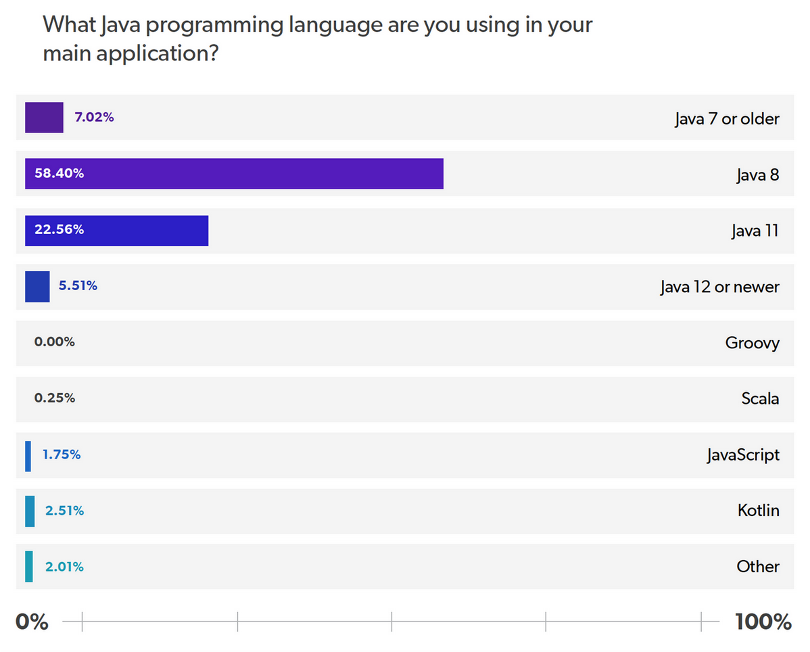
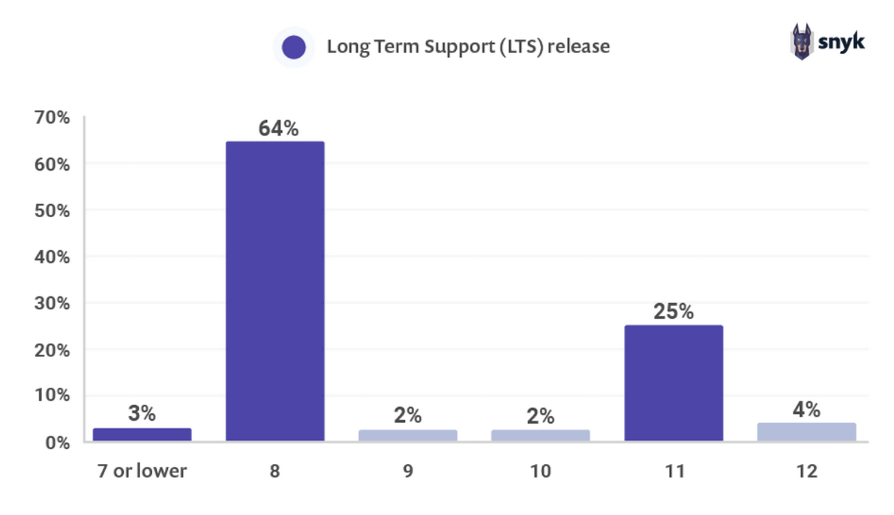

# We need to talk about updates

  

I’m not going to lie to you: when I heard that Java would be updated every six months, I thought to myself: "Oh my! That’s not gonna work".

  

Why? For some reasons (six, to be more precise):

  

1. If we look at the Java platform only from the point of view of source code, we will see that it is a gigantic project, which has been evolving for 25 years and, during that time, has undergone changes in the computation itself (see the cases of cloud and containers, just to mention two quick examples);

2. Millions of lines of code, thousands and thousands of classes, a "zillion" of things that depend on so many others;

3. Each feature derives from a JSR, which is often under an "umbrella" design. In each of these parts, there are often different people working and a different pace of project evolution;

4. Everything that happens inside the platform is regulated by the JCP, which is not famous for its speed;

5. The ecosystem of tools and frameworks around Java is one of the largest in the world (if not the largest). Some open-source, others proprietary. And all dependent on the pace of evolution of the platform;

6. And finally, the users - usually developers who work in companies. Undoubtedly, the most impacted people by any issue regarding the update cycle, since they are at the tip of this chain of interest.

  

I could add more items to that list, but I think it is enough to justify my initial skepticism.

  

But today we are here and… they managed to do it! Yes, today we have updates in Java every six months! And it didn't just work; it's going well. Really well!

  

In the following lines, we will talk about specific implications and challenges this new cycle helps to solve, and that also served as inspiration for it to be adopted.

  

## How often do you deliver something to your user?

  

If you have read/heard/studied something about DevOps, you may have already experienced something like this question.

  

Just so that we can quickly understand the principle involved here: suppose you deliver a version/update of some software to the end-user once a year.

  

That is, you and your team worked an entire year to create a new version. You coded a lot, made changes in the database, altered settings, updated screens, and so many other things that can be done according to each application type.

  

Now let's look at this scenario’s implications:

  

1. You have dropped a year of work on your user's lap. Of course, you can make this experience as painless as possible, but it will still hurt;

2. You have published a considerable amount of changes. If a bug occurs, its search/debug surface is enormous;

3. You had small, simple changes/improvements, which were ready since the first month, but had to wait for "a big release" to reach the user.

  

And, let's remember, we are talking about a year. Imagine if you do this every two years? Or every three years?

  

Well, that was more or less what was happening with Java. It used to take two to three years for a new version. In fact, we have (almost) reached an incredible five years between versions 1.6 and 1.7.

  

Now let's think about the opposite situation, in which you deliver more and more frequently. What happens?

  

1. You deliver fewer things to your user at once. It is easier for them to absorb the changes. It is easier to teach. They will have a greater perception of that fantastic slight improvement that would be lost in the middle of a more significant release;

2. If a bug occurs, you have far fewer places to look. And because you have less code delivered, the chance of errors is also lower. Some people even prefer never to deliver anything, so there’s no mistake ever...;

3. The improvements will reach your users in a much shorter time. You will make them happier more often. Point for you!

  

This is precisely what happened with the Java platform. They went from approximately three years between releases to six months. It is six times more frequent.

  

Just to give you an idea, JDK 9 had ninety-one items in its release, while JDK 14 had only sixteen. Look at the three things I mentioned above and see them materialized in the world's most widely used language.

  

## The problems of not updating the JVM version

  

The company JRebel published in 2020 the results of a survey conducted with hundreds of developers worldwide. Below is one of the specific results concerning the Java versions:

  

Source: [https://www.jrebel.com/blog/2020-java-technology-report](https://www.jrebel.com/blog/2020-java-technology-report)

  

Another interesting survey, published in 2020 by Snyk, brought the following results:

  

Source: [https://snyk.io/blog/developers-dont-want-to-leave-java-8-as-64-hold-firm-on-their-preferred-release/](https://snyk.io/blog/developers-dont-want-to-leave-java-8-as-64-hold-firm-on-their-preferred-release/)

  

Considering the average of these two surveys, we still have about 60% of Java developers at version 8. And there are surveys out there that say that number can be even higher, reaching something around 80%.

  

Considering that Java 8 was launched in 2014 and we’ve had another LTS (Java 11) since 2018, we should ask at least two questions, which I have already answered appropriately.

  

### Why is the market still at JDK 8?

  

Let's face it: the market, especially when it comes to enterprise applications, is not moving at the same speed every developer wants.

  

And why is that? I would say the main reasons are listed in the same Snyk survey mentioned above:

  

Source: [https://snyk.io/blog/developers-dont-want-to-leave-java-8-as-64-hold-firm-on-their-preferred-release/](https://snyk.io/blog/developers-dont-want-to-leave-java-8-as-64-hold-firm-on-their-preferred-release/)

  

This result, by the way, should not surprise anyone. The main reasons why professionals and companies around the world do not have this craving for the latest updates are:

  

1. The current version works (the famous "if it ain't broke, don't fix it");

2. The migration cost is too high;

3. The business area does not agree with the migration.

  

I would say that item 3 is due to item 1. That is, the business area does not agree with the migration precisely because the current version works.

  

We need to keep a clear reality in mind: projects in a corporate environment result from agreements made from different interests.

  

Version update (for whatever reason) means a risk of errors and unavailability. Neither the business nor the operations area wants that.

  

Item 2 (high migration cost) is also perfectly justified. After all, whenever you think about changing the version of a JVM, you will have to:

  

1. Build the current code in the new version (many already give up here);

2. Make all necessary code adjustments to work in the latest version;

3. Perform all the required tests to ensure that no errors were added to the application by pure JVM version changes (and, here, unit testing will be your best friend);

4. Update the tools of your ecosystem that depended on the previous version;

5. Ensure that the new version of Java will be installed and configured in all environments in which your application will run (container or vms);

6. If you get here, you will probably be safe to migrate.

  

And, in the case of migrating from Java 8 to more current versions, we still have a "small" detail along the way: Java 9.

  

Yes, Java is backward-compatible. Yes, a code made in Java 1.2 should work in Java 14. But it is also true that Java 9 introduced brutal changes in the platform that, yes, broke many projects out there.

  

In very general terms, the modularization launched in JDK 9 (Project Jigsaw) brought not only the possibility for you to modularize your application internally, but the platform itself was modularized. So the way your project deals with the Java platform has changed, and, consequently, many projects can’t get out of version 8.

  

By the way, there is a fantastic article by Trisha Gee on how to migrate your project to JDK 9 (if it is still in previous versions). In addition to being useful for the migration per se (of course!), it will also give you an idea of some problems during the process. Here it is: [https://www.infoq.com/br/articles/Java-Jigsaw-Migration-Guide/](https://www.infoq.com/br/articles/Java-Jigsaw-Migration-Guide/).

  

For all these reasons, it is somewhat understandable that most of the market is still "stuck" with Java 8.

  

In fact, in a way, it is even ironic to see that many people complained that Java took too long to receive new updates, and now a good part of these people are unable to keep pace with the platform's innovations.

  

However, if, on the one hand, it is understandable to think two hundred times before migrating to a new JVM, it is also true that being stuck in time has its technical implications.

  

### What are the impacts of not updating to the latest versions?

  

There are reasons for launching new versions of any software: correcting errors, improving features, creating new ones, or even introducing trends that emerge in the technology market.

  

The Java platform isn’t different. It is not updated, evolved, and modernized "just for fun". Therefore, if there are technical reasons that justify its update, the good architects, developers, and engineers in the market should pay attention to it.

  

Let's imagine you are a professional working on a Java application that is using JDK 8. Let's assume that, in our imaginary environment, there is no interest in updating Java to the latest versions (even if it is version 11, which is the LTS version - Long Term Support - most recent in 2020). Let's look at a few essential items that you are missing out on:

  

* With the modularization of JDK 9, jlink also appeared. It allows you, in a certain way, to generate your own JRE. That is, you can generate your application using only the necessary dependencies. In a world increasingly connected to containers, it is possible to generate images up to 70% smaller using jlink;

* Speaking of containers, until JDK 8, the Java platform was not designed to deal with memory restrictions of the process where the JVM is running (which, in the case of containers, was derived from cgroups - something that has existed on UNIX systems for decades). In other words, a container running up to the JDK 8 version could allocate memory indefinitely until it occupied all the resources made available to the daemon, which required many to use workarounds (= kludges) to avoid major problems. Since JDK 9 (check out this article <https://www.infoq.com/br/news/2017/03/java-memory-limit-container/>), each new release, we have some improvement regarding the management of consumption of platform resources. Today we can say that Java is extremely fast, efficient, and viable to use with containers;

* As of JDK 10, the GraalVM JIT compiler is available in any Java distribution. It is on average 13% faster than standard JIT and has been evolving rapidly;

* In JDK 9, G1 became the platform's default Garbage Collector, which brings substantial performance gains if you simply change the JVM (without touching your code);

* Speaking of Garbage Collector, you could (who knows?) be evaluating the use of Shenandoah, a "low-pause-time" Garbage Collector, i.e., that collects practically without generating JVM overhead.

  

We could write another book just listing things that applications running on a JVM in version 8 are "missing". And note that security issues, which are critical in any corporate environment, were not even mentioned here.

  

Of course, it is all about balancing interests and needs. But without a doubt, planning to keep up to date with at least LTS versions is something that should be in your plans and your organization's.

  

## Utility versus Hype

  

A while ago, I was at a large Brazilian company to discuss their desire to migrate to a microservice architecture. After talking about a few amenities, I asked the million-deploy question: why do you want to use microservices?

  

And the answer, of course, could not be different: _because our boss saw it at an event and told us to_.

  

This happens thousands and thousands of times around the world every day. Companies and professionals adopt technologies, standards, approaches, and languages without even knowing what they’re about, what they’re for, what problems they solve. Just because someone said it’s cool, it’s new.

  

Don't be that professional! Every time you do that, a pod dies in some Kubernetes cluster out there. Help save the pods...

  

What should a good architect do, then?

  

Balance. As always in life.

  

Every day there is a new silver bullet out there; something that will solve all the problems; something you can use in all projects. It is the formula for failure.

  

And from there comes the other extreme: you don't pay attention to anything new, you don't try anything, you don't even create a POC to see the application of any new trend. All in the name of avoiding the hype. More people are killing pods out there.

  

Again, balance.

  

The hype itself is not bad. All that is consolidated today was hyped one day. The first JavaOne had more than six thousand participants and was held just one year after the first version launch. It was hyped!

  

The secret is to use the hype to your advantage. Take advantage of it.

  

How? Look, I have some suggestions:

  

1. When something is trendy, there is a lot of buzz. There is a lot of material being created. A lot of lectures are being given. All this reference material is an invaluable treasure for anyone who wants to know what is going on;

2. When there are many people trying something new, a lot of people are facing mistakes, difficulties, seeing things that don't work out. It is here that intelligent professionals get the most out of the project: learning from the mistakes of others;

3. If there are many reports of success on a particular trend, pay attention to the scenarios where these successes occurred. Are they similar to yours? Do they solve any problems you have? If they don't apply today, they could be applied to something you were planning for the future;

4. Put it all together (collected material, cases of failure, and cases of success) and do your own analysis. Also, analyze together with co-workers. Do simulations and proofs of concept. Discuss, create content on the subject.

  

If you follow these steps, you will hardly be deceived by the next craze that comes up. And if it proves to be more than a fad, who knows, you may come out ahead as a case of success.