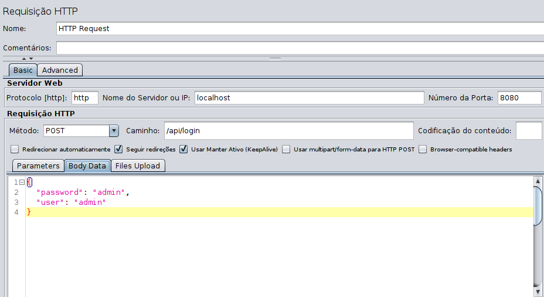
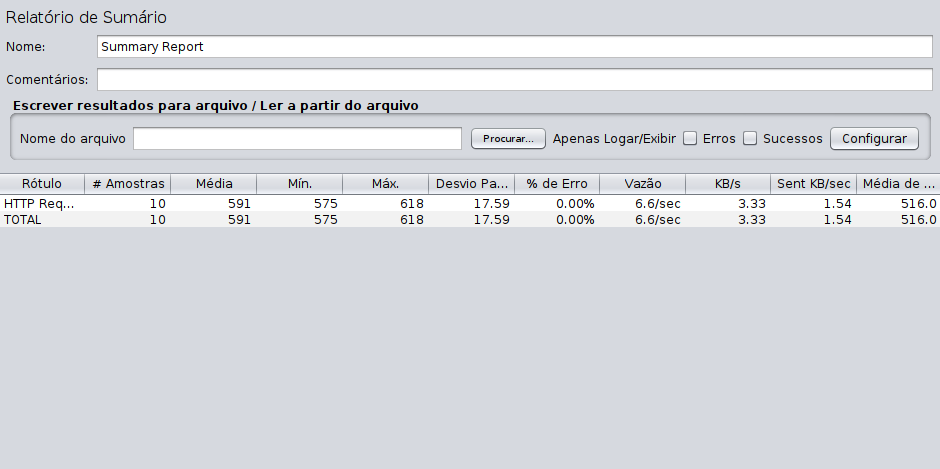

# Unraveling application performance

## Introduction and concepts

Many companies use the "leave performance for later" approach to addressing possible performance issues in the production environment for the testing phase. In the testing phase, it is likely that the load that the application may suffer and the expected response time are not taken into account, as this was not specified in the non-functional requirements - requirements such as the response time for a given operation or the quantity of simultaneous access. Besides, we have the challenge of reconciling an evolutionary architecture together with performance engineering. In evolutionary architecture, we have to be agile and allow constant architecture improvements, leaving decisions to the last minute. Performance engineering is concerned with identifying possible bottlenecks and defining the technologies used at the beginning of the project.

Before going any further, let's review some important concepts about application performance.

**Throughput**: it is the throughput or transfer rate your application can give to requests. The number of requests per second/minute or hour. The higher this number, the better. Generally, in load testing tools, throughput is measured as follows: throughput = (number of requests)/(total time).

**Latency**: The time it takes for a data packet to go from one point to another. Unlike throughput, the higher the latency, the worse the performance. In distributed systems, this can be a significant problem.

High-performance systems have high reliability, low latency, and high throughput as requirements. This seems familiar for those who are going to develop a service. Still, it is not an easy task to maintain and improve performance as the system is being used because new features are added, the database grows.

## Agility versus Performance

If performance is the project's priority, consider checking the dependencies you are using or will use. When using a library to replace some code, we can get the feeling we are producing less code, clean code. Less code means fewer bugs, right? This statement is not always correct. You may be using a library that has bugs as well. Many developers end up not following the language's evolution and are "tied" to specific libraries they used in past versions. In the new version of the language, they are no longer needed. Libraries can bring agility to development, but do they reduce performance or make your application heavier? Consider the pros and cons of each dependency you will use in the project. Understand how it works and look for a history of bugs and vulnerabilities.

### Check what you are carrying in your luggage

In a Java project using Maven, we can check the dependency tree using the command `mvn dependency:tree`, and we can also filter only by compilation dependencies, e.g.: `mvn dependency:tree -Dscope=compile`.

``` asciidoc
 [INFO] --- maven-dependency-plugin:2.8:tree (default-cli) @ testcontainers ---
 [INFO] com.testcontainers:jar:1.0-SNAPSHOT
 [INFO] \- mysql:mysql-connector-java:jar:5.1.47:compile`
```

It is prevalent to develop services packaged in a jar file known as _fatjar_, in which all dependencies are placed inside the jar. In many cases, you will not need that dependency to run your service. It can be a test dependency, or an application server can provide it. So it's always a good idea to check your project's dependencies.
 
Performance care also means, in many cases, implementing more code instead of using some library that facilitates work and accelerates development but can cost you performance upfront.

## How to measure performance?

There are many ways to measure the application performance, either with real-time monitoring or stress testing, before releasing a feature in production. Everything will depend on the requested non-functional requirement. Of course, every user wants to always have the answer as quickly as possible. But what is the acceptable limit? This is the measure to keep in mind even before you start coding. For example: the login time cannot exceed one second. How can I measure this?
Remembering that it is not simply saying 'login needs to be done in less than a second'. It is necessary to evaluate under what circumstances this login may or may not take long. How far the login system can scale. A good average guideline would be: login response time is 1 second for 500 simultaneous requests, with a 60% CPU load and 80% memory utilization.
  
### Capturing the request time.

This chapter will use [jMeter](https://jmeter.apache.org/), widely used to create different types of load tests and measure performance. The objective here is not to be a jMeter tutorial but to show how it is possible to generate and visualize data. Below, a simple example of measuring login time considering ten users:



When running the test above, we can see the results in the Summary Report:



Some essential data at this point:

**Samples:** Number of requests made.

**Average:** Average number of times for all requests.

**Min:** Shortest time among all requests.

**Max:** Longest time among all requests.

We can even have richer graphics, using the [PerfMon](https://jmeter-plugins.org/wiki/PerfMon/) plugin, for example:


In the graph above, we can see that most requests were between 600 and 700 milliseconds in a test scenario with 1000 requests.
We can have even more beautiful and real-time graphics using [grafana](https://grafana.com/) as a graphic viewer.

See that we captured the total time of a login process; however, if the login is not in a suitable time or we want to further improve the time, we need to view each component separately. Understanding how a value is calculated and what it means is essential to drawing the correct conclusions. Hence, we must examine the statistical methods used to estimate and aggregate performance data. Never use only the **average** to draw conclusions about performance because during 24 hours with thousands of requests, the peak values will be hidden by the average.

We measure the total time of login, and we need to improve the response time. To do this, we need to test each component of the architecture separately to determine where it is possible to decrease the time. With just one tool, it may not be possible to measure the performance of your application. You are likely to use a loading tool to stress the application and several others to collect the data. As an example, we can have an application that has an API for login with database access. However, we can have much more complex scenarios. The image below is a representation of the architecture to serve millions of users:


**Credits:** https://github.com/donnemartin/system-design-primer/blob/master/solutions/system_design/scaling_aws/

However, this architecture wasn’t defined at the first attempt. It took many experiments, tests, and measurements to reach a scalable architecture. It should be possible to measure the performance of the MySQL database reading replica separately, for example.

## Monitoring performance by component

As demonstrated above, an architecture for millions of users isn’t defined at the first attempt. It is necessary to stress and measure to check where the loaded points are. Several options show where the application bottlenecks are. One of the several options is [javamelody](https://github.com/javamelody/javamelody), which can be used in standalone mode with your Java application; it is free and effortless to use.


In the image above, we can see that one of the SQL queries took, on average, longer than usual compared to others. We can find out where this SQL command came from, as well as execute the SQL command in 'Explain' mode, in order to reveal that the query is doing a 'full scan' and that it will be necessary to adjust the query or create specific indexes in the table.


In the other example below, we can see a substantial deviation in the 'findById' method, which, in turn, does not use a MySQL database but another external data source. With this information in hand, it is already possible to analyze each behavior in isolation.


There are many monitoring tools, and what remains here as an example is that, in some cases, you will need to go into detail and make some fine adjustments to the infrastructure or even the code.

## Monitoring performance in distributed systems

Distributed systems, currently more popular with microservices, are complex and challenging to monitor performance. In this case, we will need more sophisticated mechanisms, such as a distributed tracing. There are also several solutions here, e.g., the famous APMs, such as New Relic, AppDynamics, DataDog, and Dynatrace. Remember that many cloud providers offer performance analysis tools, such as AWS Performance Insights.
In the OpenSource world, it is worth highlighting [Jaeger Tracing](https://www.jaegertracing.io/), whose specialty is to monitor distributed services running on a Kubernetes infrastructure, for example.


We can observe in which of the services the response time is not adequate and take the necessary actions.

## Object-relational Napping

In the Java world, we use JPA to work with the persistence layer in relational databases. In this topic, we will cover some good practices to obtain a good performance.

### Id generation strategy

The TABLE identifier generator is very inefficient. It is more generic and portable for most databases. Still, it requires a separate database transaction and a different connection to ensure the process of generating the identifier is not linked to the transaction it started. It employs row-level locking that is slow compared to IDENTITY or SEQUENCE identifier generation strategies.
Therefore, if the database supports sequences, it is much more efficient to use the SEQUENCE strategy.

### Enums

We usually map **Enums** as a String to make it easier to read in the database or directly display the enum literal.

```java
@Enumerated(EnumType.STRING)
@Column(length = 9)
private TypeTelephoneEnum type;

public enum TypeTelephoneEnum {
    HOME,
    BUSINESS,
    MOBILE;
}
```
As readable as this may be for the developer, this column takes up much more space than necessary. In this case, the type column occupies 9 bytes. If we store 10 million records, only the phone type column will occupy 90 MB.

#### Mapping as an integer

Note that the @Enumerated column does not need to receive the ORDINAL EnumType value, as it is used by default. We are also using the smallint integer column type, as we are unlikely to need more than 2 bytes to store all Enum values.

```java
@Enumerated
@Column(columnDefinition = "smallint")
private TypeTelephoneEnum type;
```

The value will be stored as an integer, starting with zero for the HOME type. Now, this is much more efficient but less expressive. So, how can we have performance and readability?

Just create a table in the database representing the enum and, in the query, join it with the table of constants.
Does it seem laborious? But it may be worth it if we have millions of records.

Of course, there are cons to this solution. If the enum is changed, the order is altered, or new values are added, the database records will have to be adjusted.

So it's all about choice! So, choose wisely.

### Other improvement measures

Many other performance measures can be adopted or verified in your code. Below, some materials to assist you:

[Unidirectional or bidirectional association](https://vladmihalcea.com/the-best-way-to-map-a-onetoone-relationship-with-jpa-and-hibernate/)

[N+1 query problem](https://vladmihalcea.com/how-to-detect-the-n-plus-one-query-problem-during-testing/)

**References:** https://vladmihalcea.com/tutorials/hibernate/

## Conclusion

Don’t try to solve all problems at the same time. Start by building a list of the top five contributors to the time and burning of the CPU, memory, or IO and explore solutions. Tackle one of the problems and reevaluate the architecture. Below, some steps that can help you find and solve a performance issue.
   
**Find out:** why is this point underperforming?
   
**Understand:** what is causing the low performance?
   
**Correct or Improve:** opportunity to correct or improve based on the data obtained in the steps above.